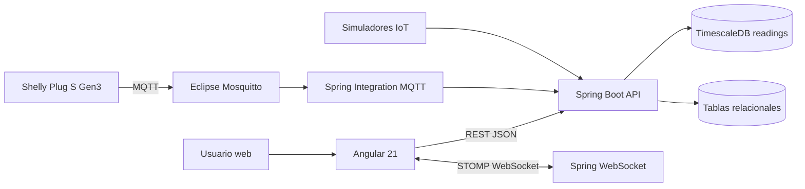
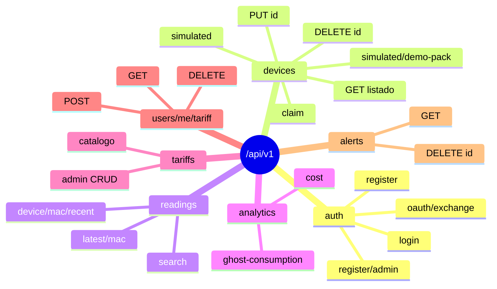
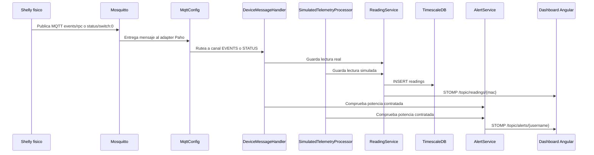
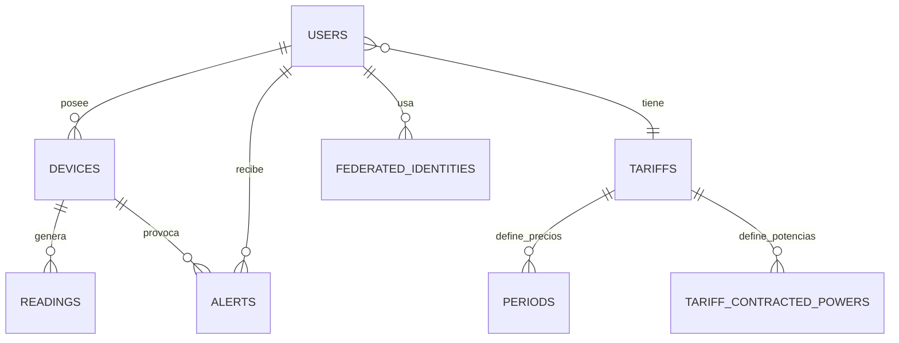
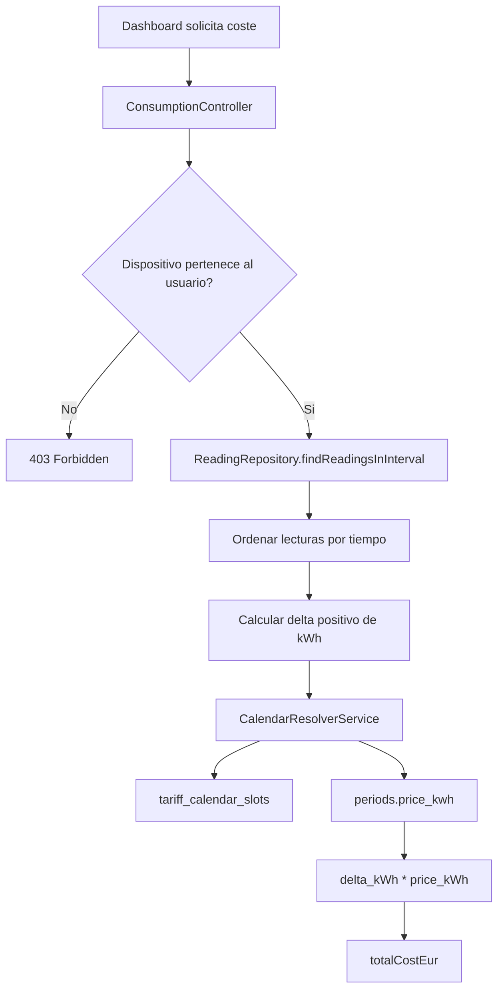
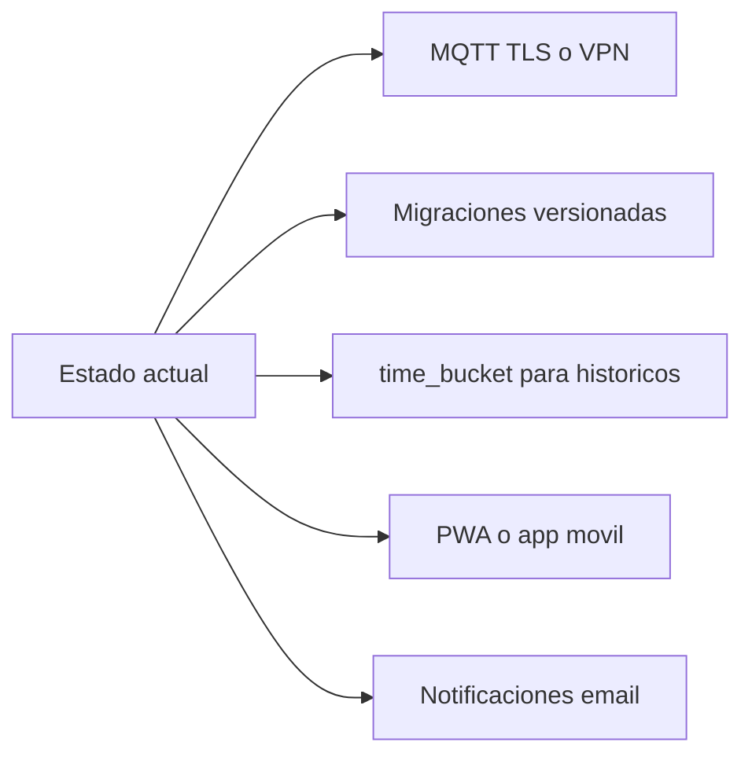

# Canvas documental - Arquitectura Wattimizer

## 1. Vista general

Este canvas resume la arquitectura tecnica de Wattimizer para usarlo como apoyo visual en la memoria o en la presentacion. La aplicacion une Angular, Spring Boot, MQTT y TimescaleDB para transformar lecturas electricas en informacion economica.

## 2. Capas del sistema

| Capa | Pieza | Responsabilidad |
|---|---|---|
| UI | Angular + PrimeNG | Formularios, dashboard, rutas protegidas y experiencia de usuario. |
| Estado cliente | NgRx Signal Store + RxJS | Dispositivos, lecturas, tarifas y flujos HTTP/WebSocket. |
| API | Spring Boot REST | Controladores, DTOs, servicios, seguridad y errores. |
| Ingesta | Spring Integration MQTT | Suscripcion al broker y conversion de JSON Shelly. |
| Tiempo real | STOMP | Empuja lecturas y alertas al navegador. |
| Datos | PostgreSQL + TimescaleDB | Modelo relacional y serie temporal de lecturas. |
| Deploy | Docker Compose + Nginx + GitHub Actions | Ejecucion en Hetzner y publicacion automatica desde `main`. |

## 3. Mapa REST

## 4. Telemetria real y simulada

## 5. Modelo de datos

## 6. Flujo de coste energetico

## 7. Decisiones que conviene defender

- **JWT stateless:** simplifica despliegue y evita sesiones de servidor.
- **`Principal` como fuente del usuario:** el cliente no envia `userId`, reduciendo riesgos de acceso cruzado.
- **Plantillas clonadas:** un usuario puede ajustar su contrato sin mutar el catalogo global.
- **Hypertable solo en `readings`:** las series temporales se concentran donde hay volumen de datos.
- **Simuladores integrados en el mismo pipeline:** permiten demo sin hardware y prueban los mismos calculos que los datos reales.
- **Nginx como unica puerta HTTP/HTTPS:** backend y base de datos quedan dentro de la red Docker.

## 8. Puntos de mejora futuros

