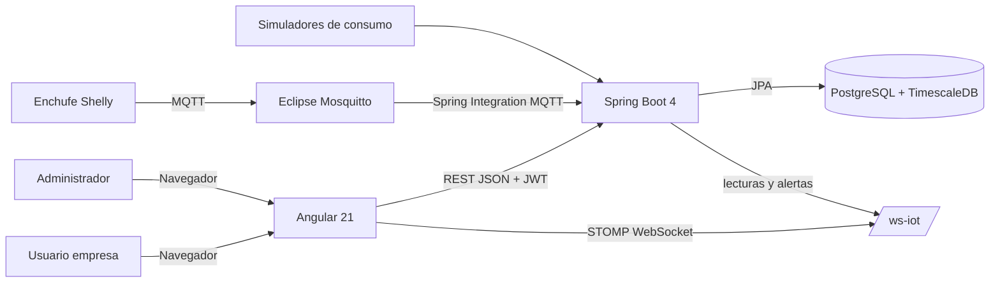
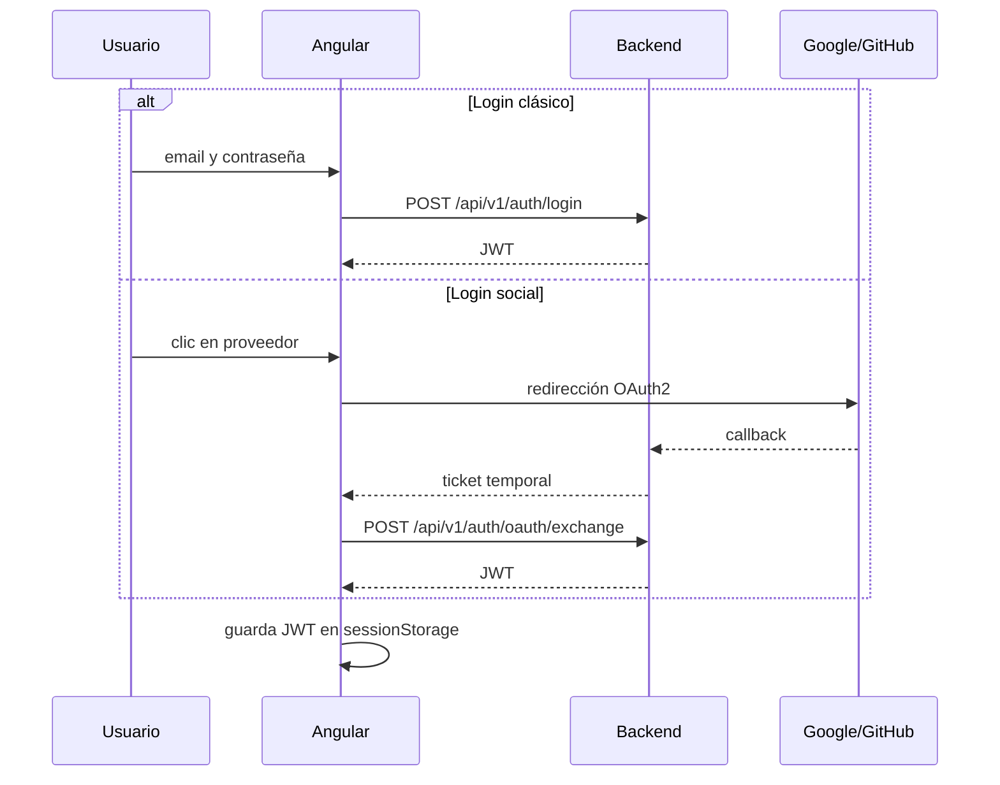
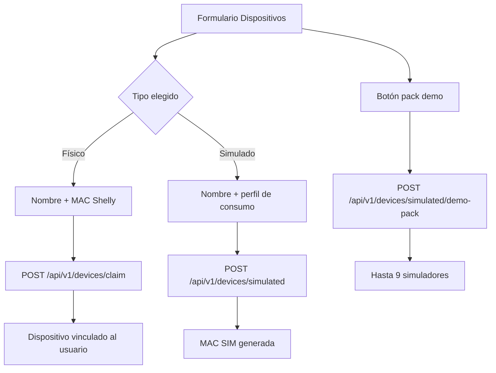
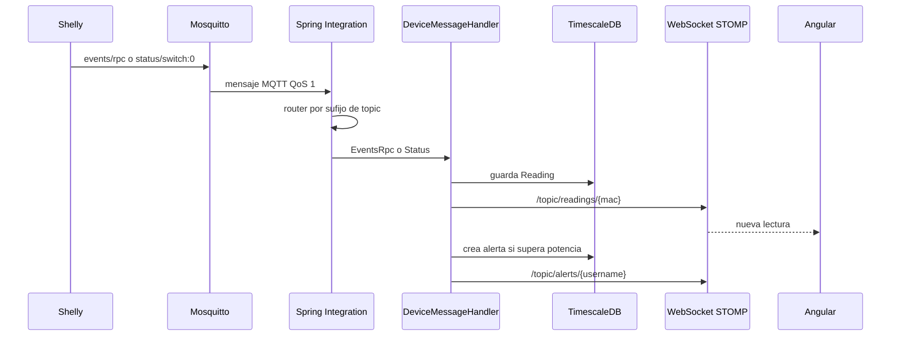
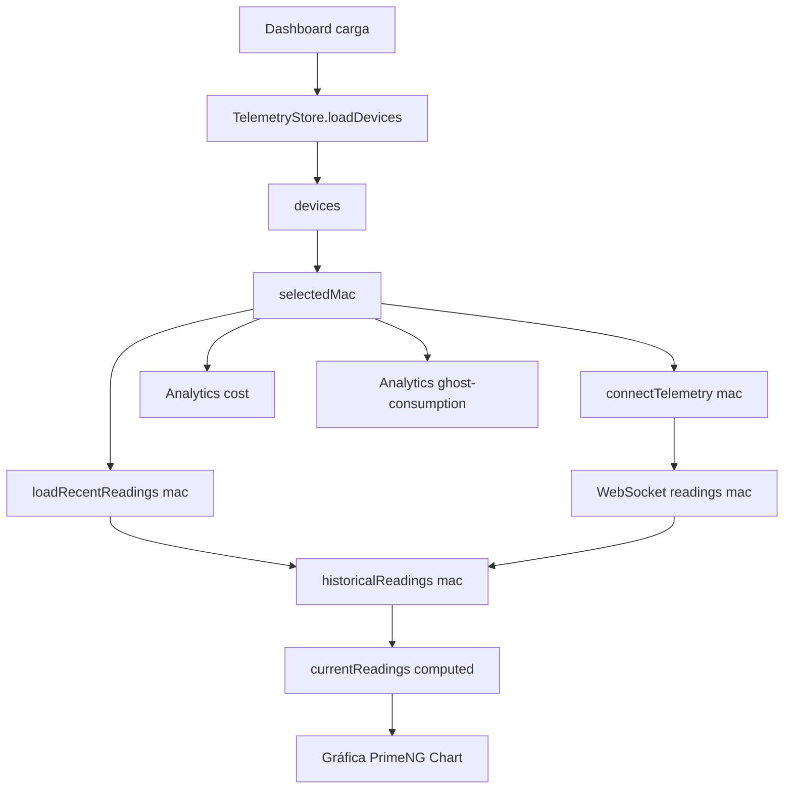
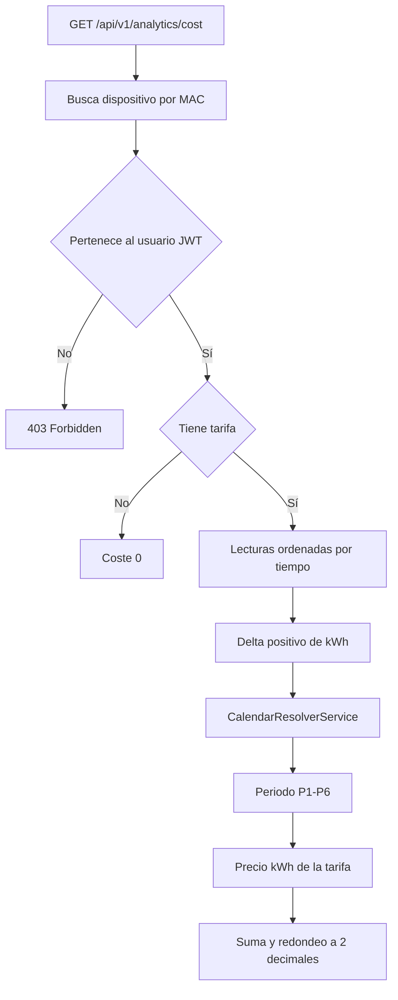
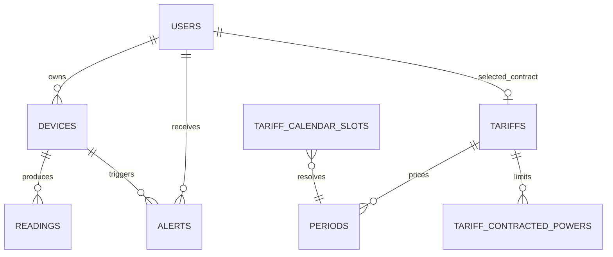

# Anexo visual - Arquitectura de Wattimizer

Este documento funciona como apoyo visual para la memoria. No sustituye a los anexos técnicos, sino que resume los flujos principales para explicarlos en una defensa oral o incluirlos como capturas.

## 1. Vista general del sistema

## 2. Flujo de autenticación

## 3. Flujo de alta de dispositivos

## 4. Ingesta MQTT y difusión en tiempo real

## 5. Dashboard multi-dispositivo

## 6. Cálculo de coste eléctrico

## 7. Modelo de datos simplificado

## 8. Puntos clave para explicar en clase

- El backend no calcula coste a partir de potencia aislada, sino del delta de energía acumulada entre lecturas.
- TimescaleDB se usa solo donde aporta valor: la tabla `readings`.
- Angular mantiene históricos separados por MAC para que el cambio de medidor no mezcle datos.
- Los simuladores pasan por el mismo flujo de persistencia, WebSocket y alertas que los dispositivos reales.
- La suscripción MQTT actual está limitada a un Shelly concreto; es una mejora futura clara y defendible.
