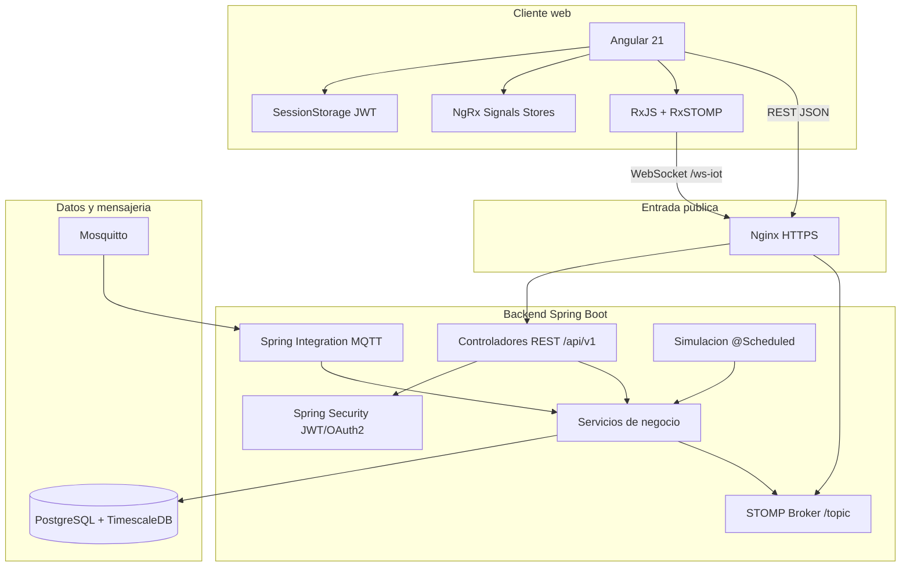
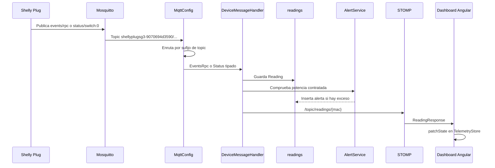
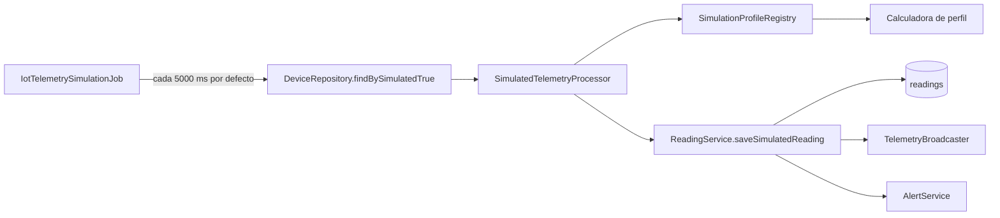
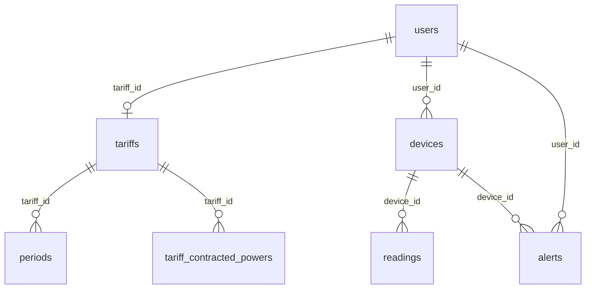

# Canvas documental: arquitectura de Wattimizer

Este documento resume la arquitectura de Wattimizer como apoyo visual a la memoria DAW. No sustituye a los anexos tecnicos; sirve como mapa de lectura rapida para explicar el flujo completo delante del tribunal.

## 1. Lectura recomendada

| Si quieres entender... | Documento |
|---|---|
| La memoria academica completa | [`docs/memoria/memoria-final-daw.md`](../docs/memoria/memoria-final-daw.md) |
| Endpoints, parametros y DTOs | [`anexo-a-backend-rest.md`](../docs/memoria/anexo-a-backend-rest.md) |
| Angular, RxJS y NgRx Signals | [`anexo-b-frontend-angular.md`](../docs/memoria/anexo-b-frontend-angular.md) |
| MQTT, simuladores y WebSocket | [`anexo-c-telemetria-mqtt.md`](../docs/memoria/anexo-c-telemetria-mqtt.md) |
| TimescaleDB y analitica | [`anexo-d-timescaledb-analitica.md`](../docs/memoria/anexo-d-timescaledb-analitica.md) |

## 2. Arquitectura por capas



## 3. Flujo de una lectura real



## 4. Flujo de simulacion



Punto importante: cada dispositivo se procesa en una transaccion nueva. Si un simulador falla, el job continua con el resto.

## 5. Modelo de datos simplificado



La tabla critica es `readings`: primero Hibernate la crea como tabla normal y despues el script `01-hypertable.sql` la convierte en hypertable de TimescaleDB por la columna `time`.

## 6. Flujo de estado en Angular

```mermaid
flowchart TD
    Login[Login/Register/OAuth] --> Token[sessionStorage auth_token]
    Token --> Interceptor[httpInterceptor Bearer]
    Interceptor --> DevicesAPI[GET /api/v1/devices]
    DevicesAPI --> TelemetryStore[TelemetryStore]
    TelemetryStore --> Dashboard[DashboardComponent]
    Dashboard --> Recent[GET /readings/device/{mac}/recent]
    Dashboard --> WS[WebsocketService watchReadings]
    WS --> TelemetryStore
    TariffAPI[GET /users/me/tariff] --> TariffStore[TariffStore]
    TariffStore --> Dashboard
    TariffStore --> TariffComponent
```

La aplicacion evita duplicar estado global innecesario. Telemetria y tarifas si se comparten mediante stores; alertas y analiticas de dashboard quedan como estado local de componente.

## 7. Decisiones tecnicas destacables

| Decision | Motivo |
|---|---|
| JWT stateless | Evita sesiones de servidor y simplifica despliegue horizontal. |
| `Principal.getName()` para recursos privados | Reduce riesgo de IDOR al no aceptar `userId` desde cliente. |
| NgRx Signals en lugar de un store clasico pesado | Encaja con Angular moderno y mantiene estado reactivo con menos ceremonia. |
| TimescaleDB solo para `readings` | La telemetria es la unica tabla de series temporales; el resto es relacional normal. |
| Simuladores con perfiles | Permiten demostrar el sistema sin depender de hardware fisico. |
| Borrado en cascada desde servicio | Evita conflictos FK sin depender de `ON DELETE CASCADE` en la base. |
| Reinicio de Nginx tras deploy | Corrige 502 por IP interna obsoleta despues de recrear contenedores. |

## 8. Puntos para defensa oral

1. La aplicacion no solo mide kWh: los convierte en euros segun contrato y calendario.
2. MQTT y simulacion terminan en el mismo pipeline, por eso las alertas y graficas funcionan igual en ambos casos.
3. TimescaleDB se usa de forma concreta y justificada en `readings`, no como adorno tecnologico.
4. La tarifa privada del usuario se gestiona sin exponer `userId`, reforzando el aislamiento entre cuentas.
5. El despliegue documentado refleja problemas reales solucionados durante la puesta en produccion.
