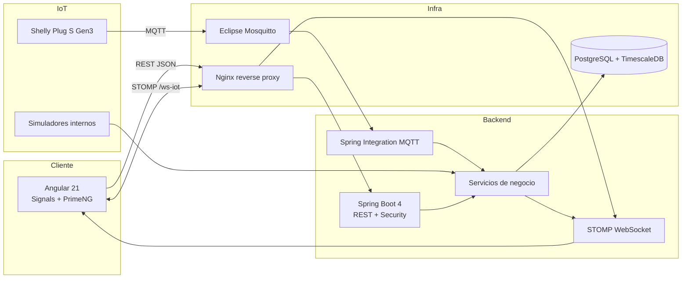
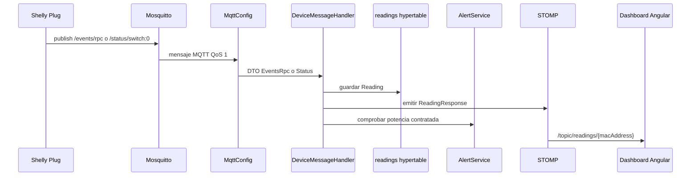
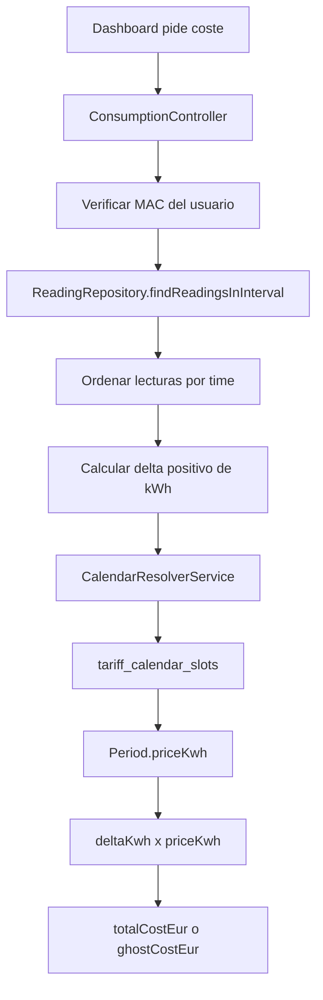
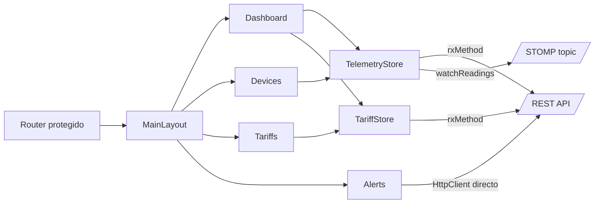

# Canvas documental: arquitectura de Wattimizer

> Este documento funciona como vista visual de la memoria técnica. Resume los flujos principales y enlaza con los anexos detallados de `docs/memoria`.

## 1. Mapa general

## 2. Flujo de una lectura real

## 3. Flujo de analítica económica

## 4. Flujo de estado Angular

## 5. Responsabilidades por capa

| Capa | Responsabilidad | Archivos de referencia |
| --- | --- | --- |
| Angular | Interfaz, sesión local, formularios, dashboard y stores reactivos. | `frontend/src/app/**` |
| REST Spring | Endpoints, validación de propietario y DTOs. | `backend/src/main/java/.../controllers/**` |
| Servicios Spring | Reglas de negocio: tarifas, simulación, coste, alertas y lecturas. | `backend/src/main/java/.../services/**` |
| MQTT | Entrada de telemetría física desde Mosquitto. | `MqttConfig.java`, `DeviceMessageHandler.java` |
| TimescaleDB | Persistencia de series temporales y consultas por intervalo. | `Reading.java`, `ReadingRepository.java`, scripts SQL |
| Infraestructura | Despliegue reproducible y reverse proxy. | `docker-compose.yml`, `nginx/default.conf`, `.github/workflows/deploy.yml` |

## 6. Lectura recomendada

1. [Memoria final DAW](../docs/memoria/memoria-final-daw.md)
2. [Anexo A: Backend REST](../docs/memoria/anexo-a-backend-rest.md)
3. [Anexo B: Frontend Angular](../docs/memoria/anexo-b-frontend-angular.md)
4. [Anexo C: Telemetría MQTT](../docs/memoria/anexo-c-telemetria-mqtt.md)
5. [Anexo D: TimescaleDB y analítica](../docs/memoria/anexo-d-timescaledb-analitica.md)
