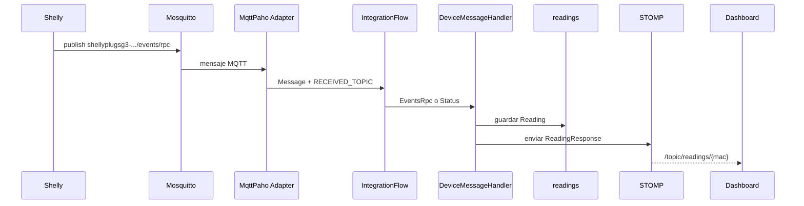
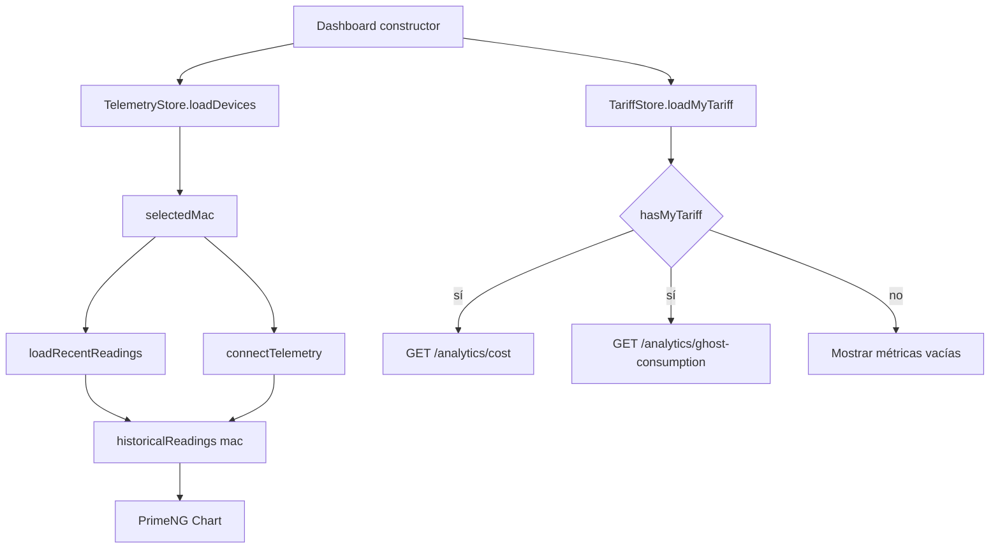
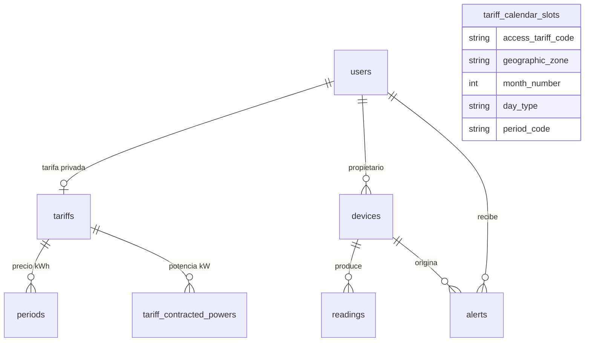
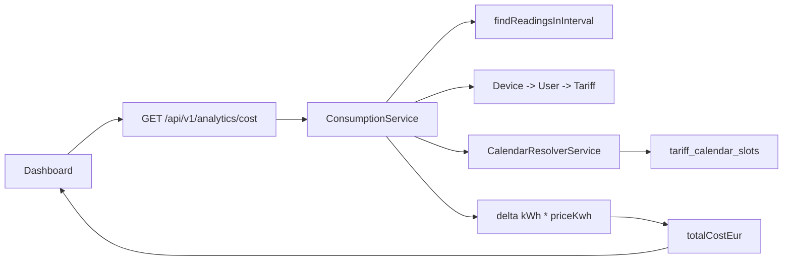

# Canvas documental: arquitectura de Wattimizer

Este documento resume de forma visual los flujos principales de Wattimizer. Complementa la memoria técnica ubicada en `docs/memoria/`.

## 1. Mapa de arquitectura

```mermaid
flowchart LR
    %% El frontend y el dispositivo físico no entran por el mismo protocolo.
    %% Separarlos ayuda a ver por qué existen REST, MQTT y WebSocket a la vez.
    subgraph Cliente
        Angular[Angular SPA]
    end

    subgraph IoT
        Shelly[Shelly Plug S G3]
        Mosquitto[Eclipse Mosquitto]
    end

    subgraph Backend
        REST[Controladores REST /api/v1]
        MQTT[Spring Integration MQTT]
        STOMP[Broker STOMP /topic]
        Services[Servicios de negocio]
    end

    subgraph Datos
        Timescale[(PostgreSQL + TimescaleDB)]
    end

    Angular -->|REST JSON| REST
    Angular -->|WebSocket STOMP /ws-iot| STOMP
    Shelly -->|MQTT QoS 1| Mosquitto
    Mosquitto --> MQTT
    MQTT --> Services
    REST --> Services
    Services --> Timescale
    Services --> STOMP
    STOMP -->|/topic/readings/{mac}| Angular
```

## 2. Flujo de telemetría física



## 3. Flujo de telemetría simulada

```mermaid
flowchart TD
    Job[IotTelemetrySimulationJob cada 5 s] --> Repo[DeviceRepository.findBySimulatedTrue]
    Repo --> Processor[SimulatedTelemetryProcessor]
    Processor --> Profile[SimulationProfileRegistry]
    Profile --> Power[Potencia W calculada]
    Power --> Energy[Odómetro kWh acumulado]
    Energy --> Save[ReadingService.saveSimulatedReading]
    Save --> Broadcast[TelemetryBroadcaster]
    Save --> Alert[AlertService.checkPowerThreshold]
    Broadcast --> Topic[/topic/readings/{mac}/]
    Alert --> Alerts[(alerts)]
```

## 4. Ciclo reactivo del dashboard Angular



## 5. Modelo de datos esencial



## 6. Recorrido de una métrica de coste



## 7. Lectura rápida para defensa del proyecto

- **REST** resuelve operaciones de usuario: login, dispositivos, tarifas, alertas y analítica.
- **MQTT** resuelve la entrada asíncrona desde hardware.
- **WebSocket/STOMP** resuelve la salida en tiempo real hacia Angular.
- **TimescaleDB** prepara la tabla `readings` para crecer como serie temporal.
- **NgRx Signals + RxJS** evitan que el dashboard mezcle estado manual con suscripciones sueltas.
- **Simuladores** hacen que el proyecto sea demostrable sin depender siempre de un enchufe físico.
