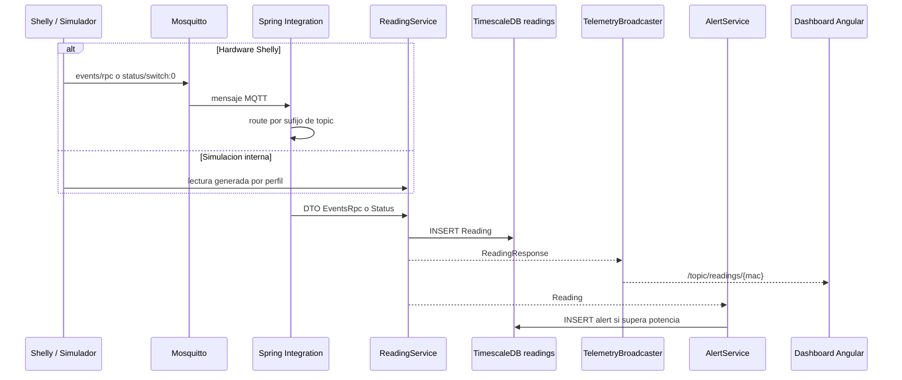
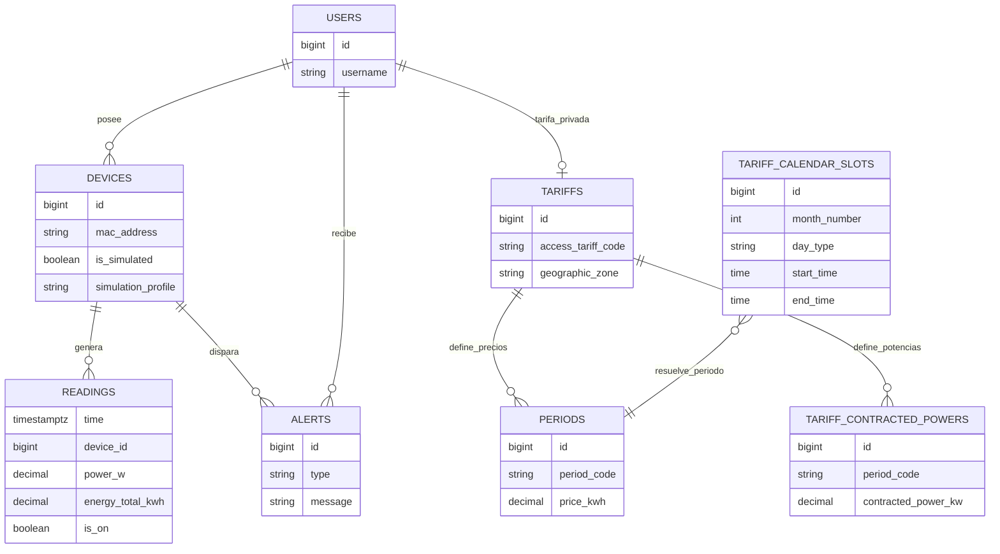
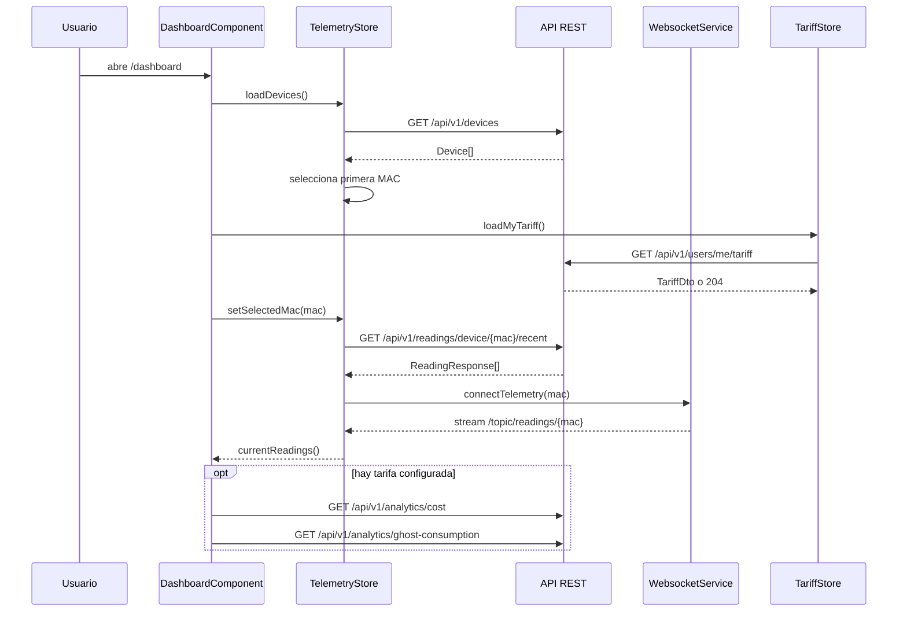
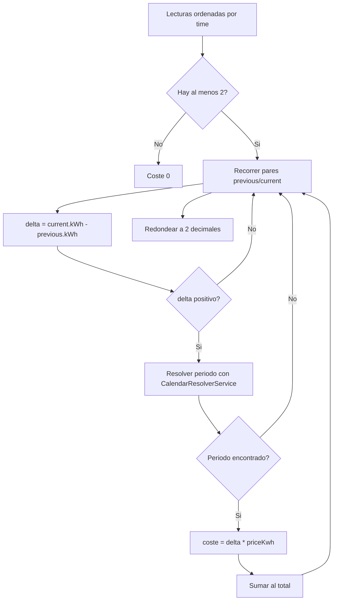

# Diagramas tecnicos de Wattimizer

Estos diagramas complementan la memoria tecnica. Estan escritos en Mermaid para que puedan renderizarse en GitHub, Cursor o exportarse a imagen para la memoria final.

## 1. Arquitectura general

```mermaid
flowchart TB
    Usuario[Usuario web] --> Angular[Frontend Angular 21]
    Angular -->|REST JSON /api/v1| Backend[Spring Boot 4]
    Angular -->|STOMP WebSocket /ws-iot| Backend

    Shelly[Shelly Plug S Gen3] -->|MQTT| Mosquitto[Eclipse Mosquitto]
    Mosquitto -->|Spring Integration MQTT| Backend

    Backend -->|JPA / JDBC| Timescale[(PostgreSQL + TimescaleDB)]
    Backend -->|/topic/readings/{mac}| Angular
    Backend -->|/topic/alerts/{username}| Angular

    subgraph Docker Compose
        Mosquitto
        Backend
        Timescale
        Nginx[Nginx reverse proxy]
    end

    Nginx --> Angular
```

## 2. Flujo de telemetria MQTT y simulada



## 3. Relacion principal de datos



## 4. Flujo del dashboard Angular



## 5. Resolucion de coste energetico


