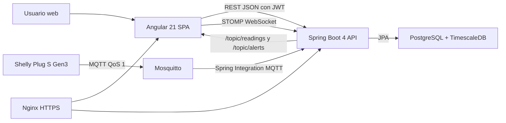
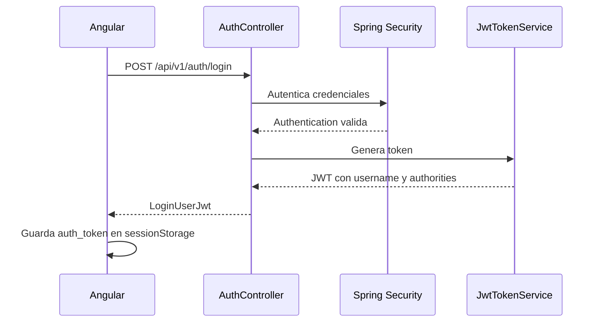
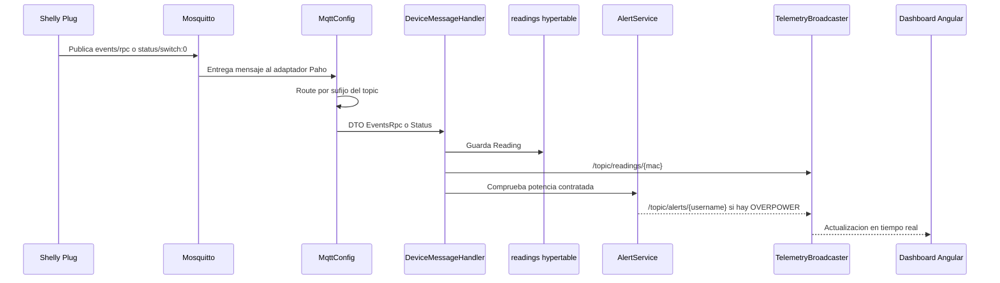
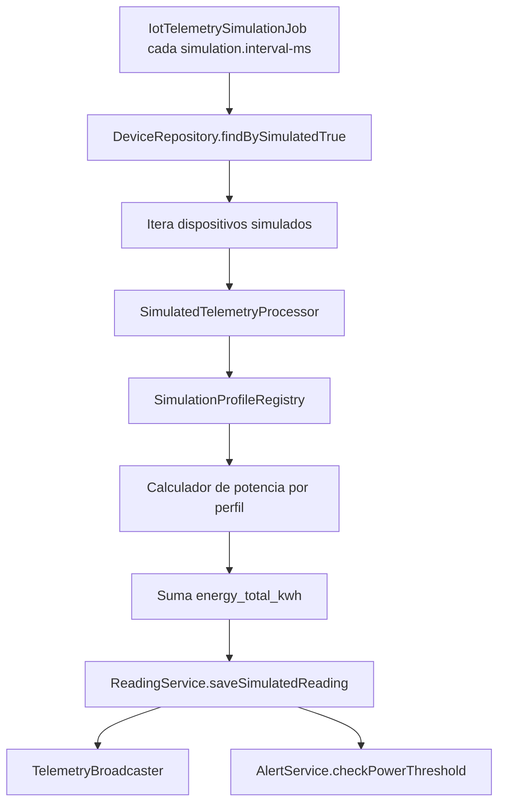
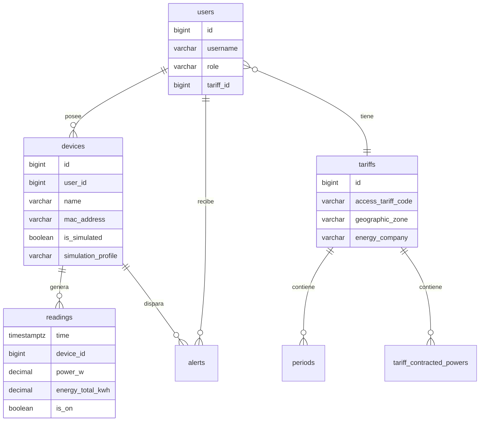

# Canvas documental: arquitectura de Wattimizer

## 1. Vista general

Este canvas resume visualmente la arquitectura documentada en la memoria técnica. Sirve como apoyo para explicar el proyecto en la defensa o como anexo grafico.

## 2. Flujo de autenticación

## 3. Flujo de telemetría real

## 4. Flujo de simuladores

## 5. Modelo de datos reducido

## 6. Mapa rápido de anexos

| Tema | Documento |
|---|---|
| Memoria academica completa | `docs/memoria/memoria-final-daw.md` |
| REST Spring Boot | `docs/memoria/anexo-a-backend-rest.md` |
| Angular, RxJS y NgRx Signals | `docs/memoria/anexo-b-frontend-angular.md` |
| MQTT y WebSocket | `docs/memoria/anexo-c-telemetria-mqtt.md` |
| TimescaleDB y analítica | `docs/memoria/anexo-d-timescaledb-analitica.md` |
