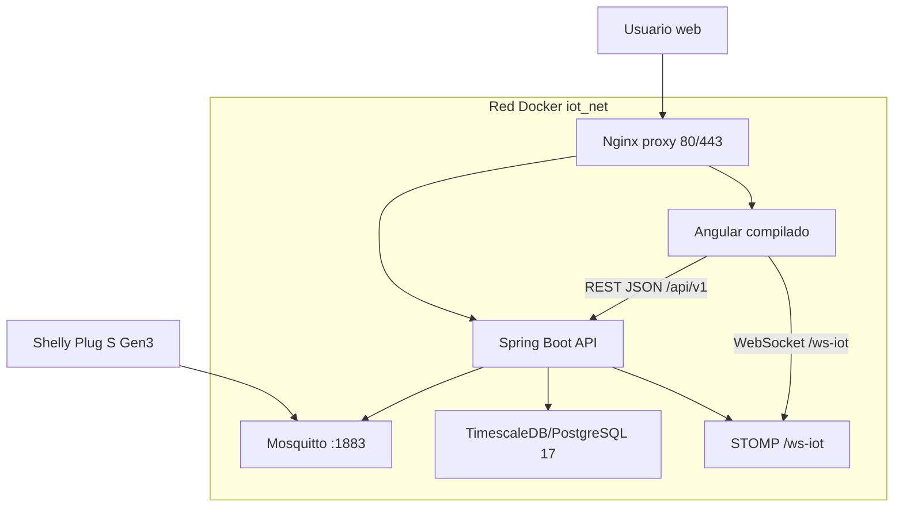
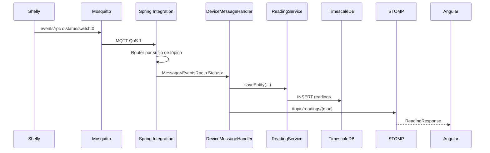
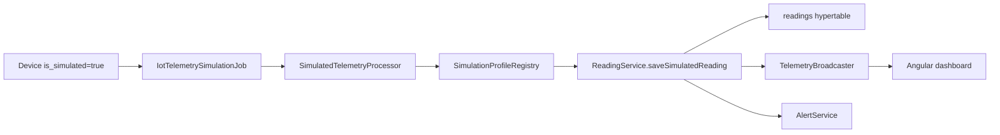
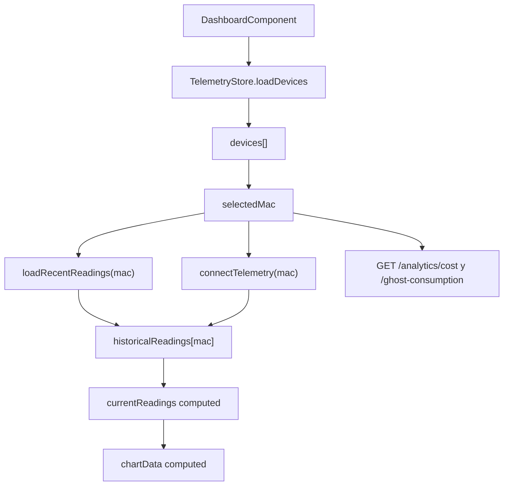
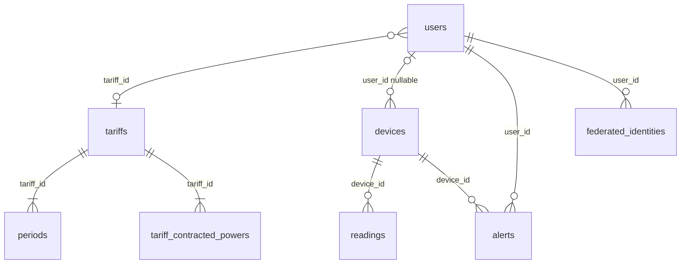
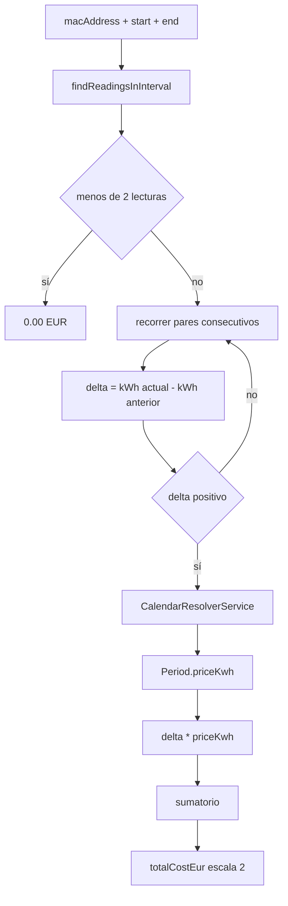
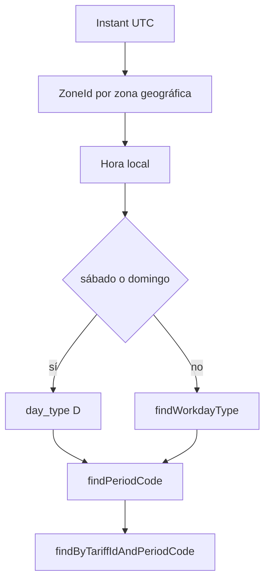

# Docs Canvas. Diagramas técnicos de Wattimizer

Este documento agrupa diagramas en Mermaid para reutilizarlos en la memoria
final. Se ha colocado fuera de los anexos porque funciona como material visual
de apoyo.

## 1. Arquitectura de despliegue

## 2. Flujo de telemetría real

## 3. Flujo de simulación

## 4. Estado reactivo del dashboard

## 5. Modelo de datos principal

## 6. Cálculo de coste histórico

## 7. Resolución de periodo tarifario

