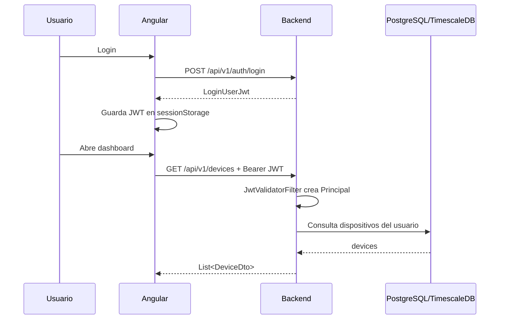
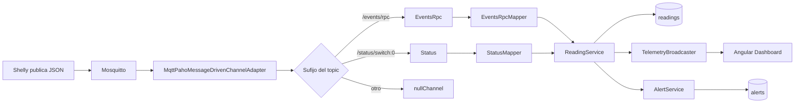
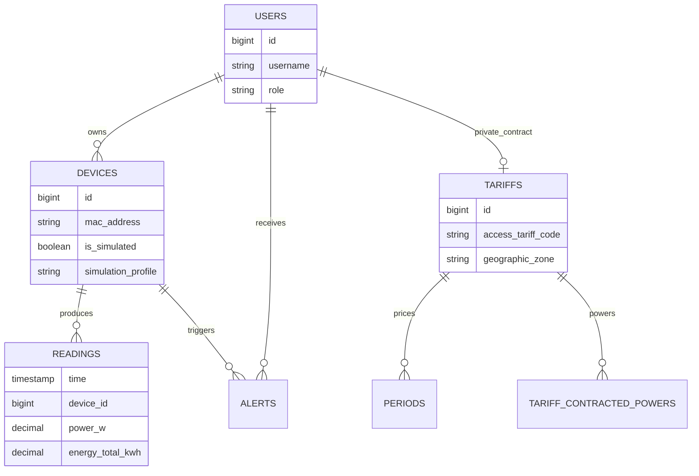

# Docs Canvas: arquitectura tecnica de Wattimizer

Este documento resume visualmente la arquitectura de Wattimizer. Sirve como apoyo grafico para la memoria DAW y enlaza con los anexos tecnicos de `docs/memoria/`.

## 1. Mapa general

```mermaid
flowchart TB
    subgraph Cliente["Navegador"]
        Angular["Angular 21\nPrimeNG + Signals + RxJS"]
        Store["TelemetryStore / TariffStore\n@ngrx/signals"]
        Angular --> Store
    end

    subgraph Backend["Spring Boot 4.0.5"]
        REST["Controladores REST\n/api/v1"]
        Security["JWT + OAuth2\nSpring Security"]
        MQTT["Spring Integration MQTT"]
        STOMP["STOMP WebSocket\n/ws-iot"]
        Services["Servicios de negocio\nDevice, Reading, Tariff, Consumption"]
        REST --> Security
        REST --> Services
        MQTT --> Services
        Services --> STOMP
    end

    subgraph Infra["Infraestructura"]
        Mosquitto["Eclipse Mosquitto\nMQTT :1883"]
        Timescale["PostgreSQL + TimescaleDB\nreadings hypertable"]
        Nginx["Nginx reverse proxy\nHTTP/HTTPS"]
    end

    Shelly["Shelly Plug S Gen3"] -->|MQTT| Mosquitto
    Mosquitto --> MQTT
    Services --> Timescale
    Angular -->|REST JSON| REST
    STOMP -->|/topic/readings/{mac}| Angular
    Nginx --> Angular
    Nginx --> REST
```

## 2. Flujo REST autenticado



## 3. Flujo de telemetria MQTT



## 4. Modelo de datos resumido



## 5. Relacion entre anexos

| Documento | Contenido |
| --- | --- |
| [`memoria-final-daw.md`](../docs/memoria/memoria-final-daw.md) | Estructura completa de memoria DAW |
| [`anexo-a-backend-rest.md`](../docs/memoria/anexo-a-backend-rest.md) | Controladores REST, endpoints y DTOs |
| [`anexo-b-frontend-angular.md`](../docs/memoria/anexo-b-frontend-angular.md) | Componentes Angular, RxJS y NgRx Signals |
| [`anexo-c-telemetria-mqtt.md`](../docs/memoria/anexo-c-telemetria-mqtt.md) | Ingesta asincrona MQTT |
| [`anexo-d-timescaledb-analitica.md`](../docs/memoria/anexo-d-timescaledb-analitica.md) | Hypertable `readings` y analitica |
