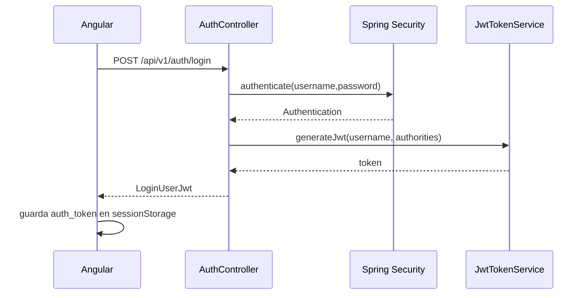
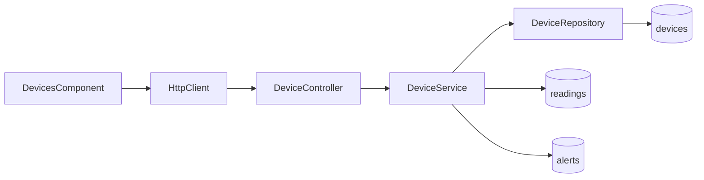
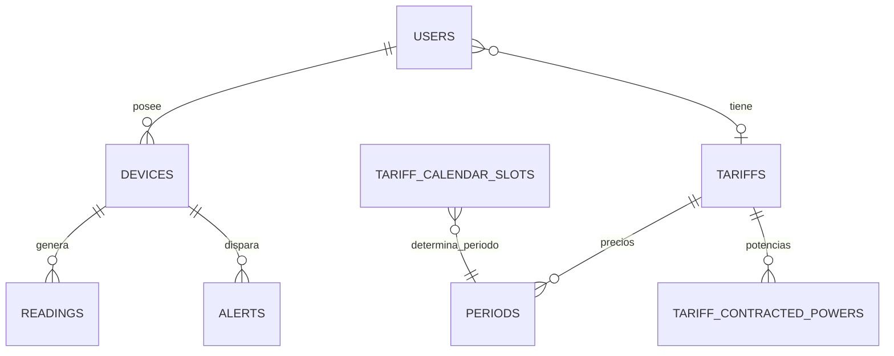
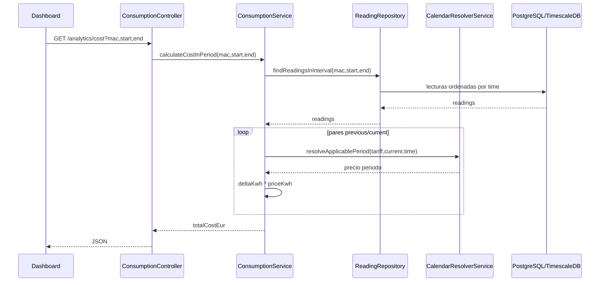

# Vista visual de arquitectura de Wattimizer

Este documento funciona como apoyo visual para la memoria tecnica. No sustituye a
los anexos, pero ayuda a ver de un vistazo como se conectan Angular, Spring Boot,
MQTT, WebSocket y TimescaleDB.

## 1. Arquitectura general

```mermaid
flowchart TB
    U[Usuario web] --> A[Angular 21]
    A -->|REST JSON /api/v1| B[Spring Boot 4]
    A -->|STOMP /ws-iot| W[WebSocket broker]
    S[Shelly Plug S Gen3] -->|MQTT| M[Mosquitto]
    M -->|Spring Integration MQTT| B
    B -->|JPA| P[(PostgreSQL)]
    P --> T[(TimescaleDB hypertable readings)]
    B -->|convertAndSend| W
    W -->|/topic/readings/{mac}| A
    W -->|/topic/alerts/{username}| A
```

La idea principal es separar dos tipos de comunicacion:

- REST para acciones de usuario: login, dispositivos, tarifas, historico y costes.
- MQTT/STOMP para telemetria y actualizaciones en tiempo real.

## 2. Flujo de autenticacion



En OAuth2 el backend genera un ticket temporal y Angular lo intercambia por el JWT
en `/api/v1/auth/oauth/exchange`.

## 3. Flujo REST de dispositivos



`DeviceService` es el punto donde se concentran reglas de propiedad. Por ejemplo,
al borrar un dispositivo tambien se eliminan sus lecturas y alertas para no dejar
datos colgados.

## 4. Flujo MQTT de telemetria

```mermaid
flowchart TD
    A[MQTT topic Shelly] --> B[MqttPahoMessageDrivenChannelAdapter]
    B --> C{Sufijo topic}
    C -->|/events/rpc| D[JSON a EventsRpc]
    C -->|/status/switch:0| E[JSON a Status]
    C -->|otro| Z[nullChannel]
    D --> F[eventsRpcChannel]
    E --> G[statusChannel]
    F --> H[DeviceMessageHandler]
    G --> H
    H --> I[ReadingService]
    I --> J[(readings hypertable)]
    H --> K[TelemetryBroadcaster]
    H --> L[AlertService]
    L --> M[(alerts)]
    L --> K
    K --> N[/topic/readings/{mac}]
    K --> O[/topic/alerts/{username}]
```

## 5. Dashboard Angular

```mermaid
flowchart TB
    A[DashboardComponent] --> B[TelemetryStore]
    A --> C[TariffStore]
    B --> D[GET /api/v1/devices]
    B --> E[GET /api/v1/readings/device/{mac}/recent]
    B --> F[WebsocketService.watchReadings]
    C --> G[GET /api/v1/users/me/tariff]
    A --> H[GET /api/v1/analytics/cost]
    A --> I[GET /api/v1/analytics/ghost-consumption]
    E --> J[historicalReadings buffer 20]
    F --> J
    J --> K[PrimeNG Chart]
```

La grafica no pinta todo el historico. El store mantiene un buffer de 20 puntos
para que el dashboard sea rapido y legible.

## 6. Modelo de datos resumido



## 7. Ruta de calculo economico



La decision clave es calcular coste con el delta de `energyTotalKwh`. Asi se usa
el contador acumulado del dispositivo y no solo una muestra instantanea de potencia.
