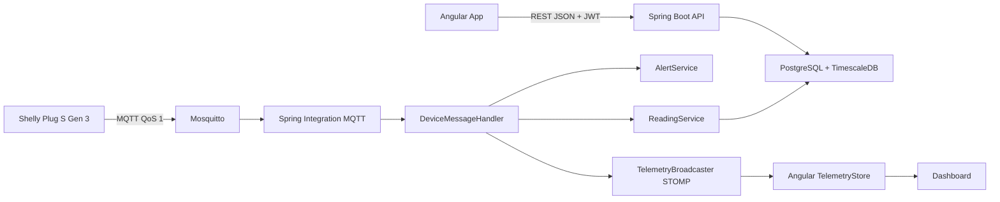
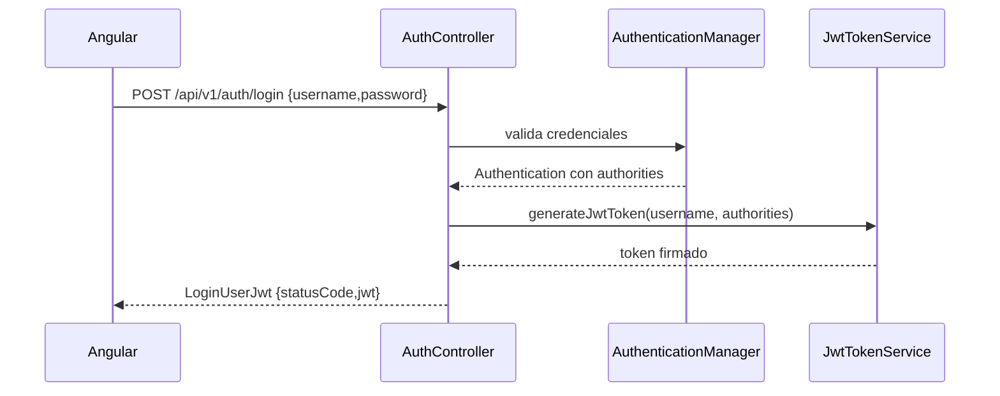
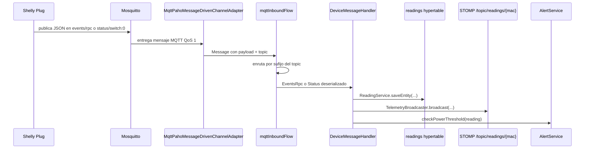
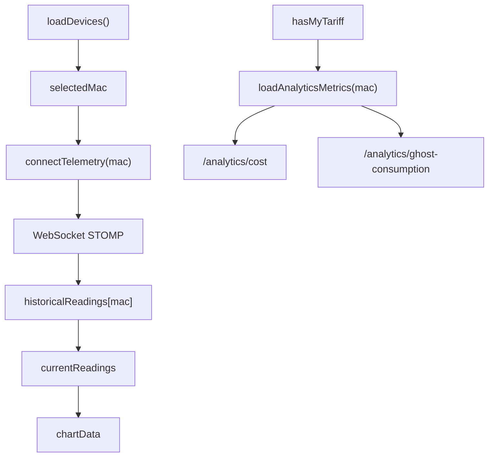

# Anexo tecnico para la memoria final de Wattimizer

> Documentacion tecnica generada a partir del codigo real del repositorio `joellmar/wattpath-app`, rama `cursor/documentaci-n-t-cnica-del-proyecto-fb8f`.
> El objetivo de este anexo es servir como material directo para la memoria final del proyecto DAW.

## Indice

1. [Introduccion y justificacion](#1-introduccion-y-justificacion)
2. [Fase 1: Analisis funcional](#2-fase-1-analisis-funcional)
3. [Fase 2: Diseno tecnico](#3-fase-2-diseno-tecnico)
4. [Fase 3: Implementacion y desarrollo](#4-fase-3-implementacion-y-desarrollo)
5. [Fase 4: Pruebas y despliegue](#5-fase-4-pruebas-y-despliegue)
6. [Conclusiones y lineas futuras](#6-conclusiones-y-lineas-futuras)
7. [Bibliografia y recursos](#7-bibliografia-y-recursos)

---

## 1. Introduccion y justificacion

### 1.1. Titulo del proyecto

El nombre comercial de la aplicacion es **Wattimizer App**.

El proyecto se presenta como una plataforma B2B de inteligencia energetica para pequenas empresas. La idea principal no es solo mostrar consumos electricos, sino traducirlos a informacion economica util: coste en euros, consumos fantasma, picos de potencia y alertas segun la tarifa contratada.

### 1.2. Descripcion del problema

Muchas pymes no tienen una vision clara de cuanto les cuesta realmente la energia que consumen durante el dia. Pueden consultar una factura a final de mes, pero esa informacion llega tarde y, ademas, suele ser dificil de relacionar con habitos concretos: maquinas que se quedan encendidas por la noche, picos de potencia en horas caras o contratos electricos mal configurados.

Wattimizer aborda este problema conectando dispositivos IoT, como un Shelly Plug S Gen 3, con una aplicacion web. El enchufe envia telemetria por MQTT, el backend la almacena en una base de datos de series temporales y el frontend la muestra en tiempo real. A partir de esos datos, el sistema calcula el coste del consumo con las tarifas TD configuradas y genera alertas cuando la potencia instantanea supera la potencia contratada.

La decision de combinar IoT, REST, WebSocket y TimescaleDB responde a una necesidad concreta del proyecto: tratar lecturas temporales frecuentes sin limitarse a un CRUD tradicional.

### 1.3. Objetivos

#### Objetivo general

Desarrollar una aplicacion web full-stack que permita monitorizar el consumo electrico de dispositivos IoT y convertirlo en informacion economica comprensible para el usuario.

#### Objetivos especificos

- Implementar autenticacion con JWT y login social OAuth2 para controlar el acceso a la plataforma.
- Permitir el registro y la vinculacion de dispositivos IoT mediante su direccion MAC.
- Ingerir lecturas de potencia y energia desde MQTT usando Spring Integration.
- Guardar las lecturas en PostgreSQL con TimescaleDB para trabajar con datos temporales.
- Mostrar en Angular una grafica de potencia en tiempo real mediante WebSocket STOMP.
- Gestionar tarifas electricas TD, con periodos de energia y potencias contratadas.
- Calcular el coste energetico diario y el coste de consumo fantasma.
- Emitir alertas cuando una lectura supera la potencia contratada del periodo aplicable.
- Separar permisos de usuario normal y administrador para proteger la gestion del catalogo de tarifas.

### 1.4. Tipos de usuarios

| Usuario | Uso principal | Permisos relevantes |
|---|---|---|
| Usuario gestor de pyme (`ROLE_USER`) | Monitoriza dispositivos, consulta dashboard, configura su tarifa privada y revisa alertas. | Acceso a sus propios dispositivos, lecturas, analiticas, tarifa personal y alertas. |
| Administrador (`ROLE_ADMIN`) | Mantiene el catalogo maestro de tarifas y puede crear usuarios administradores con clave interna. | CRUD del catalogo `/api/v1/tariffs`, ademas de las acciones normales de usuario. |
| Sistema IoT / broker MQTT | No usa la interfaz grafica, pero publica telemetria hacia el backend. | Publicacion MQTT autenticada en Mosquitto. |

---

## 2. Fase 1: Analisis funcional

### 2.1. Mapa de funcionalidades

| Modulo | Funcionalidades implementadas | Archivos principales |
|---|---|---|
| Autenticacion | Login con email/contrasena, registro, JWT, OAuth2 Google/GitHub y cierre de sesion. | `AuthController.java`, `SecurityConfig.java`, `JwtValidatorFilter.java`, `AuthService`, `SessionStorageService` |
| Dispositivos IoT | Listar dispositivos, reclamar por MAC, editar nombre, cambiar estado virtual y eliminar vinculacion. | `DeviceController.java`, `DeviceService.java`, `DevicesComponent`, `TelemetryStore` |
| Telemetria | Recepcion MQTT, persistencia de lecturas, emision por WebSocket y simulacion de dispositivos. | `MqttConfig.java`, `DeviceMessageHandler.java`, `ReadingService.java`, `IotTelemetrySimulationJob.java` |
| Dashboard | Grafica en tiempo real, selector de dispositivo, coste diario y consumo fantasma. | `DashboardComponent`, `TelemetryStore`, `WebsocketService`, `ConsumptionController.java` |
| Tarifas | Catalogo maestro, tarifa privada de usuario, periodos P1-P6 y potencias contratadas. | `TariffController.java`, `UserTariffController.java`, `TariffService.java`, `TariffComponent`, `TariffStore` |
| Alertas | Deteccion de sobrepotencia, listado y descarte de alertas. | `AlertService.java`, `AlertController.java`, `AlertsComponent` |
| Despliegue | Contenedores para TimescaleDB, Mosquitto, backend, frontend, Nginx y Certbot. | `docker-compose.yml`, `nginx/default.conf`, `GUIA_DESPLIEGUE_LOCAL_WINDOWS.md` |

### 2.2. Historias de usuario

| ID | Historia | Criterios de aceptacion | Prioridad |
|---|---|---|---|
| HU-01 | Como usuario, quiero registrarme con email y contrasena para acceder a la plataforma. | El backend valida email, longitud minima de contrasena y confirmacion; si el registro es correcto devuelve `201 Created`. | Imprescindible |
| HU-02 | Como usuario, quiero iniciar sesion para obtener un token JWT y acceder a las zonas privadas. | `POST /api/v1/auth/login` devuelve un `LoginUserJwt`; Angular guarda el token en `sessionStorage`; el guard permite navegar al dashboard. | Imprescindible |
| HU-03 | Como usuario, quiero iniciar sesion con Google o GitHub para no crear credenciales nuevas. | OAuth2 genera un ticket temporal; el frontend lo intercambia por JWT en `/api/v1/auth/oauth/exchange`. | Opcional avanzada |
| HU-04 | Como usuario, quiero vincular un enchufe mediante su MAC para asociarlo a mi cuenta. | `POST /api/v1/devices/claim` asocia el dispositivo al `Principal`; si la MAC pertenece a otro usuario se rechaza. | Imprescindible |
| HU-05 | Como usuario, quiero ver la potencia en tiempo real para detectar consumos anormales. | El backend emite `ReadingResponse` a `/topic/readings/{macAddress}` y Angular actualiza un buffer de 20 puntos. | Imprescindible |
| HU-06 | Como usuario, quiero configurar mi tarifa electrica para calcular costes reales. | `POST /api/v1/users/me/tariff` clona una plantilla o guarda un contrato privado validado. | Imprescindible |
| HU-07 | Como usuario, quiero consultar el coste diario y el consumo fantasma para entender donde gasto mas energia. | El dashboard llama a `/api/v1/analytics/cost` y `/api/v1/analytics/ghost-consumption` con MAC e intervalo temporal. | Imprescindible |
| HU-08 | Como usuario, quiero recibir alertas si supero la potencia contratada. | `AlertService.checkPowerThreshold` compara `powerW / 1000` contra la potencia contratada del periodo y crea una alerta `OVERPOWER`. | Imprescindible |
| HU-09 | Como administrador, quiero gestionar el catalogo maestro de tarifas para ofrecer plantillas reutilizables. | Los endpoints de mutacion de `/api/v1/tariffs` exigen `ROLE_ADMIN`; el frontend solo muestra acciones de admin si el JWT contiene ese rol. | Imprescindible |
| HU-10 | Como desarrollador, quiero poder simular telemetria sin hardware para validar el dashboard. | `IotTelemetrySimulationJob` genera lecturas cada 5 segundos para dispositivos `is_simulated = true`. | Opcional tecnica |

### 2.3. Gestion del trabajo: GitHub y Kanban

- **Repositorio:** <https://github.com/joellmar/wattpath-app>
- **Rama de documentacion analizada:** `cursor/documentaci-n-t-cnica-del-proyecto-fb8f`
- **Flujo observado en el repositorio:** el proyecto esta organizado por ramas de trabajo y mantiene scripts, tests y guias de despliegue versionadas junto al codigo.

La captura del tablero Kanban no esta dentro del repositorio. Para la memoria final conviene anadir una captura externa del tablero de GitHub Projects con columnas como `Backlog`, `Por hacer`, `En progreso`, `En revision` y `Hecho`. Este anexo deja documentado el enlace y el flujo tecnico, pero no inventa una captura que no forma parte del codigo.

### 2.4. Planificacion inicial por fases

| Fase | Historias asociadas | Dificultad tecnica |
|---|---|---|
| Fase 1 - Base de autenticacion | HU-01, HU-02, HU-03 | Media, por integrar JWT, SecurityFilterChain y OAuth2. |
| Fase 2 - Gestion de dispositivos | HU-04 | Media, por validar propiedad del dispositivo y evitar accesos cruzados. |
| Fase 3 - Telemetria IoT | HU-05, HU-10 | Alta, por combinar MQTT, persistencia temporal y WebSocket. |
| Fase 4 - Tarifas y analiticas | HU-06, HU-07 | Alta, por aplicar reglas TD, zonas horarias y calculos sobre lecturas acumuladas. |
| Fase 5 - Alertas y administracion | HU-08, HU-09 | Media-alta, por permisos de rol y calculo de potencia contratada por periodo. |
| Fase 6 - Despliegue | Todas | Media, por coordinar Docker, Nginx, certificados, base de datos y broker MQTT. |

---

## 3. Fase 2: Diseno tecnico

### 3.1. Diseno de la base de datos

#### Diagrama E/R resumido

```mermaid
erDiagram
    USERS ||--o{ DEVICES : posee
    USERS }o--|| TARIFFS : "tariff_id"
    DEVICES ||--o{ READINGS : genera
    USERS ||--o{ ALERTS : recibe
    DEVICES ||--o{ ALERTS : provoca
    TARIFFS ||--o{ PERIODS : define
    TARIFFS ||--o{ TARIFF_CONTRACTED_POWERS : define
    TARIFF_CALENDAR_SLOTS }o..o{ PERIODS : "resuelve period_code"

    USERS {
        bigint id PK
        varchar username UK
        varchar password
        varchar role
        boolean active
        bigint tariff_id FK
    }

    DEVICES {
        bigint id PK
        bigint user_id FK
        varchar name
        varchar mac_address UK
        boolean is_on
        boolean is_simulated
    }

    READINGS {
        timestamptz time PK
        bigint device_id PK_FK
        numeric power_w
        numeric energy_total_kwh
        boolean is_on
    }

    TARIFFS {
        bigint id PK
        varchar name
        varchar market
        varchar access_tariff_code
        varchar geographic_zone
        varchar energy_company
    }

    PERIODS {
        bigint id PK
        bigint tariff_id FK
        varchar period_code
        numeric price_kwh
    }

    TARIFF_CONTRACTED_POWERS {
        bigint id PK
        bigint tariff_id FK
        varchar period_code
        numeric contracted_power_kw
    }

    TARIFF_CALENDAR_SLOTS {
        bigint id PK
        varchar access_tariff_code
        varchar geographic_zone
        int month_number
        varchar season_code
        varchar day_type
        varchar period_code
        time start_time
        time end_time
    }

    ALERTS {
        bigint id PK
        bigint user_id FK
        bigint device_id FK
        varchar type
        varchar message
    }
```

#### Modelo relacional

| Tabla | Claves | Funcion dentro del sistema |
|---|---|---|
| `users` | PK `id`, UK `username`, FK `tariff_id` | Guarda las cuentas, el rol (`ROLE_USER` o `ROLE_ADMIN`) y la tarifa privada activa. |
| `devices` | PK `id`, UK `mac_address`, FK `user_id` | Representa enchufes IoT reales o simulados vinculados a un usuario. |
| `readings` | PK compuesta `(time, device_id)` | Serie temporal de lecturas. Se convierte manualmente en hypertable de TimescaleDB por la columna `time`. |
| `tariffs` | PK `id` | Contrato electrico: mercado, peaje TD, zona geografica y comercializadora. |
| `periods` | PK `id`, UK `(tariff_id, period_code)` | Precio de energia en euros/kWh por periodo P1-P6. |
| `tariff_contracted_powers` | PK `id`, UK `(tariff_id, period_code)` | Potencia contratada por periodo, usada para alertas de maximetro. |
| `tariff_calendar_slots` | PK `id`, indice de busqueda por peaje/zona/mes/dia/hora | Tabla de dimension que traduce hora local y zona geografica a periodo regulatorio. |
| `alerts` | PK `id`, FK `user_id`, FK `device_id` | Alertas generadas por sobrepasar potencia contratada. |

La entidad `BaseEntity` aporta a varias tablas los campos de auditoria `created_at`, `updated_at`, `created_by` y `updated_by`. Esta decision evita repetir esos campos en cada entidad de dominio.

#### Hypertable de TimescaleDB

Hibernate crea la tabla `readings`, pero la convierte a hypertable un script SQL de inicializacion:

```sql
-- backend/src/main/resources/db/dev-seed/01-hypertable.sql
SELECT create_hypertable('readings', 'time');
```

La eleccion de `time` como dimension temporal es coherente con la clave primaria compuesta `(time, device_id)`: una misma fecha puede tener lecturas de varios dispositivos, pero cada dispositivo solo debe tener una lectura por instante exacto.

#### Consultas analiticas implementadas

La consulta central no usa `time_bucket`; recupera lecturas ordenadas y el calculo se realiza en Java:

```java
@Query("SELECT r FROM Reading r WHERE r.device.macAddress = :macAddress " +
       "AND r.time >= :start AND r.time <= :end ORDER BY r.time ASC")
List<Reading> findReadingsInInterval(String macAddress, Instant start, Instant end);
```

Despues, `ConsumptionService` calcula el coste con deltas del odometro:

```text
deltaKwh = current.energyTotalKwh - previous.energyTotalKwh
costePaso = deltaKwh * precioDelPeriodo
```

Este enfoque tiene sentido para un enchufe Shelly porque el dispositivo envia energia acumulada. Asi se evita integrar potencia manualmente para el coste historico. Si el odometro baja, por ejemplo por reinicio del hardware, el delta negativo se ignora.

La resolucion del periodo tarifario consulta `tariff_calendar_slots` con peaje, zona, mes, tipo de dia y hora local. Esto permite diferenciar Peninsula, Canarias, Baleares, Ceuta y Melilla sin meter todos los horarios en codigo Java.

### 3.2. Arquitectura del sistema



| Capa | Tecnologia | Responsabilidad |
|---|---|---|
| Frontend | Angular 21, TypeScript, PrimeNG, Tailwind CSS, `@ngrx/signals` | Interfaz de usuario, formularios, dashboard, stores reactivos y consumo de REST/WebSocket. |
| Backend | Spring Boot 4.0.5, Java 26, Spring Security, JPA, MapStruct | API REST, autenticacion, negocio de tarifas, telemetria, alertas y analiticas. |
| Mensajeria IoT | Eclipse Mosquitto + Spring Integration MQTT + Eclipse Paho | Recepcion push de lecturas de dispositivos Shelly. |
| Base de datos | PostgreSQL 17 con TimescaleDB | Persistencia relacional y almacenamiento de lecturas temporales. |
| Tiempo real | Spring WebSocket/STOMP + `@stomp/rx-stomp` | Envio de lecturas al dashboard sin refrescar la pagina. |
| Despliegue | Docker Compose, Nginx, Certbot | Orquestacion de servicios, proxy HTTPS y certificados. |

La comunicacion principal entre Angular y Spring Boot se realiza mediante JSON sobre HTTP REST. La telemetria en vivo usa WebSocket STOMP porque no encaja bien en un patron de peticiones periodicas: el servidor recibe lecturas cuando llegan del broker y las empuja al navegador.

### 3.3. Diseno de interfaz

El repositorio no contiene imagenes de wireframes, pero el codigo Angular deja claras las pantallas principales:

| Pantalla | Ruta | Funcion |
|---|---|---|
| Login | `/login` | Inicio de sesion con credenciales y acceso OAuth2. |
| Registro | `/register` | Alta de usuario con validacion de contrasenas. |
| Callback OAuth | `/auth/oauth/callback` | Canjea el ticket temporal por JWT. |
| Layout principal | `/` | Cabecera, usuario autenticado, menu lateral y outlet de rutas hijas. |
| Dashboard | `/dashboard` | Grafica de potencia, coste diario, consumo fantasma y aviso si no hay tarifa. |
| Dispositivos | `/devices` | Listado, vinculacion, edicion, encendido virtual y eliminacion. |
| Tarifas | `/tariffs` | Seleccion/edicion de tarifa privada y CRUD de catalogo para administradores. |
| Alertas | `/alerts` | Lista de alertas y accion para descartarlas. |

Para la memoria final se puede acompanar este anexo con capturas reales de esas rutas. En el codigo, las pantallas estan implementadas como componentes standalone, por lo que no dependen de modulos Angular tradicionales.

### 3.4. Relacion entre historias y diseno

| Historia | Tabla principal | Backend | Frontend |
|---|---|---|---|
| HU-01, HU-02, HU-03 | `users` | `AuthController`, `AuthRegistrationService`, `JwtTokenService`, `OAuth2AuthenticationSuccessHandler` | `LoginComponent`, `RegisterComponent`, `OAuthCallbackComponent`, `SessionStorageService` |
| HU-04 | `devices` | `DeviceController`, `DeviceService` | `DevicesComponent`, `TelemetryStore` |
| HU-05 | `readings` | `MqttConfig`, `DeviceMessageHandler`, `ReadingService`, `TelemetryBroadcaster` | `DashboardComponent`, `WebsocketService`, `TelemetryStore` |
| HU-06 | `tariffs`, `periods`, `tariff_contracted_powers` | `UserTariffController`, `TariffService`, `UserTariffService` | `TariffComponent`, `TariffStore`, `TariffService` |
| HU-07 | `readings`, `tariff_calendar_slots`, `periods` | `ConsumptionController`, `ConsumptionService`, `CalendarResolverService` | `DashboardComponent` |
| HU-08 | `alerts`, `readings`, `tariff_contracted_powers` | `AlertService`, `AlertController` | `AlertsComponent` |
| HU-09 | `tariffs` y tablas hijas | `TariffController` con `@PreAuthorize("hasRole('ADMIN')")` | `TariffComponent` con `SessionStorageService.hasRole("ROLE_ADMIN")` |

---

## 4. Fase 3: Implementacion y desarrollo

### 4.1. Tecnologias utilizadas

| Area | Tecnologia / version observada | Uso |
|---|---|---|
| Backend | Spring Boot `4.0.5` | API REST, seguridad, WebSocket, JPA e integracion. |
| Lenguaje backend | Java `26` | Codigo de negocio y entidades. |
| Seguridad | Spring Security, JWT `jjwt 0.12.5`, OAuth2 Client | Login, roles, filtro Bearer y proveedores sociales. |
| Persistencia | Spring Data JPA, PostgreSQL Driver | Repositorios y mapeo de entidades. |
| MQTT | Spring Integration MQTT, Eclipse Paho `1.2.5` | Consumo de topics del broker. |
| Mapeo DTO | MapStruct `1.6.3` | Conversion entre entidades, DTOs REST y DTOs MQTT. |
| Frontend | Angular `21.x` | SPA con componentes standalone. |
| Estado frontend | `@ngrx/signals 21.1.x` | Stores reactivos sin reducers/actions clasicos. |
| UI | PrimeNG `21.1.x`, Tailwind CSS `4.x`, Chart.js `4.5.x` | Formularios, tablas, graficas y estilos. |
| Tiempo real frontend | `@stomp/rx-stomp 2.4.x`, `@stomp/stompjs 7.3.x` | Suscripcion a lecturas STOMP. |
| Base de datos | `timescale/timescaledb-ha:pg17` | PostgreSQL con extension TimescaleDB. |
| Broker | `eclipse-mosquitto:2.1.2-alpine` | Broker MQTT autenticado. |
| Proxy | Nginx Alpine + Certbot | HTTPS, frontend, `/api/` y `/ws-iot`. |

### 4.2. Desarrollo del backend

#### Seguridad y flujo de autenticacion

La API esta bajo el prefijo `/api/v1`. Spring Security trabaja en modo stateless, desactiva CSRF y anade `JwtValidatorFilter` antes de `BasicAuthenticationFilter`.

Rutas publicas:

- `POST /api/v1/auth/login`
- `POST /api/v1/auth/register`
- `POST /api/v1/auth/oauth/exchange`
- `/oauth2/authorization/**`
- `/login/oauth2/code/**`
- `/ws-iot/**`

El resto de rutas requieren JWT. Las mutaciones de tarifas maestras requieren `ROLE_ADMIN`.

El login clasico sigue este flujo:



En OAuth2, el backend no entrega el JWT directamente en la URL. Primero crea un ticket temporal de un solo uso y redirige al frontend. Despues Angular llama a `/api/v1/auth/oauth/exchange` para cambiar el ticket por el JWT definitivo. Esta decision reduce la exposicion del token en historiales y logs del navegador.

#### DTOs de entrada y salida

| DTO | Campos | Uso |
|---|---|---|
| `LoginUser` | `username`, `password` | Entrada de login. |
| `LoginUserJwt` | `statusCode`, `jwt` | Salida de login y OAuth exchange. |
| `RegisterRequest` | `username`, `password`, `confirmPassword`, `tariffId` | Registro normal y admin. |
| `OAuthTicketExchangeRequest` | `ticket` | Canje de ticket OAuth2. |
| `DeviceDto` | `id`, `username`, `name`, `macAddress`, `isOn`, `simulated` | Dispositivos REST. |
| `ReadingResponse` | `time`, `macAddress`, `powerW`, `energyTotalKwh`, `isOn` | Lecturas REST y WebSocket. |
| `TariffDto` | `id`, `name`, `market`, `accessTariffCode`, `geographicZone`, `energyCompany`, `periods`, `contractedPowers` | Tarifa completa. |
| `PeriodDto` | `id`, `periodCode`, `priceKwh` | Precio de energia por periodo. |
| `TariffContractedPowerDto` | `id`, `periodCode`, `contractedPowerKw` | Potencia contratada por periodo. |
| `UserTariffRequest` | `templateTariffId`, `contract` | Alta o edicion de tarifa privada. |
| `AlertDto` | `id`, `macAddress`, `username`, `type`, `message`, `createdAt` | Alertas. |
| `ErrorResponse` | `status`, `error`, `message`, `timestamp` | Respuesta global de errores. |

Los DTOs MQTT (`EventsRpc`, `Params`, `Switch`, `ActiveEnergy`, `Status`) no se exponen por REST. Se usan para deserializar el JSON del Shelly.

#### Controladores REST

##### `AuthController` - `/api/v1/auth`

| Metodo | Endpoint | Entrada | Salida | Intencion |
|---|---|---|---|---|
| `POST` | `/login` | `LoginUser` | `LoginUserJwt` | Valida credenciales y devuelve JWT. |
| `POST` | `/register` | `RegisterRequest` | `201 Created` sin cuerpo | Crea usuario normal. |
| `POST` | `/register/admin` | `RegisterRequest` + header `X-Wattimizer-Admin-Secret` | `201 Created` sin cuerpo | Crea administrador si coincide la clave interna. |
| `POST` | `/oauth/exchange` | `OAuthTicketExchangeRequest` | `LoginUserJwt` | Canjea ticket OAuth2 por JWT. |

La validacion de registro vive en `AuthRegistrationService`: normaliza email a minusculas, valida formato basico, comprueba longitud minima y exige que `password` y `confirmPassword` coincidan.

##### `DeviceController` - `/api/v1/devices`

| Metodo | Endpoint | Parametros | Entrada | Salida | Control de acceso |
|---|---|---|---|---|---|
| `GET` | `/` | `Principal` | - | `List<DeviceDto>` | Lista solo dispositivos del usuario autenticado. |
| `GET` | `/{id}` | `id` | - | `DeviceDto` | Devuelve `403` si el dispositivo no pertenece al usuario. |
| `POST` | `/` | - | `DeviceDto` | `201 DeviceDto` | Alta directa del DTO. |
| `POST` | `/claim` | `Principal` | `DeviceDto` con `macAddress` y `name` | `DeviceDto` | Reclama o registra una MAC para el usuario autenticado. |
| `PUT` | `/{id}` | `id`, `Principal` | `DeviceDto` | `DeviceDto` | `DeviceService` valida propiedad. |
| `DELETE` | `/{id}` | `id`, `Principal` | - | `204 No Content` | Comprueba propietario antes de borrar. |

La ruta `/claim` es la mas importante para el uso real: evita que el usuario envie a mano un `username` y toma la identidad desde el JWT.

##### `ReadingController` - `/api/v1/readings`

| Metodo | Endpoint | Parametros | Salida | Intencion |
|---|---|---|---|---|
| `GET` | `/` | `Principal` | `List<ReadingResponse>` | Historico de lecturas de los dispositivos del usuario. |
| `GET` | `/latest/{macAddress}` | `macAddress` | `ReadingResponse` | Ultima lectura de un dispositivo propio. |
| `GET` | `/search` | `time`, `macAddress` | `ReadingResponse` | Consulta por clave compuesta. |
| `DELETE` | `/search` | `time`, `macAddress` | `204 No Content` | Borra una lectura concreta. |

La clave compuesta de `Reading` obliga a identificar una lectura por `time` y `macAddress`. El controlador valida que la MAC sea del usuario autenticado antes de consultar o borrar.

##### `ConsumptionController` - `/api/v1/analytics`

| Metodo | Endpoint | Query params | Salida | Intencion |
|---|---|---|---|---|
| `GET` | `/cost` | `macAddress`, `start`, `end` | `macAddress`, `totalCostEur`, `start`, `end` | Coste total de energia del intervalo. |
| `GET` | `/ghost-consumption` | `macAddress`, `start`, `end` | `macAddress`, `ghostCostEur`, `start`, `end` | Coste de consumos entre las 00:00 y las 05:59 en hora local de la tarifa. |

Ambos endpoints verifican que la MAC pertenezca al `Principal`. El resultado se devuelve como `Map<String,Object>`, no como DTO dedicado.

##### `TariffController` - `/api/v1/tariffs`

| Metodo | Endpoint | Entrada | Salida | Rol |
|---|---|---|---|---|
| `GET` | `/` | - | `List<TariffDto>` | Usuario autenticado. |
| `GET` | `/{id}` | - | `TariffDto` | Usuario autenticado. |
| `POST` | `/` | `TariffDto` | `201 TariffDto` | `ROLE_ADMIN`. |
| `POST` | `/{id}` | `TariffDto` | `TariffDto` | `ROLE_ADMIN`. |
| `DELETE` | `/{id}` | - | `204 No Content` | `ROLE_ADMIN`. |

El servicio valida reglas de contrato: para `2.0TD` exige P1-P3 en energia y P1-P2 en potencia; para `3.0TD`, `6.1TD` y `6.2TD` trabaja con P1-P6 y comprueba que las potencias sean crecientes o iguales.

##### `UserTariffController` - `/api/v1/users/me/tariff`

| Metodo | Endpoint | Entrada | Salida | Intencion |
|---|---|---|---|---|
| `GET` | `/` | - | `TariffDto` o `204 No Content` | Recupera la tarifa privada del usuario autenticado. |
| `POST` | `/` | `UserTariffRequest` | `TariffDto` | Clona una plantilla, guarda un contrato directo o edita la tarifa actual. |
| `DELETE` | `/` | - | `204 No Content` | Desvincula y elimina el clon privado. |

Este controlador evita problemas de IDOR porque nunca recibe el username por path ni por body. Siempre toma el usuario desde `Principal`.

##### `AlertController` - `/api/v1/alerts`

| Metodo | Endpoint | Salida | Intencion |
|---|---|---|---|
| `GET` | `/` | `List<AlertDto>` | Lista alertas del usuario. |
| `DELETE` | `/{id}` | `204 No Content` o `404` | Elimina una alerta solo si pertenece al usuario autenticado. |

#### Gestion de errores

`GlobalExceptionHandler` centraliza errores como:

- `EntityNotFoundException` -> `404`
- `BadCredentialsException` -> `401`
- `UsernameNotFoundException` -> `401`
- `IllegalStateException` -> `400`
- `ForbiddenException` -> `403`
- `DataIntegrityViolationException` -> `400` o `500` segun el caso
- Excepcion no controlada -> `500`

Algunos controladores devuelven `403` sin cuerpo cuando falla una comprobacion de propiedad. Es una diferencia de estilo respecto al `ErrorResponse`, pero refleja el estado actual del codigo.

#### Ingesta de telemetria MQTT con Spring Integration

La ingesta MQTT esta en `MqttConfig` y `DeviceMessageHandler`.



Configuracion relevante:

- Broker por propiedad: `mqtt.url`.
- Usuario y password por `mqtt.username` y `mqtt.password`.
- Client ID: `backend-spring-iot`.
- Topic suscrito actualmente: `shellyplugsg3-9070694d3590/#`.
- QoS: `1`.
- Canales: `eventsRpcChannel` y `statusChannel`, ambos `DirectChannel`.

El enrutamiento diferencia dos formatos:

| Topic | DTO | Tratamiento |
|---|---|---|
| `.../events/rpc` | `EventsRpc` | Extrae timestamp del payload, MAC desde `src` y energia acumulada desde `switch:0.aenergy.total`. |
| `.../status/switch:0` | `Status` | Extrae MAC desde el topic, usa `Instant.now()` y toma `output`, `apower`, `aenergy.total`. |

Los mensajes se procesan fuera del ciclo HTTP, por eso la API REST no queda esperando a que llegue telemetria. Aun asi, dentro del adaptador se usan `DirectChannel`, asi que cada mensaje se atiende de forma sincrona en la cadena MQTT: persistir, emitir WebSocket y comprobar alertas.

#### Persistencia y calculo de alertas

`ReadingService` convierte los DTOs MQTT a la entidad `Reading`. La unidad se normaliza:

- El Shelly envia energia acumulada en Wh.
- La base de datos guarda `energy_total_kwh`.
- La potencia instantanea se guarda en `power_w`.

`AlertService.checkPowerThreshold` usa la lectura guardada para comparar:

```text
potenciaActualKw = powerW / 1000
potenciaContratadaKw = contractedPowerKw del periodo aplicable
```

Si la potencia actual supera la contratada, se crea una alerta `OVERPOWER` y se envia tambien por WebSocket a `/topic/alerts/{username}`.

### 4.3. Desarrollo del frontend

#### Estructura Angular

El frontend usa Angular standalone. La configuracion global esta en `app.config.ts`:

- `provideRouter(routes)` para rutas lazy.
- `provideHttpClient(withInterceptors([httpInterceptor]))` para HTTP.
- `providePrimeNG(...)` para tema visual.
- `provideAnimationsAsync()` para componentes PrimeNG.

Rutas principales:

| Ruta | Componente | Proteccion |
|---|---|---|
| `/login` | `LoginComponent` | Publica |
| `/register` | `RegisterComponent` | Publica |
| `/auth/oauth/callback` | `OAuthCallbackComponent` | Publica |
| `/dashboard` | `DashboardComponent` dentro de `MainLayoutComponent` | `authGuard` |
| `/devices` | `DevicesComponent` | `authGuard` |
| `/tariffs` | `TariffComponent` | `authGuard` |
| `/alerts` | `AlertsComponent` | `authGuard` |

#### Guard e interceptor

`authGuard` consulta `SessionStorageService.isLoggedIn()`. Si no hay token o esta expirado, devuelve un `UrlTree` hacia `/login`.

`httpInterceptor` anade:

- `X-Requested-With: XMLHttpRequest` a todas las peticiones.
- `Authorization: Bearer <token>` en rutas `/api/v1/*`, excepto login, registro y OAuth exchange.

Si el backend responde `401`, el interceptor borra la sesion y redirige al login. Esto mantiene el estado del cliente sincronizado con la caducidad del JWT.

#### Servicios frontend

| Servicio | Responsabilidad | Detalle reactivo |
|---|---|---|
| `AuthService` | Login, registro y OAuth exchange. | Devuelve `Observable<LoginUserJwt>` o `Observable<void>` desde `HttpClient`. |
| `SessionStorageService` | Guardar JWT, leer roles y username, comprobar expiracion. | Logica sincrona basada en `jwtDecode`. |
| `TariffService` | Catalogo y tarifa privada. | `getMyTariff()` usa `observe: "response"`, convierte `204` en `null` y propaga los demas casos como observable. |
| `WebsocketService` | Conexion STOMP y suscripcion por MAC. | `RxStomp.watch(...).pipe(map(JSON.parse))`. |
| `DeviceService` | Recurso experimental `httpResource` para dispositivos. | Existe en codigo, pero no esta conectado a componentes ni stores. |

#### Signal stores: NgRx Signals

El proyecto no usa NgRx clasico de acciones, reducers y effects. Usa `@ngrx/signals` con `signalStore`, `withState`, `withComputed`, `withMethods` y `rxMethod`.

##### `TelemetryStore`

Estado:

| Signal | Tipo | Proposito |
|---|---|---|
| `devices` | `Device[]` | Lista de dispositivos del usuario. |
| `selectedMac` | `string | null` | MAC activa en el dashboard. |
| `historicalReadings` | `Record<mac, {timestamps, powerW}>` | Buffer de lecturas por dispositivo. |
| `isLoadingDevices` | `boolean` | Carga de dispositivos. |

Computed:

- `currentReadings`: devuelve las lecturas del `selectedMac` o arrays vacios.

Metodos reactivos:

| Metodo | Fuente | Efecto |
|---|---|---|
| `loadDevices()` | `GET /api/v1/devices` | Carga lista y selecciona la primera MAC si no habia seleccion. |
| `claimDevice(payload)` | `POST /api/v1/devices/claim` | Anade el dispositivo reclamado al estado. |
| `addDevice(payload)` | `POST /api/v1/devices` | Alta directa y actualizacion local. |
| `updateDevice(payload)` | `PUT /api/v1/devices/{id}` | Sustituye el dispositivo en la lista. |
| `deleteDevice(id)` | `DELETE /api/v1/devices/{id}` | Elimina de la lista y reajusta `selectedMac`. |
| `connectTelemetry(mac)` | WebSocket `/topic/readings/{mac}` | Escucha lecturas y mantiene maximo 20 puntos. |
| `reset()` | Local | Limpia estado al cerrar sesion. |

El pipeline de `connectTelemetry` usa:

```typescript
distinctUntilChanged()
switchMap((mac) => mac ? wsService.watchReadings(mac) : of(null))
filter((reading) => reading.powerW != null)
distinctUntilChanged((prev, curr) => prev.time === curr.time)
tap((reading) => patchState(...))
```

La parte importante es `switchMap`: cuando cambia la MAC seleccionada, se cancela la suscripcion anterior y se abre la nueva. Eso evita mezclar lecturas de dos enchufes distintos en la grafica.

##### `TariffStore`

Estado:

| Signal | Tipo | Proposito |
|---|---|---|
| `catalog` | `TariffResponse[]` | Plantillas maestras. |
| `myTariff` | `TariffResponse | null` | Tarifa privada del usuario. |
| `isLoadingCatalog` | `boolean` | Carga de catalogo. |
| `isLoadingMyTariff` | `boolean` | Carga de tarifa personal. |
| `errorMessage` | `string | null` | Error visible o reutilizable por el componente. |

Computed:

- `hasMyTariff`: true si el usuario tiene contrato configurado.
- `isCatalogEmpty`: true si no hay plantillas.

Metodos:

- `loadCatalog()`
- `loadMyTariff()`
- `saveMyTariff(payload)`
- `unlinkMyTariff()`
- `refreshAfterCatalogMutation()`
- `setCatalogTariff(updated)`
- `addToCatalog(created)`
- `removeFromCatalog(id)`
- `patchMyTariff(updated)`
- `clearError()`

El store separa dos tipos de estado: el que depende de servidor (`catalog`, `myTariff`) y el que se puede actualizar localmente tras una mutacion (`addToCatalog`, `removeFromCatalog`). Asi se evita recargar toda la pantalla cuando una respuesta ya trae el objeto actualizado.

#### Componentes principales

##### `LoginComponent`

Usa formulario reactivo para email y password. Al enviar, llama a `AuthService.authentication()`, guarda el JWT y navega al dashboard. Tambien incluye botones para iniciar OAuth2 con Google o GitHub.

Signals locales:

- `isLoading`
- `loginError`

El error se limpia automaticamente con un `effect` y un temporizador.

##### `RegisterComponent`

Valida email, contrasena y confirmacion. Incluye un validador propio `passwordMatchValidator` para que el formulario no se envie si las contrasenas no coinciden.

##### `OAuthCallbackComponent`

Lee el parametro `ticket` de la URL. Si existe, llama a `AuthService.exchangeOAuthTicket(ticket)`, guarda el JWT y redirige al dashboard. Si falta el ticket o el backend lo rechaza, muestra un error.

##### `MainLayoutComponent`

Contiene la estructura privada de la aplicacion: marca, usuario, menu y `router-outlet`. En logout ejecuta tres pasos importantes:

1. Cierra la telemetria activa con `connectTelemetry(null)`.
2. Resetea `TelemetryStore` y `TariffStore`.
3. Borra el token y navega a `/login`.

Esto evita que un segundo usuario vea datos cacheados del anterior.

##### `DashboardComponent`

Es la pantalla de mayor carga reactiva. Combina:

- `TelemetryStore` para dispositivos y grafica en vivo.
- `TariffStore` para saber si se pueden calcular analiticas.
- `HttpClient` directo para `/api/v1/analytics/cost` y `/api/v1/analytics/ghost-consumption`.
- `computed` para preparar `chartData` de Chart.js.
- `effect` para reaccionar a cambios de MAC y de tarifa.

Flujo resumido:



##### `DevicesComponent`

Gestiona la pantalla de dispositivos. Aunque `TelemetryStore` tiene metodos CRUD, este componente usa `HttpClient` directamente para algunas mutaciones y despues llama a `store.loadDevices()` para refrescar.

Acciones:

- Reclamar dispositivo: `POST /api/v1/devices/claim`.
- Eliminar: `DELETE /api/v1/devices/{id}`.
- Cambiar estado virtual: `PUT /api/v1/devices/{id}`.
- Renombrar: `PUT /api/v1/devices/{id}`.

El formulario valida que la MAC tenga 12 caracteres hexadecimales.

##### `TariffComponent`

Gestiona el catalogo y la tarifa privada. La pantalla cambia segun rol:

- Usuario normal: puede asignar plantilla, editar su contrato privado y desvincularlo.
- Admin: ademas puede crear, editar y borrar tarifas maestras.

La parte mas delicada es el formulario dinamico. Al cambiar `accessTariffCode`, se reconstruyen los arrays:

| Peaje | Periodos de energia | Potencias contratadas |
|---|---|---|
| `2.0TD` | P1, P2, P3 | P1, P2 |
| `3.0TD` | P1-P6 | P1-P6 |
| `6.1TD` | P1-P6 | P1-P6 |
| `6.2TD` | P1-P6 | P1-P6 |

El componente usa `{ emitEvent: false }` al cargar una tarifa existente. El motivo es importante: si `patchValue` disparase `valueChanges`, se reconstruirian los arrays y se perderian los precios reales cargados desde backend.

##### `AlertsComponent`

Lista alertas de `/api/v1/alerts` y permite descartarlas con `DELETE /api/v1/alerts/{id}`. Usa signals locales para lista, loading, mensajes de exito y mensajes de error.

### 4.4. Control de versiones

El repositorio esta organizado como monorepo con carpetas `backend`, `frontend`, `mosquitto`, `nginx` y scripts de base de datos. El flujo de trabajo observado separa cambios por ramas. Para esta documentacion se trabaja sobre:

```text
cursor/documentaci-n-t-cnica-del-proyecto-fb8f
```

En una memoria final, este apartado puede completarse con capturas de commits, pull requests y tablero Kanban. A nivel tecnico, el repositorio ya contiene:

- Tests unitarios de backend y frontend.
- Scripts SQL de inicializacion.
- Guia de despliegue local en Windows.
- Docker Compose para entorno de produccion/VPS.

---

## 5. Fase 4: Pruebas y despliegue

### 5.1. Plan de pruebas

| Area | Prueba existente | Archivo | Que valida |
|---|---|---|---|
| Coste fantasma | Lectura dentro de ventana nocturna en Peninsula devuelve coste. | `ConsumptionServiceTest.java` | Zona horaria Madrid y rango 00:00-05:59. |
| Coste fantasma | Lectura fuera de ventana devuelve cero. | `ConsumptionServiceTest.java` | Filtrado horario. |
| Coste fantasma Canarias | Instante que es medianoche en Madrid pero no en Canarias no cuenta. | `ConsumptionServiceTest.java` | Diferencia de zona horaria segun tarifa. |
| Coste fantasma | Delta negativo del odometro se ignora. | `ConsumptionServiceTest.java` | Reinicios del hardware no generan coste falso. |
| Tarifas | `2.0TD` valida con P1-P3 energia y P1-P2 potencia. | `TariffServiceTest.java` | Reglas basicas del contrato. |
| Tarifas | Falta de periodos o precios cero lanza excepcion. | `TariffServiceTest.java` | Integridad del catalogo. |
| Tarifas | `3.0TD` exige P1-P6 y potencias ordenadas. | `TariffServiceTest.java` | Validacion regulatoria. |
| Tarifa privada | Clonar plantilla no muta la plantilla original. | `UserTariffServiceTest.java` | Separacion entre catalogo maestro y contrato de usuario. |
| Tarifa privada | Peticion vacia lanza `IllegalStateException`. | `UserTariffServiceTest.java` | Reglas de entrada. |
| Frontend tarifa | Formulario `2.0TD` crea 3 periodos de energia y 2 potencias. | `tariff.component.spec.ts` | FormArray dinamico. |
| Frontend tarifa | Formulario `3.0TD` y `6.1TD` crea P1-P6. | `tariff.component.spec.ts` | Reglas de UI alineadas con backend. |
| Frontend roles | `isAdmin()` diferencia `ROLE_USER` y `ROLE_ADMIN`. | `tariff.component.spec.ts` | Visibilidad de acciones de admin. |
| Frontend sesion | `SessionStorageService` parsea roles y username del JWT. | `session-storage.service.spec.ts` | Autorizacion en cliente. |
| Frontend API tarifas | `TariffService` llama a endpoints esperados y convierte `204` en `null`. | `tariff.service.spec.ts` | Contrato HTTP frontend-backend. |
| Dashboard | `hasMyTariff` y CTA sin tarifa. | `dashboard.component.spec.ts` | Estado visual segun tarifa. |

Pruebas manuales recomendadas para la entrega:

1. Login con credenciales validas e invalidas.
2. Registro con contrasenas distintas.
3. Vinculacion de MAC existente.
4. Recepcion de telemetria MQTT real desde Shelly.
5. Visualizacion de grafica WebSocket en dashboard.
6. Calculo de coste con tarifa asignada.
7. Generacion de alerta al simular potencia superior a la contratada.
8. Acceso a CRUD de tarifas con usuario admin y bloqueo con usuario normal.

### 5.2. Manual de instalacion y uso

El repositorio incluye `GUIA_DESPLIEGUE_LOCAL_WINDOWS.md`, que describe el entorno local. Resumen tecnico:

#### Requisitos

- Git.
- Docker Desktop.
- Java compatible con el proyecto.
- Node.js y npm.
- IDE para backend y frontend.

#### Levantar infraestructura local

En desarrollo local se recomienda arrancar solo TimescaleDB y Mosquitto:

```bash
docker compose up -d timescaledb mosquitto
```

Despues se inicializa la base de datos con scripts en este orden:

```text
00-extensions.sql
01-hypertable.sql
tariffs-td-schema.sql
seed-tariff-calendar-slots.sql
03-seed-users-dev.sql
04-seed-device-shelly.sql
05-seed-device-simulation.sql
```

La razon del orden es que Hibernate crea primero las tablas base; despues TimescaleDB convierte `readings` en hypertable y los scripts anaden restricciones, indices y datos semilla.

#### Backend

```bash
cd backend
./mvnw spring-boot:run
```

El backend arranca en `http://localhost:8080`. Las propiedades principales estan en `backend/src/main/resources/application.properties` y pueden sobrescribirse por variables de entorno:

- `DB_URL`
- `DB_USER`
- `DB_PASSWORD`
- `MQTT_USER`
- `MQTT_PASSWORD`
- `JWT_SECRET`
- `ADMIN_KEY`
- `OAUTH2_FRONTEND_CALLBACK_URI`

#### Frontend

```bash
cd frontend
npm install
npm start
```

`npm start` ejecuta Angular con `proxy.conf.json`, redirigiendo:

- `/api` a `http://localhost:8080`
- `/oauth2` a `http://localhost:8080`
- `/ws-iot` a `ws://localhost:8080`

#### Uso basico de la aplicacion

1. Registrarse o iniciar sesion.
2. Entrar en `Dispositivos` y vincular un Shelly por MAC.
3. Entrar en `Tarifas` y asignar una tarifa del catalogo.
4. Revisar el `Dashboard` para ver potencia, coste diario y consumo fantasma.
5. Consultar `Alertas` si se supera la potencia contratada.

### 5.3. Despliegue

El `docker-compose.yml` define:

| Servicio | Imagen / build | Funcion |
|---|---|---|
| `timescaledb` | `timescale/timescaledb-ha:pg17` | Base de datos PostgreSQL con TimescaleDB. |
| `mosquitto` | `eclipse-mosquitto:2.1.2-alpine` | Broker MQTT autenticado. |
| `backend` | build `./backend` | API Spring Boot. |
| `frontend` | build `./frontend` | Aplicacion Angular compilada. |
| `nginx` | `nginx:alpine` | HTTPS, proxy REST y proxy WebSocket. |
| `certbot` | `certbot/certbot` | Renovacion de certificados. |

`nginx/default.conf` configura los dominios:

- `wattimizer.com`
- `www.wattimizer.com`
- `api.wattimizer.com`

Rutas de proxy:

```nginx
location /api/ {
    proxy_pass http://backend:8080/api/;
}

location /ws-iot {
    proxy_pass http://backend:8080/ws-iot;
    proxy_http_version 1.1;
    proxy_set_header Upgrade $http_upgrade;
    proxy_set_header Connection "Upgrade";
}
```

La configuracion esta preparada para HTTPS con Let's Encrypt. Este anexo documenta lo que esta versionado; la disponibilidad publica del dominio debe comprobarse durante la defensa o la entrega.

---

## 6. Conclusiones y lineas futuras

### 6.1. Grado de cumplimiento

El MVP tecnico esta cubierto en sus partes principales:

- Autenticacion y autorizacion por roles.
- Gestion de dispositivos IoT.
- Ingesta MQTT real y simulada.
- Persistencia de lecturas temporales.
- Dashboard en tiempo real.
- Gestion de tarifas TD.
- Analiticas de coste y consumo fantasma.
- Alertas por sobrepotencia.
- Despliegue con Docker, Nginx y Mosquitto.

El proyecto no se queda en un CRUD basico; integra telemetria asincrona, WebSocket y calculos economicos, que son las partes mas diferenciales.

### 6.2. Dificultades tecnicas y soluciones aplicadas

| Dificultad | Solucion aplicada |
|---|---|
| Convertir lecturas del Shelly en datos utiles | Mappers `EventsRpcMapper` y `StatusMapper` normalizan Wh a kWh y extraen MAC/timestamp. |
| Mostrar telemetria en tiempo real | STOMP WebSocket con `TelemetryBroadcaster` en backend y `RxStomp` en Angular. |
| Evitar mezclar lecturas de varios dispositivos | `TelemetryStore.connectTelemetry(mac)` usa `switchMap` para cambiar la suscripcion activa al cambiar la MAC. |
| Calcular costes con tarifas por periodo | `CalendarResolverService` resuelve P1-P6 segun peaje, zona, mes, dia y hora local. |
| Diferencias horarias entre Peninsula y Canarias | Tests especificos en `ConsumptionServiceTest` validan el consumo fantasma por zona horaria. |
| Separar catalogo maestro y tarifa privada | `UserTariffService` clona plantillas para que el usuario no modifique la tarifa global. |
| Mantener seguridad multiusuario | Los controladores usan `Principal` para filtrar dispositivos, lecturas, tarifas privadas y alertas. |

### 6.3. Mejoras futuras

- Hacer configurable la suscripcion MQTT, sustituyendo el topic hardcodeado por un wildcard mas general o por suscripciones dinamicas segun dispositivos registrados.
- Aprovechar mas TimescaleDB con `time_bucket`, agregados continuos, compresion y politicas de retencion.
- Crear DTOs especificos para las respuestas de analitica en lugar de devolver `Map<String,Object>`.
- Unificar el manejo de errores `403` para que todos devuelvan `ErrorResponse`.
- Conectar `DevicesComponent` con los metodos CRUD ya existentes en `TelemetryStore` para evitar duplicar llamadas HTTP.
- Anadir tests de integracion REST con Spring Security para validar permisos de cada endpoint.
- Incorporar notificaciones push o email para alertas criticas.
- Crear una vista comparativa de tarifas para recomendar la mas economica segun el historico real.
- Preparar una app movil o PWA para consultar consumos desde el telefono.

---

## 7. Bibliografia y recursos

- Documentacion oficial de Spring Boot: <https://spring.io/projects/spring-boot>
- Documentacion oficial de Spring Security: <https://spring.io/projects/spring-security>
- Documentacion de Spring Integration MQTT: <https://docs.spring.io/spring-integration/reference/mqtt.html>
- Documentacion de Eclipse Paho MQTT: <https://www.eclipse.org/paho/>
- Documentacion oficial de Angular: <https://angular.dev/>
- Documentacion de NgRx Signals: <https://ngrx.io/guide/signals>
- Documentacion de RxJS: <https://rxjs.dev/>
- Documentacion de STOMP over WebSocket: <https://stomp.github.io/>
- Documentacion de PrimeNG: <https://primeng.org/>
- Documentacion de TimescaleDB: <https://docs.timescale.com/>
- Documentacion de PostgreSQL: <https://www.postgresql.org/docs/>
- Documentacion de Docker Compose: <https://docs.docker.com/compose/>
- Documentacion de Nginx: <https://nginx.org/en/docs/>
