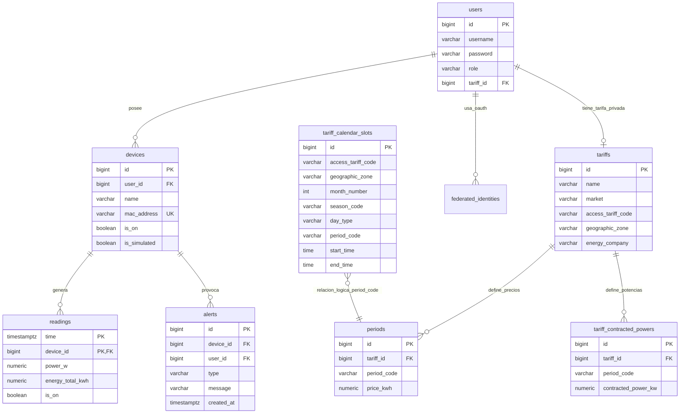
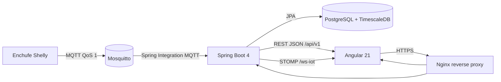
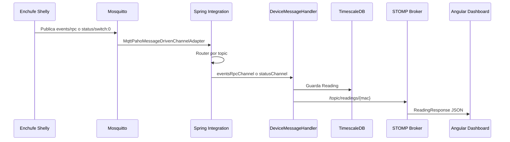

# Memoria tecnica del proyecto Wattimizer

## Indice

1. [Introduccion y justificacion](#1-introduccion-y-justificacion)
2. [Fase 1: Analisis funcional](#2-fase-1-analisis-funcional)
3. [Fase 2: Diseno tecnico](#3-fase-2-diseno-tecnico)
4. [Fase 3: Implementacion y desarrollo](#4-fase-3-implementacion-y-desarrollo)
5. [Fase 4: Pruebas y despliegue](#5-fase-4-pruebas-y-despliegue)
6. [Conclusiones y lineas futuras](#6-conclusiones-y-lineas-futuras)
7. [Bibliografia y recursos](#7-bibliografia-y-recursos)
- [Anexos tecnicos](#anexos-tecnicos)

---

## Cambios recientes analizados

La rama analizada es `cursor/documentaci-n-t-cnica-del-proyecto-c854`. En el momento de preparar este anexo la rama no tenia commits funcionales propios sobre `main`; por eso el analisis se ha centrado en el estado actual del codigo versionado y en los ultimos cambios integrados en la base de trabajo:

| Commit | Area | Impacto documentado |
|---|---|---|
| `3021eba` | Despliegue | Actualiza la guia real de produccion en Hetzner, incluyendo Docker, Certbot, OAuth2, scripts SQL y verificaciones. |
| `5c15db7` | CI | Ajusta permisos de `backend/mvnw` para que GitHub Actions pueda ejecutar Maven. |
| `7d14eb1` | CI/CD | Fuerza el primer despliegue automatico desde GitHub Actions para validar la tuberia. |
| `2263634` | Configuracion | Renombra variables de OAuth de GitHub a `GH_OAUTH_*`, porque GitHub reserva el prefijo `GITHUB_*` en Actions. |
| `269be8d` | Seguridad | Permite `/api/v1/auth/register/admin` en `SecurityConfig` para que el endpoint pueda validar la cabecera `X-Wattimizer-Admin-Secret`. |
| `239442d` | Nginx | Anade resolver DNS interno para evitar cache de IPs obsoletas entre contenedores. |
| `33cf772` | Mosquitto/OAuth2 | Corrige `log_type` en Mosquitto y evita valores vacios de OAuth2 en Docker Compose. |
| `c6f164e` | SQL | Hace el script `tariffs-td-schema.sql` mas seguro e idempotente ante tablas que todavia no existen. |

Esta memoria se centra en el codigo real del repositorio, especialmente en:

- Backend Spring Boot: `backend/src/main/java/com/joselumartos/jwtauthbackenddemo`.
- Frontend Angular: `frontend/src/app`.
- Scripts de base de datos: `backend/src/main/resources/db`.
- Despliegue: `docker-compose.yml`, `nginx/default.conf` y `docs/deployment/hetzner-production.md`.

---

## 1. Introduccion y justificacion

### 1.1. Titulo del proyecto

**Wattimizer**.

La aplicacion se presenta como una plataforma B2B de inteligencia financiera energetica. Su objetivo no es solo medir consumo electrico, sino traducirlo a coste economico real para que una pyme pueda entender cuanto dinero esta gastando, cuando lo esta gastando y que dispositivos provocan los picos.

### 1.2. Descripcion del problema

Muchas pequenas empresas pagan facturas electricas sin tener una vision clara del origen del gasto. La factura llega al final del periodo, pero no explica con detalle que equipo ha consumido mas, en que tramo horario se ha producido el gasto o si hay consumo fantasma durante la noche.

Wattimizer intenta resolver ese problema conectando enchufes inteligentes Shelly mediante MQTT, almacenando las lecturas en una base de datos temporal con TimescaleDB y aplicando tarifas electricas por periodos. De esta forma, el usuario no ve unicamente vatios o kWh, sino indicadores mas cercanos a la toma de decisiones: coste diario, consumo fantasma, alertas por sobrepotencia y evolucion en tiempo real.

La decision de usar una arquitectura web con Angular y Spring Boot encaja con el objetivo del ciclo DAW: separar una interfaz moderna, reactiva y usable de una API REST segura, mantenible y preparada para recibir datos IoT de manera asincrona.

### 1.3. Objetivos

#### Objetivo general

Desarrollar una aplicacion web que permita monitorizar dispositivos electricos IoT, calcular el coste energetico asociado a sus lecturas y ofrecer al usuario informacion util para reducir gasto y detectar consumos anormales.

#### Objetivos especificos

- Implementar autenticacion con JWT y login social OAuth2 mediante Google y GitHub.
- Permitir el registro y vinculacion de dispositivos Shelly por direccion MAC.
- Ingerir telemetria MQTT mediante Spring Integration y persistirla como serie temporal.
- Mostrar en Angular un panel de consumo en tiempo real mediante WebSocket STOMP.
- Gestionar tarifas electricas TD con periodos P1-P6, precios por kWh y potencias contratadas.
- Calcular coste energetico y consumo fantasma a partir de lecturas historicas.
- Generar alertas cuando la potencia activa supere la potencia contratada del periodo aplicable.
- Desplegar la aplicacion en produccion con Docker Compose, Nginx, HTTPS y TimescaleDB.

### 1.4. Tipos de usuarios

| Tipo de usuario | Rol tecnico | Responsabilidad |
|---|---|---|
| Usuario de empresa | `ROLE_USER` | Gestiona sus dispositivos, asigna su tarifa, consulta dashboard, costes y alertas. |
| Administrador | `ROLE_ADMIN` | Tiene las funciones del usuario normal y, ademas, mantiene el catalogo maestro de tarifas. |
| Sistema IoT | No es usuario web | Publica mensajes MQTT desde el dispositivo Shelly hacia Mosquitto. |

En el codigo, los roles se leen desde el JWT. En Angular se consultan con `SessionStorageService.hasRole()`, y en backend se aplican con `SecurityConfig` y `@PreAuthorize` en las operaciones administrativas de tarifas.

---

## 2. Fase 1: Analisis funcional

### 2.1. Mapa de funcionalidades

| Modulo | Funcionalidades principales | Codigo relacionado |
|---|---|---|
| Autenticacion | Login, registro, registro admin, OAuth2, emision de JWT | `AuthController`, `SecurityConfig`, `JwtValidatorFilter`, `AuthService` |
| Dispositivos IoT | Listar, reclamar por MAC, editar nombre, activar/desactivar, eliminar | `DeviceController`, `DeviceService`, `DevicesComponent`, `TelemetryStore` |
| Telemetria | Ingesta MQTT, persistencia de lecturas, emision WebSocket | `MqttConfig`, `DeviceMessageHandler`, `ReadingService`, `TelemetryBroadcaster` |
| Dashboard | Grafica de potencia, coste diario, consumo fantasma, seleccion de medidor | `DashboardComponent`, `TelemetryStore`, `WebsocketService`, `ConsumptionController` |
| Tarifas | Catalogo maestro, tarifa privada de usuario, periodos y potencias | `TariffController`, `UserTariffController`, `TariffComponent`, `TariffStore` |
| Alertas | Deteccion de sobrepotencia y listado de incidencias | `AlertService`, `AlertController`, `AlertsComponent` |
| Analitica energetica | Coste por periodo, consumo fantasma, calendario regulatorio | `ConsumptionService`, `CalendarResolverService`, `tariff_calendar_slots` |
| Despliegue | Produccion con Docker, Nginx, HTTPS, TimescaleDB y Mosquitto | `docker-compose.yml`, `.github/workflows/deploy.yml`, `docs/deployment/hetzner-production.md` |

### 2.2. Historias de usuario

| ID | Historia de usuario | Criterios de aceptacion | Prioridad |
|---|---|---|---|
| HU-01 | Como usuario, quiero iniciar sesion con email y contrasena para acceder a mis datos energeticos. | `POST /api/v1/auth/login` devuelve JWT valido; Angular guarda el token; rutas privadas quedan protegidas. | MVP |
| HU-02 | Como usuario, quiero registrarme para crear mi cuenta. | `POST /api/v1/auth/register` crea usuario con rol normal; si hay errores se devuelven mediante `GlobalExceptionHandler`. | MVP |
| HU-03 | Como usuario, quiero iniciar sesion con Google o GitHub para no depender solo de contrasena local. | OAuth2 redirige al frontend con ticket temporal; `POST /api/v1/auth/oauth/exchange` canjea ticket por JWT. | Opcional avanzado |
| HU-04 | Como usuario, quiero reclamar un dispositivo por MAC para asociarlo a mi cuenta. | El formulario valida una MAC de 12 caracteres hexadecimales; `POST /api/v1/devices/claim` vincula o registra el dispositivo. | MVP |
| HU-05 | Como usuario, quiero ver mis dispositivos y editar su nombre para identificar cada medidor. | `GET /api/v1/devices` lista solo los dispositivos del `Principal`; `PUT /api/v1/devices/{id}` actualiza si pertenece al usuario. | MVP |
| HU-06 | Como usuario, quiero ver la potencia en tiempo real para saber si hay picos de consumo. | Angular se suscribe a `/topic/readings/{macAddress}` y el store mantiene las ultimas 20 muestras. | MVP |
| HU-07 | Como usuario, quiero asignar una tarifa para calcular costes reales. | `GET /api/v1/tariffs` muestra catalogo; `POST /api/v1/users/me/tariff` guarda la tarifa privada del usuario. | MVP |
| HU-08 | Como usuario, quiero consultar el coste diario y el consumo fantasma. | El dashboard llama a `/api/v1/analytics/cost` y `/api/v1/analytics/ghost-consumption` si existe tarifa configurada. | MVP |
| HU-09 | Como usuario, quiero recibir alertas si supero la potencia contratada. | Tras cada lectura, `AlertService.checkPowerThreshold()` compara potencia real con `tariff_contracted_powers`. | MVP |
| HU-10 | Como administrador, quiero crear y mantener plantillas de tarifas. | `POST /api/v1/tariffs`, `POST /api/v1/tariffs/{id}` y `DELETE /api/v1/tariffs/{id}` requieren `ROLE_ADMIN`. | MVP admin |
| HU-11 | Como desarrollador, quiero desplegar la aplicacion de forma reproducible. | `docker-compose.yml` levanta TimescaleDB, Mosquitto, backend, frontend y Nginx; la guia de Hetzner define el orden de arranque y scripts SQL. | MVP tecnico |

### 2.3. Gestion del trabajo

- **Repositorio:** `https://github.com/joellmar/wattpath-app`.
- **Rama documentada:** `cursor/documentaci-n-t-cnica-del-proyecto-c854`.
- **Rama base:** `main`.
- **Flujo observado:** commits pequenos por area (`fix(ci)`, `fix(config)`, `fix(security)`, `fix(sql)`, `docs(deployment)`), con integracion posterior en `main`.

La captura del tablero Kanban no forma parte de los archivos versionados. La evidencia disponible dentro del repositorio es el historial de commits y ramas; para la defensa oral o el documento maquetado se puede acompanar con una captura externa del tablero si el profesor la solicita.

### 2.4. Planificacion inicial

| Fase | Historias asociadas | Dificultad tecnica | Motivo |
|---|---|---|---|
| Autenticacion y seguridad | HU-01, HU-02, HU-03 | Alta | Combina JWT, OAuth2, filtros, CORS y roles. |
| Dispositivos e IoT | HU-04, HU-05, HU-06 | Alta | Requiere MQTT, WebSocket, stores reactivos y persistencia temporal. |
| Tarifas y analitica | HU-07, HU-08, HU-10 | Alta | El modelo tarifario depende de periodos P1-P6, calendario regulatorio y zona horaria. |
| Alertas | HU-09 | Media | Usa datos ya persistidos, pero depende de tarifa, potencia contratada y usuario. |
| Despliegue | HU-11 | Alta | Coordina Docker, Nginx, certificados, secrets, scripts SQL y broker MQTT. |

---

## 3. Fase 2: Diseno tecnico

### 3.1. Diseno de la base de datos

#### 3.1.1. Diagrama E/R



Nota importante: la relacion entre `tariff_calendar_slots` y `periods` no es una clave foranea fisica en la base de datos. Es una relacion logica: el calendario devuelve un `period_code` y los servicios lo cruzan con los periodos de la tarifa que corresponda. Se ha dibujado para explicar el flujo de resolucion, no como restriccion SQL.

#### 3.1.2. Modelo relacional

| Tabla | Clave principal | Claves/relaciones | Uso |
|---|---|---|---|
| `users` | `id` | Relacion con tarifa privada y dispositivos | Identidad de usuario, rol y contrato energetico. |
| `federated_identities` | `id` | FK a `users` | Vinculacion OAuth2 con Google/GitHub. |
| `devices` | `id` | `user_id` a `users`, `mac_address` unico | Inventario de enchufes inteligentes y dispositivos simulados. |
| `readings` | `(time, device_id)` | `device_id` a `devices` | Serie temporal de lecturas. Se convierte en hypertable TimescaleDB. |
| `tariffs` | `id` | Puede asociarse a `users` | Tarifa catalogo o tarifa privada clonada para usuario. |
| `periods` | `id` | `tariff_id` a `tariffs`, unique `(tariff_id, period_code)` | Precio por kWh para P1-P6. |
| `tariff_contracted_powers` | `id` | `tariff_id` a `tariffs` | Potencia contratada por periodo, usada para alertas. |
| `tariff_calendar_slots` | `id` | Tabla de dimension sin usuario | Resuelve peaje + zona + mes + dia + hora a `period_code`. |
| `alerts` | `id` | Relacion con usuario/dispositivo | Guarda incidencias de sobrepotencia. |

Hibernate crea las tablas principales con `spring.jpa.hibernate.ddl-auto=update`. Despues se aplican scripts SQL para lo que JPA no cubre bien:

```sql
-- Se activa TimescaleDB porque readings guarda una serie temporal.
CREATE EXTENSION IF NOT EXISTS timescaledb;

-- La tabla readings se particiona por tiempo para consultas historicas.
SELECT create_hypertable('readings', 'time');
```

El script `tariffs-td-schema.sql` anade restricciones de integridad sobre codigos de peaje, zonas, periodos y calendario. Esta separado porque las reglas regulatorias son mas claras y controlables en SQL que repartidas en validaciones sueltas.

### 3.2. Arquitectura del sistema



#### Backend

- Lenguaje: Java 26.
- Framework: Spring Boot 4.0.5.
- Modulos principales: Spring MVC, Spring Security, OAuth2 Client, Spring Data JPA, Spring Integration MQTT, WebSocket STOMP.
- Persistencia: PostgreSQL con extension TimescaleDB.
- Seguridad: JWT stateless, roles `ROLE_USER` y `ROLE_ADMIN`, OAuth2 con ticket temporal.

#### Frontend

- Framework: Angular 21 con componentes standalone.
- Estado: Angular Signals y `@ngrx/signals`.
- Comunicacion HTTP: `HttpClient` con interceptor para Bearer JWT.
- Tiempo real: `@stomp/rx-stomp` contra `/ws-iot`.
- UI: PrimeNG 21, Tailwind CSS 4 y Chart.js.

#### Comunicacion

- API REST JSON bajo `/api/v1`.
- WebSocket STOMP en `/ws-iot`.
- MQTT inbound desde Mosquitto hacia Spring Integration.
- El frontend no se conecta directamente a MQTT; recibe datos ya validados y persistidos desde el backend.

### 3.3. Diseno de interfaz

El repositorio no versiona imagenes de wireframes. Por eso se documentan como bocetos funcionales en texto, derivados de las pantallas Angular ya implementadas:

#### Login y registro

```text
+------------------------------------------------+
| Wattimizer                                     |
|------------------------------------------------|
| Email                                          |
| [__________________________________________]   |
| Contrasena                                     |
| [__________________________________________]   |
| [Iniciar sesion]                               |
| [Google] [GitHub]                              |
+------------------------------------------------+
```

#### Layout autenticado

```text
+------------------+--------------------------------+
| Wattimizer       | Header usuario + logout         |
|------------------+--------------------------------|
| Dashboard        |                                |
| Dispositivos     | <router-outlet>                |
| Tarifas          |                                |
| Alertas          |                                |
+------------------+--------------------------------+
```

#### Dashboard

```text
+---------------------------------------------------+
| Selector de medidor                               |
| [MAC / nombre del dispositivo]                    |
|---------------------------------------------------|
| Grafica de potencia activa en W                   |
|---------------------------------------------------|
| Coste diario | Consumo fantasma | CTA tarifa      |
+---------------------------------------------------+
```

El dashboard solo muestra analiticas de coste si `TariffStore.hasMyTariff` es verdadero. Esta decision evita ofrecer importes falsos cuando el usuario aun no ha configurado contrato.

### 3.4. Relacion entre historias y diseno

| Historia | Tablas | Backend | Frontend |
|---|---|---|---|
| HU-01 Login | `users` | `AuthController`, `JwtTokenService`, `UserProviderDetailsManager` | `LoginComponent`, `AuthService`, `SessionStorageService` |
| HU-04 Reclamar dispositivo | `devices` | `DeviceController.claimDevice`, `DeviceService` | `DevicesComponent`, `TelemetryStore.loadDevices` |
| HU-06 Telemetria real | `readings`, `devices` | `MqttConfig`, `DeviceMessageHandler`, `TelemetryBroadcaster` | `DashboardComponent`, `WebsocketService`, `TelemetryStore.connectTelemetry` |
| HU-07 Tarifa usuario | `tariffs`, `periods`, `tariff_contracted_powers`, `users` | `UserTariffController`, `UserTariffService` | `TariffComponent`, `TariffStore`, `TariffService` |
| HU-08 Costes | `readings`, `tariff_calendar_slots`, `periods` | `ConsumptionController`, `ConsumptionService`, `CalendarResolverService` | `DashboardComponent` |
| HU-09 Alertas | `alerts`, `readings`, `tariff_contracted_powers` | `AlertService`, `AlertController` | `AlertsComponent` |
| HU-10 Admin tarifas | `tariffs`, `periods`, `tariff_contracted_powers` | `TariffController` con `@PreAuthorize` | `TariffComponent` en modo admin |

---

## 4. Fase 3: Implementacion y desarrollo

### 4.1. Tecnologias utilizadas

| Capa | Tecnologia | Version/uso real |
|---|---|---|
| Backend | Java | 26 (`backend/pom.xml`) |
| Backend | Spring Boot | 4.0.5 |
| Seguridad | Spring Security + JJWT | JWT HMAC, OAuth2 Google/GitHub |
| Persistencia | Spring Data JPA + PostgreSQL | Hibernate con `ddl-auto=update` |
| Series temporales | TimescaleDB | Imagen `timescale/timescaledb-ha:pg17` |
| Mensajeria IoT | Mosquitto + Spring Integration MQTT | `spring-integration-mqtt`, Paho MQTT v3 |
| Frontend | Angular | Dependencias Angular 21.x |
| Estado frontend | `@ngrx/signals` | Signal Store y `rxMethod` |
| Tiempo real frontend | `@stomp/rx-stomp` | Suscripcion STOMP a `/topic/readings/{mac}` |
| UI | PrimeNG, Tailwind CSS, Chart.js | Formularios, tablas, mensajes y grafica de consumo |
| Despliegue | Docker Compose, Nginx, Certbot | Produccion en Hetzner VPS |
| CI/CD | GitHub Actions | Workflow de despliegue automatico |

### 4.2. Desarrollo del backend

#### Seguridad

El backend usa sesiones stateless. `SecurityConfig` desactiva CSRF, configura CORS desde `app.cors.allowed-origins`, registra `JwtValidatorFilter` antes de `BasicAuthenticationFilter` y define rutas publicas:

- `/api/v1/auth/login`
- `/api/v1/auth/register`
- `/api/v1/auth/register/admin`
- `/api/v1/auth/oauth/exchange`
- `/oauth2/authorization/**`
- `/login/oauth2/code/**`
- `/ws-iot/**`

Las lecturas de catalogo de tarifas requieren usuario autenticado, y las mutaciones de catalogo requieren `ROLE_ADMIN`.

#### Controladores REST principales

| Controlador | Ruta base | Responsabilidad |
|---|---|---|
| `AuthController` | `/api/v1/auth` | Login, registro, registro admin y canje de ticket OAuth2. |
| `DeviceController` | `/api/v1/devices` | CRUD y vinculacion de dispositivos por MAC. |
| `ReadingController` | `/api/v1/readings` | Consulta y borrado de lecturas por usuario y MAC. |
| `ConsumptionController` | `/api/v1/analytics` | Calculo de coste y consumo fantasma. |
| `TariffController` | `/api/v1/tariffs` | Catalogo maestro de tarifas. |
| `UserTariffController` | `/api/v1/users/me/tariff` | Tarifa privada del usuario autenticado. |
| `AlertController` | `/api/v1/alerts` | Listado y descarte de alertas. |

#### Gestion de errores

`GlobalExceptionHandler` centraliza errores como `404`, `401`, `400`, `403`, violaciones de integridad y excepciones genericas. El DTO de error es `ErrorResponse`, con estado, tipo de error, mensaje y timestamp.

#### Analitica de consumo

`ConsumptionService` calcula el coste recorriendo lecturas ordenadas por tiempo:

1. Recupera lecturas con `ReadingRepository.findReadingsInInterval(macAddress, start, end)`.
2. Calcula el delta positivo de `energyTotalKwh` entre dos lecturas consecutivas.
3. Resuelve el periodo tarifario aplicable mediante `CalendarResolverService`.
4. Multiplica el delta kWh por `priceKwh`.
5. Redondea el resultado a dos decimales.

Para consumo fantasma se aplica la misma idea, pero solo cuando la lectura cae entre las `00:00` y las `05:59` en la zona horaria del contrato.

### 4.3. Desarrollo del frontend

Angular esta organizado con componentes standalone y rutas lazy. El layout principal se carga solo para usuarios autenticados mediante `authGuard`.

#### Stores reactivos

`TelemetryStore` mantiene:

- `devices`
- `selectedMac`
- `historicalReadings`
- `isLoadingDevices`

La parte mas importante es `connectTelemetry`, definido con `rxMethod`. Usa `distinctUntilChanged` para no reconectar si la MAC no cambia, `switchMap` para cancelar la suscripcion anterior y `filter` para descartar lecturas sin potencia. El store conserva un buffer de 20 puntos por dispositivo para la grafica.

`TariffStore` mantiene:

- `catalog`
- `myTariff`
- `isLoadingCatalog`
- `isLoadingMyTariff`
- `errorMessage`

Expone los computed `hasMyTariff` e `isCatalogEmpty`. El dashboard depende de `hasMyTariff` para decidir si puede llamar a los endpoints analiticos.

#### Componentes principales

| Componente | Funcion |
|---|---|
| `DashboardComponent` | Carga dispositivos, conecta WebSocket, pinta grafica y consulta coste diario/consumo fantasma. |
| `DevicesComponent` | Reclama dispositivos, edita nombre, borra y cambia estado. Usa `HttpClient` directo y refresca el store. |
| `TariffComponent` | Gestiona catalogo admin y tarifa privada. Reconstruye `FormArray` segun peaje de acceso. |
| `AlertsComponent` | Lista y descarta alertas de maximetro. |
| `MainLayoutComponent` | Gestiona navegacion privada y logout limpiando token y stores. |

### 4.4. Control de versiones

El flujo observado en Git separa cambios por responsabilidad. Hay commits especificos para CI, configuracion, seguridad, Nginx, Mosquitto, SQL y despliegue. Esta separacion facilita explicar por que se hizo cada cambio y reduce el riesgo de mezclar correcciones de produccion con cambios funcionales.

El ultimo bloque de trabajo se centro especialmente en estabilizar produccion:

- Variables de entorno OAuth2 compatibles con GitHub Actions.
- Endpoint admin permitido en seguridad antes de validar la clave secreta.
- Correcciones de Nginx y Mosquitto tras pruebas reales.
- Scripts SQL mas seguros cuando Hibernate aun no ha creado todas las tablas.
- Guia de despliegue ampliada con pasos reales de Hetzner.

---

## 5. Fase 4: Pruebas y despliegue

### 5.1. Plan de pruebas

| Area | Prueba existente | Archivo | Que valida |
|---|---|---|---|
| Arranque backend | Contexto Spring | `JwtAuthBackendDemoApplicationTests.java` | La aplicacion carga el contexto basico. |
| Tarifas | Servicio de tarifas | `TariffServiceTest.java` | Validaciones, creacion y actualizacion de tarifas. |
| Tarifa privada | Servicio de tarifa de usuario | `UserTariffServiceTest.java` | Clonado, asignacion y gestion de contrato privado. |
| Consumo | Servicio de consumo | `ConsumptionServiceTest.java` | Coste por delta, consumo fantasma y casos sin tarifa/lecturas. |
| TariffService Angular | HTTP de tarifas | `tariff.service.spec.ts` | Endpoints, `204 -> null`, POST/DELETE. |
| SessionStorage Angular | JWT y roles | `session-storage.service.spec.ts` | Roles, username y ausencia de token. |
| TariffComponent | Formulario dinamico | `tariff.component.spec.ts` | Periodos P1-P6, potencias y modo admin. |
| DashboardComponent | Integracion con TariffStore | `dashboard.component.spec.ts` | Banner sin tarifa, placeholders y estado inicial. |

Pruebas funcionales recomendadas para la memoria final:

| Caso | Entrada | Resultado esperado |
|---|---|---|
| Login vacio | Formulario sin email/contrasena | Angular marca campos invalidos. |
| Login correcto | Credenciales validas | Se guarda JWT y se navega a `/dashboard`. |
| Dispositivo ajeno | MAC de otro usuario | Backend devuelve `403` en lecturas/analytics. |
| Usuario sin tarifa | Dashboard con dispositivo pero sin tarifa | No se calculan costes y aparece CTA de configuracion. |
| Sobrepotencia | Lectura con `powerW / 1000` mayor que potencia contratada | Se guarda alerta `OVERPOWER`. |
| Script hypertable | Ejecutar `01-hypertable.sql` antes de datos | `timescaledb_information.hypertables` muestra `readings`. |

### 5.2. Manual de instalacion y uso

#### Instalacion local

La guia local del repositorio (`GUIA_DESPLIEGUE_LOCAL_WINDOWS.md`) define un modo hibrido de desarrollo: TimescaleDB y Mosquitto corren en Docker, mientras que Spring Boot y Angular se ejecutan como procesos nativos para poder usar hot-reload y depuracion.

Antes de arrancar la infraestructura hay que preparar variables de entorno. El `docker-compose.yml` exige `DB_PASSWORD`, y el broker MQTT usa las credenciales del `password_file`.

```bash
cp .env.example .env
# Editar .env y rellenar, como minimo:
# DB_PASSWORD, PROD_MQTT_USER, PROD_MQTT_PASSWORD, PROD_JWT_SECRET y PROD_ADMIN_KEY.
```

El compose de produccion no publica `5432` al host. Si el backend se ejecuta fuera de Docker, hay que usar una base local accesible en `localhost:5432` o crear un override de desarrollo que publique TimescaleDB. La guia local documenta ese entorno hibrido; el compose principal esta pensado para el VPS.

1. Crear un override temporal para publicar PostgreSQL solo en desarrollo y levantar servicios de infraestructura:

```bash
# El override vive en /tmp para no modificar el compose de produccion del repo.
cat > /tmp/wattimizer-compose.local.yml <<'YAML'
services:
  timescaledb:
    ports:
      - "5432:5432"
YAML

docker compose \
  -f docker-compose.yml \
  -f /tmp/wattimizer-compose.local.yml \
  --env-file .env \
  up -d timescaledb mosquitto
```

2. Arrancar backend en modo nativo apuntando a la base accesible desde el host:

```bash
cd backend
SPRING_DATASOURCE_URL=jdbc:postgresql://localhost:5432/wattimizer_db \
SPRING_DATASOURCE_USERNAME=postgres \
SPRING_DATASOURCE_PASSWORD=tu_password \
MQTT_URL=tcp://localhost:1883 \
MQTT_USER=gateway-service \
MQTT_PASSWORD=s3cr3t \
./mvnw spring-boot:run
```

3. Arrancar frontend:

```bash
cd frontend
npm install
npm start
```

4. Aplicar scripts SQL despues de que Hibernate cree tablas. Si TimescaleDB no esta publicado en el host, ejecutar `psql` desde el contenedor como indica la guia local:

```bash
PSQL="docker compose exec -T timescaledb psql -U postgres -d wattimizer_db"
$PSQL < backend/src/main/resources/db/dev-seed/00-extensions.sql
$PSQL < backend/src/main/resources/db/dev-seed/01-hypertable.sql
$PSQL < backend/src/main/resources/db/tariffs-td-schema.sql
$PSQL < backend/src/main/resources/db/seed-tariff-calendar-slots.sql
```

#### Uso basico

1. Registrarse o iniciar sesion.
2. Ir a **Dispositivos** y reclamar un medidor con su MAC.
3. Ir a **Tarifas** y asignar una plantilla o configurar precios propios.
4. Volver a **Dashboard** para ver potencia en tiempo real, coste diario y consumo fantasma.
5. Revisar **Alertas** para detectar sobrepotencias.

#### Uso de administrador

1. Crear administrador con:

```bash
curl -X POST https://wattimizer.com/api/v1/auth/register/admin \
  -H "Content-Type: application/json" \
  -H "X-Wattimizer-Admin-Secret: TU_PROD_ADMIN_KEY" \
  -d '{"username":"admin","password":"contrasena_segura"}'
```

2. Entrar en **Tarifas**.
3. Crear, editar o eliminar plantillas del catalogo maestro.

### 5.3. Despliegue

El despliegue de produccion esta documentado para un VPS Hetzner con Ubuntu 24.04 LTS. La arquitectura usa:

- Docker Compose para TimescaleDB, Mosquitto, backend, frontend y Nginx.
- Certbot nativo en el host para certificados HTTPS.
- Cloudflare DNS.
- Dominio principal `https://wattimizer.com`.
- Subdominio `api.wattimizer.com` documentado para evitar problemas con WebSocket detras de proxy CDN.

Los puertos expuestos son:

| Puerto | Servicio | Motivo |
|---|---|---|
| 80 | Nginx | HTTP y renovacion Certbot. |
| 443 | Nginx | HTTPS publico. |
| 1883 | Mosquitto | Conexion MQTT del Shelly fisico. |

Los puertos de backend y base de datos no se exponen al exterior. El backend solo es accesible a traves de Nginx y la base solo desde la red Docker `iot_net`.

---

## 6. Conclusiones y lineas futuras

### 6.1. Grado de cumplimiento

El MVP queda cubierto en sus partes principales: autenticacion, gestion de dispositivos, ingesta MQTT, dashboard en tiempo real, gestion de tarifas, calculo de costes, alertas y despliegue. Tambien hay pruebas automatizadas sobre las partes mas sensibles de tarifas, consumo y estado frontend.

### 6.2. Dificultades encontradas

- **Integracion MQTT real:** el backend tiene que distinguir topicos `events/rpc` y `status/switch:0`, parsear estructuras JSON distintas y normalizarlas a una misma entidad `Reading`.
- **Tarifas electricas TD:** no basta con guardar un precio unico; hay que resolver periodo por peaje, zona, mes, tipo de dia y hora local.
- **Costes correctos:** el coste no se calcula desde potencia instantanea, sino desde deltas positivos de energia acumulada para evitar errores por reinicios o lecturas incompletas.
- **Produccion:** aparecieron detalles practicos como variables reservadas por GitHub Actions, DNS interno de Docker en Nginx, orden correcto de scripts SQL y credenciales MQTT.

### 6.3. Mejoras futuras

- Hacer dinamica la suscripcion MQTT para no depender de `shellyplugsg3-9070694d3590/#`.
- Anadir TLS al broker MQTT o encapsular MQTT en VPN.
- Crear indices especificos sobre `readings(device_id, time)` si el volumen crece.
- Usar funciones propias de TimescaleDB, como `time_bucket`, para agregados por hora/dia.
- Anadir politicas de retencion y compresion en TimescaleDB.
- Sustituir `ddl-auto=update` por migraciones controladas cuando el modelo este estable.
- Incorporar comandos MQTT outbound para encender/apagar dispositivos reales desde la web.
- Anadir pruebas end-to-end de login, claim de dispositivo, tarifa y dashboard.

---

## 7. Bibliografia y recursos

- Documentacion oficial de Spring Boot: <https://spring.io/projects/spring-boot>
- Documentacion oficial de Spring Security: <https://spring.io/projects/spring-security>
- Documentacion de Spring Integration MQTT: <https://docs.spring.io/spring-integration/reference/mqtt.html>
- Documentacion de Angular: <https://angular.dev>
- Documentacion de NgRx Signals: <https://ngrx.io/guide/signals>
- Documentacion de RxJS: <https://rxjs.dev>
- Documentacion de TimescaleDB: <https://docs.timescale.com>
- Documentacion de Eclipse Mosquitto: <https://mosquitto.org/documentation/>
- Circular CNMC 3/2020, usada como referencia para los periodos tarifarios TD.
- Guia interna de despliegue: `docs/deployment/hetzner-production.md`.

---

## Anexos tecnicos

## Anexo A. Controladores REST de Spring Boot

### A.1. Autenticacion: `AuthController`

Ruta base: `/api/v1/auth`.

| Metodo | Endpoint | Entrada | Salida | Observaciones |
|---|---|---|---|---|
| `POST` | `/login` | `LoginUser` | `LoginUserJwt` | Autentica usuario/contrasena y genera JWT. |
| `POST` | `/register` | `RegisterRequest` | `201 Created` sin cuerpo | Registra usuario normal. |
| `POST` | `/register/admin` | `RegisterRequest` + header `X-Wattimizer-Admin-Secret` | `201 Created` sin cuerpo | Valida una clave maestra antes de crear administrador. |
| `POST` | `/oauth/exchange` | `OAuthTicketExchangeRequest` | `LoginUserJwt` | Canjea ticket OAuth2 temporal por JWT. |

DTOs:

```java
public record LoginUser(String username, String password) {}
public record LoginUserJwt(String statusCode, String jwt) {}
public record RegisterRequest(
    String username,
    String password,
    String confirmPassword,
    Long tariffId
) {}
public record OAuthTicketExchangeRequest(String ticket) {}
```

El login social no entrega el JWT directamente en la URL. Primero crea un ticket temporal de un solo uso, y Angular lo canjea en `/oauth/exchange`. Esto reduce la exposicion del JWT en historiales o logs del navegador.

### A.2. Dispositivos: `DeviceController`

Ruta base: `/api/v1/devices`.

| Metodo | Endpoint | Parametros | Entrada | Salida |
|---|---|---|---|---|
| `GET` | `/` | `Principal` | - | `List<DeviceDto>` |
| `GET` | `/{id}` | `id`, `Principal` | - | `DeviceDto` o `403` |
| `POST` | `/` | - | `DeviceDto` | `201 DeviceDto` |
| `POST` | `/claim` | `Principal` | `DeviceDto` con `macAddress` y `name` | `DeviceDto` |
| `PUT` | `/{id}` | `id`, `Principal` | `DeviceDto` | `DeviceDto` |
| `DELETE` | `/{id}` | `id`, `Principal` | - | `204` o `403` |

DTO:

```java
public record DeviceDto(
    Long id,
    String username,
    String name,
    String macAddress,
    Boolean isOn,
    Boolean simulated
) {}
```

La mayor parte de operaciones usan `Principal` para limitar el acceso al propietario. La excepcion relevante es `POST /api/v1/devices`, que persiste el DTO recibido sin comprobar usuario en el controlador; el flujo habitual del frontend usa `/claim`.

### A.3. Lecturas: `ReadingController`

Ruta base: `/api/v1/readings`.

| Metodo | Endpoint | Parametros | Salida |
|---|---|---|---|
| `GET` | `/` | `Principal` | Lecturas del usuario autenticado. |
| `GET` | `/latest/{macAddress}` | `macAddress`, `Principal` | Ultima lectura del dispositivo. |
| `GET` | `/search` | `time`, `macAddress`, `Principal` | Lectura por clave compuesta. |
| `DELETE` | `/search` | `time`, `macAddress`, `Principal` | Borrado por clave compuesta. |

DTO:

```java
public record ReadingResponse(
    Instant time,
    String macAddress,
    BigDecimal powerW,
    BigDecimal energyTotalKwh,
    Boolean isOn
) {}
```

`time` se recibe como ISO-8601 y forma parte de la clave primaria junto con el dispositivo. La comprobacion de propietario se hace resolviendo antes el dispositivo por MAC.

### A.4. Analitica: `ConsumptionController`

Ruta base: `/api/v1/analytics`.

| Metodo | Endpoint | Query params | Respuesta |
|---|---|---|---|
| `GET` | `/cost` | `macAddress`, `start`, `end` | `{ macAddress, totalCostEur, start, end }` |
| `GET` | `/ghost-consumption` | `macAddress`, `start`, `end` | `{ macAddress, ghostCostEur, start, end }` |

Estos endpoints no aceptan `userId`. El usuario se obtiene del JWT y se compara con el propietario del dispositivo. Si la MAC no pertenece al usuario autenticado, se devuelve `403`.

### A.5. Tarifas: `TariffController` y `UserTariffController`

`TariffController` gestiona el catalogo global:

| Metodo | Endpoint | Rol | Entrada | Salida |
|---|---|---|---|---|
| `GET` | `/api/v1/tariffs` | Usuario autenticado | - | `List<TariffDto>` |
| `GET` | `/api/v1/tariffs/{id}` | Usuario autenticado | - | `TariffDto` |
| `POST` | `/api/v1/tariffs` | `ROLE_ADMIN` | `TariffDto` | `201 TariffDto` |
| `POST` | `/api/v1/tariffs/{id}` | `ROLE_ADMIN` | `TariffDto` | `TariffDto` |
| `DELETE` | `/api/v1/tariffs/{id}` | `ROLE_ADMIN` | - | `204` |

`UserTariffController` gestiona la tarifa privada:

| Metodo | Endpoint | Entrada | Salida |
|---|---|---|---|
| `GET` | `/api/v1/users/me/tariff` | - | `200 TariffDto` o `204` |
| `POST` | `/api/v1/users/me/tariff` | `UserTariffRequest` | `TariffDto` |
| `DELETE` | `/api/v1/users/me/tariff` | - | `204` |

DTO principal:

```java
public record TariffDto(
    Long id,
    String name,
    String market,
    String accessTariffCode,
    String geographicZone,
    String energyCompany,
    List<PeriodDto> periods,
    List<TariffContractedPowerDto> contractedPowers
) {}
```

DTOs anidados y entrada de tarifa privada:

```java
public record PeriodDto(
    Long id,
    String periodCode,
    BigDecimal priceKwh
) {}

public record TariffContractedPowerDto(
    Long id,
    String periodCode,
    BigDecimal contractedPowerKw
) {}

public record UserTariffRequest(
    Long templateTariffId,
    TariffDto contract
) {}
```

`PeriodDto` transporta el precio de energia por periodo P1-P6. `TariffContractedPowerDto` transporta la potencia contratada en kW para esos mismos periodos y se usa despues en las alertas de maximetro. `UserTariffRequest` permite tres flujos: clonar una plantilla (`templateTariffId`), clonar y modificarla (`templateTariffId` + `contract`) o guardar directamente un contrato privado (`contract`).

La separacion entre catalogo y tarifa privada permite que un usuario parta de una plantilla comun, pero despues tenga sus propios precios y potencias contratadas sin modificar el catalogo global.

### A.6. Alertas: `AlertController`

Ruta base: `/api/v1/alerts`.

| Metodo | Endpoint | Entrada | Salida |
|---|---|---|---|
| `GET` | `/` | `Principal` | `List<AlertDto>` |
| `DELETE` | `/{id}` | `id`, `Principal` | `204` o error si no existe/no pertenece |

DTO:

```java
public record AlertDto(
    Long id,
    String macAddress,
    String username,
    String type,
    String message,
    LocalDateTime createdAt
) {}
```

---

## Anexo B. Componentes y servicios Angular

### B.1. Rutas

Las rutas estan en `frontend/src/app/app.routes.ts`. Login, registro y callback OAuth2 son publicas. El resto cuelga de `MainLayoutComponent` y se protege con `authGuard` y `canActivateChild`.

```typescript
// El uso de loadComponent reduce el bundle inicial y carga cada pantalla cuando se necesita.
{
  path: "dashboard",
  loadComponent: () => import("./components/dashboard/dashboard.component"),
}
```

### B.2. `TelemetryStore`

`TelemetryStore` es un Signal Store global. Su flujo mas importante es:

```mermaid
flowchart TD
    A[DashboardComponent] --> B[loadDevices]
    B --> C[GET /api/v1/devices]
    C --> D[selectedMac]
    D --> E[connectTelemetry]
    E --> F[WebsocketService.watchReadings]
    F --> G[/topic/readings/{mac}]
    G --> H[filter powerW != null]
    H --> I[distinctUntilChanged por time]
    I --> J[historicalReadings max 20 puntos]
    J --> K[computed currentReadings]
    K --> L[Chart.js en dashboard]
```

Decision importante: `switchMap` cancela la suscripcion anterior cuando cambia la MAC. Asi no quedan graficas escuchando a varios dispositivos a la vez.

### B.3. `TariffStore`

`TariffStore` centraliza el catalogo y la tarifa privada:

- `loadCatalog()`: llama a `TariffService.getCatalog()`.
- `loadMyTariff()`: llama a `TariffService.getMyTariff()`.
- `saveMyTariff()`: guarda plantilla o contrato propio.
- `unlinkMyTariff()`: desvincula la tarifa privada.
- `hasMyTariff`: computed usado por el dashboard.

Cuando `getMyTariff()` recibe `204 No Content`, `TariffService` lo convierte en `null`. Esto simplifica el frontend, porque la vista solo pregunta si hay tarifa o no.

### B.4. `DashboardComponent`

Responsabilidades:

- Cargar dispositivos al construir el componente.
- Cargar tarifa privada del usuario.
- Conectar telemetria cuando cambia `selectedMac`.
- Consultar coste diario y consumo fantasma si existe tarifa.
- Mostrar un banner de configuracion cuando el usuario aun no tiene tarifa.

El componente usa tres `effect()`:

1. Ocultar errores de analitica tras unos segundos.
2. Conectar WebSocket y cargar metricas al cambiar MAC.
3. Resetear metricas o recargarlas cuando cambia la tarifa.

### B.5. `TariffComponent`

La pantalla de tarifas tiene dos modos:

- **Admin:** crea, edita y elimina plantillas del catalogo.
- **Usuario:** asigna una plantilla o edita los precios/potencias de su contrato privado.

El formulario es reactivo y usa `FormArray` para periodos de energia y potencias contratadas. Al cambiar el peaje (`2.0TD`, `3.0TD`, `6.1TD`, `6.2TD`) se reconstruyen los arrays:

| Peaje | Periodos energia | Periodos potencia |
|---|---|---|
| `2.0TD` | P1, P2, P3 | P1, P2 |
| `3.0TD` | P1-P6 | P1-P6 |
| `6.1TD` | P1-P6 | P1-P6 |
| `6.2TD` | P1-P6 | P1-P6 |

El validador `ascendingPowerValidator` impone que las potencias contratadas no bajen de un periodo al siguiente.

### B.6. Servicios Angular

| Servicio | Responsabilidad |
|---|---|
| `AuthService` | Login, registro y canje OAuth2. |
| `TariffService` | Catalogo de tarifas y tarifa privada del usuario. |
| `WebsocketService` | Conexion STOMP a `/ws-iot` y suscripcion a `/topic/readings/{macAddress}`. |
| `SessionStorageService` | Guarda JWT, lee roles, username y expiracion. |
| `DeviceService` | Define un `httpResource` para dispositivos, aunque actualmente no se usa desde componentes. |

El interceptor HTTP anade `Authorization: Bearer <token>` a rutas `/api/v1` salvo login, register y oauth/exchange. Si el backend devuelve `401`, limpia la sesion y redirige a `/login`.

---

## Anexo C. Ingesta de telemetria con Spring Integration MQTT

### C.1. Flujo general



### C.2. Configuracion MQTT

`MqttConfig` crea un `MqttPahoMessageDrivenChannelAdapter` con:

| Parametro | Valor |
|---|---|
| Client ID | `backend-spring-iot` |
| Topic | `shellyplugsg3-9070694d3590/#` |
| QoS | `1` |
| Reconexion | Automatica |
| Clean session | `true` |

Las propiedades se leen de:

```properties
mqtt.url=${MQTT_URL:tcp://localhost:1883}
mqtt.username=${MQTT_USER:gateway-service}
mqtt.password=${MQTT_PASSWORD:s3cr3t}
```

La suscripcion esta fijada a un prefijo de Shelly concreto. Es suficiente para el MVP con un dispositivo fisico, pero no para un entorno con alta dinamica de dispositivos.

### C.3. Enrutamiento por topico

| Topic reconocido | Rama | DTO |
|---|---|---|
| `.../events/rpc` | `EVENTS` | `EventsRpc` |
| `.../status/switch:0` | `STATUS` | `Status` |
| Otros | `IGNORE` | `nullChannel` |

El flow transforma JSON a DTO con `Transformers.fromJson(...)` y entrega el mensaje a canales `DirectChannel`. Al ser `DirectChannel`, el procesado se ejecuta de forma directa en el hilo del callback MQTT, aunque separado del flujo HTTP normal de la aplicacion.

### C.4. Persistencia y broadcast

`DeviceMessageHandler` tiene dos `@ServiceActivator`:

- `handleEventsRpc`: guarda lectura desde payload RPC, emite WebSocket y comprueba alerta.
- `handleStatus`: extrae MAC del topico, busca dispositivo, guarda lectura, emite WebSocket y comprueba alerta.

Diferencias:

| Aspecto | `events/rpc` | `status/switch:0` |
|---|---|---|
| MAC | El mapper intenta resolverla desde `src`, buscando un dispositivo ya existente | Sale del topico MQTT |
| Timestamp | Sale de `params.ts` | Se asigna con `Instant.now()` |
| Dispositivo inexistente | Limitacion actual: si no existe, el flujo no recupera bien la MAC y puede acabar creando un dispositivo sin MAC util | Debe existir previamente |
| `isOn` | No se rellena | Sale de `output` |

En `events/rpc` hay que tener cuidado con la palabra "autoalta". El codigo actual de `EventsRpcMapper.mapSourceToDevice()` no crea el dispositivo a partir del `src`; solo busca la MAC en `DeviceRepository`. Despues, `ReadingService.saveEntity(EventsRpc)` crea un dispositivo si no encuentra uno, pero lo hace con la MAC que ya tenga la lectura mapeada. Si el mapper no encontro el dispositivo, esa MAC queda vacia. Por eso, para el MVP el flujo fiable de vinculacion es reclamar o registrar el dispositivo antes desde `/api/v1/devices/claim`, y dejar la mejora de autoalta real por MQTT como linea futura.

La energia total llega desde Shelly en Wh y los mappers la convierten a kWh dividiendo entre 1000. Esta decision evita mezclar unidades en la tabla `readings`.

---

## Anexo D. TimescaleDB, hypertables y consultas analiticas

### D.1. Hypertable `readings`

La entidad `Reading` se guarda en la tabla `readings`:

| Campo | Tipo logico | Notas |
|---|---|---|
| `time` | `Instant` | Parte de la PK compuesta. |
| `device_id` | FK a `devices` | Parte de la PK compuesta. |
| `power_w` | `BigDecimal` | Potencia activa en vatios. |
| `energy_total_kwh` | `BigDecimal` | Energia acumulada en kWh. |
| `is_on` | `Boolean` | Estado del rele si lo aporta el mensaje. |

La clave primaria compuesta `(time, device_id)` encaja con TimescaleDB porque la dimension principal de consulta es el tiempo, pero evitando colisiones entre dispositivos.

### D.2. Scripts SQL aplicados

Orden recomendado:

```bash
PSQL="docker compose exec -T timescaledb psql -U postgres -d wattimizer_db"
$PSQL < backend/src/main/resources/db/dev-seed/00-extensions.sql
$PSQL < backend/src/main/resources/db/dev-seed/01-hypertable.sql
$PSQL < backend/src/main/resources/db/tariffs-td-schema.sql
$PSQL < backend/src/main/resources/db/seed-tariff-calendar-slots.sql
$PSQL < backend/src/main/resources/db/prod/99-resync-sequences.sql
```

Consulta de verificacion documentada:

```sql
SELECT hypertable_name, num_chunks
FROM timescaledb_information.hypertables;
```

### D.3. Consultas analiticas reales

El repositorio no usa todavia funciones especificas de TimescaleDB como `time_bucket` o agregados continuos. Las consultas analiticas reales se hacen con JPQL sobre la hypertable:

```java
@Query("SELECT r FROM Reading r WHERE r.device.macAddress = :macAddress " +
       "AND r.time >= :start AND r.time <= :end ORDER BY r.time ASC")
List<Reading> findReadingsInInterval(String macAddress, Instant start, Instant end);
```

Su equivalente SQL seria:

```sql
-- Se ordena por tiempo porque ConsumptionService calcula deltas entre lecturas consecutivas.
SELECT r.*
FROM readings r
JOIN devices d ON d.id = r.device_id
WHERE d.mac_address = :macAddress
  AND r.time >= :start
  AND r.time <= :end
ORDER BY r.time ASC;
```

Con esas lecturas, `ConsumptionService` calcula:

```text
delta_kwh = lectura_actual.energy_total_kwh - lectura_anterior.energy_total_kwh
coste_paso = delta_kwh * precio_kwh_del_periodo
coste_total = suma(coste_paso)
```

Para consumo fantasma anade una condicion funcional: solo cuenta lecturas entre `00:00` y `05:59` en la zona horaria del contrato.

### D.4. Calendario regulatorio

La tabla `tariff_calendar_slots` evita tener hardcodeados en Java todos los horarios regulatorios. El servicio resuelve:

```text
Instant UTC
  -> zona local del contrato
  -> mes + hora local + dia semana
  -> day_type
  -> period_code
  -> precio en periods
```

La consulta JPQL de `TariffCalendarSlotRepository.findPeriodCode` usa intervalo semiabierto `[startTime, endTime)`, y anade un caso para `23:59` porque PostgreSQL `TIME` no representa `24:00`.

### D.5. Limitaciones actuales

- No hay indices SQL explicitos sobre `readings` mas alla de la organizacion como hypertable y la clave primaria.
- No hay politicas de retencion ni compresion.
- No hay agregados continuos.
- La cobertura seed del calendario se centra en `2.0TD` y `3.0TD` para `PENINSULA` e `ISLAS_BALEARES`.
- Los calculos se hacen en Java, no dentro de TimescaleDB.

Estas limitaciones no bloquean el MVP, pero marcan bien las lineas futuras si la aplicacion recibe muchas lecturas por minuto o muchos dispositivos.
