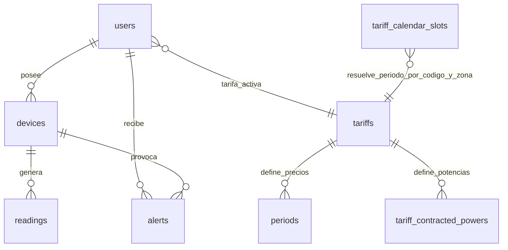

# Memoria tecnica del proyecto Wattimizer

## Indice de la memoria

Este documento organiza la memoria final del proyecto **Wattimizer** siguiendo la estructura exigida en clase. Los apartados principales resumen el proyecto y enlazan con anexos tecnicos mas detallados, redactados a partir del codigo real del repositorio.

- [1. Introduccion y justificacion](#1-introduccion-y-justificacion)
- [2. Fase 1: Analisis funcional](#2-fase-1-analisis-funcional)
- [3. Fase 2: Diseno tecnico](#3-fase-2-diseno-tecnico)
- [4. Fase 3: Implementacion y desarrollo](#4-fase-3-implementacion-y-desarrollo)
- [5. Fase 4: Pruebas y despliegue](#5-fase-4-pruebas-y-despliegue)
- [6. Conclusiones y lineas futuras](#6-conclusiones-y-lineas-futuras)
- [7. Bibliografia y recursos](#7-bibliografia-y-recursos)
- [Anexos tecnicos](#anexos-tecnicos)

---

## 1. Introduccion y justificacion

### 1.1. Titulo del proyecto

**Wattimizer App**.

El nombre combina la idea de optimizar el consumo electrico con una aplicacion web orientada a controlar el gasto energetico de forma clara. El repositorio presenta el proyecto como una plataforma B2B de inteligencia financiera energetica para pymes.

### 1.2. Descripcion del problema

Muchas pequenas empresas conocen el importe final de la factura electrica, pero no saben que dispositivos provocan los picos de potencia, en que franjas horarias se consume mas energia ni cuanto dinero se pierde por consumos residuales durante la noche. Esa falta de visibilidad provoca decisiones a ciegas: se pagan contratos que no encajan con el uso real, se detectan tarde los consumos fantasma y no se relacionan los kWh registrados con euros concretos.

Wattimizer plantea una solucion web que conecta dispositivos IoT tipo Shelly Plug mediante MQTT, registra lecturas electricas en una base de datos de series temporales y traduce esos datos a informacion economica. El usuario puede ver la potencia en tiempo real, asociar una tarifa electrica, calcular el coste del periodo analizado y recibir alertas cuando la potencia medida supera la potencia contratada.

### 1.3. Objetivos

#### Objetivo general

Desarrollar una aplicacion web full-stack que permita monitorizar consumos electricos de dispositivos IoT, convertir las lecturas en coste economico segun tarifas electricas configurables y mostrar la informacion al usuario en tiempo real.

#### Objetivos especificos

- Implementar una API REST segura con Spring Boot para autenticacion, dispositivos, lecturas, tarifas, analiticas y alertas.
- Integrar login tradicional con JWT y login social mediante OAuth2, usando un ticket temporal para entregar el JWT al frontend sin exponerlo en la URL final.
- Recibir telemetria MQTT desde Mosquitto con Spring Integration MQTT y persistirla como lecturas asociadas a dispositivos.
- Utilizar PostgreSQL con TimescaleDB para almacenar la tabla `readings` como hypertable particionada por tiempo.
- Construir un frontend Angular con rutas privadas, componentes standalone, formularios reactivos y estado compartido mediante `@ngrx/signals`.
- Mostrar telemetria en tiempo real mediante WebSocket STOMP y mantener una serie corta de lecturas por dispositivo para la grafica.
- Calcular coste energetico y consumo fantasma usando los periodos tarifarios reales almacenados en base de datos.
- Desplegar la solucion con Docker Compose, Nginx, TimescaleDB y Mosquitto en un entorno preparado para produccion.

### 1.4. Tipos de usuarios

| Usuario | Descripcion | Funciones principales |
| --- | --- | --- |
| Usuario registrado | Persona o empresa que quiere controlar sus dispositivos y consumo electrico. | Login, vinculacion de dispositivos, consulta de dashboard, configuracion de tarifa propia, revision de alertas. |
| Administrador | Usuario con rol `ROLE_ADMIN`. | Gestion del catalogo global de tarifas, alta/edicion/borrado de plantillas tarifarias y acceso a funciones protegidas de administracion. |
| Sistema IoT | Dispositivo Shelly o simulador interno que emite telemetria. | Publica potencia, energia acumulada y estado del interruptor para que el backend genere lecturas. |

---

## 2. Fase 1: Analisis funcional

### 2.1. Mapa de funcionalidades

| Modulo | Funcionalidades |
| --- | --- |
| Autenticacion | Registro, login con email y password, login OAuth2 con Google/GitHub, emision y validacion de JWT, cierre de sesion en frontend. |
| Dispositivos IoT | Listado de dispositivos del usuario, alta, vinculacion por MAC, cambio de nombre, apagado/encendido logico y borrado. |
| Telemetria | Recepcion MQTT, normalizacion de energia Wh a kWh, persistencia de lecturas, simulacion cada 5 segundos y emision STOMP al dashboard. |
| Dashboard | Seleccion de dispositivo, grafica de potencia en tiempo real, coste total del periodo y coste de consumo fantasma. |
| Tarifas | Catalogo maestro, tarifa privada del usuario, periodos de energia, potencias contratadas y validacion por peajes `2.0TD`, `3.0TD`, `6.1TD` y `6.2TD`. |
| Alertas | Deteccion de sobrepotencia, persistencia de alertas y borrado de alertas por el usuario propietario. |
| Despliegue | Contenedores Docker para backend, frontend, TimescaleDB, Mosquitto y Nginx. |

### 2.2. Historias de usuario

| ID | Historia de usuario | Criterios de aceptacion | Prioridad |
| --- | --- | --- | --- |
| HU-01 | Como usuario, quiero registrarme con email y contrasena para acceder a la plataforma. | El sistema valida email, contrasena minima y confirmacion; si el email ya existe, devuelve error controlado. | MVP |
| HU-02 | Como usuario, quiero iniciar sesion para recibir un JWT y acceder a mis datos. | Con credenciales correctas se guarda el token; con credenciales incorrectas se muestra error y no se accede al area privada. | MVP |
| HU-03 | Como usuario, quiero iniciar sesion con Google o GitHub para no crear otra contrasena. | El backend genera un ticket temporal OAuth2 y el frontend lo intercambia por JWT. | Opcional avanzada |
| HU-04 | Como usuario, quiero vincular un dispositivo por MAC para ver solo mis lecturas. | El dispositivo queda asociado al usuario autenticado; si pertenece a otra cuenta, no se permite reclamarlo. | MVP |
| HU-05 | Como usuario, quiero ver potencia en tiempo real para detectar consumos anormales. | El dashboard se suscribe al topic STOMP de la MAC seleccionada y actualiza la grafica con nuevas lecturas. | MVP |
| HU-06 | Como usuario, quiero configurar mi tarifa electrica para calcular el coste real. | El sistema permite asignar una plantilla o crear contrato privado con periodos y potencias validas. | MVP |
| HU-07 | Como usuario, quiero consultar el coste del periodo seleccionado para traducir kWh a euros. | El backend calcula deltas positivos del odometro y aplica el precio del periodo tarifario correspondiente. | MVP |
| HU-08 | Como usuario, quiero conocer el consumo fantasma nocturno para detectar gasto innecesario. | El calculo solo incluye lecturas entre `00:00` y `05:59` en la zona local del contrato. | MVP |
| HU-09 | Como usuario, quiero recibir alertas si supero mi potencia contratada. | El sistema compara `powerW` convertido a kW con la potencia contratada del periodo resuelto y crea alerta `OVERPOWER`. | MVP |
| HU-10 | Como administrador, quiero gestionar el catalogo de tarifas para ofrecer plantillas reutilizables. | Solo `ROLE_ADMIN` puede crear, editar o borrar tarifas del catalogo. | MVP |
| HU-11 | Como desarrollador, quiero tener telemetria simulada para probar sin hardware fisico. | Los dispositivos marcados como simulados generan una lectura cada 5 segundos y alimentan el mismo flujo que un Shelly real. | Opcional tecnica |

### 2.3. Gestion del trabajo

- **Repositorio:** este repositorio contiene backend, frontend, infraestructura Docker y documentacion.
- **Rama de documentacion actual:** `cursor/documentaci-n-t-cnica-del-proyecto-b94c`.
- **Flujo usado:** ramas de funcionalidad y commits descriptivos. En el historial reciente se observan cambios de CI/CD, configuracion de Mosquitto, ajustes de OAuth2, seguridad de rutas y guias de despliegue.
- **Kanban:** para la entrega academica se recomienda adjuntar una captura externa del tablero con las columnas `Backlog`, `Por hacer`, `En progreso`, `En revision` y `Hecho`.

### 2.4. Planificacion inicial por fases

| Fase | Historias asociadas | Dificultad tecnica |
| --- | --- | --- |
| Analisis y base del proyecto | HU-01, HU-02 | Media: implica seguridad, entidades de usuario y estructura inicial. |
| Dispositivos y telemetria | HU-04, HU-05, HU-11 | Alta: combina MQTT, persistencia temporal y WebSocket. |
| Tarifas y analiticas | HU-06, HU-07, HU-08, HU-10 | Alta: requiere modelo tarifario, calendario regulatorio y calculos por intervalos. |
| Alertas y UX | HU-09 | Media: reutiliza telemetria y tarifas, pero anade reglas de negocio y pantalla propia. |
| Despliegue y documentacion | Todas | Media-alta: coordina Docker, Nginx, TimescaleDB, Mosquitto y variables de entorno. |

---

## 3. Fase 2: Diseno tecnico

### 3.1. Diseno de la base de datos

El modelo relacional se centra en usuarios, dispositivos, lecturas, tarifas y alertas. La tabla especial es `readings`, porque almacena datos de series temporales y se convierte en hypertable de TimescaleDB por la columna `time`.



La descripcion completa de tablas, claves e indices esta en [`../technical/database-analytics.md`](../technical/database-analytics.md).

### 3.2. Arquitectura del sistema

```mermaid
flowchart LR
    Shelly[Shelly Plug / Simulador] -->|MQTT| Mosquitto[Eclipse Mosquitto]
    Mosquitto -->|Spring Integration MQTT| Backend[Spring Boot API]
    Backend -->|JPA| DB[(PostgreSQL + TimescaleDB)]
    Backend -->|STOMP /topic/readings/{mac}| Frontend[Angular]
    Frontend -->|REST JSON /api/v1| Backend
    Nginx[Nginx reverse proxy] --> Frontend
    Nginx --> Backend
```

- **Backend:** Java 26, Spring Boot 4.0.5, Spring Security, Spring Integration MQTT, Spring Data JPA, WebSocket STOMP y MapStruct.
- **Frontend:** Angular 21, TypeScript, PrimeNG, Chart.js, RxJS, `@ngrx/signals` y formularios reactivos.
- **Comunicacion:** REST JSON para operaciones de negocio, STOMP sobre WebSocket para lecturas en tiempo real y MQTT para entrada de telemetria IoT.
- **Base de datos:** PostgreSQL 17 con TimescaleDB, ejecutado mediante la imagen `timescale/timescaledb-ha:pg17`.

### 3.3. Diseno de interfaz

Las pantallas principales implementadas son:

- **Login y registro:** formularios reactivos con validacion y accesos OAuth2.
- **Dashboard:** seleccion de dispositivo, grafica de potencia y tarjetas de coste.
- **Dispositivos:** formulario para reclamar MAC, listado, edicion y borrado.
- **Tarifas:** catalogo, tarifa activa del usuario y mantenimiento administrativo.
- **Alertas:** tabla de avisos generados por sobrepotencia.

Para la memoria final se pueden adjuntar capturas reales de estas vistas. El comportamiento tecnico de cada componente esta documentado en [`../technical/frontend-angular.md`](../technical/frontend-angular.md).

### 3.4. Relacion entre historias y diseno

| Historia | Tablas principales | Codigo principal |
| --- | --- | --- |
| HU-01 / HU-02 | `users` | `AuthController`, `AuthRegistrationService`, `JwtTokenService`, `SessionStorageService`. |
| HU-04 | `devices`, `users` | `DeviceController`, `DeviceService`, `TelemetryStore`, `DevicesComponent`. |
| HU-05 | `readings`, `devices` | `MqttConfig`, `DeviceMessageHandler`, `ReadingService`, `TelemetryBroadcaster`, `DashboardComponent`. |
| HU-06 / HU-10 | `tariffs`, `periods`, `tariff_contracted_powers` | `TariffController`, `UserTariffController`, `TariffService`, `UserTariffService`, `TariffComponent`. |
| HU-07 / HU-08 | `readings`, `tariff_calendar_slots`, `periods` | `ConsumptionController`, `ConsumptionService`, `CalendarResolverService`. |
| HU-09 | `alerts`, `readings`, `devices` | `AlertService`, `AlertController`, `AlertsComponent`. |

---

## 4. Fase 3: Implementacion y desarrollo

### 4.1. Tecnologias utilizadas

| Area | Tecnologia |
| --- | --- |
| Backend | Java 26, Spring Boot 4.0.5, Spring Security, OAuth2 Client, Spring Data JPA, Spring Integration MQTT, Spring WebSocket, MapStruct 1.6.3, Lombok. |
| Frontend | Angular 21, TypeScript 5.9, RxJS 7.8, `@ngrx/signals`, PrimeNG 21, Chart.js 4.5, STOMP/RxStomp. |
| Base de datos | PostgreSQL 17 + TimescaleDB, extension `pgcrypto`, Hibernate `ddl-auto=update` y scripts SQL complementarios. |
| IoT | Eclipse Mosquitto 2.1.2, MQTT QoS 1, dispositivo Shelly Plug S Gen3 y simulador interno. |
| Infraestructura | Docker Compose, Nginx, Certbot externo, GitHub Actions para despliegue. |
| Pruebas | JUnit 5, Mockito, AssertJ, Angular TestBed, Vitest/jsdom. |

### 4.2. Desarrollo del backend

El backend separa la API REST en controladores por dominio: autenticacion, dispositivos, lecturas, tarifas, analiticas y alertas. La seguridad es stateless mediante JWT; el filtro extrae el token `Bearer`, valida la firma y carga las authorities desde el claim `authorities`.

La logica de negocio vive en servicios:

- `AuthRegistrationService` valida registro y asigna roles.
- `DeviceService` controla vinculacion de dispositivos por usuario.
- `ReadingService` persiste lecturas reales y simuladas.
- `ConsumptionService` calcula costes sobre deltas positivos del odometro.
- `CalendarResolverService` traduce fecha local, zona geografica y peaje a periodo tarifario.
- `AlertService` crea alertas al superar la potencia contratada.

El contrato completo de endpoints y DTOs esta en [`../technical/api-reference.md`](../technical/api-reference.md).

### 4.3. Desarrollo del frontend

El frontend usa Angular standalone con rutas lazy-loaded. Las pantallas privadas cuelgan de `MainLayoutComponent` y estan protegidas con `authGuard`. El token se guarda en `sessionStorage`; el interceptor HTTP lo adjunta solo a rutas `/api/v1` protegidas y limpia la sesion si recibe `401`.

El estado compartido no usa NgRx Store clasico con actions/reducers/effects. Se usa `@ngrx/signals`:

- `TelemetryStore` gestiona dispositivos, MAC seleccionada y ultimas 20 lecturas por dispositivo.
- `TariffStore` gestiona catalogo, tarifa activa, cargas y errores.

Los flujos asincronos se modelan con `rxMethod`, `switchMap`, `tap`, `catchError`, `filter` y `distinctUntilChanged`.

### 4.4. Control de versiones

El repositorio organiza backend, frontend, infraestructura y documentacion en una unica raiz. El historial reciente muestra commits atomicos para:

- permisos de `mvnw` en CI;
- ajustes de variables OAuth2 para evitar conflictos con GitHub Actions;
- apertura controlada de `/api/v1/auth/register/admin`;
- configuracion de Nginx para resolver nombres internos de Docker;
- correcciones de Mosquitto y scripts SQL de tarifas;
- guias de despliegue en Hetzner.

---

## 5. Fase 4: Pruebas y despliegue

### 5.1. Plan de pruebas

| Prueba | Tipo | Resultado esperado |
| --- | --- | --- |
| Registro con email duplicado | Backend servicio | Devuelve error controlado, no crea otro usuario. |
| Login con credenciales invalidas | Backend/API | Devuelve `401 Unauthorized`. |
| Calculo de consumo fantasma en Peninsula | Backend unitario | Cuenta lecturas entre `00:00` y `05:59` hora local peninsular. |
| Calculo de consumo fantasma en Canarias | Backend unitario | Usa `Atlantic/Canary` y no confunde medianoche peninsular con hora canaria. |
| Validacion de tarifa `2.0TD` | Backend servicio | Exige energia `P1-P3` y potencias `P1-P2`. |
| Dashboard sin tarifa | Frontend componente | Muestra llamada a configurar tarifa y no calcula coste. |
| `SessionStorageService` | Frontend servicio | Guarda, lee, valida expiracion y extrae roles del JWT. |
| `TariffService` | Frontend servicio | Interpreta `204 No Content` en `GET /users/me/tariff` como ausencia de tarifa. |

### 5.2. Manual de instalacion y uso

La guia local ya esta desarrollada en [`../../GUIA_DESPLIEGUE_LOCAL_WINDOWS.md`](../../GUIA_DESPLIEGUE_LOCAL_WINDOWS.md). Para un resumen rapido:

```bash
# Backend local
cd backend
./mvnw spring-boot:run

# Frontend local
cd frontend
npm install
npm start

# Entorno completo con contenedores
docker compose up -d --build
```

Uso funcional basico:

1. Registrarse o iniciar sesion.
2. Vincular un dispositivo desde la pantalla de dispositivos.
3. Configurar una tarifa propia o asignar una plantilla.
4. Entrar al dashboard y seleccionar la MAC.
5. Revisar coste, consumo fantasma y alertas.

### 5.3. Despliegue

El despliegue de produccion esta documentado en [`../deployment/hetzner-production.md`](../deployment/hetzner-production.md). La arquitectura usa:

- VPS Ubuntu en Hetzner.
- Docker Compose para servicios internos.
- Nginx como proxy inverso en puertos 80/443.
- Certbot en el host para certificados.
- Mosquitto en puerto 1883 para el Shelly fisico.
- TimescaleDB sin puerto expuesto al exterior.

---

## 6. Conclusiones y lineas futuras

### 6.1. Grado de cumplimiento

El MVP queda cubierto en sus partes principales: autenticacion, gestion de dispositivos, telemetria, dashboard, tarifas, analiticas y alertas. Tambien existe una ruta de despliegue completa con Docker y Nginx.

### 6.2. Dificultades

- **Ingesta IoT asincrona:** se resolvio con Spring Integration MQTT, separando mensajes `events/rpc` y `status/switch:0`.
- **Series temporales:** se mantuvo JPA para el dominio de negocio y se anadio TimescaleDB solo donde aporta valor: la tabla `readings`.
- **Coste electrico por zona:** se separo el calendario regulatorio (`tariff_calendar_slots`) de los precios privados de cada tarifa.
- **OAuth2 en SPA:** se evito devolver el JWT directamente en la redireccion y se uso un ticket temporal intercambiable.
- **Despliegue real:** se ajustaron variables, Nginx, Mosquitto y permisos de Maven para que el entorno de CI/CD pudiera arrancar.

### 6.3. Mejoras futuras

- Sustituir la suscripcion MQTT hardcodeada por un patron multi-dispositivo configurable.
- Anadir TLS para MQTT en puerto 8883 o aislar el broker mediante VPN.
- Incorporar `time_bucket`, continuous aggregates, retencion y compresion de TimescaleDB.
- Generar documentacion OpenAPI automatica para la API REST.
- Crear una app movil o PWA con notificaciones push de alertas.
- Anadir importacion automatica de precios reales o integracion con APIs energeticas oficiales.
- Mejorar permisos de dispositivos para que el alta directa use siempre el usuario del JWT y no el `username` recibido en el cuerpo.

---

## 7. Bibliografia y recursos

- Documentacion oficial de Spring Boot: https://spring.io/projects/spring-boot
- Documentacion oficial de Spring Security: https://spring.io/projects/spring-security
- Spring Integration MQTT: https://docs.spring.io/spring-integration/reference/mqtt.html
- Angular: https://angular.dev
- NgRx Signals: https://ngrx.io/guide/signals
- RxJS: https://rxjs.dev
- PrimeNG: https://primeng.org
- Chart.js: https://www.chartjs.org
- TimescaleDB: https://docs.timescale.com
- PostgreSQL: https://www.postgresql.org/docs
- Eclipse Mosquitto: https://mosquitto.org/documentation
- Shelly API Documentation: https://shelly-api-docs.shelly.cloud
- Docker Compose: https://docs.docker.com/compose
- Nginx: https://nginx.org/en/docs

---

## Anexos tecnicos

- [Anexo A - Referencia de API REST](../technical/api-reference.md)
- [Anexo B - Frontend Angular, RxJS y NgRx Signals](../technical/frontend-angular.md)
- [Anexo C - Ingesta MQTT, WebSocket y telemetria](../technical/iot-mqtt-timescaledb.md)
- [Anexo D - Base de datos, TimescaleDB y consultas analiticas](../technical/database-analytics.md)
