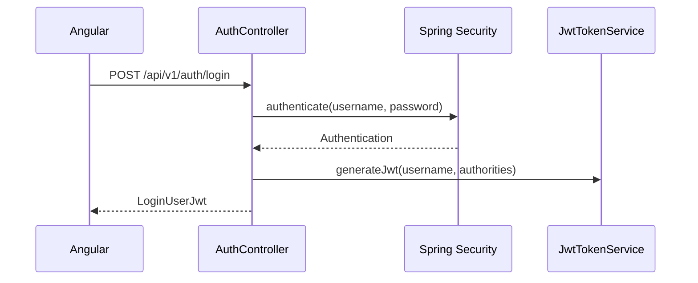

# Anexo A. Controladores REST de Spring Boot

## 1. Visión general

El backend expone una API REST bajo el prefijo `/api/v1`. Está implementado con
Spring Boot 4.0.5, Spring WebMVC, Spring Security y JPA. La mayoría de
operaciones requiere JWT en el header:

```http
Authorization: Bearer <jwt>
```

El token contiene el nombre de usuario en el claim `username` y los roles en
`authorities`. En los endpoints multitenant, el backend toma el usuario desde
`Principal` para evitar que el cliente pueda enviar un `userId` de otra cuenta.

## 2. Autenticación: `AuthController`

**Base path:** `/api/v1/auth`

| Método | Endpoint | Seguridad | Entrada | Salida |
| --- | --- | --- | --- | --- |
| `POST` | `/login` | Pública | `LoginUser` | `LoginUserJwt` con HTTP 200 |
| `POST` | `/register` | Pública | `RegisterRequest` | HTTP 201 sin cuerpo |
| `POST` | `/register/admin` | Pública, pero exige header secreto | `RegisterRequest` + `X-Wattimizer-Admin-Secret` | HTTP 201 sin cuerpo |
| `POST` | `/oauth/exchange` | Pública | `OAuthTicketExchangeRequest` | `LoginUserJwt` con HTTP 200 |

### DTOs

```java
public record LoginUser(
        String username,
        String password
) { }
```

En la aplicación, `username` se usa como correo electrónico. El registro lo
normaliza a minúsculas desde la capa de servicio.

```java
public record RegisterRequest(
        String username,
        String password,
        String confirmPassword,
        Long tariffId
) { }
```

`tariffId` permite asociar una tarifa durante el alta, aunque el flujo principal
del frontend permite configurarla después desde la pantalla de tarifas.

```java
public record OAuthTicketExchangeRequest(String ticket) { }
```

```java
public record LoginUserJwt(
        String statusCode,
        String jwt
) { }
```

El campo `statusCode` contiene la cadena `"200 OK"`, no un entero.

### Flujo de login y OAuth2



En OAuth2, Google o GitHub redirigen al backend. El backend emite un ticket de
un solo uso y Angular lo canjea en `/oauth/exchange` para obtener el JWT propio
de Wattimizer.

## 3. Dispositivos: `DeviceController`

**Base path:** `/api/v1/devices`

| Método | Endpoint | Parámetros | Entrada | Salida | Intención |
| --- | --- | --- | --- | --- | --- |
| `GET` | `/` | `Principal` | Ninguna | `List<DeviceDto>` | Lista solo los dispositivos del usuario autenticado. |
| `GET` | `/{id}` | `id`, `Principal` | Ninguna | `DeviceDto`, 403 sin cuerpo o 404 | Consulta un dispositivo si pertenece al usuario. |
| `POST` | `/` | Ninguno | `DeviceDto` | `DeviceDto` con HTTP 201 | Alta directa de dispositivo; es un endpoint más permisivo que `/claim`. |
| `POST` | `/claim` | `Principal` | `DeviceDto` con `macAddress` y `name` | `DeviceDto` | Vincula o registra una MAC física para el usuario actual. |
| `POST` | `/simulated/demo-pack` | `Principal` | Ninguna | `List<DeviceDto>` con HTTP 201 | Crea un simulador por perfil que el usuario aún no tenga. |
| `POST` | `/simulated` | `Principal` | `CreateSimulatedDeviceRequest` | `DeviceDto` con HTTP 201 | Crea un dispositivo virtual con MAC generada. |
| `PUT` | `/{id}` | `id`, `Principal` | `DeviceDto` | `DeviceDto` | Edita nombre, estado y perfil si es simulado. |
| `DELETE` | `/{id}` | `id`, `Principal` | Ninguna | HTTP 204, 403 sin cuerpo o 404 | Elimina dispositivo, lecturas y alertas asociadas. |

### DTOs

```java
public record DeviceDto(
        Long id,
        String username,
        String name,
        String macAddress,
        Boolean isOn,
        Boolean simulated,
        SimulationProfile simulationProfile
) {}
```

`DeviceDto` se usa tanto para entrada como para salida. En operaciones como
`/claim` el backend solo necesita `macAddress` y `name`; en simuladores, el
usuario se obtiene desde el JWT y la MAC se genera con prefijo `SIM`.

```java
public record CreateSimulatedDeviceRequest(
        String name,
        SimulationProfile simulationProfile
) {}
```

Perfiles soportados por `SimulationProfile`:

```text
SINE_WAVE, OVEN, WASHING_MACHINE, TELEVISION, FAN,
DESKTOP_PC, FRIDGE, STANDBY, CONSTANT_HIGH_LOAD
```

### Decisiones de diseño

- La ruta `/claim` es la más segura para alta física porque asocia el
  dispositivo al `Principal`.
- Los simuladores se marcan con `simulated=true` y reciben MACs del tipo
  `SIM000000001`.
- El borrado llama a `readingRepository.deleteAllByDeviceMacAddress` y
  `alertRepository.deleteByDeviceId` antes de eliminar el dispositivo, para no
  dejar datos colgando.
- El pack demo es idempotente a nivel funcional: si un usuario ya tiene un
  perfil, ese perfil se omite.

## 4. Lecturas: `ReadingController`

**Base path:** `/api/v1/readings`

| Método | Endpoint | Parámetros | Entrada | Salida |
| --- | --- | --- | --- | --- |
| `GET` | `/` | `Principal` | Ninguna | `List<ReadingResponse>` del usuario |
| `GET` | `/latest/{macAddress}` | `macAddress`, `Principal` | Ninguna | Última `ReadingResponse`, 403 o 404 |
| `GET` | `/device/{macAddress}/recent` | `macAddress`, query `seconds` con valor por defecto 120 | Ninguna | Lista reciente, 403 o 404 si la MAC no existe |
| `GET` | `/search` | query `time` ISO-8601, `macAddress`, `Principal` | Ninguna | Lectura por clave compuesta, 403 o 404 |
| `DELETE` | `/search` | query `time` ISO-8601, `macAddress`, `Principal` | Ninguna | HTTP 204, 403 o 404 |

### DTO de salida

```java
public record ReadingResponse(
        Instant time,
        String macAddress,
        BigDecimal powerW,
        BigDecimal energyTotalKwh,
        Boolean isOn
) {}
```

No existe endpoint REST para crear lecturas manualmente. Las lecturas llegan por
MQTT o por el job de simulación. Esta decisión evita que el frontend pueda
inyectar telemetría arbitraria en la serie temporal.

## 5. Alertas: `AlertController`

**Base path:** `/api/v1/alerts`

| Método | Endpoint | Parámetros | Salida |
| --- | --- | --- | --- |
| `GET` | `/` | `Principal` | `List<AlertDto>` |
| `DELETE` | `/{id}` | `id`, `Principal` | HTTP 204 o 404 si no pertenece al usuario |

```java
public record AlertDto(
        Long id,
        String macAddress,
        String username,
        String type,
        String message,
        LocalDateTime createdAt
) { }
```

Las alertas no se crean desde la API pública. Se generan en backend cuando
`AlertService.checkPowerThreshold` detecta que la potencia de una lectura supera
la potencia contratada del periodo correspondiente.

## 6. Tarifas de catálogo: `TariffController`

**Base path:** `/api/v1/tariffs`

| Método | Endpoint | Seguridad | Entrada | Salida |
| --- | --- | --- | --- | --- |
| `GET` | `/` | JWT | Ninguna | `List<TariffDto>` |
| `GET` | `/{id}` | JWT | Ninguna | `TariffDto` |
| `POST` | `/` | `ROLE_ADMIN` | `TariffDto` | `TariffDto` con HTTP 201 |
| `POST` | `/{id}` | `ROLE_ADMIN` | `TariffDto` | `TariffDto` con HTTP 200 |
| `DELETE` | `/{id}` | `ROLE_ADMIN` | Ninguna | HTTP 204 |

El endpoint de actualización usa `POST /{id}` en lugar de `PUT`. Es importante
documentarlo así porque el frontend llama a `TariffService.updateCatalogTariff`
con `POST`.

```java
public record TariffDto(
        Long id,
        String name,
        String market,
        String accessTariffCode,
        String geographicZone,
        String energyCompany,
        List<PeriodDto> periods,
        List<TariffContractedPowerDto> contractedPowers
) {}
```

DTOs anidados:

```java
public record PeriodDto(
        Long id,
        String periodCode,
        BigDecimal priceKwh
) {}

public record TariffContractedPowerDto(
        Long id,
        String periodCode,
        BigDecimal contractedPowerKw
) {}
```

## 7. Tarifa privada del usuario: `UserTariffController`

**Base path:** `/api/v1/users/me/tariff`

| Método | Endpoint | Entrada | Salida |
| --- | --- | --- | --- |
| `GET` | `/` | Ninguna | `TariffDto` con HTTP 200 o HTTP 204 sin cuerpo |
| `POST` | `/` | `UserTariffRequest` | `TariffDto` con HTTP 200 |
| `DELETE` | `/` | Ninguna | HTTP 204 |

```java
public record UserTariffRequest(
        Long templateTariffId,
        TariffDto contract
) {}
```

El diseño permite tres usos:

1. Asignar una plantilla existente con `templateTariffId`.
2. Crear una copia personalizada partiendo de plantilla y sobrescribiendo
   campos del contrato.
3. Guardar un contrato propio enviando `contract` sin plantilla.

La ruta no acepta `userId`: el propietario se obtiene del token.

## 8. Analítica: `ConsumptionController`

**Base path:** `/api/v1/analytics`

| Método | Endpoint | Query params | Salida |
| --- | --- | --- | --- |
| `GET` | `/cost` | `macAddress`, `start`, `end` | JSON con `totalCostEur` |
| `GET` | `/ghost-consumption` | `macAddress`, `start`, `end` | JSON con `ghostCostEur` |

Ejemplo de respuesta de coste:

```json
{
  "macAddress": "9070694d3590",
  "totalCostEur": 1.24,
  "start": "2026-09-01T00:00:00Z",
  "end": "2026-09-01T18:30:00Z"
}
```

Ejemplo de respuesta de consumo fantasma:

```json
{
  "macAddress": "9070694d3590",
  "ghostCostEur": 0.18,
  "start": "2026-09-01T00:00:00Z",
  "end": "2026-09-01T18:30:00Z"
}
```

No hay DTO Java específico para estas respuestas: el controlador construye un
`Map<String, Object>`.

## 9. Seguridad y gestión de errores

### Rutas públicas y protegidas

`SecurityConfig` deja públicas estas rutas:

```text
/api/v1/auth/login
/api/v1/auth/register
/api/v1/auth/register/admin
/api/v1/auth/oauth/exchange
/oauth2/authorization/**
/login/oauth2/code/**
/ws-iot/**
```

Las consultas `GET /api/v1/tariffs/**` requieren autenticación. Las mutaciones
de tarifas de catálogo requieren `ROLE_ADMIN`.

### Formato `ErrorResponse`

```java
public record ErrorResponse(
        int status,
        String error,
        String message,
        LocalDateTime timestamp
) {}
```

| Excepción | HTTP | Comportamiento |
| --- | --- | --- |
| `EntityNotFoundException` | 404 | Devuelve `ErrorResponse`. |
| `BadCredentialsException` | 401 | Mensaje fijo: `Credenciales de acceso incorrectas.` |
| `IllegalStateException` | 400 | Reglas de negocio, como permisos de edición. |
| `UsernameNotFoundException` | 401 | Usuario no encontrado en sesión. |
| `ForbiddenException` | 403 | Usada en registro admin con clave inválida. |
| `DataIntegrityViolationException` | 400, 409 o 500 | Depende de la restricción afectada. |
| `Exception` | 500 | Mensaje genérico de plataforma de telemetría. |

Hay dos matices importantes:

- Algunos 403 de propiedad de dispositivo se devuelven con cuerpo vacío porque
  el controlador construye directamente `ResponseEntity.status(FORBIDDEN)`.
- Si el JWT está caducado, `JwtValidatorFilter` devuelve un JSON propio con el
  mensaje `The token has expired, log in again`, no un `ErrorResponse`.

## 10. Resumen de responsabilidades

| Controlador | Servicio principal | Responsabilidad |
| --- | --- | --- |
| `AuthController` | `AuthRegistrationService`, `JwtTokenService` | Alta, login y OAuth2. |
| `DeviceController` | `DeviceService` | Dispositivos físicos, simulados y pack demo. |
| `ReadingController` | `ReadingService` | Consulta y borrado de lecturas. |
| `AlertController` | `AlertService` | Consulta y limpieza de alertas. |
| `TariffController` | `TariffService` | Catálogo maestro de tarifas. |
| `UserTariffController` | `UserTariffService` | Contrato eléctrico del usuario autenticado. |
| `ConsumptionController` | `ConsumptionService` | Costes energéticos y consumo fantasma. |
