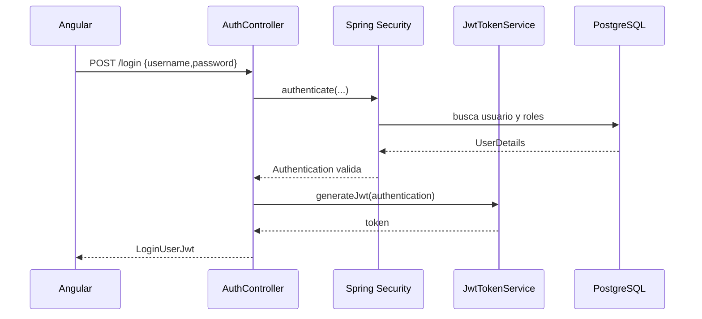
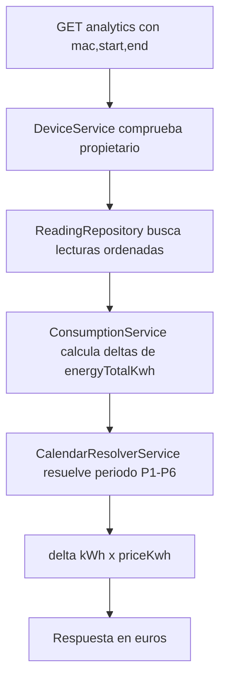

# Anexo A. Controladores REST de Spring Boot

## 1. Vision general de la API

El backend expone la API principal bajo `/api/v1`. La mayor parte de rutas exige un JWT en la cabecera `Authorization: Bearer <token>`, salvo login, registro, OAuth y el endpoint WebSocket.

La configuracion esta en:

- `backend/src/main/java/com/joselumartos/jwtauthbackenddemo/config/SecurityConfig.java`
- `backend/src/main/java/com/joselumartos/jwtauthbackenddemo/security/JwtValidatorFilter.java`

| Grupo | Base path | Controlador | Responsabilidad |
| --- | --- | --- | --- |
| Autenticacion | `/api/v1/auth` | `AuthController` | Login, registro y canje OAuth |
| Dispositivos | `/api/v1/devices` | `DeviceController` | Gestion de medidores fisicos y simulados |
| Lecturas | `/api/v1/readings` | `ReadingController` | Consulta y borrado tecnico de lecturas |
| Tarifas catalogo | `/api/v1/tariffs` | `TariffController` | CRUD del catalogo maestro |
| Tarifa usuario | `/api/v1/users/me/tariff` | `UserTariffController` | Contrato privado del usuario |
| Analitica | `/api/v1/analytics` | `ConsumptionController` | Coste y consumo fantasma |
| Alertas | `/api/v1/alerts` | `AlertController` | Consulta y borrado de incidencias |

La API usa DTOs para no exponer directamente todas las entidades. En algunos puntos concretos, como analitica, se devuelve un `Map<String, Object>` porque la respuesta es pequena y cerrada.

## 2. Seguridad aplicada

| Regla | Rutas | Acceso |
| --- | --- | --- |
| Publicas | `/api/v1/auth/login`, `/api/v1/auth/register`, `/api/v1/auth/register/admin`, `/api/v1/auth/oauth/exchange` | No requieren JWT |
| OAuth2 | `/oauth2/authorization/**`, `/login/oauth2/code/**` | Gestionadas por Spring Security |
| WebSocket | `/ws-iot/**` | Permitido en handshake |
| Tarifas lectura | `GET /api/v1/tariffs/**` | Usuario autenticado |
| Tarifas escritura | `POST`, `DELETE /api/v1/tariffs/**` | `ROLE_ADMIN` |
| Resto | Cualquier otra ruta | Usuario autenticado |

El JWT se genera en `JwtTokenService` e incluye el `username` y las autoridades. En frontend se almacena en `sessionStorage` y se envia mediante el interceptor HTTP.

## 3. `AuthController`

**Archivo:** `backend/src/main/java/com/joselumartos/jwtauthbackenddemo/controllers/AuthController.java`

### 3.1. Endpoints

| Metodo | Ruta | Entrada | Salida | Intencion |
| --- | --- | --- | --- | --- |
| `POST` | `/api/v1/auth/login` | `LoginUser` | `LoginUserJwt` | Autenticar usuario y emitir JWT |
| `POST` | `/api/v1/auth/register` | `RegisterRequest` | `201 Created` sin cuerpo | Registrar usuario normal |
| `POST` | `/api/v1/auth/register/admin` | Header `X-Wattimizer-Admin-Secret` + `RegisterRequest` | `201 Created` sin cuerpo | Registrar administrador protegido por secreto |
| `POST` | `/api/v1/auth/oauth/exchange` | `OAuthTicketExchangeRequest` | `LoginUserJwt` | Canjear ticket temporal OAuth por JWT |

### 3.2. DTOs

```java
public record LoginUser(String username, String password) {}
```

```java
public record LoginUserJwt(String statusCode, String jwt) {}
```

```java
public record RegisterRequest(
    String username,
    String password,
    String confirmPassword,
    Long tariffId
) {}
```

```java
public record OAuthTicketExchangeRequest(String ticket) {}
```

### 3.3. Flujo de datos



El registro no valida con Bean Validation; la validacion esta en `AuthRegistrationService`. Alli se comprueba formato de email, longitud minima de password, confirmacion y duplicados. La decision es sencilla y suficiente para el alcance del proyecto, aunque una mejora futura seria mover reglas de formato a anotaciones `@Valid`.

## 4. `DeviceController`

**Archivo:** `backend/src/main/java/com/joselumartos/jwtauthbackenddemo/controllers/DeviceController.java`

### 4.1. Endpoints

| Metodo | Ruta | Entrada | Salida | Control de propiedad |
| --- | --- | --- | --- | --- |
| `GET` | `/api/v1/devices` | Sin parametros | `List<DeviceDto>` | Filtrado por `Principal.getName()` |
| `GET` | `/api/v1/devices/{id}` | `id: Long` | `DeviceDto` | Compara propietario con usuario autenticado |
| `POST` | `/api/v1/devices` | `DeviceDto` | `201 DeviceDto` | Alta directa desde DTO |
| `POST` | `/api/v1/devices/claim` | `DeviceDto` con `macAddress` y `name` | `DeviceDto` | Asigna la MAC al usuario |
| `POST` | `/api/v1/devices/simulated/demo-pack` | Sin cuerpo | `201 List<DeviceDto>` | Crea simuladores faltantes para el usuario |
| `POST` | `/api/v1/devices/simulated` | `CreateSimulatedDeviceRequest` | `201 DeviceDto` | Crea un dispositivo simulado |
| `PUT` | `/api/v1/devices/{id}` | `DeviceDto` | `DeviceDto` | Servicio valida propietario |
| `DELETE` | `/api/v1/devices/{id}` | Sin cuerpo | `204 No Content` | Controlador valida propietario |

### 4.2. DTOs

```java
public record DeviceDto(
    Long id,
    String username,
    String name,
    String macAddress,
    Boolean isOn,
    Boolean simulated,
    SimulationProfile simulationProfile
) {}
```

```java
public record CreateSimulatedDeviceRequest(
    String name,
    SimulationProfile simulationProfile
) {}
```

`SimulationProfile` es un enum con perfiles como `OVEN`, `WASHING_MACHINE`, `FRIDGE`, `STANDBY` o `CONSTANT_HIGH_LOAD`. Esta parte se anadio para poder ensenar la aplicacion sin depender del enchufe fisico.

### 4.3. Logica de servicio

`DeviceService` concentra las reglas de negocio:

- Lista solo dispositivos del usuario autenticado.
- Reclama dispositivos existentes por MAC si estan sin propietario real o asociados al usuario `SYSTEM`.
- Impide que un usuario se apropie de un dispositivo ya vinculado a otro usuario.
- Crea MACs simuladas con prefijo `SIM`.
- Crea un pack demo con un dispositivo por perfil de simulacion.
- Al borrar un dispositivo elimina primero lecturas y alertas relacionadas para evitar errores de clave foranea.

La decision importante es que la propiedad del dispositivo se comprueba por usuario. Esto evita que una peticion con otro `id` o `macAddress` permita consultar o modificar informacion ajena.

## 5. `ReadingController`

**Archivo:** `backend/src/main/java/com/joselumartos/jwtauthbackenddemo/controllers/ReadingController.java`

### 5.1. Endpoints

| Metodo | Ruta | Parametros | Salida | Uso real |
| --- | --- | --- | --- | --- |
| `GET` | `/api/v1/readings` | Ninguno | `List<ReadingResponse>` | Listado general filtrado por usuario |
| `GET` | `/api/v1/readings/latest/{macAddress}` | `macAddress` | `ReadingResponse` | Ultima lectura de un dispositivo |
| `GET` | `/api/v1/readings/device/{macAddress}/recent` | `seconds`, por defecto `120` | `List<ReadingResponse>` | Bootstrap del dashboard antes del WebSocket |
| `GET` | `/api/v1/readings/search` | `time`, `macAddress` | `ReadingResponse` | Busqueda por clave compuesta logica |
| `DELETE` | `/api/v1/readings/search` | `time`, `macAddress` | `204 No Content` | Borrado tecnico de una lectura |

### 5.2. DTO de salida

```java
public record ReadingResponse(
    Instant time,
    String macAddress,
    BigDecimal powerW,
    BigDecimal energyTotalKwh,
    Boolean isOn
) {}
```

### 5.3. Intencion de diseno

Aunque las lecturas se consultan por REST, no se crean mediante un endpoint publico. La escritura viene de dos caminos controlados:

1. Mensajes MQTT recibidos por `DeviceMessageHandler`.
2. Job interno de simulacion en `IotTelemetrySimulationJob`.

Esto reduce superficie de entrada: el usuario consulta lecturas, pero no las inventa desde la API.

## 6. `TariffController`

**Archivo:** `backend/src/main/java/com/joselumartos/jwtauthbackenddemo/controllers/TariffController.java`

### 6.1. Endpoints

| Metodo | Ruta | Entrada | Salida | Rol |
| --- | --- | --- | --- | --- |
| `GET` | `/api/v1/tariffs` | Sin parametros | `List<TariffDto>` | Usuario autenticado |
| `GET` | `/api/v1/tariffs/{id}` | `id: Long` | `TariffDto` | Usuario autenticado |
| `POST` | `/api/v1/tariffs` | `TariffDto` | `201 TariffDto` | `ROLE_ADMIN` |
| `POST` | `/api/v1/tariffs/{id}` | `TariffDto` | `TariffDto` | `ROLE_ADMIN` |
| `DELETE` | `/api/v1/tariffs/{id}` | Sin cuerpo | `204 No Content` | `ROLE_ADMIN` |

### 6.2. DTOs

```java
public record TariffDto(
    Long id,
    String name,
    String market,
    String accessTariffCode,
    String geographicZone,
    String energyCompany,
    List<PeriodDto> periods,
    List<TariffContractedPowerDto> contractedPowers
) {}
```

```java
public record PeriodDto(
    Long id,
    String periodCode,
    BigDecimal priceKwh
) {}
```

```java
public record TariffContractedPowerDto(
    Long id,
    String periodCode,
    BigDecimal contractedPowerKw
) {}
```

### 6.3. Reglas de negocio

`TariffService` valida que la tarifa tenga sentido segun el modelo TD:

- Peajes admitidos: `2.0TD`, `3.0TD`, `6.1TD`, `6.2TD`.
- Zonas admitidas: `PENINSULA`, `CANARIAS`, `ISLAS_BALEARES`, `CEUTA`, `MELILLA`.
- Periodos P1-P6 segun el peaje.
- Precios y potencias positivos.
- Potencias contratadas ordenadas de forma coherente.

La separacion entre catalogo maestro y tarifa privada se resuelve excluyendo del catalogo las tarifas que estan asignadas a usuarios. Asi el usuario puede tener su propio contrato sin modificar la plantilla comun.

## 7. `UserTariffController`

**Archivo:** `backend/src/main/java/com/joselumartos/jwtauthbackenddemo/controllers/UserTariffController.java`

### 7.1. Endpoints

| Metodo | Ruta | Entrada | Salida |
| --- | --- | --- | --- |
| `GET` | `/api/v1/users/me/tariff` | Sin cuerpo | `200 TariffDto` o `204 No Content` |
| `POST` | `/api/v1/users/me/tariff` | `UserTariffRequest` | `200 TariffDto` |
| `DELETE` | `/api/v1/users/me/tariff` | Sin cuerpo | `204 No Content` |

```java
public record UserTariffRequest(
    Long templateTariffId,
    TariffDto contract
) {}
```

Este controlador evita pasar `userId` por URL. El usuario siempre sale del `Principal`, que viene del JWT. Es una decision importante porque reduce el riesgo de IDOR: un usuario no puede pedir `/users/otro/tariff`.

## 8. `ConsumptionController`

**Archivo:** `backend/src/main/java/com/joselumartos/jwtauthbackenddemo/controllers/ConsumptionController.java`

### 8.1. Endpoints

| Metodo | Ruta | Query params | Salida |
| --- | --- | --- | --- |
| `GET` | `/api/v1/analytics/cost` | `macAddress`, `start`, `end` | `macAddress`, `totalCostEur`, `start`, `end` |
| `GET` | `/api/v1/analytics/ghost-consumption` | `macAddress`, `start`, `end` | `macAddress`, `ghostCostEur`, `start`, `end` |

Los parametros `start` y `end` se reciben como `Instant` en formato ISO. Antes de calcular, el controlador comprueba que el dispositivo pertenezca al usuario autenticado.

### 8.2. Flujo de calculo



El calculo no suma `powerW` directamente. Usa el odometro `energyTotalKwh`, compara cada lectura con la anterior y solo suma deltas positivos. Esta decision evita depender del intervalo exacto de muestreo.

## 9. `AlertController`

**Archivo:** `backend/src/main/java/com/joselumartos/jwtauthbackenddemo/controllers/AlertController.java`

### 9.1. Endpoints

| Metodo | Ruta | Entrada | Salida |
| --- | --- | --- | --- |
| `GET` | `/api/v1/alerts` | Sin parametros | `List<AlertDto>` |
| `DELETE` | `/api/v1/alerts/{id}` | `id: Long` | `204 No Content` |

```java
public record AlertDto(
    Long id,
    String macAddress,
    String username,
    String type,
    String message,
    LocalDateTime createdAt
) {}
```

Las alertas no se crean desde REST. Se generan al procesar telemetria en `AlertService.checkPowerThreshold`. Si la potencia de una lectura supera la potencia contratada del periodo resuelto, se guarda una alerta `OVERPOWER`.

## 10. Tratamiento de errores

**Archivo:** `backend/src/main/java/com/joselumartos/jwtauthbackenddemo/controllers/GlobalExceptionHandler.java`

| Excepcion | Estado HTTP | Comentario |
| --- | --- | --- |
| `EntityNotFoundException` | `404` | Recursos inexistentes |
| `BadCredentialsException` | `401` | Login incorrecto |
| `UsernameNotFoundException` | `401` | Usuario no encontrado |
| `ForbiddenException` | `403` | Registro admin con secreto incorrecto |
| `IllegalStateException` | `400` | Reglas de negocio incumplidas |
| `DataIntegrityViolationException` | `400`, `409` o `500` | Duplicados o conflictos de integridad |
| `Exception` | `500` | Fallback general |

El DTO comun de error es:

```java
public record ErrorResponse(
    int status,
    String error,
    String message,
    LocalDateTime timestamp
) {}
```

## 11. Endpoints desactivados

Hay controladores antiguos comentados:

- `DeviceStateController.java`
- `ReactiveDeviceStateController.java`
- `DeviceCommandController.java`

No forman parte de la API activa. Se mencionan solo porque aparecen en el codigo, pero no exponen rutas al ejecutarse la aplicacion.
