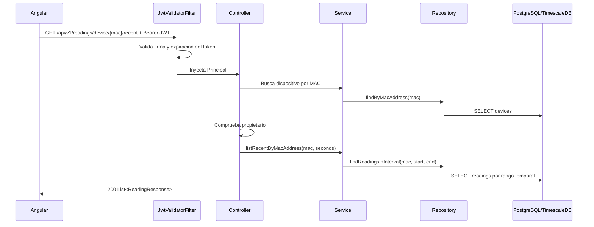

# Anexo A. Backend REST con Spring Boot

## 1. Visión general

El backend de Wattimizer está en `backend/` y usa Spring Boot 4.0.5 con Java 26. Su paquete base es `com.joselumartos.jwtauthbackenddemo`. La API REST se agrupa bajo `/api/v1` y se completa con WebSocket STOMP para telemetría en tiempo real y OAuth2 para login social.

La estructura sigue una separación clásica:

- `controllers/`: entrada HTTP.
- `services/`: reglas de negocio.
- `repositories/`: acceso a datos con Spring Data JPA.
- `entities/`: modelo persistente.
- `dtos/`: objetos de entrada/salida de la API.
- `mappers/`: conversión entre entidades y DTOs mediante MapStruct.
- `config/` y `security/`: seguridad, CORS, JWT, OAuth2, WebSocket y MQTT.

## 2. Seguridad de la API

La seguridad se configura en `backend/src/main/java/com/joselumartos/jwtauthbackenddemo/config/SecurityConfig.java`.

### 2.1. Decisiones principales

- La API es **stateless**: `SessionCreationPolicy.STATELESS`.
- CSRF está desactivado porque el frontend consume la API con JWT y no con sesión clásica.
- CORS se carga desde `app.cors.allowed-origins`.
- El filtro `JwtValidatorFilter` valida `Authorization: Bearer <token>`.
- Se permite OAuth2 con Google y GitHub.
- Se habilita `@EnableMethodSecurity` para poder usar `@PreAuthorize`.

### 2.2. Rutas públicas y protegidas

| Ruta | Acceso |
| --- | --- |
| `/api/v1/auth/login` | Público |
| `/api/v1/auth/register` | Público |
| `/api/v1/auth/register/admin` | Público, pero exige cabecera secreta |
| `/api/v1/auth/oauth/exchange` | Público |
| `/oauth2/authorization/**` | Público |
| `/login/oauth2/code/**` | Público |
| `/ws-iot/**` | Público a nivel HTTP |
| `GET /api/v1/tariffs/**` | Usuario autenticado |
| Mutaciones en `/api/v1/tariffs/**` | Rol `ADMIN` |
| Resto de rutas | Usuario autenticado |

La elección de no recibir `userId` desde el frontend es importante: el usuario se toma del `Principal`, que deriva del JWT. Así se evita que un cliente manipule el identificador de otro usuario.

## 3. Controladores REST

### 3.1. `AuthController`

**Archivo:** `backend/src/main/java/com/joselumartos/jwtauthbackenddemo/controllers/AuthController.java`
**Prefijo:** `/api/v1/auth`

| Método | Ruta | Entrada | Salida | Intención |
| --- | --- | --- | --- | --- |
| `POST` | `/login` | `LoginUser` | `LoginUserJwt` | Autentica email y contraseña y emite JWT. |
| `POST` | `/register` | `RegisterRequest` | `201 Created` sin cuerpo | Registra usuario estándar. |
| `POST` | `/register/admin` | `RegisterRequest` + header `X-Wattimizer-Admin-Secret` | `201 Created` o `403` | Registra administrador solo si conoce la clave maestra. |
| `POST` | `/oauth/exchange` | `OAuthTicketExchangeRequest` | `LoginUserJwt` | Intercambia un ticket OAuth2 temporal por un JWT propio. |

DTOs usados:

```java
public record LoginUser(String username, String password) {}
public record LoginUserJwt(String statusCode, String jwt) {}
public record OAuthTicketExchangeRequest(String ticket) {}
public record RegisterRequest(String username, String password) {}
```

El login clásico usa `UserProviderDetailsManager` como `AuthenticationManager`. Si la autenticación es correcta, `JwtTokenService` genera el token con nombre de usuario y authorities.

### 3.2. `DeviceController`

**Archivo:** `backend/src/main/java/com/joselumartos/jwtauthbackenddemo/controllers/DeviceController.java`
**Prefijo:** `/api/v1/devices`

| Método | Ruta | Parámetros | Body | Respuesta |
| --- | --- | --- | --- | --- |
| `GET` | `/` | `Principal` | - | `List<DeviceDto>` |
| `GET` | `/{id}` | `id`, `Principal` | - | `DeviceDto` o `403` |
| `POST` | `/` | - | `DeviceDto` | `201 DeviceDto` |
| `POST` | `/claim` | `Principal` | `DeviceDto` con `macAddress` y `name` | `DeviceDto` |
| `POST` | `/simulated/demo-pack` | `Principal` | - | `201 List<DeviceDto>` |
| `POST` | `/simulated` | `Principal` | `CreateSimulatedDeviceRequest` | `201 DeviceDto` |
| `PUT` | `/{id}` | `id`, `Principal` | `DeviceDto` | `DeviceDto` |
| `DELETE` | `/{id}` | `id`, `Principal` | - | `204 No Content` |

`DeviceDto`:

```java
public record DeviceDto(
    Long id,
    String username,
    String name,
    String macAddress,
    Boolean isOn,
    Boolean simulated,
    SimulationProfile simulationProfile
) {}
```

La ruta `/claim` está pensada para asociar a un usuario un dispositivo físico ya conocido por su MAC. Las rutas `/simulated` y `/simulated/demo-pack` permiten que la aplicación se pueda demostrar sin depender del enchufe físico.

### 3.3. `ReadingController`

**Archivo:** `backend/src/main/java/com/joselumartos/jwtauthbackenddemo/controllers/ReadingController.java`
**Prefijo:** `/api/v1/readings`

| Método | Ruta | Parámetros | Respuesta | Uso |
| --- | --- | --- | --- | --- |
| `GET` | `/` | `Principal` | `List<ReadingResponse>` | Lista lecturas de dispositivos del usuario. |
| `GET` | `/latest/{macAddress}` | `macAddress`, `Principal` | `ReadingResponse` | Última lectura de un dispositivo. |
| `GET` | `/device/{macAddress}/recent` | `macAddress`, `seconds=120`, `Principal` | `List<ReadingResponse>` | Histórico reciente para pintar el dashboard. |
| `GET` | `/search` | `time`, `macAddress`, `Principal` | `ReadingResponse` | Busca una lectura por clave compuesta. |
| `DELETE` | `/search` | `time`, `macAddress`, `Principal` | `204 No Content` | Borra una lectura concreta. |

`ReadingResponse`:

```java
public record ReadingResponse(
    Instant time,
    String macAddress,
    BigDecimal powerW,
    BigDecimal energyTotalKwh,
    Boolean isOn
) {}
```

Antes de devolver lecturas, el controlador comprueba que la MAC pertenece al usuario autenticado. Esto se hace comparando `device.username()` con `principal.getName()`.

### 3.4. `ConsumptionController`

**Archivo:** `backend/src/main/java/com/joselumartos/jwtauthbackenddemo/controllers/ConsumptionController.java`
**Prefijo:** `/api/v1/analytics`

| Método | Ruta | Query params | Respuesta |
| --- | --- | --- | --- |
| `GET` | `/cost` | `macAddress`, `start`, `end` | `macAddress`, `totalCostEur`, `start`, `end` |
| `GET` | `/ghost-consumption` | `macAddress`, `start`, `end` | `macAddress`, `ghostCostEur`, `start`, `end` |

Los parámetros `start` y `end` se parsean como `Instant` con formato ISO. El controlador no calcula directamente el coste: delega en `ConsumptionService`, que consulta lecturas del intervalo y aplica el periodo tarifario correspondiente.

Ejemplo de respuesta:

```json
{
  "macAddress": "9070694d3590",
  "totalCostEur": 1.27,
  "start": "2026-07-01T00:00:00Z",
  "end": "2026-07-01T22:00:00Z"
}
```

### 3.5. `AlertController`

**Archivo:** `backend/src/main/java/com/joselumartos/jwtauthbackenddemo/controllers/AlertController.java`
**Prefijo:** `/api/v1/alerts`

| Método | Ruta | Parámetros | Respuesta |
| --- | --- | --- | --- |
| `GET` | `/` | `Principal` | `List<AlertDto>` |
| `DELETE` | `/{id}` | `id`, `Principal` | `204 No Content` o `404` |

`AlertDto` representa alertas generadas por el backend, especialmente excesos de potencia (`OVERPOWER`). Al borrar, `AlertService.deleteAlertForUser` elimina solo si la alerta pertenece al usuario autenticado.

### 3.6. `TariffController`

**Archivo:** `backend/src/main/java/com/joselumartos/jwtauthbackenddemo/controllers/TariffController.java`
**Prefijo:** `/api/v1/tariffs`

| Método | Ruta | Body | Seguridad | Respuesta |
| --- | --- | --- | --- | --- |
| `GET` | `/` | - | Autenticado | `List<TariffDto>` |
| `GET` | `/{id}` | - | Autenticado | `TariffDto` |
| `POST` | `/` | `TariffDto` | `ROLE_ADMIN` | `201 TariffDto` |
| `POST` | `/{id}` | `TariffDto` | `ROLE_ADMIN` | `TariffDto` |
| `DELETE` | `/{id}` | - | `ROLE_ADMIN` | `204 No Content` |

Aunque la actualización usa `POST /{id}` en lugar de `PUT`, el comportamiento es de modificación de tarifa existente. El acceso de escritura se restringe con `@PreAuthorize("hasRole('ADMIN')")`.

`TariffDto`:

```java
public record TariffDto(
    Long id,
    String name,
    String market,
    String accessTariffCode,
    String geographicZone,
    String energyCompany,
    List<PeriodDto> periods,
    List<TariffContractedPowerDto> contractedPowers
) {}
```

### 3.7. `UserTariffController`

**Archivo:** `backend/src/main/java/com/joselumartos/jwtauthbackenddemo/controllers/UserTariffController.java`
**Prefijo:** `/api/v1/users/me/tariff`

| Método | Ruta | Body | Respuesta |
| --- | --- | --- | --- |
| `GET` | `/` | - | `200 TariffDto` o `204 No Content` |
| `POST` | `/` | `UserTariffRequest` | `200 TariffDto` |
| `DELETE` | `/` | - | `204 No Content` |

Este controlador es una de las piezas más claras de diseño multitenant. No acepta un `userId` en la URL ni en el body. El usuario sale siempre del `Principal`, de forma que la tarifa privada solo puede ser leída o modificada por su propietario.

`UserTariffRequest` permite dos modos:

- `templateTariffId`: copiar una tarifa del catálogo.
- `contract`: guardar una tarifa personalizada recibida como `TariffDto`.

## 4. DTOs de entrada y salida

| DTO | Uso |
| --- | --- |
| `LoginUser` | Body del login clásico. |
| `LoginUserJwt` | Respuesta con estado y JWT. |
| `RegisterRequest` | Alta de usuario o administrador. |
| `OAuthTicketExchangeRequest` | Intercambio de ticket OAuth2. |
| `DeviceDto` | Lectura y escritura de dispositivos. |
| `CreateSimulatedDeviceRequest` | Alta de simulador con nombre y perfil. |
| `ReadingResponse` | Lecturas expuestas al frontend. |
| `TariffDto` | Tarifa completa, con periodos y potencias. |
| `PeriodDto` | Precio de energía por periodo. |
| `TariffContractedPowerDto` | Potencia contratada por periodo. |
| `UserTariffRequest` | Asignación o edición de tarifa privada. |
| `AlertDto` | Avisos generados por maxímetro. |
| `ErrorResponse` | Formato común de error. |

## 5. Manejo de errores

`GlobalExceptionHandler` centraliza errores habituales:

| Excepción | HTTP | Motivo |
| --- | --- | --- |
| `EntityNotFoundException` | `404` | Recurso no encontrado. |
| `BadCredentialsException` | `401` | Login incorrecto. |
| `IllegalStateException` | `400` | Regla de negocio incumplida. |
| `UsernameNotFoundException` | `401` | Usuario no localizable. |
| `ForbiddenException` | `403` | Acceso denegado. |
| `DataIntegrityViolationException` | `400`, `409` o `500` | Email duplicado, FK o error de integridad. |
| `Exception` | `500` | Error no controlado. |

`ErrorResponse` tiene esta forma:

```java
public record ErrorResponse(
    int status,
    String error,
    String message,
    LocalDateTime timestamp
) {}
```

Hay algunos `403` que se devuelven directamente con `ResponseEntity.status(HttpStatus.FORBIDDEN).build()`. En esos casos no se usa `ErrorResponse`, porque la comprobación de propiedad se hace dentro del controlador y se corta la respuesta sin cuerpo.

## 6. Flujo de datos de una petición típica



La intención de este diseño es que el frontend no tenga que conocer detalles internos de entidades ni claves primarias compuestas. Angular trabaja con DTOs estables, mientras el backend protege el acceso y traduce el dominio a respuestas JSON.
