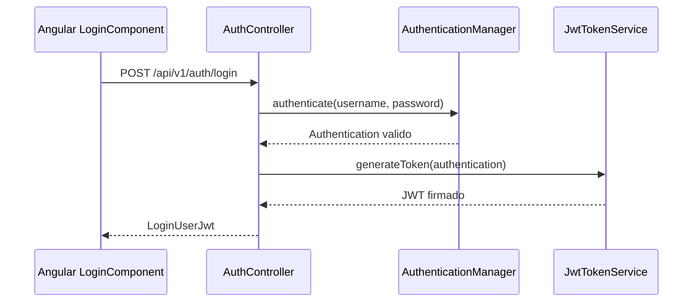

# Anexo A. Backend Spring Boot: controladores REST, seguridad y DTOs

Este anexo documenta la API REST implementada en `backend/src/main/java/com/joselumartos/jwtauthbackenddemo`. El backend usa Spring Boot 4.0.5, Spring Security, JPA, MapStruct y JWT. Las rutas principales cuelgan de `/api/v1`.

## 1. Seguridad de la API

La seguridad se configura en `config/SecurityConfig.java` y se apoya en `security/JwtValidatorFilter.java`.

| Elemento | Implementacion | Papel dentro del backend |
| --- | --- | --- |
| JWT stateless | `JwtTokenService`, `JwtValidatorFilter` | Emite y valida tokens para no depender de sesion HTTP. |
| Login local | `AuthController.loginUser` + `UserProviderDetailsManager` | Autentica usuario y contrasena. |
| OAuth2 | `OAuth2AuthenticationSuccessHandler`, `OAuth2LoginTicketService` | Convierte login Google/GitHub en un ticket temporal y despues en JWT. |
| Roles | `Role.ROLE_USER`, `Role.ROLE_ADMIN` | Limitan operaciones administrativas de tarifas. |
| CORS | `app.cors.allowed-origins` | Permite separar frontend y backend entre local y produccion. |
| Password hashing | `PasswordConfig` con BCrypt | Evita guardar contrasenas en claro. |

Rutas publicas:

- `POST /api/v1/auth/login`
- `POST /api/v1/auth/register`
- `POST /api/v1/auth/register/admin`
- `POST /api/v1/auth/oauth/exchange`
- `GET /oauth2/authorization/**`
- `GET /login/oauth2/code/**`
- `/ws-iot/**` para handshake WebSocket STOMP

El resto de rutas exige JWT salvo las mutaciones de catalogo de tarifas, que ademas requieren `ROLE_ADMIN`.

## 2. DTOs principales

### 2.1. Autenticacion

| DTO | Archivo | Campos | Uso |
| --- | --- | --- | --- |
| `LoginUser` | `dtos/LoginUser.java` | `username`, `password` | Entrada de login local. |
| `LoginUserJwt` | `dtos/LoginUserJwt.java` | `statusCode`, `jwt` | Respuesta de login y OAuth exchange. `statusCode` contiene la cadena de `HttpStatus`, por ejemplo `200 OK`. |
| `RegisterRequest` | `dtos/RegisterRequest.java` | `username`, `password`, `confirmPassword`, `tariffId` | Alta de usuario o admin. |
| `OAuthTicketExchangeRequest` | `dtos/OAuthTicketExchangeRequest.java` | `ticket` | Intercambio de ticket OAuth por JWT. |
| `ErrorResponse` | `dtos/ErrorResponse.java` | `status`, `error`, `message`, `timestamp` | Respuesta normalizada del `GlobalExceptionHandler`. |

Ejemplo de login:

```json
{
  "username": "user@wattimizer.dev",
  "password": "User_Wattimizer1!"
}
```

Respuesta:

```json
{
  "statusCode": "200 OK",
  "jwt": "eyJhbGciOiJIUzI1NiJ9.ejemplo-de-payload.firma"
}
```

### 2.2. Dispositivos y lecturas

| DTO | Campos | Observaciones |
| --- | --- | --- |
| `DeviceDto` | `id`, `username`, `name`, `macAddress`, `isOn`, `simulated` | `username` se usa para presentar propietario; las operaciones reales se filtran por `Principal`. |
| `ReadingResponse` | `time`, `macAddress`, `powerW`, `energyTotalKwh`, `isOn` | Se usa tanto en REST como en STOMP. |
| `AlertDto` | `id`, `macAddress`, `username`, `type`, `message`, `createdAt` | La alerta implementada es `OVERPOWER`. |

### 2.3. Tarifas

| DTO | Campos | Funcion |
| --- | --- | --- |
| `TariffDto` | `id`, `name`, `market`, `accessTariffCode`, `geographicZone`, `energyCompany`, `periods`, `contractedPowers` | Contrato completo o plantilla de catalogo. |
| `PeriodDto` | `id`, `periodCode`, `priceKwh` | Precio de energia por periodo P1-P6. |
| `TariffContractedPowerDto` | `id`, `periodCode`, `contractedPowerKw` | Potencia contratada por periodo. |
| `UserTariffRequest` | `templateTariffId`, `contract` | Permite clonar una plantilla o guardar una tarifa privada completa. |

## 3. Controlador de autenticacion

**Clase:** `controllers/AuthController.java`
**Ruta base:** `/api/v1/auth`

| Metodo | Endpoint | Entrada | Salida | Seguridad |
| --- | --- | --- | --- | --- |
| `POST` | `/login` | Body `LoginUser` | `200 LoginUserJwt` | Publico |
| `POST` | `/register` | Body `RegisterRequest` | `201` sin body | Publico |
| `POST` | `/register/admin` | Body `RegisterRequest`, header `X-Wattimizer-Admin-Secret` | `201` sin body | Publico, pero protegido por secreto admin |
| `POST` | `/oauth/exchange` | Body `OAuthTicketExchangeRequest` | `200 LoginUserJwt` | Publico |

### Flujo de login local



### Flujo OAuth2

1. El frontend redirige a `/oauth2/authorization/google` o `/oauth2/authorization/github`.
2. Spring Security completa el login con el proveedor externo.
3. `OAuth2AuthenticationSuccessHandler` crea un ticket temporal.
4. El navegador vuelve a `/auth/oauth/callback?ticket=ticket-temporal-de-un-solo-uso`.
5. `OAuthCallbackComponent` llama a `POST /api/v1/auth/oauth/exchange`.
6. El backend consume el ticket y devuelve un JWT normal de la aplicacion.

Esta decision evita exponer el JWT directamente en una URL de redireccion.

## 4. Controlador de dispositivos

**Clase:** `controllers/DeviceController.java`
**Ruta base:** `/api/v1/devices`

| Metodo | Endpoint | Entrada | Salida | Seguridad y validacion |
| --- | --- | --- | --- | --- |
| `GET` | `/api/v1/devices` | `Principal` | `List<DeviceDto>` | Lista solo dispositivos del usuario autenticado. |
| `GET` | `/api/v1/devices/{id}` | Path `id`, `Principal` | `DeviceDto` o `403` | Comprueba que `device.username` coincida con `principal.getName()`. |
| `POST` | `/api/v1/devices` | Body `DeviceDto` | `201 DeviceDto` | Autenticado, pero no recibe `Principal`; queda documentado como endpoint residual o interno, no como flujo principal de vinculacion multitenant. |
| `POST` | `/api/v1/devices/claim` | Body con `macAddress`, `name`; `Principal` | `200 DeviceDto` | Flujo principal: asocia el dispositivo al usuario autenticado. |
| `PUT` | `/api/v1/devices/{id}` | Path `id`, body `DeviceDto`, `Principal` | `200 DeviceDto` | `DeviceService.updateDevice` valida propiedad. |
| `DELETE` | `/api/v1/devices/{id}` | Path `id`, `Principal` | `204` o `403` | Borra solo si pertenece al usuario. |

Ejemplo de claim:

```json
{
  "name": "Medidor oficina",
  "macAddress": "9070694d3590"
}
```

El claim es importante porque la telemetria MQTT puede auto-crear un dispositivo sin usuario. Despues, un usuario lo reclama por MAC y pasa a verlo en su dashboard. Para el uso normal de la aplicacion, este es el camino seguro; `POST /api/v1/devices` no vincula explicitamente por `Principal`.

## 5. Controlador de lecturas

**Clase:** `controllers/ReadingController.java`
**Ruta base:** `/api/v1/readings`

| Metodo | Endpoint | Parametros | Salida | Seguridad |
| --- | --- | --- | --- | --- |
| `GET` | `/api/v1/readings` | `Principal` | `List<ReadingResponse>` | Lecturas de dispositivos del usuario. |
| `GET` | `/api/v1/readings/latest/{macAddress}` | `macAddress`, `Principal` | `ReadingResponse` | Comprueba propiedad de la MAC. |
| `GET` | `/api/v1/readings/search` | `time` ISO, `macAddress`, `Principal` | `ReadingResponse` | Busca por clave logica `(time, macAddress)`. |
| `DELETE` | `/api/v1/readings/search` | `time` ISO, `macAddress`, `Principal` | `204` | Borra por clave logica si el dispositivo pertenece al usuario. |

Ejemplo de busqueda:

```http
GET /api/v1/readings/search?time=2026-06-12T10:15:30Z&macAddress=9070694d3590
Authorization: Bearer <jwt>
```

Aunque existe API REST para lecturas, la grafica principal del dashboard no usa polling: se alimenta por STOMP desde `TelemetryBroadcaster`.

## 6. Controlador de analitica

**Clase:** `controllers/ConsumptionController.java`
**Ruta base:** `/api/v1/analytics`

| Metodo | Endpoint | Query params | Respuesta | Regla de negocio |
| --- | --- | --- | --- | --- |
| `GET` | `/cost` | `macAddress`, `start`, `end` | `macAddress`, `totalCostEur`, `start`, `end` | Calcula coste por deltas de energia acumulada. |
| `GET` | `/ghost-consumption` | `macAddress`, `start`, `end` | `macAddress`, `ghostCostEur`, `start`, `end` | Calcula coste solo en ventana 00:00-05:59 local. |

Ejemplo:

```http
GET /api/v1/analytics/cost?macAddress=9070694d3590&start=2026-06-12T00:00:00Z&end=2026-06-12T23:59:59Z
Authorization: Bearer <jwt>
```

Respuesta:

```json
{
  "macAddress": "9070694d3590",
  "totalCostEur": 1.27,
  "start": "2026-06-12T00:00:00Z",
  "end": "2026-06-12T23:59:59Z"
}
```

Antes de calcular, el controlador valida que la MAC pertenezca al usuario autenticado. El calculo real esta en `ConsumptionService`.

## 7. Controlador de alertas

**Clase:** `controllers/AlertController.java`
**Ruta base:** `/api/v1/alerts`

| Metodo | Endpoint | Entrada | Salida | Seguridad |
| --- | --- | --- | --- | --- |
| `GET` | `/api/v1/alerts` | `Principal` | `List<AlertDto>` | Solo alertas del usuario. |
| `DELETE` | `/api/v1/alerts/{id}` | Path `id`, `Principal` | `204` o `404` | Borra la alerta si pertenece al usuario. |

Las alertas se crean en `AlertService.checkPowerThreshold(Reading reading)`, no desde un formulario. El usuario solo las consulta o descarta.

## 8. Controlador de tarifas

**Clase:** `controllers/TariffController.java`
**Ruta base:** `/api/v1/tariffs`

| Metodo | Endpoint | Entrada | Salida | Seguridad |
| --- | --- | --- | --- | --- |
| `GET` | `/api/v1/tariffs` | - | `List<TariffDto>` | Autenticado. |
| `GET` | `/api/v1/tariffs/{id}` | Path `id` | `TariffDto` | Autenticado. |
| `POST` | `/api/v1/tariffs` | Body `TariffDto` | `201 TariffDto` | `ROLE_ADMIN`. |
| `POST` | `/api/v1/tariffs/{id}` | Path `id`, body `TariffDto` | `200 TariffDto` | `ROLE_ADMIN`. |
| `DELETE` | `/api/v1/tariffs/{id}` | Path `id` | `204` | `ROLE_ADMIN`. |

La actualizacion usa `POST /{id}` en lugar de `PUT`. El frontend lo refleja en `TariffService.updateCatalogTariff`, donde hay un comentario indicando esta decision.

## 9. Controlador de tarifa privada del usuario

**Clase:** `controllers/UserTariffController.java`
**Ruta base:** `/api/v1/users/me/tariff`

| Metodo | Endpoint | Entrada | Salida | Seguridad |
| --- | --- | --- | --- | --- |
| `GET` | `/api/v1/users/me/tariff` | `Principal` | `200 TariffDto` o `204` | JWT. |
| `POST` | `/api/v1/users/me/tariff` | Body `UserTariffRequest`, `Principal` | `200 TariffDto` | JWT. |
| `DELETE` | `/api/v1/users/me/tariff` | `Principal` | `204` | JWT. |

Este controlador es una decision arquitectonica importante: evita el patron `/users/{id}/tariff`, que seria mas propenso a errores IDOR. La identidad del usuario se toma siempre del token.

Ejemplo de asignacion desde plantilla:

```json
{
  "templateTariffId": 1,
  "contract": null
}
```

Ejemplo de contrato completo:

```json
{
  "templateTariffId": null,
  "contract": {
    "name": "Contrato oficina",
    "market": "libre",
    "accessTariffCode": "3.0TD",
    "geographicZone": "PENINSULA",
    "energyCompany": "Comercializadora ejemplo",
    "periods": [
      { "periodCode": "P1", "priceKwh": 0.210000 },
      { "periodCode": "P2", "priceKwh": 0.180000 }
    ],
    "contractedPowers": [
      { "periodCode": "P1", "contractedPowerKw": 4.00 },
      { "periodCode": "P2", "contractedPowerKw": 4.00 }
    ]
  }
}
```

## 10. Gestion global de errores

**Clase:** `controllers/GlobalExceptionHandler.java`

| Excepcion | HTTP | Respuesta |
| --- | --- | --- |
| `EntityNotFoundException` | `404` | Recurso no encontrado. |
| `BadCredentialsException` | `401` | Credenciales incorrectas. |
| `IllegalStateException` | `400` | Regla de negocio incumplida. |
| `UsernameNotFoundException` | `401` | Usuario no encontrado o no autenticable. |
| `ForbiddenException` | `403` | Acceso denegado por regla propia. |
| `DataIntegrityViolationException` | `400` o `500` | Duplicado de email o error de integridad. |
| `Exception` | `500` | Error interno generico. |

DTO de error:

```json
{
  "status": 404,
  "error": "Not Found",
  "message": "Dispositivo no encontrado",
  "timestamp": "2026-06-12T22:00:00"
}
```

Los errores de JWT expirado se gestionan directamente en `JwtValidatorFilter`, porque se producen antes de entrar en la capa MVC.

## 11. WebSocket STOMP relacionado con REST

Aunque no es REST, forma parte de la API del backend.

| Elemento | Valor |
| --- | --- |
| Handshake | `/ws-iot` |
| Broker simple | `/topic` |
| Prefijo de aplicacion | `/app` |
| Lecturas emitidas | `/topic/readings/{macAddress}` |
| Alertas emitidas | `/topic/alerts/{username}` |
| Clase emisora | `services/TelemetryBroadcaster.java` |

El REST se usa para operaciones de negocio y consultas puntuales; STOMP se reserva para datos que cambian continuamente, como potencia instantanea y alertas.
