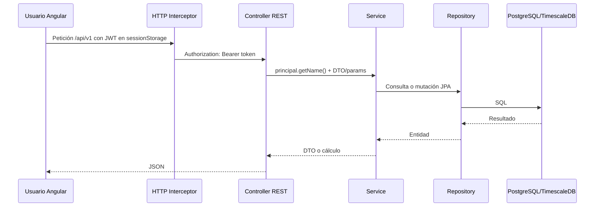

# Anexo A. Backend REST con Spring Boot

## 1. Visión general

El backend se encuentra en `backend/src/main/java/com/joselumartos/jwtauthbackenddemo`. Aunque el paquete conserva un nombre heredado de pruebas JWT, la aplicación real corresponde a Wattimizer.

La API expone recursos bajo `/api/v1/*`, usa JSON y se protege con JWT salvo rutas públicas de autenticación. La identidad del usuario autenticado se obtiene de `Principal.getName()`, que procede del claim `username` del token.

## 2. Seguridad aplicada a la API

Archivo principal: `backend/src/main/java/com/joselumartos/jwtauthbackenddemo/config/SecurityConfig.java`.

- Sesión HTTP: `STATELESS`.
- CSRF: desactivado porque la API se consume con JWT.
- JWT: `JwtValidatorFilter` se ejecuta antes de `BasicAuthenticationFilter`.
- OAuth2: Google/GitHub redirigen al frontend con un ticket temporal.
- WebSocket: `/ws-iot/**` se permite para que STOMP pueda negociar conexión.

Rutas públicas:

```text
POST /api/v1/auth/login
POST /api/v1/auth/register
POST /api/v1/auth/register/admin
POST /api/v1/auth/oauth/exchange
/oauth2/authorization/**
/login/oauth2/code/**
/ws-iot/**
```

Reglas específicas:

- `GET /api/v1/tariffs/**`: usuario autenticado.
- Mutaciones sobre `/api/v1/tariffs/**`: `ROLE_ADMIN`.
- Resto de endpoints: JWT obligatorio.

## 3. Controladores REST activos

### 3.1. `AuthController`

Archivo: `backend/src/main/java/com/joselumartos/jwtauthbackenddemo/controllers/AuthController.java`
Base path: `/api/v1/auth`

| Método | Endpoint | Entrada | Salida | Intención |
| --- | --- | --- | --- | --- |
| `POST` | `/login` | `LoginUser` | `LoginUserJwt` | Autentica con usuario/contraseña y devuelve JWT. |
| `POST` | `/register` | `RegisterRequest` | `201 No Content` | Registra un usuario estándar. |
| `POST` | `/register/admin` | `RegisterRequest` + header `X-Wattimizer-Admin-Secret` | `201 No Content` | Crea administrador si la clave coincide con `app.admin.secret`. |
| `POST` | `/oauth/exchange` | `OAuthTicketExchangeRequest` | `LoginUserJwt` | Canjea ticket OAuth2 de un solo uso por JWT. |

DTOs:

```java
public record LoginUser(String username, String password) {}

public record RegisterRequest(
    String username,
    String password,
    String confirmPassword,
    Long tariffId
) {}

public record OAuthTicketExchangeRequest(String ticket) {}

public record LoginUserJwt(String statusCode, String jwt) {}
```

El registro admin no depende de un usuario logueado, pero sí de una clave privada de servidor. Esta decisión permite crear el primer administrador en producción sin abrir un endpoint administrativo permanente sin protección.

### 3.2. `DeviceController`

Archivo: `backend/src/main/java/com/joselumartos/jwtauthbackenddemo/controllers/DeviceController.java`
Base path: `/api/v1/devices`

| Método | Endpoint | Parámetros | Entrada | Salida | Control de propiedad |
| --- | --- | --- | --- | --- | --- |
| `GET` | `/` | `Principal` | - | `List<DeviceDto>` | Lista solo por `principal.getName()`. |
| `GET` | `/{id}` | `id`, `Principal` | - | `DeviceDto` o `403` | Compara `device.username()` con el principal. |
| `POST` | `/` | - | `DeviceDto` | `201 DeviceDto` | Endpoint directo/legacy: persiste lo recibido. |
| `POST` | `/claim` | `Principal` | `DeviceDto` (`macAddress`, `name`) | `DeviceDto` | Asocia MAC al usuario autenticado. |
| `POST` | `/simulated/demo-pack` | `Principal` | - | `201 List<DeviceDto>` | Crea simuladores demo para el usuario. |
| `POST` | `/simulated` | `Principal` | `CreateSimulatedDeviceRequest` | `201 DeviceDto` | Crea simulador vinculado al usuario. |
| `PUT` | `/{id}` | `id`, `Principal` | `DeviceDto` | `DeviceDto` | Delegado a `DeviceService.updateDevice`. |
| `DELETE` | `/{id}` | `id`, `Principal` | - | `204` o `403` | Compara propietario antes de borrar. |

DTOs:

```java
public record DeviceDto(
    Long id,
    String username,
    String name,
    String macAddress,
    Boolean isOn,
    Boolean simulated,
    SimulationProfile simulationProfile
) {}

public record CreateSimulatedDeviceRequest(
    String name,
    SimulationProfile simulationProfile
) {}
```

La ruta recomendada para usuarios normales es `/claim` o `/simulated`, porque el propietario se toma del JWT. El `POST /api/v1/devices` sigue activo, pero depende del `username` del DTO y por eso se documenta como endpoint directo heredado.

### 3.3. `ReadingController`

Archivo: `backend/src/main/java/com/joselumartos/jwtauthbackenddemo/controllers/ReadingController.java`
Base path: `/api/v1/readings`

| Método | Endpoint | Parámetros | Salida | Uso |
| --- | --- | --- | --- | --- |
| `GET` | `/` | `Principal` | `List<ReadingResponse>` | Lecturas de dispositivos del usuario. |
| `GET` | `/latest/{macAddress}` | `macAddress`, `Principal` | `ReadingResponse` | Última lectura de una MAC propia. |
| `GET` | `/device/{macAddress}/recent` | `macAddress`, query `seconds` (`120` por defecto), `Principal` | `List<ReadingResponse>` | Histórico reciente para precargar gráfica. |
| `GET` | `/search` | query `time`, query `macAddress`, `Principal` | `ReadingResponse` | Busca por clave temporal + MAC. |
| `DELETE` | `/search` | query `time`, query `macAddress`, `Principal` | `204` | Borra una lectura concreta. |

DTO de salida:

```java
public record ReadingResponse(
    Instant time,
    String macAddress,
    BigDecimal powerW,
    BigDecimal energyTotalKwh,
    Boolean isOn
) {}
```

Los endpoints que aceptan `macAddress` verifican que el dispositivo pertenezca al usuario antes de consultar o borrar. La fecha `time` usa formato ISO (`DateTimeFormat.ISO.DATE_TIME`), por ejemplo `2026-08-01T10:15:30Z`.

### 3.4. `ConsumptionController`

Archivo: `backend/src/main/java/com/joselumartos/jwtauthbackenddemo/controllers/ConsumptionController.java`
Base path: `/api/v1/analytics`

| Método | Endpoint | Query params | Salida |
| --- | --- | --- | --- |
| `GET` | `/cost` | `macAddress`, `start`, `end` | `macAddress`, `totalCostEur`, `start`, `end` |
| `GET` | `/ghost-consumption` | `macAddress`, `start`, `end` | `macAddress`, `ghostCostEur`, `start`, `end` |

Ambos endpoints comprueban que la MAC pertenezca al usuario. La respuesta se construye con `Map<String,Object>` porque son cálculos concretos y pequeños, no un agregado persistente.

Lógica usada:

- `calculateCostInPeriod`: obtiene lecturas ordenadas, calcula deltas positivos de `energyTotalKwh` y multiplica por el precio del periodo aplicable.
- `calculateGhostCost`: aplica la misma lógica, pero solo entre las 00:00 y las 05:59 en la zona horaria del contrato.

### 3.5. `AlertController`

Archivo: `backend/src/main/java/com/joselumartos/jwtauthbackenddemo/controllers/AlertController.java`
Base path: `/api/v1/alerts`

| Método | Endpoint | Parámetros | Salida |
| --- | --- | --- | --- |
| `GET` | `/` | `Principal` | `List<AlertDto>` |
| `DELETE` | `/{id}` | `id`, `Principal` | `204` si borra, `404` si no existe para ese usuario |

DTO:

```java
public record AlertDto(
    Long id,
    String macAddress,
    String username,
    String type,
    String message,
    LocalDateTime createdAt
) {}
```

La alerta principal que genera el código actual es `OVERPOWER`, creada cuando la potencia instantánea supera la potencia contratada del periodo.

### 3.6. `TariffController`

Archivo: `backend/src/main/java/com/joselumartos/jwtauthbackenddemo/controllers/TariffController.java`
Base path: `/api/v1/tariffs`

| Método | Endpoint | Entrada | Salida | Rol |
| --- | --- | --- | --- | --- |
| `GET` | `/` | - | `List<TariffDto>` | Autenticado |
| `GET` | `/{id}` | - | `TariffDto` | Autenticado |
| `POST` | `/` | `TariffDto` | `201 TariffDto` | `ROLE_ADMIN` |
| `POST` | `/{id}` | `TariffDto` | `TariffDto` | `ROLE_ADMIN` |
| `DELETE` | `/{id}` | - | `204` | `ROLE_ADMIN` |

DTO principal:

```java
public record TariffDto(
    Long id,
    String name,
    String market,
    String accessTariffCode,
    String geographicZone,
    String energyCompany,
    List<PeriodDto> periods,
    List<TariffContractedPowerDto> contractedPowers
) {}

public record PeriodDto(Long id, String periodCode, BigDecimal priceKwh) {}

public record TariffContractedPowerDto(
    Long id,
    String periodCode,
    BigDecimal contractedPowerKw
) {}
```

El endpoint de actualización usa `POST /{id}` en lugar de `PUT`. Angular lo respeta en `TariffService.updateCatalogTariff`, por lo que la documentación debe reflejar esta decisión real.

### 3.7. `UserTariffController`

Archivo: `backend/src/main/java/com/joselumartos/jwtauthbackenddemo/controllers/UserTariffController.java`
Base path: `/api/v1/users/me/tariff`

| Método | Endpoint | Entrada | Salida | Intención |
| --- | --- | --- | --- | --- |
| `GET` | `/` | - | `200 TariffDto` o `204 No Content` | Recupera tarifa del usuario actual. |
| `POST` | `/` | `UserTariffRequest` | `TariffDto` | Guarda o reemplaza tarifa privada. |
| `DELETE` | `/` | - | `204 No Content` | Desvincula la tarifa del usuario. |

DTO:

```java
public record UserTariffRequest(
    Long templateTariffId,
    TariffDto contract
) {}
```

Este controlador no recibe `userId` en la URL ni en el cuerpo. Esa decisión reduce riesgo de acceso cruzado porque siempre opera sobre el usuario autenticado.

## 4. Controladores comentados

Los siguientes archivos existen, pero su código está comentado y no expone endpoints activos:

- `DeviceCommandController.java`: antiguo `@MessageMapping` para comandos STOMP.
- `DeviceStateController.java`: endpoints REST de estado.
- `ReactiveDeviceStateController.java`: versión con `Mono`, no activa.

No se deben presentar como funcionalidad disponible del producto.

## 5. Manejo de errores

Archivo: `backend/src/main/java/com/joselumartos/jwtauthbackenddemo/controllers/GlobalExceptionHandler.java`.

DTO:

```java
public record ErrorResponse(
    int status,
    String error,
    String message,
    LocalDateTime timestamp
) {}
```

Casos tratados:

| Excepción | HTTP | Uso |
| --- | --- | --- |
| `EntityNotFoundException` | 404 | Recurso inexistente. |
| `BadCredentialsException` | 401 | Login incorrecto. |
| `UsernameNotFoundException` | 401 | Usuario no localizado. |
| `ForbiddenException` | 403 | Acceso denegado por regla de negocio. |
| `IllegalStateException` | 400 | Validación de negocio. |
| `DataIntegrityViolationException` | 400/409/500 | Duplicados o integridad referencial. |
| `Exception` | 500 | Error interno controlado. |

Algunos controladores devuelven `403` vacío directamente cuando detectan que el dispositivo no pertenece al usuario. Es una mezcla aceptable para el estado actual, aunque una mejora futura sería centralizar todos los `403` en excepciones de dominio.

## 6. Flujo de datos REST principal



Este flujo mantiene la autorización en servidor, aunque Angular oculte botones según rol. La UI mejora la experiencia, pero la seguridad efectiva está en Spring Security y en los servicios/controladores.
