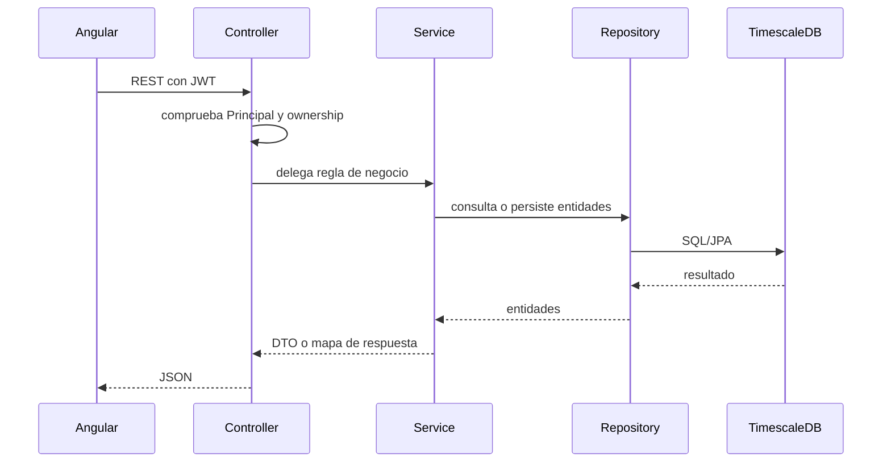

# Anexo A - Backend REST con Spring Boot

## 1. Visión general del backend

El backend de Wattimizer está desarrollado con **Spring Boot 4.0.5** y Java 26. Su responsabilidad principal es exponer la API REST, validar la seguridad, recibir telemetría, persistir datos y calcular costes energéticos. La aplicación sigue una separación clara:

- `controllers`: puntos de entrada HTTP.
- `services`: reglas de negocio.
- `repositories`: acceso a datos mediante Spring Data JPA.
- `entities`: modelo persistente.
- `dtos`: objetos de entrada y salida de la API.
- `mappers`: conversión entre entidades y DTOs.

La API trabaja en JSON y casi todas las rutas están bajo `/api/v1`.

## 2. Seguridad y autenticación

La seguridad está configurada como **stateless**, por lo que el servidor no mantiene sesión HTTP. El cliente guarda el JWT y lo envía en cada petición protegida:

```http
Authorization: Bearer <jwt>
```

El token contiene el nombre de usuario y las autoridades. El filtro `JwtValidatorFilter` valida el token y rellena el `SecurityContext`, permitiendo que los controladores reciban un `Principal` con el usuario autenticado.

### 2.1. Rutas públicas

| Ruta | Motivo |
| --- | --- |
| `POST /api/v1/auth/login` | Permite obtener JWT con usuario y contraseña. |
| `POST /api/v1/auth/register` | Alta de usuario estándar. |
| `POST /api/v1/auth/register/admin` | Alta de administrador protegida por cabecera secreta. |
| `POST /api/v1/auth/oauth/exchange` | Canje del ticket OAuth2 por JWT. |
| `/oauth2/authorization/**` | Inicio del login social. |
| `/login/oauth2/code/**` | Callback de proveedores OAuth2. |
| `/ws-iot/**` | Endpoint WebSocket STOMP para telemetría. |

### 2.2. Rutas con rol especial

Los endpoints `GET /api/v1/tariffs/**` requieren usuario autenticado. Las operaciones `POST` y `DELETE` sobre tarifas requieren `ROLE_ADMIN`.

## 3. Controlador de autenticación

**Clase:** `AuthController`
**Prefijo:** `/api/v1/auth`

| Método | Endpoint | Entrada | Salida | Descripción |
| --- | --- | --- | --- | --- |
| `POST` | `/login` | `LoginUser` | `LoginUserJwt` | Autentica credenciales y devuelve un JWT. |
| `POST` | `/register` | `RegisterRequest` | Sin cuerpo, `201 Created` | Crea una cuenta de usuario. |
| `POST` | `/register/admin` | `RegisterRequest` + cabecera `X-Wattimizer-Admin-Secret` | Sin cuerpo, `201 Created` | Crea cuenta administradora si la clave coincide. |
| `POST` | `/oauth/exchange` | `OAuthTicketExchangeRequest` | `LoginUserJwt` | Cambia un ticket temporal OAuth2 por JWT. |

### 3.1. DTOs

```java
public record LoginUser(String username, String password) {}
public record LoginUserJwt(String statusCode, String jwt) {}
public record RegisterRequest(
    String username,
    String password,
    String confirmPassword,
    Long tariffId
) {}
public record OAuthTicketExchangeRequest(String ticket) {}
```

La decisión de usar un ticket OAuth2 temporal evita exponer directamente el JWT en la URL de callback. El backend redirige al frontend con un `ticket`, y después Angular llama a `/oauth/exchange` para recibir el JWT.

## 4. Controlador de dispositivos

**Clase:** `DeviceController`
**Prefijo:** `/api/v1/devices`

| Método | Endpoint | Entrada | Salida | Descripción |
| --- | --- | --- | --- | --- |
| `GET` | `/` | JWT | `List<DeviceDto>` | Lista solo los dispositivos del usuario autenticado. |
| `GET` | `/{id}` | `id` path | `DeviceDto` | Devuelve un dispositivo si pertenece al usuario. |
| `POST` | `/` | `DeviceDto` | `DeviceDto`, `201 Created` | Alta directa de dispositivo. Mantiene el `username` recibido en el DTO. |
| `POST` | `/claim` | `DeviceDto` con `macAddress` y `name` | `DeviceDto` | Vincula una MAC existente o registra una nueva para el usuario actual. |
| `POST` | `/simulated` | `CreateSimulatedDeviceRequest` | `DeviceDto`, `201 Created` | Crea un medidor simulado con perfil de consumo. |
| `POST` | `/simulated/demo-pack` | JWT | `List<DeviceDto>`, `201 Created` | Crea hasta nueve simuladores, uno por perfil que el usuario no tenga. |
| `PUT` | `/{id}` | `id` path + `DeviceDto` | `DeviceDto` | Actualiza nombre, estado `isOn` y perfil si es simulado. |
| `DELETE` | `/{id}` | `id` path | `204 No Content` | Borra lecturas, alertas y después el dispositivo. |

### 4.1. DTOs de dispositivo

```java
public record DeviceDto(
    Long id,
    String username,
    String name,
    String macAddress,
    Boolean isOn,
    Boolean simulated,
    SimulationProfile simulationProfile
) {}

public record CreateSimulatedDeviceRequest(
    String name,
    SimulationProfile simulationProfile
) {}
```

### 4.2. Perfiles de simulación

El enum `SimulationProfile` permite representar consumos diferentes sin hardware:

| Perfil | Intención |
| --- | --- |
| `SINE_WAVE` | Onda de prueba variable. |
| `OVEN` | Consumo alto durante calentamiento. |
| `WASHING_MACHINE` | Ciclos con picos y pausas. |
| `TELEVISION` | Consumo doméstico estable. |
| `FAN` | Consumo bajo-medio continuo. |
| `DESKTOP_PC` | Carga irregular propia de un ordenador. |
| `FRIDGE` | Ciclos de compresor. |
| `STANDBY` | Consumo fantasma de baja potencia. |
| `CONSTANT_HIGH_LOAD` | Carga constante alta para probar alertas. |

El backend genera MAC simuladas con prefijo `SIM` y nueve dígitos, por ejemplo `SIM000000010`. Esta decisión evita colisiones con las MAC hexadecimales de dispositivos físicos y permite distinguir datos reales de datos de demostración.

### 4.3. Borrado con limpieza previa

Antes de eliminar un dispositivo se borran sus lecturas y alertas:

```java
readingRepository.deleteAllByDeviceMacAddress(macAddress);
alertRepository.deleteByDeviceId(id);
deviceRepository.delete(device);
```

Esta limpieza es necesaria porque `readings` y `alerts` dependen del dispositivo mediante claves foráneas. Si se borrase primero el dispositivo, la base de datos podría rechazar la operación por integridad referencial.

## 5. Controlador de lecturas

**Clase:** `ReadingController`
**Prefijo:** `/api/v1/readings`

| Método | Endpoint | Parámetros | Salida | Descripción |
| --- | --- | --- | --- | --- |
| `GET` | `/` | JWT | `List<ReadingResponse>` | Lista lecturas de dispositivos del usuario. |
| `GET` | `/latest/{macAddress}` | `macAddress` path | `ReadingResponse` | Última lectura de una MAC propia. |
| `GET` | `/device/{macAddress}/recent` | `macAddress` path, `seconds` query por defecto `120` | `List<ReadingResponse>` | Lecturas recientes para repoblar la gráfica al cambiar medidor. |
| `GET` | `/search` | `time`, `macAddress` query | `ReadingResponse` | Busca una lectura por clave temporal y MAC. |
| `DELETE` | `/search` | `time`, `macAddress` query | `204 No Content` | Elimina una lectura concreta. |

### 5.1. DTO de salida

```java
public record ReadingResponse(
    Instant time,
    String macAddress,
    BigDecimal powerW,
    BigDecimal energyTotalKwh,
    Boolean isOn
) {}
```

El endpoint `/device/{macAddress}/recent` se añadió para el panel multi-dispositivo. Cuando el usuario cambia el medidor activo en Angular, primero se cargan las lecturas recientes por HTTP y después el WebSocket continúa alimentando la gráfica.

## 6. Controlador de alertas

**Clase:** `AlertController`
**Prefijo:** `/api/v1/alerts`

| Método | Endpoint | Entrada | Salida | Descripción |
| --- | --- | --- | --- | --- |
| `GET` | `/` | JWT | `List<AlertDto>` | Devuelve las alertas del usuario autenticado. |
| `DELETE` | `/{id}` | `id` path | `204 No Content` | Descarta una alerta si pertenece al usuario. |

```java
public record AlertDto(
    Long id,
    String macAddress,
    String username,
    String type,
    String message,
    LocalDateTime createdAt
) {}
```

El tipo principal generado por el código es `OVERPOWER`, usado cuando la potencia instantánea supera la potencia contratada del periodo tarifario.

## 7. Controlador de analítica

**Clase:** `ConsumptionController`
**Prefijo:** `/api/v1/analytics`

| Método | Endpoint | Query params | Salida | Descripción |
| --- | --- | --- | --- | --- |
| `GET` | `/cost` | `macAddress`, `start`, `end` | `macAddress`, `totalCostEur`, `start`, `end` | Calcula el coste total de un intervalo. |
| `GET` | `/ghost-consumption` | `macAddress`, `start`, `end` | `macAddress`, `ghostCostEur`, `start`, `end` | Calcula coste en ventana nocturna 00:00-05:59. |

Ambos endpoints comprueban que la MAC pertenece al usuario del JWT. Si el dispositivo no tiene tarifa asociada o no hay suficientes lecturas, la respuesta no falla: devuelve coste `0`. Esta decisión mantiene el dashboard operativo aunque el usuario todavía no haya configurado su contrato.

## 8. Controladores de tarifas

### 8.1. Catálogo de tarifas

**Clase:** `TariffController`
**Prefijo:** `/api/v1/tariffs`

| Método | Endpoint | Rol | Entrada | Salida |
| --- | --- | --- | --- | --- |
| `GET` | `/` | Usuario autenticado | - | `List<TariffDto>` |
| `GET` | `/{id}` | Usuario autenticado | `id` path | `TariffDto` |
| `POST` | `/` | `ROLE_ADMIN` | `TariffDto` | `TariffDto`, `201 Created` |
| `POST` | `/{id}` | `ROLE_ADMIN` | `id` path + `TariffDto` | `TariffDto` |
| `DELETE` | `/{id}` | `ROLE_ADMIN` | `id` path | `204 No Content` |

La edición usa `POST /{id}` en vez de `PUT`. Aunque no sea la convención REST más habitual, es el contrato real implementado en el controlador y por eso se documenta tal como está.

### 8.2. Tarifa privada del usuario

**Clase:** `UserTariffController`
**Prefijo:** `/api/v1/users/me/tariff`

| Método | Endpoint | Entrada | Salida | Descripción |
| --- | --- | --- | --- | --- |
| `GET` | `/` | JWT | `TariffDto` o `204` | Devuelve la tarifa del usuario actual. |
| `POST` | `/` | `UserTariffRequest` | `TariffDto` | Clona una plantilla o guarda un contrato privado. |
| `DELETE` | `/` | JWT | `204 No Content` | Desvincula y elimina la copia privada. |

```java
public record UserTariffRequest(
    Long templateTariffId,
    TariffDto contract
) {}
```

El controlador no acepta `userId` en ruta ni en el cuerpo. El usuario se deduce del JWT, reduciendo el riesgo de modificar tarifas de otra cuenta.

## 9. DTO de tarifa

```java
public record TariffDto(
    Long id,
    String name,
    String market,
    String accessTariffCode,
    String geographicZone,
    String energyCompany,
    List<PeriodDto> periods,
    List<TariffContractedPowerDto> contractedPowers
) {}
```

```java
public record PeriodDto(
    Long id,
    String periodCode,
    BigDecimal priceKwh
) {}

public record TariffContractedPowerDto(
    Long id,
    String periodCode,
    BigDecimal contractedPowerKw
) {}
```

`TariffService` valida las reglas mínimas del contrato:

- Peaje `2.0TD`: energía P1-P3 y potencia P1-P2.
- Peajes `3.0TD`, `6.1TD` y `6.2TD`: periodos P1-P6.
- Precios y potencias mayores que cero.
- Potencias en orden legal creciente para peajes de seis periodos.

## 10. Gestión de errores

`GlobalExceptionHandler` devuelve errores con esta estructura:

```java
public record ErrorResponse(
    int status,
    String error,
    String message,
    LocalDateTime timestamp
) {}
```

| Excepción | HTTP | Uso |
| --- | --- | --- |
| `EntityNotFoundException` | `404` | Recurso no encontrado. |
| `BadCredentialsException` | `401` | Login incorrecto. |
| `IllegalStateException` | `400` | Regla de negocio incumplida. |
| `UsernameNotFoundException` | `401` | Usuario no localizable. |
| `ForbiddenException` | `403` | Acceso denegado. |
| `DataIntegrityViolationException` | `400` o `409` | Duplicados o conflictos de integridad. |
| Genérica | `500` | Error interno no controlado. |

Un punto a tener en cuenta es que `IllegalArgumentException` en la creación de simuladores no tiene handler dedicado, por lo que actualmente puede acabar como `500`. En la memoria se recoge como mejora futura de gestión de errores.

## 11. Flujo de datos backend



La decisión más importante es que la propiedad de los recursos no se controla solo en frontend. Los controladores de dispositivos, lecturas y analítica comparan la MAC o el id con el usuario autenticado antes de devolver información sensible.
