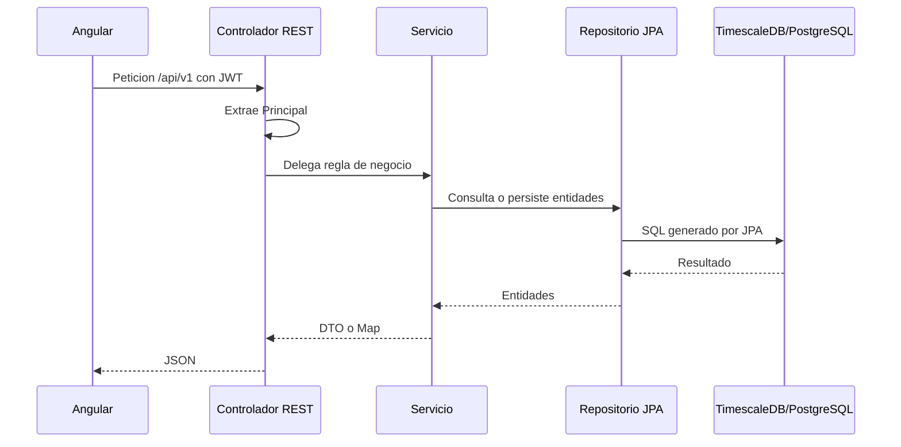

# Anexo A. Backend REST con Spring Boot

## 1. Proposito del backend

El backend de Wattimizer actua como capa central entre la interfaz Angular, la base de datos TimescaleDB y la telemetría MQTT. Esta desarrollado con **Spring Boot 4.0.5** y **Java 26**, usando Spring Web MVC para REST, Spring Security para autenticación, Spring Data JPA para persistencia y MapStruct para transformar entidades en DTOs.

La aplicación principal esta en:

```java
// backend/src/main/java/com/joselumartos/jwtauthbackenddemo/JwtAuthBackendDemoApplication.java
@SpringBootApplication
@EnableConfigurationProperties(SimulationProperties.class)
public class JwtAuthBackendDemoApplication {
    public static void main(String[] args) {
        SpringApplication.run(JwtAuthBackendDemoApplication.class, args);
    }
}
```

La decisión de separar controladores, servicios, repositorios, entidades y DTOs permite que cada capa tenga una responsabilidad clara. El controlador no calcula costes ni toca directamente MQTT; solo recibe la peticion, válida lo mínimo y delega.

## 2. Seguridad general de la API

La seguridad esta definida en `SecurityConfig`.

| Aspecto | Implementacion |
|---|---|
| Tipo de sesion | `SessionCreationPolicy.STATELESS`; no hay sesion HTTP de servidor para la API. |
| Token | JWT enviado en `Authorization: Bearer <token>`. |
| Filtro | `JwtValidatorFilter`, insertado antes de `BasicAuthenticationFilter`. |
| CORS | Origenes desde `app.cors.allowed-origins` o `APP_CORS_ALLOWED_ORIGINS`. |
| Rutas públicas | Login, registro, registro admin, canje OAuth2, rutas OAuth2 y `/ws-iot/**`. |
| Rutas autenticadas | El resto de `/api/v1/**`. |
| Administracion | Mutaciones de `/api/v1/tariffs/**` requieren `ROLE_ADMIN`. |

Las comprobaciones de propiedad de datos se hacen en los controladores y servicios usando `Principal.getName()`. Por ejemplo, un usuario solo puede leer o borrar dispositivos cuyo `username` coincida con el usuario autenticado.

## 3. Controladores REST activos

### 3.1. `AuthController`

**Archivo:** `backend/src/main/java/com/joselumartos/jwtauthbackenddemo/controllers/AuthController.java`
**Ruta base:** `/api/v1/auth`

| Metodo | Endpoint | Entrada | Salida | Intencion |
|---|---|---|---|---|
| `POST` | `/login` | `LoginUser` | `LoginUserJwt` | Autentica email/contraseña y devuelve JWT. |
| `POST` | `/register` | `RegisterRequest` | `201 Created` sin cuerpo | Registra un usuario normal. |
| `POST` | `/register/admin` | `RegisterRequest` + header `X-Wattimizer-Admin-Secret` | `201 Created` sin cuerpo o `403` | Permite crear admin solo si la clave coincide con `app.admin.secret`. |
| `POST` | `/oauth/exchange` | `OAuthTicketExchangeRequest` | `LoginUserJwt` | Canjea un ticket temporal de OAuth2 por un JWT propio de la aplicación. |

#### DTOs

```java
public record LoginUser(String username, String password) {}

public record LoginUserJwt(String statusCode, String jwt) {}

public record RegisterRequest(
        String username,
        String password,
        String confirmPassword,
        Long tariffId
) {}

public record OAuthTicketExchangeRequest(String ticket) {}
```

La validación de registro vive en `AuthRegistrationService`: email obligatorio con formato válido, contraseña mínima de 6 caracteres y confirmación coincidente. No se usan anotaciones Bean Validation en estos DTOs; la regla esta programada en servicio.

### 3.2. `DeviceController`

**Archivo:** `backend/src/main/java/com/joselumartos/jwtauthbackenddemo/controllers/DeviceController.java`
**Ruta base:** `/api/v1/devices`

| Metodo | Endpoint | Parametros | Entrada | Salida | Intencion |
|---|---|---|---|---|---|
| `GET` | `/` | `Principal` | - | `List<DeviceDto>` | Lista dispositivos del usuario autenticado. |
| `GET` | `/{id}` | `id`, `Principal` | - | `DeviceDto` o `403` | Devuelve un dispositivo si pertenece al usuario. |
| `POST` | `/` | - | `DeviceDto` | `201 DeviceDto` | Alta directa de dispositivo. Es un endpoint activo de compatibilidad y usa el `username` del body. |
| `POST` | `/claim` | `Principal` | `DeviceDto` con `macAddress` y `name` | `DeviceDto` | Reclama o registra un Shelly para el usuario autenticado. |
| `POST` | `/simulated/demo-pack` | `Principal` | - | `201 List<DeviceDto>` | Crea un simulador por perfil que el usuario no tenga aun. |
| `POST` | `/simulated` | `Principal` | `CreateSimulatedDeviceRequest` | `201 DeviceDto` | Crea un dispositivo simulado con MAC generada. |
| `PUT` | `/{id}` | `id`, `Principal` | `DeviceDto` | `DeviceDto` | Actualiza nombre, estado y perfil si es simulado. |
| `DELETE` | `/{id}` | `id`, `Principal` | - | `204` o `403` | Borra dispositivo, lecturas y alertas asociadas. |

#### DTOs

```java
public record DeviceDto(
        Long id,
        String username,
        String name,
        String macAddress,
        Boolean isOn,
        Boolean simulated,
        SimulationProfile simulationProfile
) {}

public record CreateSimulatedDeviceRequest(
        String name,
        SimulationProfile simulationProfile
) {}
```

Los perfiles de simulación disponibles son:

```java
public enum SimulationProfile {
    SINE_WAVE,
    OVEN,
    WASHING_MACHINE,
    TELEVISION,
    FAN,
    DESKTOP_PC,
    FRIDGE,
    STANDBY,
    CONSTANT_HIGH_LOAD
}
```

`DeviceService` genera MACs simuladas con prefijo `SIM` y nueve digitos (`SIM000000001`, por ejemplo). El pack demo evita duplicar perfiles ya existentes para el mismo usuario.

### 3.3. `ReadingController`

**Archivo:** `backend/src/main/java/com/joselumartos/jwtauthbackenddemo/controllers/ReadingController.java`
**Ruta base:** `/api/v1/readings`

| Metodo | Endpoint | Parametros | Salida | Intencion |
|---|---|---|---|---|
| `GET` | `/` | `Principal` | `List<ReadingResponse>` | Devuelve lecturas de los dispositivos del usuario. |
| `GET` | `/latest/{macAddress}` | `macAddress`, `Principal` | `ReadingResponse` | Ultima lectura de un dispositivo propio. |
| `GET` | `/device/{macAddress}/recent` | `macAddress`, `seconds` con defecto `120`, `Principal` | `List<ReadingResponse>` | Lecturas recientes dentro de una ventana temporal. |
| `GET` | `/search` | `time`, `macAddress`, `Principal` | `ReadingResponse` | Busca por clave compuesta tiempo + MAC. |
| `DELETE` | `/search` | `time`, `macAddress`, `Principal` | `204` | Borra una lectura concreta si el dispositivo es del usuario. |

#### DTO de salida

```java
public record ReadingResponse(
        Instant time,
        String macAddress,
        BigDecimal powerW,
        BigDecimal energyTotalKwh,
        Boolean isOn
) {}
```

El campo `time` viaja como `Instant` en Java y se serializa en JSON como fecha ISO-8601. En Angular se acepta como `string | number` porque puede llegar ya transformado por distintas capas del runtime.

### 3.4. `ConsumptionController`

**Archivo:** `backend/src/main/java/com/joselumartos/jwtauthbackenddemo/controllers/ConsumptionController.java`
**Ruta base:** `/api/v1/analytics`

| Metodo | Endpoint | Query params | Salida | Intencion |
|---|---|---|---|---|
| `GET` | `/cost` | `macAddress`, `start`, `end` | `Map<String,Object>` con `totalCostEur` | Calcula coste total del periodo consultado. |
| `GET` | `/ghost-consumption` | `macAddress`, `start`, `end` | `Map<String,Object>` con `ghostCostEur` | Calcula coste en ventana nocturna 00:00-05:59. |

Ambos endpoints verifican antes que la MAC pertenezca al usuario. El calculo no se basa en sumar potencias instantaneas, sino en deltas positivos de `energyTotalKwh`; así se aprovecha el odometro acumulado del Shelly y se evitan errores si una lectura aislada llega con potencia nula.

### 3.5. `TariffController`

**Archivo:** `backend/src/main/java/com/joselumartos/jwtauthbackenddemo/controllers/TariffController.java`
**Ruta base:** `/api/v1/tariffs`

| Metodo | Endpoint | Rol | Entrada | Salida | Intencion |
|---|---|---|---|---|---|
| `GET` | `/` | Usuario autenticado | - | `List<TariffDto>` | Lista catalogo maestro. |
| `GET` | `/{id}` | Usuario autenticado | - | `TariffDto` | Consulta una tarifa. |
| `POST` | `/` | `ROLE_ADMIN` | `TariffDto` | `201 TariffDto` | Crea tarifa de catalogo. |
| `POST` | `/{id}` | `ROLE_ADMIN` | `TariffDto` | `TariffDto` | Actualiza tarifa existente. |
| `DELETE` | `/{id}` | `ROLE_ADMIN` | - | `204` | Borra tarifa de catalogo. |

#### DTOs de tarifa

```java
public record TariffDto(
        Long id,
        String name,
        String market,
        String accessTariffCode,
        String geographicZone,
        String energyCompany,
        List<PeriodDto> periods,
        List<TariffContractedPowerDto> contractedPowers
) {}

public record PeriodDto(Long id, String periodCode, BigDecimal priceKwh) {}

public record TariffContractedPowerDto(
        Long id,
        String periodCode,
        BigDecimal contractedPowerKw
) {}
```

`TariffService` válida códigos de peaje (`2.0TD`, `3.0TD`, `6.1TD`, `6.2TD`), zonas geograficas, periodos P1-P6, precios positivos y potencias contratadas.

### 3.6. `UserTariffController`

**Archivo:** `backend/src/main/java/com/joselumartos/jwtauthbackenddemo/controllers/UserTariffController.java`
**Ruta base:** `/api/v1/users/me/tariff`

| Metodo | Endpoint | Entrada | Salida | Intencion |
|---|---|---|---|---|
| `GET` | `/` | - | `TariffDto` o `204 No Content` | Recupera la tarifa privada del usuario actual. |
| `POST` | `/` | `UserTariffRequest` | `TariffDto` | Asigna/clona o actualiza tarifa del usuario. |
| `DELETE` | `/` | - | `204 No Content` | Desvincula la tarifa privada. |

```java
public record UserTariffRequest(
        Long templateTariffId,
        TariffDto contract
) {}
```

El diseño evita IDOR porque el usuario no envia su propio identificador: el backend toma la identidad desde `Principal`.

### 3.7. `AlertController`

**Archivo:** `backend/src/main/java/com/joselumartos/jwtauthbackenddemo/controllers/AlertController.java`
**Ruta base:** `/api/v1/alerts`

| Metodo | Endpoint | Parametros | Salida | Intencion |
|---|---|---|---|---|
| `GET` | `/` | `Principal` | `List<AlertDto>` | Lista alertas del usuario. |
| `DELETE` | `/{id}` | `id`, `Principal` | `204` o `404` | Elimina una alerta solo si pertenece al usuario. |

```java
public record AlertDto(
        Long id,
        String macAddress,
        String username,
        String type,
        String message,
        LocalDateTime createdAt
) {}
```

## 4. Gestion de errores

`GlobalExceptionHandler` centraliza las respuestas de error con `ErrorResponse`:

```java
public record ErrorResponse(
        int status,
        String error,
        String message,
        LocalDateTime timestamp
) {}
```

El handler convierte errores frecuentes a códigos HTTP comprensibles:

| Error | Codigo |
|---|---|
| `EntityNotFoundException` | `404` |
| `UsernameNotFoundException` | `401` |
| `IllegalStateException` de reglas de negocio | `400` |
| `IllegalArgumentException` sin handler específico | `500` genérico |
| `ForbiddenException` | `403` |
| Duplicado de email o usuario | `400` |
| Conflicto de clave foránea al borrar dispositivos con lecturas/alertas | `409` |
| Error no controlado | `500` |

La ventaja de este enfoque es que Angular puede mostrar mensajes uniformes sin tener que interpretar excepciones internas de Java.

## 5. Flujo principal de datos



## 6. Observaciones técnicas importantes

- `POST /api/v1/devices` esta activo y persiste el `username` recibido en el body. Para uso normal del producto es preferible `/claim` o `/simulated`, porque toman el propietario desde el JWT.
- No hay Bean Validation (`@NotNull`, `@Valid`) en los DTOs de entrada; la validación se realiza en servicios.
- `ReadingService.listByUsername()` filtra en memoria tras `findAll()`. Funciona para MVP, pero con muchas lecturas convendria mover ese filtro a una consulta por usuario.
- Los tickets OAuth2 se guardan en memoria (`ConcurrentHashMap`) y duran 60 segundos. Si se escala el backend a varias instancias, habria que moverlos a Redis o una tabla temporal.
- Los controladores `DeviceCommandController`, `DeviceStateController` y `ReactiveDeviceStateController` estan comentados, por lo que no forman parte de la API activa.
