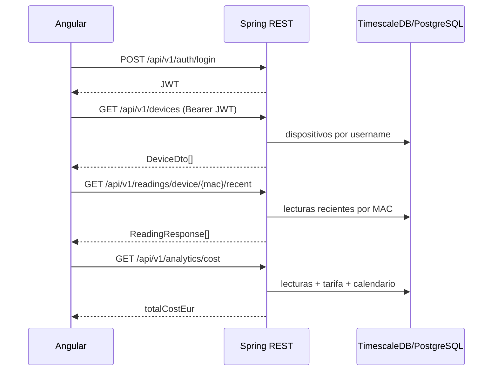

# Anexo A. Controladores REST de Spring Boot

Este anexo documenta la API REST real implementada en `backend/src/main/java/com/joselumartos/jwtauthbackenddemo/controllers`. El backend usa Spring Boot 4.0.5, Spring Security, JWT y DTOs tipo `record` para separar la representación HTTP de las entidades JPA.

## A.1. Seguridad común de la API

La seguridad se configura en `config/SecurityConfig.java`:

- La sesión HTTP se configura como **stateless**.
- CSRF se desactiva porque la autenticación principal se basa en token JWT.
- `JwtValidatorFilter` se ejecuta antes de `BasicAuthenticationFilter`.
- CORS lee los orígenes desde `app.cors.allowed-origins`.

| Ruta | Política |
|---|---|
| `/api/v1/auth/login` | Pública |
| `/api/v1/auth/register` | Pública |
| `/api/v1/auth/register/admin` | Pública a nivel de Spring Security, pero exige cabecera propia |
| `/api/v1/auth/oauth/exchange` | Pública |
| `/oauth2/authorization/**` | Pública |
| `/login/oauth2/code/**` | Pública |
| `/ws-iot/**` | Pública para handshake WebSocket |
| `GET /api/v1/tariffs/**` | Usuario autenticado |
| Resto de `/api/v1/tariffs/**` | `ROLE_ADMIN` |
| Cualquier otra ruta | Usuario autenticado |

La autorización de recursos propios se comprueba en los controladores y servicios comparando el propietario con `Principal.getName()` en las operaciones de consulta, claim, simulación, edición, borrado, lecturas, analítica y alertas. La excepción es la ruta directa `POST /api/v1/devices`, que guarda el `DeviceDto` recibido y se mantiene como alta simple; la interfaz actual usa `/claim` o `/simulated`, que sí toman el usuario del JWT.

## A.2. Gestión de errores

`GlobalExceptionHandler` convierte excepciones de negocio en respuestas JSON homogéneas con `ErrorResponse`.

```java
public record ErrorResponse(
        int status,
        String error,
        String message,
        LocalDateTime timestamp
) {}
```

| Excepción | HTTP | Uso principal |
|---|---:|---|
| `EntityNotFoundException` | 404 | Recurso inexistente o no accesible. |
| `BadCredentialsException` | 401 | Login incorrecto. |
| `UsernameNotFoundException` | 401 | Usuario no encontrado durante autenticación. |
| `ForbiddenException` | 403 | Registro admin con clave incorrecta. |
| `IllegalStateException` | 400 | Validaciones de negocio, tarifas incompletas o datos incoherentes. |
| `DataIntegrityViolationException` | 400/409/500 | Restricciones SQL o duplicados. |

---

## A.3. `AuthController`

**Archivo:** `controllers/AuthController.java`
**Ruta base:** `/api/v1/auth`
**Servicios:** `UserProviderDetailsManager`, `JwtTokenService`, `AuthRegistrationService`, `OAuth2LoginTicketService`

| Método | Endpoint | Entrada | Salida | Comportamiento |
|---|---|---|---|---|
| `POST` | `/login` | Body `LoginUser` | `200 LoginUserJwt` | Autentica usuario y contraseña. Si son válidos genera JWT con username y authorities. |
| `POST` | `/register` | Body `RegisterRequest` | `201` sin cuerpo | Registra usuario estándar con `ROLE_USER`. |
| `POST` | `/register/admin` | Header `X-Wattimizer-Admin-Secret`, body `RegisterRequest` | `201` sin cuerpo | Crea `ROLE_ADMIN` solo si la cabecera coincide con `app.admin.secret`. |
| `POST` | `/oauth/exchange` | Body `OAuthTicketExchangeRequest` | `200 LoginUserJwt` | Intercambia un ticket OAuth temporal por un JWT propio de Wattimizer. |

### DTOs de autenticación

| DTO | Campos | Intención |
|---|---|---|
| `LoginUser` | `username`, `password` | Credenciales del formulario de login. |
| `LoginUserJwt` | `statusCode`, `jwt` | Respuesta de autenticación consumida por Angular. |
| `RegisterRequest` | `username`, `password`, `confirmPassword`, `tariffId` opcional | Registro local. |
| `OAuthTicketExchangeRequest` | `ticket` | Token temporal emitido tras login OAuth2. |

El endpoint de registro admin está marcado como público en `SecurityConfig`, pero no queda abierto realmente: la protección se desplaza a una cabecera secreta para poder crear el primer administrador sin depender de una sesión previa.

---

## A.4. `DeviceController`

**Archivo:** `controllers/DeviceController.java`
**Ruta base:** `/api/v1/devices`
**Servicio:** `DeviceService`

| Método | Endpoint | Parámetros | Body | Salida | Decisión de negocio |
|---|---|---|---|---|---|
| `GET` | `/api/v1/devices` | `Principal` | - | `List<DeviceDto>` | Lista solo dispositivos del usuario autenticado. |
| `GET` | `/api/v1/devices/{id}` | Path `id`, `Principal` | - | `DeviceDto` o 403 | Comprueba que `device.username` coincida con el JWT. |
| `POST` | `/api/v1/devices` | - | `DeviceDto` | `201 DeviceDto` | Alta directa basada en el DTO recibido. En la UI actual se prefiere `/claim` porque vincula al usuario autenticado. |
| `POST` | `/api/v1/devices/claim` | `Principal` | `DeviceDto` con `macAddress`, `name` | `200 DeviceDto` | Vincula una MAC física al usuario actual o registra el dispositivo si procede. |
| `POST` | `/api/v1/devices/simulated/demo-pack` | `Principal` | - | `201 List<DeviceDto>` | Crea un simulador por cada perfil que el usuario aún no tenga. |
| `POST` | `/api/v1/devices/simulated` | `Principal` | `CreateSimulatedDeviceRequest` | `201 DeviceDto` | Crea un dispositivo sintético con MAC `SIM...`. |
| `PUT` | `/api/v1/devices/{id}` | Path `id`, `Principal` | `DeviceDto` | `200 DeviceDto` | Actualiza nombre, estado y perfil si el dispositivo es simulado. |
| `DELETE` | `/api/v1/devices/{id}` | Path `id`, `Principal` | - | `204` | Elimina dispositivo tras comprobar propietario. El servicio limpia lecturas y alertas asociadas. |

### DTOs de dispositivos

```java
public record DeviceDto(
        Long id,
        String username,
        String name,
        String macAddress,
        Boolean isOn,
        Boolean simulated,
        SimulationProfile simulationProfile
) {}
```

```java
public record CreateSimulatedDeviceRequest(
        String name,
        SimulationProfile simulationProfile
) {}
```

`SimulationProfile` incluye perfiles como `OVEN`, `WASHING_MACHINE`, `FRIDGE`, `STANDBY` y `CONSTANT_HIGH_LOAD`. La decisión de usar un enum permite que backend, frontend y tests hablen el mismo idioma cuando se crea telemetría sintética.

---

## A.5. `ReadingController`

**Archivo:** `controllers/ReadingController.java`
**Ruta base:** `/api/v1/readings`
**Servicios:** `ReadingService`, `DeviceService`

| Método | Endpoint | Parámetros | Salida | Comportamiento |
|---|---|---|---|---|
| `GET` | `/api/v1/readings` | `Principal` | `List<ReadingResponse>` | Devuelve lecturas de dispositivos del usuario autenticado. |
| `GET` | `/api/v1/readings/latest/{macAddress}` | Path `macAddress` | `ReadingResponse` | Devuelve la última lectura de una MAC, previa comprobación de propiedad. |
| `GET` | `/api/v1/readings/device/{macAddress}/recent` | Path `macAddress`, query `seconds` por defecto `120` | `List<ReadingResponse>` | Devuelve lecturas recientes para inicializar la gráfica antes del WebSocket. |
| `GET` | `/api/v1/readings/search` | Query `time` ISO, `macAddress` | `ReadingResponse` | Consulta una lectura por clave compuesta temporal. |
| `DELETE` | `/api/v1/readings/search` | Query `time` ISO, `macAddress` | `204` | Borra una lectura concreta si pertenece al usuario. |

### DTO de salida

```java
public record ReadingResponse(
        Instant time,
        String macAddress,
        BigDecimal powerW,
        BigDecimal energyTotalKwh,
        Boolean isOn
) {}
```

La API usa MAC como identificador funcional en lecturas porque la telemetría IoT llega con esa referencia. Antes de consultar o borrar, el controlador localiza el dispositivo por MAC y compara su `username` con el usuario del token.

---

## A.6. `ConsumptionController`

**Archivo:** `controllers/ConsumptionController.java`
**Ruta base:** `/api/v1/analytics`
**Servicios:** `ConsumptionService`, `DeviceService`

| Método | Endpoint | Query params | Salida | Uso en frontend |
|---|---|---|---|---|
| `GET` | `/api/v1/analytics/cost` | `macAddress`, `start`, `end` | `Map` con `macAddress`, `totalCostEur`, `start`, `end` | Tarjeta de coste diario del dashboard. |
| `GET` | `/api/v1/analytics/ghost-consumption` | `macAddress`, `start`, `end` | `Map` con `macAddress`, `ghostCostEur`, `start`, `end` | Tarjeta de consumo fantasma. |

El cálculo se basa en lecturas ordenadas por tiempo. En lugar de sumar potencia instantánea, el servicio usa el delta positivo del odómetro `energy_total_kwh` entre dos lecturas consecutivas:

```text
coste del tramo = delta_kWh_positivo * precio_kWh_del_periodo
```

Para consumo fantasma se aplica el mismo cálculo, pero solo si la lectura cae entre las 00:00 y las 05:59 en la zona horaria de la tarifa.

---

## A.7. `TariffController`

**Archivo:** `controllers/TariffController.java`
**Ruta base:** `/api/v1/tariffs`
**Servicio:** `TariffService`

| Método | Endpoint | Seguridad | Body | Salida | Comportamiento |
|---|---|---|---|---|---|
| `GET` | `/api/v1/tariffs` | Autenticado | - | `List<TariffDto>` | Lista el catálogo maestro, no clones privados. |
| `GET` | `/api/v1/tariffs/{id}` | Autenticado | - | `TariffDto` | Consulta una tarifa por id. |
| `POST` | `/api/v1/tariffs` | `ROLE_ADMIN` | `TariffDto` | `201 TariffDto` | Crea plantilla de catálogo validando periodos y potencias. |
| `POST` | `/api/v1/tariffs/{id}` | `ROLE_ADMIN` | `TariffDto` | `200 TariffDto` | Actualiza plantilla. El frontend usa POST porque así está expuesto el backend. |
| `DELETE` | `/api/v1/tariffs/{id}` | `ROLE_ADMIN` | - | `204` | Borra plantilla si no está asignada a usuarios. |

### DTOs de tarifa

```java
public record TariffDto(
        Long id,
        String name,
        String market,
        String accessTariffCode,
        String geographicZone,
        String energyCompany,
        List<PeriodDto> periods,
        List<TariffContractedPowerDto> contractedPowers
) {}
```

```java
public record PeriodDto(Long id, String periodCode, BigDecimal priceKwh) {}
public record TariffContractedPowerDto(Long id, String periodCode, BigDecimal contractedPowerKw) {}
```

La tarifa separa tres conceptos que en versiones simples podrían mezclarse:

1. **Estructura del contrato** (`tariffs`).
2. **Precio de energía** por periodo (`periods`).
3. **Potencia contratada** por periodo (`tariff_contracted_powers`).

Esa separación permite calcular tanto el coste por kWh como las alertas de maxímetro.

---

## A.8. `UserTariffController`

**Archivo:** `controllers/UserTariffController.java`
**Ruta base:** `/api/v1/users/me/tariff`
**Servicio:** `UserTariffService`

| Método | Endpoint | Body | Salida | Intención |
|---|---|---|---|---|
| `GET` | `/api/v1/users/me/tariff` | - | `200 TariffDto` o `204 No Content` | Recupera la tarifa privada del usuario. |
| `POST` | `/api/v1/users/me/tariff` | `UserTariffRequest` | `200 TariffDto` | Clona una plantilla y/o guarda contrato privado. |
| `DELETE` | `/api/v1/users/me/tariff` | - | `204` | Desvincula la tarifa privada del usuario. |

```java
public record UserTariffRequest(
        Long templateTariffId,
        TariffDto contract
) {}
```

Este controlador es uno de los puntos más importantes de seguridad funcional. No existe `/users/{id}/tariff`, porque el usuario se toma siempre del JWT. Así se evita una vulnerabilidad IDOR donde alguien podría modificar la tarifa de otro usuario cambiando el id en la URL.

---

## A.9. `AlertController`

**Archivo:** `controllers/AlertController.java`
**Ruta base:** `/api/v1/alerts`
**Servicio:** `AlertService`

| Método | Endpoint | Parámetros | Salida | Comportamiento |
|---|---|---|---|---|
| `GET` | `/api/v1/alerts` | `Principal` | `List<AlertDto>` | Lista alertas del usuario autenticado. |
| `DELETE` | `/api/v1/alerts/{id}` | Path `id`, `Principal` | `204` | Borra solo si la alerta pertenece al usuario; si no, lanza 404. |

```java
public record AlertDto(
        Long id,
        String macAddress,
        String username,
        String type,
        String message,
        Instant createdAt
) {}
```

Las alertas se generan desde el pipeline de telemetría, no desde una acción manual del usuario. Cada lectura guardada puede activar `AlertService.checkPowerThreshold(reading)`.

---

## A.10. Controladores presentes pero no expuestos

Hay clases antiguas o experimentales comentadas:

| Clase | Estado |
|---|---|
| `DeviceStateController` | Código comentado, sin `@RestController` activo. |
| `ReactiveDeviceStateController` | Código comentado, no forma parte de la API actual. |
| `DeviceCommandController` | Código comentado, no expone comandos WebSocket activos. |

No se documentan como API disponible porque el código no las registra en Spring.

---

## A.11. Resumen de flujo REST principal


