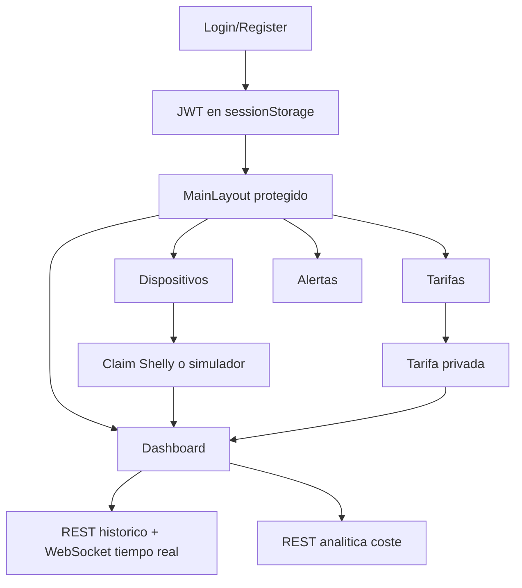

# Anexo B. Frontend Angular, RxJS y NgRx Signals

## 1. Proposito del frontend

El frontend de Wattimizer es una SPA desarrollada con **Angular 21**, componentes standalone y lazy loading por rutas. Su funcion es convertir los datos energéticos del backend en una experiencia clara: login, gestión de dispositivos, configuracion de tarifas, visualizacion de consumo y revisión de alertas.

La aplicación arranca desde `frontend/src/main.ts` con `bootstrapApplication(App, appConfig)`. No usa modulos Angular clasicos para declarar pantallas; cada componente se carga de forma independiente desde `app.routes.ts`.

## 2. Tecnologias reales usadas

| Tecnologia | Uso en el proyecto |
|---|---|
| Angular `^21.1.0` / `^21.2.14` | Componentes, formularios, rutas y renderizado SPA. |
| TypeScript `~5.9.2` | Tipado de servicios, DTOs e interfaces. |
| RxJS `~7.8.0` | Flujos HTTP, WebSocket y transformacion de eventos. |
| `@ngrx/signals` `^21.1.0` | Stores reactivos con Signals, no NgRx Store clasico. |
| PrimeNG 21 | Componentes UI como tablas, selects, botones y formularios. |
| Tailwind CSS 4 | Utilidades visuales globales. |
| Chart.js 4.5 | Grafica de potencia en el dashboard. |
| `@stomp/rx-stomp` | Cliente STOMP sobre WebSocket para telemetría. |
| Biome | Lint/formato frontend. |
| Vitest | Tests unitarios configurados por Angular build. |

## 3. Rutas y pantallas

Las rutas estan en `frontend/src/app/app.routes.ts`.

| Ruta | Componente | Proteccion | Funcion |
|---|---|---|---|
| `/login` | `LoginComponent` | Pública | Login por credenciales y entrada OAuth2. |
| `/register` | `RegisterComponent` | Pública | Registro de usuario. |
| `/auth/oauth/callback` | `OAuthCallbackComponent` | Pública | Canje del ticket OAuth2 por JWT. |
| `/` | `MainLayoutComponent` | `authGuard` | Shell autenticado con menu lateral. |
| `/dashboard` | `DashboardComponent` | Hija protegida | Potencia en tiempo real y costes. |
| `/devices` | `DevicesComponent` | Hija protegida | CRUD de dispositivos fisicos y simulados. |
| `/tariffs` | `TariffComponent` | Hija protegida | Catalogo y tarifa privada. |
| `/alerts` | `AlertsComponent` | Hija protegida | Listado y descarte de alertas. |
| `**` | Redireccion | - | Redirige a `/dashboard`. |

`authGuard` consulta `SessionStorageService.isLoggedIn()`. Si el JWT no existe o esta expirado, redirige al login.

## 4. Componentes principales

### 4.1. `LoginComponent`

**Archivo:** `frontend/src/app/components/login/login.component.ts`

Usa un formulario reactivo con email y contraseña. Al enviar:

1. Llama a `AuthService.authentication()`.
2. Guarda el JWT con `SessionStorageService.saveToken()`.
3. Navega a `/dashboard`.

Tambien permite iniciar OAuth2 redirigiendo a `/oauth2/authorization/google` o `/oauth2/authorization/github`. Los errores se guardan en una `signal` y se limpian automaticamente con un `effect`.

### 4.2. `RegisterComponent`

**Archivo:** `frontend/src/app/components/register/register.component.ts`

Registra usuarios con `AuthService.register()`. La validación de coincidencia de contraseñas se hace en el formulario antes de enviar. Si el backend responde correctamente, navega al login.

### 4.3. `OAuthCallbackComponent`

**Archivo:** `frontend/src/app/components/oauth-callback/oauth-callback.component.ts`

Lee `ticket` de la URL de callback. Ese ticket no es el JWT definitivo, sino una clave temporal generada por el backend. El componente llama a:

```ts
this.authService.exchangeOAuthTicket(ticket)
```

Si el canje es correcto, guarda el JWT y redirige al dashboard. Esta separacion evita exponer el JWT directamente en la URL durante el flujo OAuth2.

### 4.4. `MainLayoutComponent`

**Archivo:** `frontend/src/app/components/main-layout/main-layout.component.ts`

Contiene la estructura autenticada: marca, usuario, boton de logout, menu lateral y `<router-outlet>`. Al cerrar sesion ejecuta una limpieza ordenada:

```ts
this.telemetryStore.connectTelemetry(null);
this.telemetryStore.reset();
this.tariffStore.reset();
this.session.logout();
this.router.navigate(["/login"], { replaceUrl: true });
```

El orden importa porque primero se corta el flujo WebSocket y despues se eliminan datos cacheados. Asi se evita que otro usuario vea temporalmente información de la sesion anterior.

### 4.5. `DashboardComponent`

**Archivo:** `frontend/src/app/components/dashboard/dashboard.component.ts`

Es la pantalla más representativa. Combina:

- `TelemetryStore` para dispositivos, MAC seleccionada y lecturas.
- `TariffStore` para saber si el usuario tiene tarifa.
- `HttpClient` directo para analíticas de coste.
- `computed()` para preparar datos de gráfica y textos.
- `effect()` para reaccionar a cambios de dispositivo o tarifa.

Cuando cambia la MAC seleccionada, el componente:

1. Carga lecturas recientes por REST.
2. Conecta WebSocket a `/topic/readings/{macAddress}`.
3. Recarga coste diario si existe tarifa privada.

### 4.6. `DevicesComponent`

**Archivo:** `frontend/src/app/components/devices/devices.component.ts`

Gestiona dispositivos fisicos y simulados. El formulario cambia de validación segun el tipo:

- Fisico: requiere nombre y MAC.
- Simulado: requiere nombre y `simulationProfile`.

Aunque `TelemetryStore` contiene metodos CRUD, esta pantalla usa varias llamadas HTTP directas y despues refresca el store con `loadDevices()`. Es una decisión práctica: la pantalla mantiene su lógica de formularios local y usa el store como fuente compartida para dashboard y layout.

### 4.7. `TariffComponent`

**Archivo:** `frontend/src/app/components/tariff/tariff.component.ts`

Gestiona dos casos:

- Usuario normal: selecciona una plantilla y guarda su contrato privado.
- Administrador: mantiene el catalogo global si tiene `ROLE_ADMIN`.

El rol se calcula con:

```ts
readonly isAdmin = computed(() => this.sessionService.hasRole("ROLE_ADMIN"));
```

El formulario trabaja con peajes `2.0TD`, `3.0TD`, `6.1TD`, `6.2TD`, zonas geograficas y arrays de periodos/potencias. En modo tarifa privada, se bloquean campos estructurales para que el usuario edite precios y potencias sin alterar el catalogo.

### 4.8. `AlertsComponent`

**Archivo:** `frontend/src/app/components/alerts/alerts.component.ts`

Carga alertas con `GET /api/v1/alerts` y permite descartarlas con `DELETE /api/v1/alerts/{id}`. Usa signals locales para estado de carga, mensajes de exito y errores temporales.

## 5. Servicios Angular

### 5.1. `AuthService`

**Archivo:** `frontend/src/app/services/auth.service.ts`

| Metodo | HTTP | DTO |
|---|---|---|
| `authentication(user)` | `POST /api/v1/auth/login` | `LoginUser` -> `LoginUserJwt` |
| `register(user)` | `POST /api/v1/auth/register` | `RegisterRequest` -> `void` |
| `exchangeOAuthTicket(ticket)` | `POST /api/v1/auth/oauth/exchange` | `{ ticket }` -> `LoginUserJwt` |

### 5.2. `SessionStorageService`

**Archivo:** `frontend/src/app/services/session-storage.service.ts`

Guarda el JWT bajo la clave `auth_token` en `sessionStorage`. Tambien decodifica el payload para obtener:

```ts
export interface JwtPayload {
    exp?: number;
    username?: string;
    authorities?: string;
}
```

Sus metodos más importantes son `saveToken`, `getToken`, `logout`, `isLoggedIn`, `getAuthorities`, `hasRole` y `getUsername`.

### 5.3. `TariffService`

**Archivo:** `frontend/src/app/services/tariff.service.ts`

Consume tanto el catalogo global como la tarifa privada del usuario.

| Metodo | Endpoint |
|---|---|
| `getCatalog()` | `GET /api/v1/tariffs` |
| `getById(id)` | `GET /api/v1/tariffs/{id}` |
| `createCatalogTariff(payload)` | `POST /api/v1/tariffs` |
| `updateCatalogTariff(id, payload)` | `POST /api/v1/tariffs/{id}` |
| `deleteCatalogTariff(id)` | `DELETE /api/v1/tariffs/{id}` |
| `getMyTariff()` | `GET /api/v1/users/me/tariff` |
| `saveMyTariff(payload)` | `POST /api/v1/users/me/tariff` |
| `unlinkMyTariff()` | `DELETE /api/v1/users/me/tariff` |

Cuando `getMyTariff()` recibe `204 No Content`, transforma la respuesta en `null`, lo que simplifica el dashboard: si `myTariff === null`, se muestra el aviso de tarifa pendiente.

### 5.4. `WebsocketService`

**Archivo:** `frontend/src/app/services/websocket.service.ts`

Configura `RxStomp` contra `/ws-iot`. La URL se adapta a HTTP/HTTPS:

- En local con `http`, usa `ws://`.
- En producción con `https`, usa `wss://`.

El metodo principal es:

```ts
watchReadings(macAddress: string): Observable<ReadingResponse> {
    const destination = `/topic/readings/${macAddress}`;
    return this.rxStomp.watch(destination).pipe(
        map((message) => JSON.parse(message.body) as ReadingResponse),
    );
}
```

### 5.5. Interceptor HTTP

**Archivo:** `frontend/src/app/interceptors/http.interceptor.ts`

El interceptor anade:

- `X-Requested-With: XMLHttpRequest`
- `Authorization: Bearer <token>` en rutas `/api/v1/*` protegidas

Si el backend responde `401`, limpia sesion y redirige al login. Esto centraliza el tratamiento de expiracion de token.

## 6. DTOs frontend

| Interface | Archivo | Campos principales |
|---|---|---|
| `Device` | `interfaces/device.interface.ts` | `id`, `username`, `name`, `macAddress`, `isOn`, `simulated`, `simulationProfile`. |
| `ReadingResponse` | `interfaces/reading-response.interface.ts` | `time`, `macAddress`, `powerW`, `energyTotalKwh`, `isOn`. |
| `EnergyCostResponse` | `interfaces/energy-cost-response.interface.ts` | `macAddress`, `totalCostEur`, `start`, `end`. |
| `GhostCostResponse` | `interfaces/ghost-cost-response.interface.ts` | `macAddress`, `ghostCostEur`, `start`, `end`. |
| `Alert` | `interfaces/alert.interface.ts` | `id`, `macAddress`, `username`, `type`, `message`, `createdAt`. |
| `TariffRequest` / `TariffResponse` | `interfaces/tariff-request.interface.ts` | `id`, `name`, `market`, `accessTariffCode`, `geographicZone`, `energyCompany`, `periods`, `contractedPowers`. |

## 7. Logica reactiva con NgRx Signals y RxJS

### 7.1. `TelemetryStore`

**Archivo:** `frontend/src/app/store/telemetry.store.ts`

Estado:

```ts
interface TelemetryState {
    devices: Device[];
    selectedMac: string | null;
    historicalReadings: {
        [mac: string]: {
            timestamps: string[];
            powerW: number[];
        };
    };
    isLoadingDevices: boolean;
}
```

Selector principal:

```ts
currentReadings: computed(() => {
    const mac = state.selectedMac();
    return mac
        ? (state.historicalReadings()[mac] ?? { timestamps: [], powerW: [] })
        : { timestamps: [], powerW: [] };
})
```

La idea es guardar el historico por MAC. Asi, si el usuario cambia de dispositivo, el dashboard no mezcla lecturas de enchufes distintos.

#### Flujo de carga de dispositivos

`loadDevices` es un `rxMethod<void>`:

1. Activa `isLoadingDevices`.
2. Llama a `GET /api/v1/devices`.
3. Actualiza `devices`.
4. Si no habia MAC seleccionada, selecciona la primera.

#### Flujo WebSocket

`connectTelemetry` recibe `string | null`. Con `switchMap`, al cambiar de MAC se cancela la suscripcion anterior:

```ts
connectTelemetry: rxMethod<string | null>(
    pipe(
        distinctUntilChanged(),
        switchMap((mac) => {
            if (!mac) return of(null);
            return wsService.watchReadings(mac).pipe(
                filter((r) => (r.powerW as number | null | undefined) != null),
                distinctUntilChanged((prev, curr) => prev.time === curr.time),
                tap({ next: (reading) => { /* actualiza historico */ } }),
            );
        }),
    ),
)
```

Se filtran lecturas sin potencia para evitar huecos en la gráfica. Tambien se deduplica por timestamp porque el backend puede emitir información desde más de un canal MQTT.

### 7.2. `TariffStore`

**Archivo:** `frontend/src/app/store/tariff.store.ts`

Estado:

```ts
interface TariffState {
    catalog: TariffResponse[];
    myTariff: TariffResponse | null;
    isLoadingCatalog: boolean;
    isLoadingMyTariff: boolean;
    errorMessage: string | null;
}
```

Computed:

- `hasMyTariff`: indica si el usuario ya tiene contrato.
- `isCatalogEmpty`: ayuda a la UI cuando no hay tarifas cargadas.

Metodos `rxMethod`:

| Metodo | Funcion |
|---|---|
| `loadCatalog` | Carga catalogo maestro. |
| `loadMyTariff` | Carga contrato privado del usuario. |
| `saveMyTariff` | Guarda o actualiza contrato privado. |
| `unlinkMyTariff` | Elimina la asignacion de tarifa privada. |
| `refreshAfterCatalogMutation` | Recarga catalogo tras cambios admin. |

Los errores de servicio se convierten en `errorMessage`. Despues los componentes los muestran con signals locales y temporizadores.

## 8. Flujo de usuario



La experiencia se basa en una regla clara: primero autenticación, despues tarifa y dispositivos. Si falta tarifa, el dashboard lo comunica porque no puede calcular euros con rigor.

## 9. Observaciones técnicas

- El proyecto usa `@ngrx/signals`, no NgRx Store con reducers/effects clasicos.
- `DeviceService` existe con `httpResource`, pero actualmente las pantallas usan sobre todo `TelemetryStore` o `HttpClient` directo.
- El dashboard consulta analíticas con `HttpClient` directo porque son calculos puntuales ligados al dia actual y a la MAC seleccionada.
- La limpieza en logout es importante: corta WebSocket y resetea stores antes de cambiar de usuario.
- El proxy de desarrollo (`frontend/proxy.conf.json`) envia `/api`, `/oauth2` y `/ws-iot` a `http://localhost:8080`, por lo que Angular no necesita conocer la URL real del backend en local.
