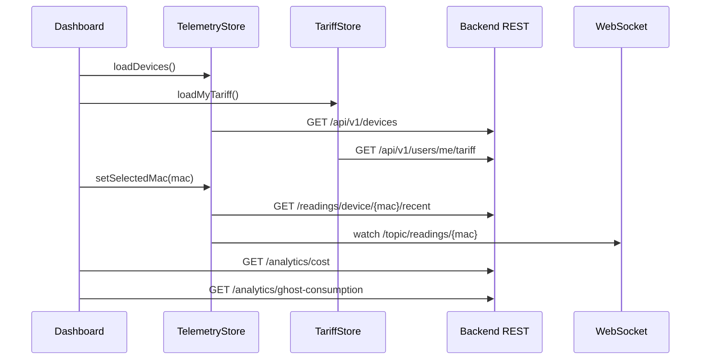

# Anexo B. Frontend Angular, RxJS y NgRx Signals

## 1. Estructura general del frontend

El frontend esta en `frontend/src/app` y usa Angular 21 con componentes standalone. La aplicacion no tiene modulos clasicos de Angular; la configuracion global se realiza en `app.config.ts`.

| Archivo | Funcion |
| --- | --- |
| `frontend/src/app/app.ts` | Componente raiz con el `router-outlet` principal |
| `frontend/src/app/app.config.ts` | Router, HTTP client, interceptor, animaciones y tema PrimeNG |
| `frontend/src/app/app.routes.ts` | Rutas publicas y privadas |
| `frontend/src/app/guards/auth.guard.ts` | Proteccion de rutas autenticadas |
| `frontend/src/app/interceptors/http.interceptor.ts` | Cabecera JWT y gestion de `401` |

La interfaz esta montada sobre PrimeNG, Chart.js y Tailwind. La decision de usar Angular standalone simplifica la estructura porque cada pantalla importa directamente lo que necesita.

## 2. Rutas y pantallas

| Ruta | Componente | Acceso | Proposito |
| --- | --- | --- | --- |
| `/login` | `LoginComponent` | Publico | Login con email/password y OAuth |
| `/register` | `RegisterComponent` | Publico | Alta de usuario |
| `/auth/oauth/callback` | `OAuthCallbackComponent` | Publico | Canje del ticket OAuth |
| `/dashboard` | `DashboardComponent` | Privado | Panel de consumo y analitica |
| `/devices` | `DevicesComponent` | Privado | Gestion de medidores |
| `/tariffs` | `TariffComponent` | Privado | Catalogo y tarifa personal |
| `/alerts` | `AlertsComponent` | Privado | Incidencias de potencia |

Las rutas privadas cuelgan de `MainLayoutComponent`, que aporta cabecera, menu lateral y boton de logout.

## 3. Sesion y seguridad en cliente

### 3.1. `SessionStorageService`

**Archivo:** `frontend/src/app/services/session-storage.service.ts`

El token se guarda con la clave `auth_token` en `sessionStorage`. El servicio expone:

- `saveToken(token)`
- `getToken()`
- `logout()`
- `isLoggedIn()`
- `getUsername()`
- `getAuthorities()`
- `hasRole(role)`

El JWT se decodifica con `jwt-decode`. El frontend comprueba `exp` antes de considerar valida la sesion. Esto no sustituye la seguridad del backend, pero evita mantener al usuario en pantallas privadas con un token claramente caducado.

### 3.2. Interceptor HTTP

**Archivo:** `frontend/src/app/interceptors/http.interceptor.ts`

El interceptor anade:

```text
X-Requested-With: XMLHttpRequest
Authorization: Bearer <token>
```

La cabecera `Authorization` se aplica a `/api/v1/*`, excepto login, registro y canje OAuth. Si recibe un `401`, borra la sesion y redirige a `/login`.

### 3.3. Guard de rutas

**Archivo:** `frontend/src/app/guards/auth.guard.ts`

El guard valida `SessionStorageService.isLoggedIn()`. Si no hay token o esta expirado, redirige al login.

## 4. Servicios HTTP

### 4.1. `AuthService`

**Archivo:** `frontend/src/app/services/auth.service.ts`

| Metodo frontend | Endpoint | Entrada | Salida |
| --- | --- | --- | --- |
| `authentication` | `POST /api/v1/auth/login` | `LoginUser` | `LoginUserJwt` |
| `register` | `POST /api/v1/auth/register` | `RegisterRequest` | `void` |
| `exchangeOAuthTicket` | `POST /api/v1/auth/oauth/exchange` | `{ ticket }` | `LoginUserJwt` |

El componente de login guarda el JWT y navega a `/dashboard`. El callback OAuth hace lo mismo, pero antes lee el `ticket` desde la URL.

### 4.2. `TariffService`

**Archivo:** `frontend/src/app/services/tariff.service.ts`

| Metodo | Endpoint | Uso |
| --- | --- | --- |
| `getTariffs` | `GET /api/v1/tariffs` | Cargar catalogo maestro |
| `getTariffById` | `GET /api/v1/tariffs/{id}` | Consultar detalle |
| `createTariff` | `POST /api/v1/tariffs` | Alta admin |
| `updateTariff` | `POST /api/v1/tariffs/{id}` | Edicion admin |
| `deleteTariff` | `DELETE /api/v1/tariffs/{id}` | Borrado admin |
| `getMyTariff` | `GET /api/v1/users/me/tariff` | Cargar contrato personal |
| `saveMyTariff` | `POST /api/v1/users/me/tariff` | Asignar o editar tarifa privada |
| `unlinkMyTariff` | `DELETE /api/v1/users/me/tariff` | Desvincular tarifa |

### 4.3. `WebsocketService`

**Archivo:** `frontend/src/app/services/websocket.service.ts`

El servicio crea un `RxStomp` singleton. La URL se construye segun el protocolo actual:

- `ws://.../ws-iot` en HTTP.
- `wss://.../ws-iot` en HTTPS.

La operacion principal es:

```typescript
watchReadings(macAddress: string): Observable<ReadingResponse>
```

Internamente se suscribe a:

```text
/topic/readings/{macAddress}
```

Esto permite que el dashboard reciba lecturas sin hacer polling.

### 4.4. `DeviceService`

**Archivo:** `frontend/src/app/services/device.service.ts`

Este servicio define un `httpResource<Device[]>` para `/api/v1/devices`, pero en el codigo actual no es el camino principal de la pantalla de dispositivos. `DevicesComponent` usa `HttpClient` directamente, y `TelemetryStore` tambien tiene metodos CRUD. Es una zona del frontend que podria unificarse mas adelante.

## 5. Estado reactivo con NgRx Signals

El proyecto no usa NgRx clasico con reducers y effects. Usa `@ngrx/signals`, que encaja mejor con Angular moderno y con una aplicacion de tamano medio.

### 5.1. `TelemetryStore`

**Archivo:** `frontend/src/app/store/telemetry.store.ts`

#### Estado

```typescript
type TelemetryState = {
  devices: Device[];
  selectedMac: string | null;
  historicalReadings: {
    [mac: string]: {
      timestamps: string[];
      powerW: number[];
    };
  };
  isLoadingDevices: boolean;
};
```

El historico se guarda por MAC. Esta decision evita mezclar lecturas cuando el usuario cambia de medidor en el dashboard.

#### Computed

| Computed | Intencion |
| --- | --- |
| `currentReadings` | Devuelve las lecturas del `selectedMac` actual |

#### Metodos con `rxMethod`

| Metodo | Operadores RxJS principales | Funcion |
| --- | --- | --- |
| `loadDevices` | `tap`, `switchMap` | Carga dispositivos y selecciona el primero si no hay MAC activa |
| `claimDevice` | `switchMap`, `tap` | Reclama un dispositivo fisico por MAC |
| `createSimulatedDevice` | `switchMap`, `tap` | Crea un medidor simulado |
| `addDevice` | `switchMap`, `tap` | Alta directa de dispositivo |
| `updateDevice` | `switchMap`, `tap` | Actualiza nombre, estado o perfil |
| `deleteDevice` | `switchMap`, `tap` | Elimina dispositivo y ajusta seleccion |
| `connectTelemetry` | `distinctUntilChanged`, `switchMap`, `filter`, `tap` | Cambia la suscripcion WebSocket segun la MAC |

#### Flujo de telemetria

```mermaid
flowchart TD
  A[Dashboard selecciona MAC] --> B[TelemetryStore.setSelectedMac]
  B --> C[loadRecentReadings]
  C --> D[GET /api/v1/readings/device/{mac}/recent]
  B --> E[connectTelemetry]
  E --> F[WebsocketService.watchReadings]
  F --> G[/topic/readings/{mac}]
  G --> H[Patch de historicalReadings mac]
  H --> I[Grafica ultimos 20 puntos]
```

El store filtra lecturas incompletas y mantiene una ventana corta de puntos para que la grafica sea legible.

### 5.2. `TariffStore`

**Archivo:** `frontend/src/app/store/tariff.store.ts`

#### Estado

```typescript
type TariffState = {
  catalog: TariffResponse[];
  myTariff: TariffResponse | null;
  isLoadingCatalog: boolean;
  isLoadingMyTariff: boolean;
  errorMessage: string | null;
};
```

#### Computed

| Computed | Uso |
| --- | --- |
| `hasMyTariff` | Saber si el dashboard puede calcular coste |
| `isCatalogEmpty` | Estado visual de catalogo vacio |

#### Metodos principales

| Metodo | Funcion |
| --- | --- |
| `loadCatalog` | Carga tarifas maestras |
| `loadMyTariff` | Carga contrato privado |
| `saveMyTariff` | Guarda asignacion o edicion de tarifa del usuario |
| `unlinkMyTariff` | Elimina vinculacion de tarifa |
| `refreshAfterCatalogMutation` | Recarga catalogo tras cambios admin |
| `reset` | Limpia estado al cerrar sesion |

## 6. Componentes principales

### 6.1. `LoginComponent`

**Archivos:** `components/login/login.component.ts`, `login.html`

- Formulario reactivo con email y password.
- Llama a `AuthService.authentication`.
- Guarda el JWT con `SessionStorageService.saveToken`.
- Redirige a `/dashboard`.
- Tiene botones OAuth para Google y GitHub.
- Usa `effect()` para ocultar mensajes de error despues de unos segundos.

### 6.2. `RegisterComponent`

**Archivos:** `components/register/register.component.ts`, `register.html`

- Valida coincidencia entre `password` y `confirmPassword`.
- Envia `RegisterRequest` al backend.
- En caso correcto, muestra mensaje y redirige al login.

### 6.3. `OAuthCallbackComponent`

**Archivo:** `components/oauth-callback/oauth-callback.component.ts`

- Lee `ticket` de la URL.
- Llama a `AuthService.exchangeOAuthTicket`.
- Guarda JWT y navega a `/dashboard`.

### 6.4. `MainLayoutComponent`

**Archivos:** `components/main-layout/main-layout.component.ts`, `main-layout.html`

Contiene la navegacion privada: Dashboard, Mis dispositivos, Tarifas electricas y Alertas.

En logout hace limpieza ordenada:

1. Cierra la telemetria con `connectTelemetry(null)`.
2. Resetea `TelemetryStore`.
3. Resetea `TariffStore`.
4. Borra sesion.
5. Redirige a `/login`.

### 6.5. `DashboardComponent`

**Archivos:** `components/dashboard/dashboard.component.ts`, `dashboard.html`

Responsabilidades:

- Cargar dispositivos.
- Cargar tarifa personal.
- Mostrar selector de medidor activo.
- Pintar grafica con las ultimas lecturas.
- Calcular coste del dia y consumo fantasma.
- Mostrar aviso si el usuario no ha configurado tarifa.

El componente usa varios `computed` para preparar datos de grafica y textos. Tambien usa `effect()` para reaccionar a cambios de MAC y tarifa.

Flujo principal:



### 6.6. `DevicesComponent`

**Archivos:** `components/devices/devices.component.ts`, `devices.html`

Permite:

- Reclamar un dispositivo fisico por MAC.
- Crear un dispositivo simulado con perfil.
- Crear el pack demo completo.
- Editar nombre, estado y perfil.
- Borrar dispositivos.

Aunque `TelemetryStore` tiene metodos CRUD, esta pantalla usa `HttpClient` directamente y refresca despues con `store.loadDevices()`. Es una decision funcional, aunque deja margen para refactorizar y centralizar todo en el store.

### 6.7. `TariffComponent`

**Archivos:** `components/tariff/tariff.component.ts`, `tariff.html`

La pantalla cambia segun rol:

- `ROLE_USER`: ve plantillas, asigna una tarifa y puede editar precios/potencias de su contrato.
- `ROLE_ADMIN`: gestiona el catalogo maestro.

La validacion de periodos y potencias tambien se representa en la UI para evitar enviar datos claramente invalidos.

### 6.8. `AlertsComponent`

**Archivos:** `components/alerts/alerts.component.ts`, `alerts.html`

La pantalla usa signals locales:

- `alertsList`
- `isLoading`
- `errorMessage`
- `successMessage`

Consume:

- `GET /api/v1/alerts`
- `DELETE /api/v1/alerts/{id}`

El backend emite alertas por WebSocket, pero el frontend actual consulta esta pantalla por REST.

## 7. Interfaces principales

| Interface | Archivo | Uso |
| --- | --- | --- |
| `LoginUser` | `interfaces/login-user.interface.ts` | Login |
| `LoginUserJwt` | `interfaces/login-user-jwt.interface.ts` | Respuesta de autenticacion |
| `RegisterRequest` | `interfaces/register-request.interface.ts` | Registro |
| `JwtPayload` | `interfaces/jwt-payload.interface.ts` | Decodificacion de sesion |
| `Device` | `interfaces/device.interface.ts` | Dispositivos reales/simulados |
| `SimulationProfile` | `interfaces/simulation-profile.interface.ts` | Perfiles de simulacion |
| `ReadingResponse` | `interfaces/reading-response.interface.ts` | Lecturas REST y WebSocket |
| `TelemetryState` | `interfaces/telemetry-state.interface.ts` | Estado del store de telemetria |
| `TariffRequest`, `TariffResponse`, `UserTariffRequest` | `interfaces/tariff-request.interface.ts` | Tarifas |
| `EnergyCostResponse` | `interfaces/energy-cost-response.interface.ts` | Coste del periodo |
| `GhostCostResponse` | `interfaces/ghost-cost-response.interface.ts` | Coste fantasma |
| `Alert` | `interfaces/alert.interface.ts` | Alertas |

## 8. Decisiones destacadas

- **Signals y NgRx Signals:** reducen codigo repetitivo frente a reducers para un proyecto de tamano DAW.
- **Historico por MAC:** necesario para un dashboard multi-dispositivo.
- **REST + WebSocket:** REST inicializa datos; WebSocket mantiene la pantalla viva.
- **Sesion en `sessionStorage`:** evita persistir el token despues de cerrar navegador.
- **Layout autenticado:** separa vistas publicas de la zona privada.
- **Estados locales en alertas:** suficiente porque las alertas no se comparten todavia con otras pantallas.

## 9. Puntos mejorables detectados

- Unificar la gestion de dispositivos: ahora conviven `DeviceService`, metodos CRUD en `TelemetryStore` y llamadas directas en `DevicesComponent`.
- Crear un servicio o store para analiticas, ya que ahora `DashboardComponent` llama directamente a `/api/v1/analytics`.
- Conectar el frontend a `/topic/alerts/{username}` para recibir incidencias en tiempo real.
- Aprovechar `ReadingsHistory` si se quiere evitar el tipo inline de `TelemetryState`.
