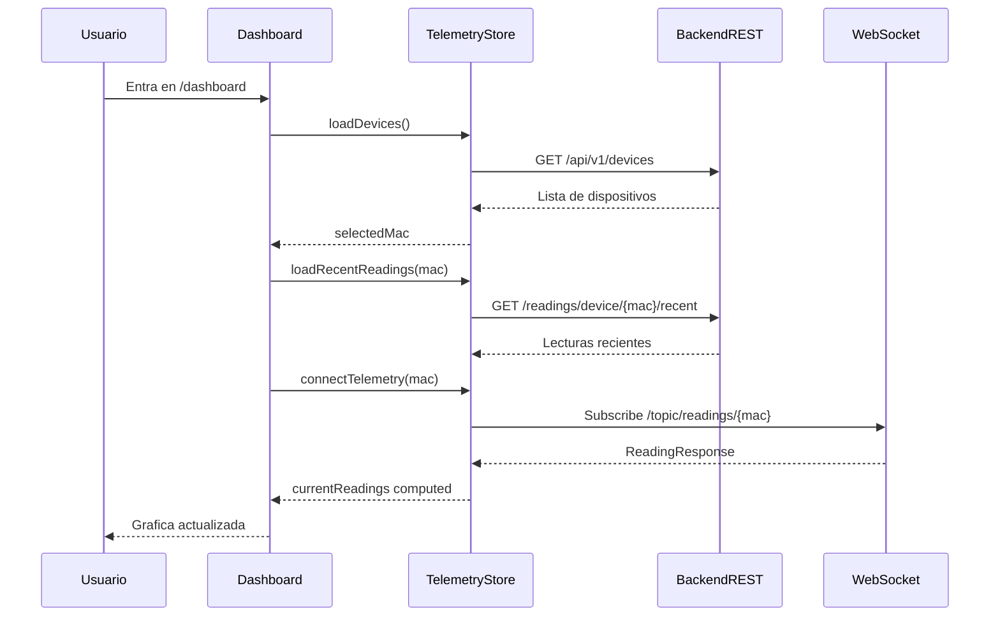

# Anexo B. Frontend Angular, RxJS y NgRx Signals

## 1. Vision general del frontend

El frontend de Wattimizer esta desarrollado con **Angular 21**, componentes standalone y carga diferida mediante `loadComponent`. La aplicacion se centra en cuatro zonas privadas: dashboard, dispositivos, tarifas y alertas.

Directorio principal:

```text
frontend/src/app
```

Tecnologias usadas:

| Tecnologia | Uso real en el proyecto |
| --- | --- |
| Angular standalone | Componentes sin modulos clasicos |
| Angular Router | Rutas publicas y layout protegido |
| Reactive Forms | Login, registro, tarifas y formularios de dispositivos |
| Angular Signals | Estado local de componentes y valores derivados |
| `@ngrx/signals` | Stores globales de telemetria y tarifas |
| RxJS | Flujos HTTP, WebSocket y metodos reactivos del store |
| PrimeNG | Componentes visuales: tablas, botones, selectores, graficas y mensajes |
| Chart.js | Grafica de potencia activa en el dashboard |
| STOMP sobre WebSocket | Lecturas en tiempo real desde el backend |

---

## 2. Rutas y layout

Archivo:

```text
frontend/src/app/app.routes.ts
```

| Ruta | Componente | Proteccion |
| --- | --- | --- |
| `/login` | `LoginComponent` | Publica |
| `/register` | `RegisterComponent` | Publica |
| `/auth/oauth/callback` | `OAuthCallbackComponent` | Publica |
| `/dashboard` | `DashboardComponent` dentro de `MainLayoutComponent` | `authGuard` |
| `/devices` | `DevicesComponent` dentro de `MainLayoutComponent` | `authGuard` |
| `/tariffs` | `TariffComponent` dentro de `MainLayoutComponent` | `authGuard` |
| `/alerts` | `AlertsComponent` dentro de `MainLayoutComponent` | `authGuard` |
| `**` | Redireccion a `/dashboard` | - |

El `authGuard` se encuentra en:

```text
frontend/src/app/guards/auth.guard.ts
```

Su funcion es simple: consulta `SessionStorageService.isLoggedIn()` y redirige a `/login` cuando no hay JWT valido en `sessionStorage`.

---

## 3. Servicios de aplicacion

### 3.1. `AuthService`

Archivo:

```text
frontend/src/app/services/auth.service.ts
```

Responsabilidades:

- Login clasico contra `POST /api/v1/auth/login`.
- Registro contra `POST /api/v1/auth/register`.
- Canje de ticket OAuth contra `POST /api/v1/auth/oauth/exchange`.

El servicio no interpreta permisos; solo transporta DTOs de autenticacion. La persistencia del token se delega a `SessionStorageService`.

### 3.2. `SessionStorageService`

Archivo:

```text
frontend/src/app/services/session-storage.service.ts
```

Responsabilidades:

- Guardar y recuperar JWT.
- Decodificar claims con `jwt-decode`.
- Obtener nombre de usuario.
- Comprobar roles, por ejemplo `ROLE_ADMIN`.
- Cerrar sesion borrando datos locales.

Este servicio es la pieza que conecta seguridad frontend con las rutas protegidas y con la UI de administracion de tarifas.

### 3.3. `TariffService`

Archivo:

```text
frontend/src/app/services/tariff.service.ts
```

Consume dos grupos de endpoints:

| Metodo | Ruta | Uso |
| --- | --- | --- |
| `GET` | `/api/v1/tariffs` | Cargar catalogo maestro |
| `GET` | `/api/v1/tariffs/{id}` | Consultar plantilla |
| `POST` | `/api/v1/tariffs` | Crear tarifa como admin |
| `POST` | `/api/v1/tariffs/{id}` | Editar tarifa como admin |
| `DELETE` | `/api/v1/tariffs/{id}` | Borrar tarifa como admin |
| `GET` | `/api/v1/users/me/tariff` | Cargar tarifa privada |
| `POST` | `/api/v1/users/me/tariff` | Guardar contrato privado |
| `DELETE` | `/api/v1/users/me/tariff` | Desvincular contrato |

### 3.4. `WebsocketService`

Archivo:

```text
frontend/src/app/services/websocket.service.ts
```

Usa `RxStomp` para conectarse al endpoint:

```text
/ws-iot
```

El metodo clave es:

```ts
watchReadings(macAddress: string): Observable<ReadingResponse>
```

Se suscribe a:

```text
/topic/readings/{macAddress}
```

El backend emite JSON y el servicio lo transforma a `ReadingResponse`.

### 3.5. Interceptor HTTP

Archivo:

```text
frontend/src/app/interceptors/http.interceptor.ts
```

Funciones:

- Anade `X-Requested-With: XMLHttpRequest`.
- Anade `Authorization: Bearer <jwt>` a llamadas `/api/v1/*`.
- Excluye login, registro y canje OAuth.
- Si recibe `401`, cierra sesion y redirige a `/login`.

---

## 4. Modelos e interfaces

Los modelos TypeScript estan en:

```text
frontend/src/app/interfaces
```

| Interfaz | Archivo | Uso |
| --- | --- | --- |
| `LoginUser` | `login-user.interface.ts` | Credenciales de acceso |
| `LoginUserJwt` | `login-user-jwt.interface.ts` | JWT recibido del backend |
| `RegisterRequest` | `register-request.interface.ts` | Alta de usuario |
| `JwtPayload` | `jwt-payload.interface.ts` | Claims decodificados del token |
| `Device` | `device.interface.ts` | Medidor fisico o simulado |
| `ClaimDeviceRequest` | `device.interface.ts` | Payload para reclamar MAC |
| `CreateSimulatedDeviceRequest` | `device.interface.ts` | Payload para simuladores |
| `SimulationProfile` | `simulation-profile.interface.ts` | Perfiles de simulacion |
| `ReadingResponse` | `reading-response.interface.ts` | Lectura REST/WebSocket |
| `TelemetryState` | `telemetry-state.interface.ts` | Estado de telemetria |
| `TariffRequest` / `TariffResponse` | `tariff-request.interface.ts` | Tarifas y contratos |
| `EnergyCostResponse` | `energy-cost-response.interface.ts` | Resultado de coste diario |
| `GhostCostResponse` | `ghost-cost-response.interface.ts` | Resultado de consumo fantasma |
| `Alert` | `alert.interface.ts` | Incidencia de sobrepotencia |

El modelo `ReadingsHistory` existe en el repositorio, pero no esta siendo usado por los componentes actuales.

---

## 5. Stores reactivos con `@ngrx/signals`

El proyecto no usa NgRx clasico con reducers, actions y effects. Usa **SignalStore**, que encaja mejor con Angular moderno y reduce bastante el codigo repetitivo para este tamano de aplicacion.

### 5.1. `TelemetryStore`

Archivo:

```text
frontend/src/app/store/telemetry.store.ts
```

Estado principal:

```ts
const initialState: TelemetryState = {
  devices: [],
  selectedMac: null,
  historicalReadings: {},
  isLoadingDevices: false,
};
```

Campos:

| Campo | Significado |
| --- | --- |
| `devices` | Lista de dispositivos del usuario |
| `selectedMac` | MAC del medidor activo en dashboard |
| `historicalReadings` | Historico separado por MAC |
| `isLoadingDevices` | Indicador de carga para inventario |

Computed principal:

```ts
currentReadings: computed(() => {
  const mac = state.selectedMac();
  return mac
    ? (state.historicalReadings()[mac] ?? { timestamps: [], powerW: [] })
    : { timestamps: [], powerW: [] };
})
```

La decision importante aqui es guardar el historico por MAC. Antes de esta separacion, al cambiar de medidor se podia mezclar informacion de varios dispositivos en la misma grafica. Con `historicalReadings[mac]`, cada medidor conserva su ventana de lecturas.

#### Metodos `rxMethod`

| Metodo | Endpoint / flujo | Uso |
| --- | --- | --- |
| `loadDevices` | `GET /api/v1/devices` | Carga inventario y selecciona la primera MAC si no habia seleccion |
| `claimDevice` | `POST /api/v1/devices/claim` | Reclama dispositivo fisico |
| `createSimulatedDevice` | `POST /api/v1/devices/simulated` | Crea simulador individual |
| `addDevice` | `POST /api/v1/devices` | Alta directa, presente pero no usada por la UI principal |
| `updateDevice` | `PUT /api/v1/devices/{id}` | Actualiza dispositivo |
| `deleteDevice` | `DELETE /api/v1/devices/{id}` | Elimina dispositivo y reajusta MAC seleccionada |
| `connectTelemetry` | WebSocket STOMP | Escucha lecturas de la MAC activa |

#### Helpers expuestos

Ademas de los `rxMethod`, el store expone dos funciones sincronas usadas por el dashboard:

| Metodo | Uso |
| --- | --- |
| `setSelectedMac(mac)` | Cambia la MAC activa y dispara la carga de historico reciente |
| `loadRecentReadings(mac)` | Consulta `GET /api/v1/readings/device/{mac}/recent?seconds=120` y rellena `historicalReadings[mac]` |

#### Flujo WebSocket

El flujo mas importante es `connectTelemetry`:

```ts
connectTelemetry: rxMethod<string | null>(
  pipe(
    distinctUntilChanged(),
    switchMap((mac) => {
      if (!mac) return of(null);
      return wsService.watchReadings(mac).pipe(
        filter((r) => (r.powerW as number | null | undefined) != null),
        distinctUntilChanged((prev, curr) => prev.time === curr.time),
        tap({ next: (reading) => { /* actualiza historico */ } }),
      );
    }),
  ),
)
```

La combinacion de operadores tiene una intencion clara:

- `distinctUntilChanged()` evita reconectar si la MAC no cambia.
- `switchMap()` cancela la suscripcion anterior cuando el usuario elige otro medidor.
- `filter()` descarta lecturas incompletas sin potencia.
- `distinctUntilChanged()` por timestamp evita pintar duplicados si llegan mensajes muy parecidos desde dos canales.
- `tap()` actualiza el estado manteniendo solo las ultimas 20 muestras.

### 5.2. `TariffStore`

Archivo:

```text
frontend/src/app/store/tariff.store.ts
```

Estado:

| Campo | Significado |
| --- | --- |
| `catalog` | Plantillas de tarifa disponibles |
| `myTariff` | Contrato privado del usuario |
| `isLoadingCatalog` | Carga de catalogo |
| `isLoadingMyTariff` | Carga de contrato propio |
| `errorMessage` | Error de negocio visible para UI |

Computed:

```ts
hasMyTariff: computed(() => state.myTariff() !== null)
isCatalogEmpty: computed(() => state.catalog().length === 0)
```

Metodos:

| Metodo | Funcion |
| --- | --- |
| `loadCatalog` | Recupera catalogo maestro |
| `loadMyTariff` | Recupera contrato privado |
| `saveMyTariff` | Guarda contrato privado |
| `unlinkMyTariff` | Desvincula tarifa |
| `refreshAfterCatalogMutation` | Recarga catalogo tras mutacion admin |
| `reset` | Limpia estado al cerrar sesion |

---

## 6. Componentes principales

### 6.1. `MainLayoutComponent`

Archivo:

```text
frontend/src/app/components/main-layout/main-layout.component.ts
```

Responsabilidades:

- Mostrar cabecera y navegacion lateral.
- Renderizar las rutas hijas mediante `<router-outlet>`.
- Mostrar el usuario obtenido del JWT.
- Cerrar sesion limpiando telemetria, tarifas y JWT.

En `logout()`, antes de borrar la sesion, se llama a:

```ts
this.telemetryStore.connectTelemetry(null);
this.telemetryStore.reset();
this.tariffStore.reset();
```

Esto evita que un segundo usuario vea datos cacheados del anterior, que seria un fallo funcional y de privacidad.

### 6.2. `LoginComponent`

Archivo:

```text
frontend/src/app/components/login/login.component.ts
```

Logica:

- Formulario reactivo de email y contrasena.
- Validacion basica antes de enviar.
- Llamada a `AuthService.authentication()`.
- Guardado del JWT en `SessionStorageService`.
- Navegacion a `/dashboard`.
- Botones de OAuth2 que redirigen a `/oauth2/authorization/google` o `/oauth2/authorization/github`.

### 6.3. `RegisterComponent`

Archivo:

```text
frontend/src/app/components/register/register.component.ts
```

Incluye un validador propio para comprobar que `password` y `confirmPassword` coinciden. Tras registro correcto, redirige a login.

### 6.4. `OAuthCallbackComponent`

Archivo:

```text
frontend/src/app/components/oauth-callback/oauth-callback.component.ts
```

Flujo:

1. Lee `ticket` de la query string.
2. Llama a `POST /api/v1/auth/oauth/exchange`.
3. Guarda el JWT.
4. Navega a `/dashboard`.

Si no hay ticket o el backend lo rechaza, muestra error. El ticket es de un solo uso y tiene vida corta en el backend.

### 6.5. `DashboardComponent`

Archivo:

```text
frontend/src/app/components/dashboard/dashboard.component.ts
```

Responsabilidades:

- Cargar dispositivos y tarifa privada al entrar.
- Mostrar selector de medidor.
- Conectar telemetria en tiempo real.
- Pintar grafica de potencia activa.
- Calcular gasto diario y consumo fantasma si hay tarifa.

Signals y computed relevantes:

```ts
readonly totalCostEur = signal<number | null>(null);
readonly ghostCostEur = signal<number | null>(null);
readonly isLoadingAnalytics = signal<boolean>(false);
readonly analyticsError = signal<string | null>(null);
readonly powerW = computed(() => this.historicalData().powerW);
readonly formattedTime = computed(() =>
  this.timestamps().map((ts) => new Date(ts).toLocaleTimeString("es-ES", TIME_OPTIONS)),
);
```

Efectos:

- Auto-ocultar errores de analitica.
- Reaccionar a cambios de `selectedMac`.
- Recalcular analiticas cuando el usuario configura tarifa.

La carga de metricas usa dos endpoints:

```text
GET /api/v1/analytics/cost
GET /api/v1/analytics/ghost-consumption
```

### 6.6. `DevicesComponent`

Archivo:

```text
frontend/src/app/components/devices/devices.component.ts
```

Responsabilidades:

- Alta de dispositivo fisico mediante MAC.
- Alta de dispositivo simulado con perfil.
- Creacion de pack demo.
- Edicion de nombre, estado y perfil.
- Borrado.
- Dialogos de detalle y edicion.

Los perfiles se definen en:

```text
frontend/src/app/interfaces/simulation-profile.interface.ts
```

La UI separa dispositivo fisico y simulado. Esto mejora la experiencia porque el usuario no necesita conocer internamente la diferencia entre un Shelly real y un generador de datos de demo.

### 6.7. `TariffComponent`

Archivo:

```text
frontend/src/app/components/tariff/tariff.component.ts
```

Responsabilidades:

- Cargar catalogo.
- Detectar si el usuario es admin.
- Permitir CRUD del catalogo si hay `ROLE_ADMIN`.
- Permitir al usuario clonar o editar su tarifa privada.
- Construir formularios dinamicos segun peaje (`2.0TD`, `3.0TD`, `6.1TD`, `6.2TD`).
- Validar potencias contratadas crecientes.

Hay una separacion funcional importante:

- El **catalogo** es comun y lo administra `ROLE_ADMIN`.
- La **tarifa privada** pertenece al usuario autenticado y se gestiona en `/api/v1/users/me/tariff`.

### 6.8. `AlertsComponent`

Archivo:

```text
frontend/src/app/components/alerts/alerts.component.ts
```

Responsabilidades:

- Cargar alertas del usuario.
- Mostrar mensajes de exito/error con Signals.
- Descartar alertas con `DELETE /api/v1/alerts/{id}`.

Las alertas no usan un store global propio. Para el tamano actual de esta pantalla, el estado local con `signal()` es suficiente y evita complejidad innecesaria.

---

## 7. Flujo de datos del dashboard



---

## 8. Cambios recientes documentados

Los cambios recientes mas relevantes para el frontend son:

- Panel multi-dispositivo: el dashboard carga historico por MAC y no mezcla lecturas.
- Alta de dispositivos simulados con perfiles.
- Boton de pack demo para crear varios simuladores.
- Badges y campos especificos para indicar si un dispositivo es simulado.
- Integracion de metricas economicas en dashboard condicionadas a tener tarifa.

Estas mejoras hacen que la aplicacion sea mas demostrable y mas estable en evaluacion, porque no depende exclusivamente de recibir mensajes de un enchufe fisico en ese momento.

---

## 9. Observaciones tecnicas

- `DeviceService` existe con `httpResource`, pero la UI principal gestiona dispositivos sobre todo mediante `TelemetryStore` y llamadas directas desde `DevicesComponent`.
- No hay NgRx clasico; hablar de reducers o actions seria incorrecto para este proyecto.
- Las operaciones de alertas y analiticas usan estado local en componentes, no stores globales.
- La ventana visible de grafica se limita a 20 puntos para mantener una lectura clara y evitar saturar el canvas.
- El cierre de sesion resetea stores, una medida sencilla pero importante para no compartir datos entre usuarios en el mismo navegador.
