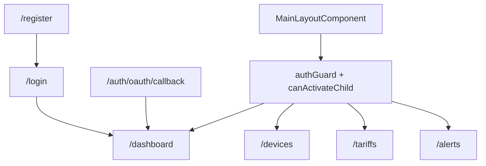
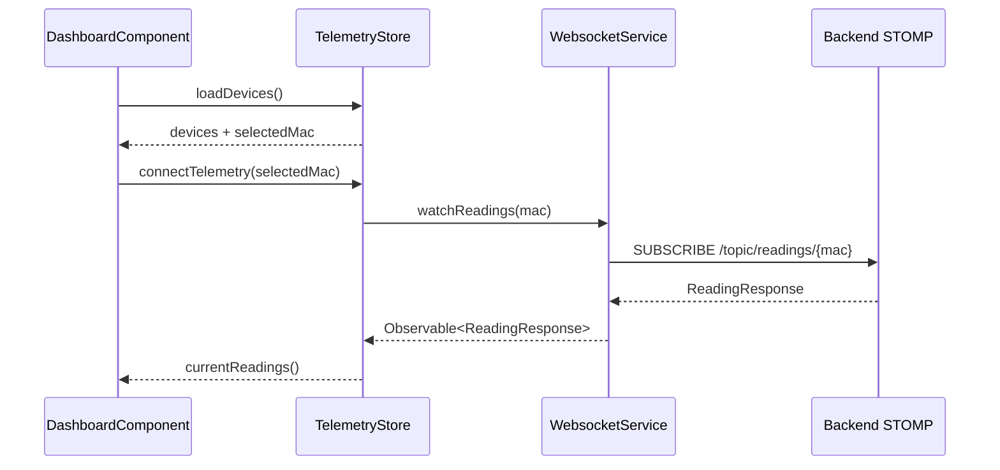

# Anexo B. Frontend Angular: componentes, servicios, RxJS y NgRx Signals

Este anexo documenta el frontend ubicado en `frontend/src/app`. La aplicacion esta construida con Angular 21, componentes standalone, PrimeNG, Tailwind CSS, Chart.js, RxJS y NgRx Signals Store.

## 1. Estructura general

| Archivo | Responsabilidad |
| --- | --- |
| `app.ts` | Componente raiz con `router-outlet`. |
| `app.config.ts` | Configuracion global: router, HTTP client, interceptor, animaciones y tema PrimeNG. |
| `app.routes.ts` | Rutas publicas y privadas con carga diferida. |
| `guards/auth.guard.ts` | Bloquea area privada si no hay JWT valido. |
| `interceptors/http.interceptor.ts` | Anade token Bearer y gestiona `401`. |
| `store/telemetry.store.ts` | Estado global de dispositivos y telemetria en vivo. |
| `store/tariff.store.ts` | Estado global de catalogo de tarifas y tarifa privada. |

## 2. Rutas y navegacion

Las rutas se definen en `frontend/src/app/app.routes.ts`.



| Ruta | Componente | Proteccion | Funcion |
| --- | --- | --- | --- |
| `/login` | `LoginComponent` | Publica | Login local y redireccion OAuth2. |
| `/register` | `RegisterComponent` | Publica | Alta de usuario. |
| `/auth/oauth/callback` | `OAuthCallbackComponent` | Publica | Intercambia ticket OAuth2 por JWT. |
| `/dashboard` | `DashboardComponent` | `authGuard` | Vista principal de telemetria y costes. |
| `/devices` | `DevicesComponent` | `authGuard` | Gestion de dispositivos IoT. |
| `/tariffs` | `TariffComponent` | `authGuard` | Tarifa privada y catalogo admin. |
| `/alerts` | `AlertsComponent` | `authGuard` | Consulta y borrado de alertas. |

El layout privado se carga en la ruta vacia `""` y protege tambien sus hijas con `canActivateChild`. Esto evita que un usuario con token caducado entre escribiendo directamente una URL privada.

## 3. Servicios Angular

### 3.1. `AuthService`

**Archivo:** `services/auth.service.ts`

| Metodo | Endpoint | Entrada | Salida |
| --- | --- | --- | --- |
| `authentication` | `POST /api/v1/auth/login` | `LoginUser` | `LoginUserJwt` |
| `register` | `POST /api/v1/auth/register` | `RegisterRequest` | `void` |
| `exchangeOAuthTicket` | `POST /api/v1/auth/oauth/exchange` | `{ ticket }` | `LoginUserJwt` |

Este servicio no guarda el token por si mismo. Esa responsabilidad queda en `SessionStorageService`, lo que mantiene separada la llamada HTTP de la gestion de sesion.

### 3.2. `SessionStorageService`

**Archivo:** `services/session-storage.service.ts`

Gestiona la clave `auth_token` en `sessionStorage`.

| Metodo | Funcion |
| --- | --- |
| `saveToken(token)` | Guarda el JWT recibido del backend. |
| `getToken()` | Recupera el token para el interceptor. |
| `logout()` | Elimina el token. |
| `isLoggedIn()` | Comprueba existencia y expiracion del JWT. |
| `getAuthorities()` | Extrae roles del claim `authorities`. |
| `hasRole(role)` | Comprueba `ROLE_USER` o `ROLE_ADMIN`. |
| `getUsername()` | Lee el email/username del token. |

El frontend no consulta al backend para saber si el token ha expirado antes de navegar; lo valida localmente con `jwt-decode`.

### 3.3. `TariffService`

**Archivo:** `services/tariff.service.ts`

| Metodo | Endpoint | Uso |
| --- | --- | --- |
| `getCatalog()` | `GET /api/v1/tariffs` | Cargar plantillas del catalogo maestro disponibles para usuarios autenticados. |
| `getById(id)` | `GET /api/v1/tariffs/{id}` | Obtener una tarifa concreta. |
| `createCatalogTariff(payload)` | `POST /api/v1/tariffs` | Alta admin de plantilla. |
| `updateCatalogTariff(id, payload)` | `POST /api/v1/tariffs/{id}` | Edicion admin; el backend usa POST, no PUT. |
| `deleteCatalogTariff(id)` | `DELETE /api/v1/tariffs/{id}` | Borrado admin. |
| `getMyTariff()` | `GET /api/v1/users/me/tariff` | Devuelve `TariffResponse` o `null` si el backend responde `204`. |
| `saveMyTariff(payload)` | `POST /api/v1/users/me/tariff` | Guarda tarifa privada. |
| `unlinkMyTariff()` | `DELETE /api/v1/users/me/tariff` | Desvincula tarifa privada. |

La decision de mapear `204` a `null` en `getMyTariff()` simplifica el componente, porque puede preguntar directamente si hay tarifa.

### 3.4. `WebsocketService`

**Archivo:** `services/websocket.service.ts`

El servicio crea un cliente `RxStomp` y se conecta a `/ws-iot` usando `ws://` o `wss://` segun el protocolo actual del navegador.

| Metodo | Destino STOMP | Salida |
| --- | --- | --- |
| `watchReadings(macAddress)` | `/topic/readings/{macAddress}` | `Observable<ReadingResponse>` |

La reconexion se configura en el cliente STOMP, con `reconnectDelay` y heartbeats. El servicio no decide que MAC escuchar; esa decision se toma en `TelemetryStore`.

### 3.5. `DeviceService`

**Archivo:** `services/device.service.ts`

Existe un servicio preparado con `httpResource`, pero en la implementacion actual no es el camino usado por las vistas principales. La carga real de dispositivos se hace desde `TelemetryStore.loadDevices()` y varias mutaciones desde `DevicesComponent` con `HttpClient` directo.

## 4. Guard e interceptor

### 4.1. `authGuard`

**Archivo:** `guards/auth.guard.ts`

El guard es funcional (`CanActivateFn`). Si `SessionStorageService.isLoggedIn()` devuelve `true`, permite la navegacion. Si no, redirige a `/login`.

```typescript
return isLogged ? true : router.createUrlTree(["/login"]);
```

La decision es simple: el frontend solo necesita saber si existe un JWT no expirado. La autorizacion fina se mantiene en el backend.

### 4.2. `httpInterceptor`

**Archivo:** `interceptors/http.interceptor.ts`

Funciones principales:

1. Anade `X-Requested-With: XMLHttpRequest`.
2. Si la URL contiene `/api/v1` y no es una ruta publica de auth, anade `Authorization: Bearer <jwt>`.
3. Si una respuesta devuelve `401`, limpia la sesion y navega a `/login`.

Rutas excluidas de Bearer:

- `/auth/login`
- `/auth/register`
- `/auth/oauth/exchange`

Esta decision evita repetir codigo de autenticacion en cada servicio.

## 5. Componentes

### 5.1. `LoginComponent`

**Archivos:** `components/login/login.component.ts`, `login.html`, `login.css`

Responsabilidades:

- Formulario reactivo con `username` y `password`.
- Llamada a `AuthService.authentication`.
- Guardado de JWT mediante `SessionStorageService.saveToken`.
- Navegacion a `/dashboard`.
- Login social con `window.location.href = /oauth2/authorization/{provider}`.
- Signals `isLoading` y `loginError` para feedback visual.

### 5.2. `RegisterComponent`

**Archivos:** `components/register/register.component.ts`, `register.html`, `register.css`

Incluye un validador de grupo para comprobar que `password` y `confirmPassword` coinciden. Si el registro termina correctamente, navega a `/login`.

### 5.3. `OAuthCallbackComponent`

**Archivo:** `components/oauth-callback/oauth-callback.component.ts`

Lee el query param `ticket`. Si existe, lo envia a `AuthService.exchangeOAuthTicket`, guarda el JWT y redirige a `/dashboard`. Si no existe, muestra error. Esta pantalla actua como puente entre Spring Security OAuth2 y la SPA.

### 5.4. `MainLayoutComponent`

**Archivos:** `components/main-layout/main-layout.component.ts`, `main-layout.html`

Contiene cabecera, sidebar y `router-outlet` de las vistas privadas. En logout hace limpieza activa:

1. `TelemetryStore.connectTelemetry(null)` para cortar la suscripcion.
2. `TelemetryStore.reset()` y `TariffStore.reset()` para evitar datos cacheados entre usuarios.
3. `SessionStorageService.logout()`.
4. Navegacion a `/login`.

### 5.5. `DashboardComponent`

**Archivos:** `components/dashboard/dashboard.component.ts`, `dashboard.html`, `dashboard.css`

Responsabilidades:

- Cargar dispositivos con `TelemetryStore.loadDevices()`.
- Cargar tarifa privada con `TariffStore.loadMyTariff()`.
- Conectar telemetria del dispositivo seleccionado.
- Pintar grafica de potencia con Chart.js a traves de PrimeNG.
- Consultar `GET /api/v1/analytics/cost`.
- Consultar `GET /api/v1/analytics/ghost-consumption`.

Signals y computed relevantes:

| Signal/computed | Uso |
| --- | --- |
| `totalCostEur` | Coste total del intervalo consultado. |
| `ghostCostEur` | Coste asociado al consumo nocturno. |
| `analyticsError` | Mensaje de error con auto-limpieza. |
| `powerW` | Serie de potencia desde `TelemetryStore.currentReadings`. |
| `formattedTime` | Etiquetas horarias de la grafica. |
| `chartData` | Objeto que consume el componente de Chart.js. |

### 5.6. `DevicesComponent`

**Archivos:** `components/devices/devices.component.ts`, `devices.html`, `devices.css`

Permite reclamar dispositivos, editar nombre/estado y borrar. Aunque `TelemetryStore` contiene metodos CRUD, este componente usa `HttpClient` directo para varias mutaciones y despues recarga dispositivos. Es una decision funcional valida, pero conviene dejarla documentada porque no todo el CRUD pasa por el store.

### 5.7. `TariffComponent`

**Archivos:** `components/tariff/tariff.component.ts`, `tariff.html`

Gestiona dos niveles:

- **Tarifa privada del usuario:** todos los usuarios autenticados pueden asignar plantilla, editar precios/potencias o desvincular.
- **Catalogo maestro:** las plantillas se pueden leer/asignar por usuarios autenticados; crear, editar y borrar plantillas es lo que queda reservado a `ROLE_ADMIN`, comprobado con `SessionStorageService.hasRole("ROLE_ADMIN")`.

Usa formularios reactivos con `FormArray` para periodos y potencias. El validador `ascendingPowerValidator` fuerza que las potencias contratadas no bajen al avanzar por periodos.

### 5.8. `AlertsComponent`

**Archivos:** `components/alerts/alerts.component.ts`, `alerts.html`, `alerts.css`

Lista alertas con `GET /api/v1/alerts` y permite descartarlas con `DELETE /api/v1/alerts/{id}`. Usa signals locales para lista, carga, mensaje de exito y mensaje de error.

## 6. NgRx Signals Store

### 6.1. `TelemetryStore`

**Archivo:** `store/telemetry.store.ts`

Estado:

```typescript
{
  devices: [],
  selectedMac: null,
  historicalReadings: {},
  isLoadingDevices: false
}
```

Computed:

| Computed | Descripcion |
| --- | --- |
| `currentReadings` | Devuelve las lecturas historicas de la MAC seleccionada o arrays vacios. |

Metodos sincronicos:

| Metodo | Funcion |
| --- | --- |
| `setSelectedMac(mac)` | Cambia el medidor activo. |
| `reset()` | Vuelve al estado inicial en logout. |

Metodos `rxMethod`:

| Metodo | Operadores principales | Efecto |
| --- | --- | --- |
| `loadDevices` | `tap`, `switchMap` | Carga dispositivos y selecciona primera MAC. |
| `claimDevice` | `switchMap`, `tap` | Reclama MAC y anade dispositivo al estado. |
| `addDevice` | `switchMap`, `tap` | Crea dispositivo y actualiza lista. |
| `updateDevice` | `switchMap`, `tap` | Sustituye dispositivo actualizado en la lista. |
| `deleteDevice` | `switchMap`, `tap` | Elimina dispositivo y reajusta `selectedMac`. |
| `connectTelemetry` | `distinctUntilChanged`, `switchMap`, `filter`, `tap` | Mantiene suscripcion STOMP por MAC. |

Flujo de telemetria:



Detalles importantes:

- `switchMap` cancela la suscripcion anterior si cambia la MAC.
- `filter` descarta lecturas sin `powerW`.
- `distinctUntilChanged` deduplica por timestamp exacto.
- Solo se conservan 20 lecturas por MAC para no hacer crecer el estado indefinidamente.

### 6.2. `TariffStore`

**Archivo:** `store/tariff.store.ts`

Estado:

```typescript
{
  catalog: [],
  myTariff: null,
  isLoadingCatalog: false,
  isLoadingMyTariff: false,
  errorMessage: null
}
```

Computed:

| Computed | Descripcion |
| --- | --- |
| `hasMyTariff` | `true` si el usuario tiene tarifa privada. |
| `isCatalogEmpty` | `true` si no hay plantillas cargadas. |

Metodos `rxMethod`:

| Metodo | Servicio usado | Resultado |
| --- | --- | --- |
| `loadCatalog` | `TariffService.getCatalog` | Carga plantillas. |
| `loadMyTariff` | `TariffService.getMyTariff` | Carga tarifa privada o `null`. |
| `saveMyTariff` | `TariffService.saveMyTariff` | Guarda y actualiza `myTariff`. |
| `unlinkMyTariff` | `TariffService.unlinkMyTariff` | Pone `myTariff` a `null`. |
| `refreshAfterCatalogMutation` | `TariffService.getCatalog` | Recarga catalogo; definido aunque la UI usa helpers sincronicos. |

Helpers sincronicos:

- `setCatalogTariff`
- `addToCatalog`
- `removeFromCatalog`
- `patchMyTariff`
- `clearError`
- `reset`

## 7. Uso de RxJS

| Ubicacion | Operadores | Motivo |
| --- | --- | --- |
| `TelemetryStore.loadDevices` | `tap`, `switchMap` | Encadenar carga HTTP y actualizacion de estado. |
| `TelemetryStore.connectTelemetry` | `distinctUntilChanged`, `switchMap`, `filter`, `tap` | Cambiar de stream STOMP segun MAC. |
| `TariffStore` | `switchMap`, `tap`, `catchError`, `EMPTY` | Apagar flujos con error y guardar mensaje en estado. |
| `TariffService.getMyTariff` | `map`, `catchError`, `EMPTY` | Convertir `204` en `null`. |
| `WebsocketService.watchReadings` | `map` | Parsear JSON STOMP a `ReadingResponse`. |
| `httpInterceptor` | `catchError`, `throwError` | Gestion centralizada de `401`. |

La logica reactiva mas relevante esta en el store de telemetria: la seleccion de MAC controla que stream WebSocket esta vivo. Asi se evita que el dashboard siga recibiendo datos de un dispositivo que ya no esta seleccionado.

## 8. Interfaces de datos

| Archivo | Modelo |
| --- | --- |
| `device.interface.ts` | `Device` con `id`, `username`, `name`, `macAddress`, `isOn`, `simulated`. |
| `reading-response.interface.ts` | Lectura en tiempo real: `time`, `macAddress`, `powerW`, `energyTotalKwh`, `isOn`. |
| `telemetry-state.interface.ts` | Estado interno de `TelemetryStore`. |
| `login-user.interface.ts` | Credenciales de login. |
| `login-user-jwt.interface.ts` | JWT devuelto por backend. |
| `register-request.interface.ts` | Datos de registro. |
| `jwt-payload.interface.ts` | Claims usados por sesion: `exp`, `username`, `authorities`. |
| `tariff-request.interface.ts` | Contratos, periodos, potencias y request de tarifa privada. |
| `energy-cost-response.interface.ts` | Respuesta de `/analytics/cost`. |
| `ghost-cost-response.interface.ts` | Respuesta de `/analytics/ghost-consumption`. |
| `alert.interface.ts` | Alertas del usuario. |

## 9. Decisiones y puntos de mejora

| Decision actual | Motivo | Mejora posible |
| --- | --- | --- |
| Estado global con NgRx Signals, no NgRx clasico. | El estado compartido es pequeno y no requiere reducers/actions tradicionales. | Mantener esta opcion mientras no crezca mucho la app. |
| WebSocket conectado desde store segun MAC. | Permite que la vista solo consuma signals y no gestione STOMP directamente. | Anadir manejo visual de estado desconectado/reconectando. |
| `DevicesComponent` usa `HttpClient` directo para mutaciones. | Solucion rapida y explicita en la vista. | Mover todas las mutaciones a `TelemetryStore` para unificar estado. |
| Sin guard frontend de `ROLE_ADMIN`. | El backend ya bloquea acciones admin. | Anadir guard o directiva si crece el area admin. |
| Subscriptions HTTP manuales en componentes. | Peticiones de una sola emision normalmente completan solas. | Usar `takeUntilDestroyed` en flujos no one-shot, si aparecen. |
