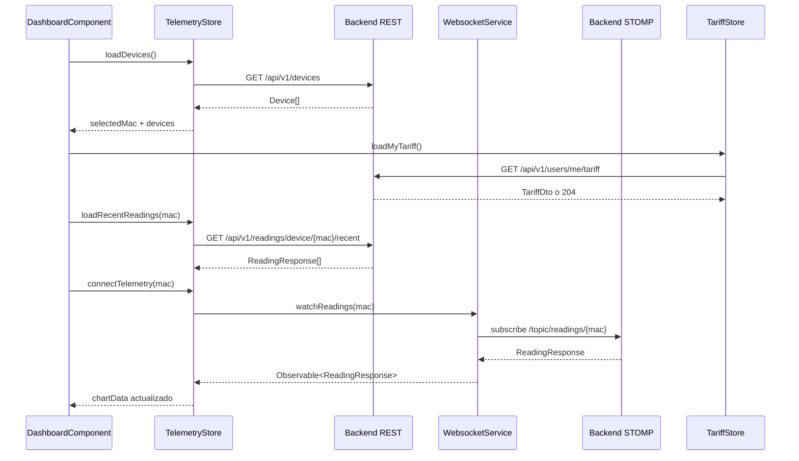

# Anexo B - Frontend Angular, RxJS y NgRx Signals

## 1. Alcance del anexo

Este anexo documenta el frontend Angular ubicado en `frontend/src/app`. La aplicación está construida con Angular standalone, PrimeNG, Tailwind CSS, RxJS y `@ngrx/signals`.

La estructura principal es:

| Carpeta | Contenido |
| --- | --- |
| `components/` | Vistas de login, registro, dashboard, dispositivos, tarifas, alertas y layout |
| `services/` | Acceso a API REST, sesión y WebSocket |
| `store/` | Stores globales reactivos con NgRx Signals |
| `interfaces/` | Contratos TypeScript usados por HTTP y UI |
| `guards/` | Protección de rutas privadas |
| `interceptors/` | Inyección de JWT y gestión global de `401` |

## 2. Configuración general

El arranque se hace en `frontend/src/main.ts` mediante:

```typescript
bootstrapApplication(App, appConfig);
```

`app.config.ts` registra:

- `provideRouter(routes)` para navegación.
- `provideHttpClient(withInterceptors([httpInterceptor]))` para HTTP.
- `provideAnimationsAsync()` para PrimeNG.
- `providePrimeNG(...)` con un preset visual propio basado en Aura.

El componente raíz (`app.ts`) solo contiene el `router-outlet`. Esta decisión mantiene la lógica de negocio dentro de componentes específicos y evita convertir el componente raíz en un contenedor con responsabilidades mezcladas.

## 3. Rutas y guard de autenticación

**Archivo:** `app.routes.ts`

| Ruta | Componente | Acceso |
| --- | --- | --- |
| `/login` | `LoginComponent` | Público |
| `/register` | `RegisterComponent` | Público |
| `/auth/oauth/callback` | `OAuthCallbackComponent` | Público |
| `/dashboard` | `DashboardComponent` dentro de `MainLayoutComponent` | Protegido |
| `/devices` | `DevicesComponent` dentro de `MainLayoutComponent` | Protegido |
| `/tariffs` | `TariffComponent` dentro de `MainLayoutComponent` | Protegido |
| `/alerts` | `AlertsComponent` dentro de `MainLayoutComponent` | Protegido |

El `authGuard` usa `SessionStorageService.isLoggedIn()`. Si el token no existe o está caducado, devuelve un `UrlTree` hacia `/login`. También se aplica como `canActivateChild`, por lo que no solo protege la entrada al layout, sino cada navegación interna.

## 4. Autenticación y sesión

### 4.1. Servicio de autenticación

**Archivo:** `services/auth.service.ts`

| Método | Endpoint | Entrada | Respuesta |
| --- | --- | --- | --- |
| `authentication` | `POST /api/v1/auth/login` | `LoginUser` | `LoginUserJwt` |
| `register` | `POST /api/v1/auth/register` | `RegisterRequest` | `void` |
| `exchangeOAuthTicket` | `POST /api/v1/auth/oauth/exchange` | `{ ticket }` | `LoginUserJwt` |

### 4.2. Gestión del JWT

**Archivo:** `services/session-storage.service.ts`

El token se guarda en `sessionStorage` con la clave `auth_token`. El servicio también decodifica el JWT para obtener:

- fecha de expiración (`exp`);
- nombre de usuario;
- roles (`authorities`).

Se usa `sessionStorage` en lugar de `localStorage` para que la sesión no quede persistida indefinidamente si el usuario cierra el navegador.

### 4.3. Interceptor HTTP

**Archivo:** `interceptors/http.interceptor.ts`

El interceptor añade:

```http
X-Requested-With: XMLHttpRequest
Authorization: Bearer <token>
```

La cabecera `Authorization` solo se añade a rutas `/api/v1` que no sean login, registro ni canje OAuth. Si el backend responde `401`, se limpia la sesión y se navega a `/login`.

## 5. Stores reactivos

El frontend usa `@ngrx/signals` para estado global. No se usa NgRx clásico con reducers/actions, sino `signalStore`, que encaja mejor con Angular moderno y reduce código repetitivo.

### 5.1. `TelemetryStore`

**Archivo:** `store/telemetry.store.ts`

Estado:

```typescript
{
  devices: Device[];
  selectedMac: string | null;
  historicalReadings: {
    [mac: string]: {
      timestamps: string[];
      powerW: number[];
    };
  };
  isLoadingDevices: boolean;
}
```

Computed principal:

| Computed | Función |
| --- | --- |
| `currentReadings` | Devuelve el histórico del dispositivo seleccionado o arrays vacíos |

Métodos reactivos:

| Método | Tipo | Lógica |
| --- | --- | --- |
| `loadDevices` | `rxMethod<void>` | Carga `/api/v1/devices`, marca loading y selecciona la primera MAC si no había selección |
| `claimDevice` | `rxMethod<ClaimDeviceRequest>` | Llama a `/api/v1/devices/claim` y añade el dispositivo al estado |
| `createSimulatedDevice` | `rxMethod<CreateSimulatedDeviceRequest>` | Crea simulador y actualiza lista |
| `addDevice` | `rxMethod<{ name; macAddress }>` | Alta directa contra `/api/v1/devices` |
| `updateDevice` | `rxMethod<Device>` | Actualiza nombre, estado o perfil |
| `deleteDevice` | `rxMethod<number>` | Borra el dispositivo y recalcula la MAC seleccionada |
| `connectTelemetry` | `rxMethod<string \| null>` | Abre la suscripción WebSocket de la MAC seleccionada |

Patrón RxJS más importante:

```typescript
connectTelemetry: rxMethod<string | null>(
  pipe(
    distinctUntilChanged(),
    switchMap((mac) => {
      if (!mac) return of(null);
      return wsService.watchReadings(mac).pipe(
        filter((r) => (r.powerW as number | null | undefined) != null),
        distinctUntilChanged((prev, curr) => prev.time === curr.time),
        tap({ next: (reading) => { /* actualiza buffer */ } }),
      );
    }),
  ),
);
```

La intención es clara: cuando cambia la MAC seleccionada, `switchMap` cancela la suscripción anterior y abre otra. Además, se descartan lecturas sin potencia y se deduplican timestamps repetidos.

El buffer de gráfica mantiene solo 20 puntos. No se guarda todo el histórico en memoria porque eso haría crecer el estado del navegador sin necesidad.

### 5.2. `TariffStore`

**Archivo:** `store/tariff.store.ts`

Estado:

```typescript
{
  catalog: TariffResponse[];
  myTariff: TariffResponse | null;
  isLoadingCatalog: boolean;
  isLoadingMyTariff: boolean;
  errorMessage: string | null;
}
```

Computed:

| Computed | Función |
| --- | --- |
| `hasMyTariff` | Indica si el usuario tiene tarifa privada |
| `isCatalogEmpty` | Detecta catálogo vacío |

Métodos:

| Método | Lógica |
| --- | --- |
| `loadCatalog` | Carga el catálogo maestro de tarifas |
| `loadMyTariff` | Obtiene la tarifa privada; si backend devuelve `204`, el servicio la transforma a `null` |
| `saveMyTariff` | Crea o actualiza la tarifa privada |
| `unlinkMyTariff` | Desvincula la tarifa privada |
| `refreshAfterCatalogMutation` | Recarga catálogo tras una mutación admin |
| `reset` | Limpia el store al cerrar sesión |

Los errores se guardan en `errorMessage` y se corta el observable con `catchError(() => EMPTY)`. Así el stream no queda roto y el usuario puede reintentar la acción.

## 6. Servicio WebSocket

**Archivo:** `services/websocket.service.ts`

El frontend usa `RxStomp` sobre `/ws-iot`:

```typescript
const protocol = window.location.protocol === "https:" ? "wss:" : "ws:";
const wsUrl = `${protocol}//${window.location.host}/ws-iot`;
```

Configuración:

| Opción | Valor |
| --- | --- |
| `heartbeatOutgoing` | `20000` ms |
| `reconnectDelay` | `5000` ms |
| Destino de lecturas | `/topic/readings/{macAddress}` |

La función principal es:

```typescript
watchReadings(macAddress: string): Observable<ReadingResponse> {
  return this.rxStomp
    .watch(`/topic/readings/${macAddress}`)
    .pipe(map((message) => JSON.parse(message.body) as ReadingResponse));
}
```

El servicio se activa en el constructor y queda disponible a nivel global. La selección concreta de qué dispositivo escuchar la gestiona `TelemetryStore`.

## 7. Componentes principales

### 7.1. `MainLayoutComponent`

Muestra navegación lateral, marca del proyecto y usuario actual. En `logout()` limpia:

1. Suscripción de telemetría con `connectTelemetry(null)`.
2. `TelemetryStore`.
3. `TariffStore`.
4. JWT de `sessionStorage`.
5. Navegación a `/login`.

Esta limpieza evita que un segundo usuario vea datos cacheados del anterior si se usa el mismo navegador.

### 7.2. `DashboardComponent`

**Archivo:** `components/dashboard/dashboard.component.ts`

Responsabilidades:

- Cargar dispositivos.
- Cargar tarifa privada.
- Seleccionar la MAC activa.
- Pintar gráfica de potencia con Chart.js/PrimeNG.
- Calcular coste diario y consumo fantasma.

Signals relevantes:

| Signal/computed | Uso |
| --- | --- |
| `totalCostEur` | Coste acumulado del día |
| `ghostCostEur` | Coste de consumo nocturno |
| `isLoadingAnalytics` | Estado de carga de widgets económicos |
| `analyticsError` | Error temporal mostrado en UI |
| `chartData` | Dataset reactivo para la gráfica |

Efectos:

- Auto-ocultar errores de analítica tras 8 segundos.
- Al cambiar `selectedMac`, cargar histórico, conectar WebSocket y pedir métricas si hay tarifa.
- Al cambiar `hasMyTariff`, limpiar o recargar métricas.

La llamada de analíticas usa el inicio del día local y la hora actual:

```typescript
const params = new HttpParams()
  .set("macAddress", macAddress)
  .set("start", startOfToday.toISOString())
  .set("end", now.toISOString());
```

### 7.3. `DevicesComponent`

**Archivo:** `components/devices/devices.component.ts`

Permite gestionar dispositivos físicos y simulados. Tiene dos formularios reactivos:

- `deviceForm`: alta física o simulada.
- `editDeviceForm`: edición de nombre y perfil simulado.

Validación destacada:

```typescript
private readonly macRegex = /^[0-9A-Fa-f]{12}$/;
```

Cuando el usuario elige dispositivo simulado, se desactiva el campo MAC porque el backend genera una MAC artificial `SIM...`. Cuando elige físico, se exige MAC real de 12 caracteres hexadecimales.

Endpoints usados directamente:

| Acción | Endpoint |
| --- | --- |
| Vincular físico | `POST /api/v1/devices/claim` |
| Crear simulado | `POST /api/v1/devices/simulated` |
| Crear pack demo | `POST /api/v1/devices/simulated/demo-pack` |
| Editar | `PUT /api/v1/devices/{id}` |
| Borrar | `DELETE /api/v1/devices/{id}` |

Después de cada mutación se llama a `store.loadDevices()` para refrescar el inventario desde el backend.

### 7.4. `TariffComponent`

**Archivo:** `components/tariff/tariff.component.ts`

Gestiona dos casos:

- Usuario normal: asignar, editar o desvincular su tarifa privada.
- Administrador: mantener el catálogo maestro.

La condición de rol se calcula con:

```typescript
readonly isAdmin = computed(() => this.sessionService.hasRole("ROLE_ADMIN"));
```

El formulario construye arrays dinámicos de periodos de energía y potencias contratadas. También aplica un validador propio para asegurar que las potencias se mantienen ordenadas de P1 a P6. Esto refleja la restricción regulatoria que también se valida en backend.

### 7.5. `AlertsComponent`

**Archivo:** `components/alerts/alerts.component.ts`

Carga alertas con `GET /api/v1/alerts` y permite descartarlas con `DELETE /api/v1/alerts/{id}`. Usa signals locales para:

- lista de alertas;
- estado de carga;
- mensajes de éxito/error.

### 7.6. Login, registro y OAuth callback

| Componente | Flujo |
| --- | --- |
| `LoginComponent` | Envía credenciales a `AuthService.authentication`, guarda JWT y navega al dashboard |
| `RegisterComponent` | Valida confirmación de contraseña y llama a `AuthService.register` |
| `OAuthCallbackComponent` | Lee `ticket` de la URL, lo canjea por JWT y entra al dashboard |

## 8. Interfaces TypeScript principales

| Interfaz | Campos destacados | Uso |
| --- | --- | --- |
| `Device` | `id`, `username`, `name`, `macAddress`, `isOn`, `simulated`, `simulationProfile` | Inventario y stores |
| `ReadingResponse` | `time`, `macAddress`, `powerW`, `energyTotalKwh`, `isOn` | Gráfica y WebSocket |
| `TariffResponse` | `id`, `name`, `market`, `accessTariffCode`, `geographicZone`, `periods`, `contractedPowers` | Catálogo y contrato |
| `UserTariffRequest` | `templateTariffId`, `contract` | Guardado de tarifa privada |
| `EnergyCostResponse` | `macAddress`, `totalCostEur`, `start`, `end` | Widget de coste |
| `GhostCostResponse` | `macAddress`, `ghostCostEur`, `start`, `end` | Widget de consumo fantasma |
| `Alert` | `id`, `macAddress`, `username`, `type`, `message`, `createdAt` | Pantalla de alertas |

## 9. Flujo de datos del dashboard



## 10. Decisiones técnicas destacables

- **Standalone components:** reducen módulos innecesarios y hacen más claro qué importa cada pantalla.
- **Stores con Signals:** estado global simple, legible y compatible con `computed`.
- **`rxMethod`:** une Signals con Observables sin convertir todo el estado a RxJS clásico.
- **`switchMap` en telemetría:** evita escuchar varias MAC a la vez cuando cambia la selección.
- **Buffer limitado a 20 puntos:** mantiene la gráfica fluida y evita crecimiento de memoria.
- **REST + WebSocket:** REST da estado inicial; STOMP actualiza en tiempo real.
- **Reset al logout:** medida sencilla para no filtrar datos entre sesiones del mismo navegador.
