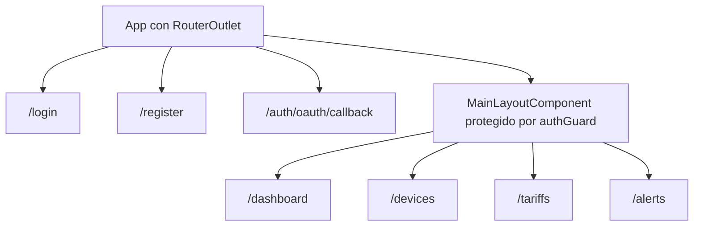
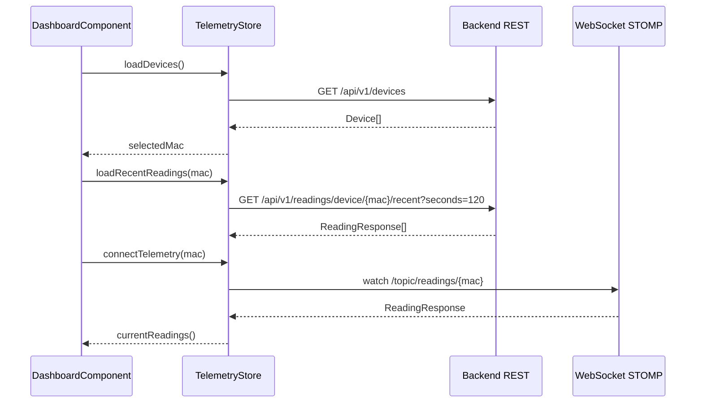

# Anexo B. Frontend Angular, RxJS y NgRx Signals

## 1. Estructura general

El frontend está en `frontend/src/app` y usa Angular 21 con componentes
standalone. No existe un módulo raíz tradicional con `NgModule`; la aplicación
se configura desde `app.config.ts` con `provideRouter` y `provideHttpClient`.

Rutas principales:



El layout privado usa `canActivate` y `canActivateChild`, de modo que se valida
la sesión al entrar y también al navegar entre páginas internas. Si el token no
existe o está caducado, el guard redirige a `/login`.

## 2. Servicios Angular

### 2.1. `AuthService`

`AuthService` encapsula las llamadas de autenticación:

| Método | Endpoint | Uso |
| --- | --- | --- |
| `authentication(user)` | `POST /api/v1/auth/login` | Login clásico con email y contraseña. |
| `register(user)` | `POST /api/v1/auth/register` | Alta de usuario normal. |
| `exchangeOAuthTicket(ticket)` | `POST /api/v1/auth/oauth/exchange` | Canjea el ticket OAuth2 por JWT. |

El login social no se hace con una llamada XHR, sino redirigiendo el navegador a
`/oauth2/authorization/google` o `/oauth2/authorization/github`.

### 2.2. `SessionStorageService`

Gestiona el token JWT en `sessionStorage` con la clave `auth_token`.

Funciones relevantes:

- `saveToken(token)`: sustituye el token anterior por el nuevo.
- `getToken()`: devuelve el JWT o `null`.
- `logout()`: borra solo `auth_token`, sin limpiar todo el storage.
- `isLoggedIn()`: decodifica `exp` con `jwt-decode` y comprueba si sigue
  vigente.
- `getAuthorities()`: separa el claim `authorities`, que el backend envía como
  CSV.
- `hasRole("ROLE_ADMIN" | "ROLE_USER")`: comprueba roles exactos.
- `getUsername()`: lee el claim `username`.

### 2.3. `TariffService`

Trabaja con dos recursos REST:

```text
/api/v1/tariffs
/api/v1/users/me/tariff
```

| Método | Endpoint | Comentario |
| --- | --- | --- |
| `getCatalog()` | `GET /api/v1/tariffs` | Catálogo maestro. |
| `getById(id)` | `GET /api/v1/tariffs/{id}` | Consulta individual. |
| `createCatalogTariff(payload)` | `POST /api/v1/tariffs` | Solo administrador. |
| `updateCatalogTariff(id, payload)` | `POST /api/v1/tariffs/{id}` | El backend actualiza con POST, no con PUT. |
| `deleteCatalogTariff(id)` | `DELETE /api/v1/tariffs/{id}` | Solo administrador. |
| `getMyTariff()` | `GET /api/v1/users/me/tariff` | Convierte HTTP 204 o body nulo en `null`. |
| `saveMyTariff(payload)` | `POST /api/v1/users/me/tariff` | Guarda contrato privado. |
| `unlinkMyTariff()` | `DELETE /api/v1/users/me/tariff` | Desvincula tarifa del usuario. |

### 2.4. `WebsocketService`

`WebsocketService` crea un cliente `RxStomp` al instanciarse. La URL se calcula
según el protocolo de la página:

```typescript
const protocol = window.location.protocol === "https:" ? "wss:" : "ws:";
const wsUrl = `${protocol}//${window.location.host}/ws-iot`;
```

La suscripción por dispositivo se expone como:

```typescript
watchReadings(macAddress: string): Observable<ReadingResponse>
```

Internamente escucha:

```text
/topic/readings/{macAddress}
```

## 3. Interceptor y guard de seguridad

El interceptor HTTP añade dos elementos:

1. Header `X-Requested-With: XMLHttpRequest`.
2. Header `Authorization: Bearer <token>` en rutas `/api/v1/**`, excepto login,
   registro y canje OAuth.

Cuando recibe un 401, borra la sesión y navega a `/login`. Esta decisión evita
que la SPA siga mostrando datos cacheados si el token caduca.

El `authGuard` es una función `CanActivateFn`. Si
`SessionStorageService.isLoggedIn()` devuelve `true`, permite la navegación; si
no, devuelve un `UrlTree` hacia `/login`.

## 4. Estado global con NgRx Signals

El proyecto usa `@ngrx/signals`, no NgRx clásico con actions, reducers y
effects. Hay dos stores globales: `TelemetryStore` y `TariffStore`.

### 4.1. `TelemetryStore`

Estado:

| Campo | Tipo | Descripción |
| --- | --- | --- |
| `devices` | `Device[]` | Dispositivos del usuario. |
| `selectedMac` | `string | null` | MAC activa en dashboard. |
| `historicalReadings` | `Record<string, { timestamps: string[]; powerW: number[] }>` | Historial por MAC. |
| `isLoadingDevices` | `boolean` | Carga de dispositivos. |

Computed principal:

```typescript
currentReadings: computed(() => {
  const mac = state.selectedMac();
  return mac
    ? (state.historicalReadings()[mac] ?? { timestamps: [], powerW: [] })
    : { timestamps: [], powerW: [] };
})
```

La store tiene dos tipos de operaciones:

- Métodos síncronos como `setSelectedMac`, `loadRecentReadings` y `reset`.
- Métodos `rxMethod` para flujos HTTP y WebSocket.

Flujos `rxMethod`:

| Método | Pipeline | Efecto |
| --- | --- | --- |
| `loadDevices` | `tap` activa loading, `switchMap` a `GET /api/v1/devices`, `tap` guarda lista | Carga dispositivos y selecciona la primera MAC si no había una. |
| `claimDevice` | `switchMap` a `POST /api/v1/devices/claim` | Añade el dispositivo reclamado. |
| `createSimulatedDevice` | `switchMap` a `POST /api/v1/devices/simulated` | Añade simulador creado. |
| `addDevice` | `switchMap` a `POST /api/v1/devices` | Alta directa de dispositivo. |
| `updateDevice` | `switchMap` a `PUT /api/v1/devices/{id}` | Sustituye el dispositivo en la lista. |
| `deleteDevice` | `switchMap` a `DELETE /api/v1/devices/{id}` | Elimina de la lista y reajusta `selectedMac`. |
| `connectTelemetry` | `distinctUntilChanged`, `switchMap` al WebSocket, `filter`, `distinctUntilChanged`, `tap` | Alimenta el historial de la MAC con límite de 20 puntos. |

Flujo real en el dashboard:



El historial se limita a 20 puntos tanto al cargar datos recientes como al
recibir datos por WebSocket. Así la gráfica se mantiene ligera y no crece sin
control durante una sesión larga.

### 4.2. `TariffStore`

Estado:

| Campo | Tipo | Descripción |
| --- | --- | --- |
| `catalog` | `TariffResponse[]` | Tarifas maestras. |
| `myTariff` | `TariffResponse | null` | Contrato del usuario autenticado. |
| `isLoadingCatalog` | `boolean` | Carga de catálogo. |
| `isLoadingMyTariff` | `boolean` | Carga de contrato privado. |
| `errorMessage` | `string | null` | Error visible para la UI. |

Computed:

- `hasMyTariff`: indica si el usuario ya tiene tarifa.
- `isCatalogEmpty`: permite mostrar estados vacíos.

Flujos `rxMethod`:

| Método | Servicio usado | Resultado |
| --- | --- | --- |
| `loadCatalog` | `TariffService.getCatalog()` | Rellena `catalog`. |
| `loadMyTariff` | `TariffService.getMyTariff()` | Rellena `myTariff` o `null`. |
| `saveMyTariff` | `TariffService.saveMyTariff()` | Guarda y actualiza `myTariff`. |
| `unlinkMyTariff` | `TariffService.unlinkMyTariff()` | Deja `myTariff` a `null`. |
| `refreshAfterCatalogMutation` | `TariffService.getCatalog()` | Recarga catálogo, aunque el componente actual usa helpers síncronos. |

También expone helpers como `setCatalogTariff`, `addToCatalog`,
`removeFromCatalog`, `patchMyTariff`, `clearError` y `reset`.

## 5. Componentes principales

### 5.1. `LoginComponent`

Usa formulario reactivo con email y password. Al enviar:

1. Llama a `AuthService.authentication`.
2. Guarda el JWT con `SessionStorageService.saveToken`.
3. Navega a `/dashboard`.

Para OAuth2 cambia `window.location.href` hacia el endpoint social del backend.

### 5.2. `RegisterComponent`

Usa un formulario reactivo con validador de grupo para comprobar que password y
confirmación coinciden. Envía un `RegisterRequest` al backend y, si todo va
bien, redirige al login.

### 5.3. `OAuthCallbackComponent`

Lee el query param `ticket`, llama a `exchangeOAuthTicket` y guarda el JWT. Este
diseño evita dejar el token definitivo directamente en la URL de callback.

### 5.4. `MainLayoutComponent`

Contiene la navegación privada. Al hacer logout:

```text
connectTelemetry(null)
reset TelemetryStore
reset TariffStore
sessionStorage.logout()
navigate /login
```

El reinicio de stores evita que un segundo usuario vea datos cacheados del
usuario anterior en el mismo navegador.

### 5.5. `DashboardComponent`

Responsabilidades:

- Cargar dispositivos (`TelemetryStore.loadDevices`).
- Cargar tarifa del usuario (`TariffStore.loadMyTariff`).
- Mostrar gráfica de potencia con Chart.js/PrimeNG.
- Calcular métricas financieras diarias.
- Navegar a tarifas si no hay contrato configurado.

Usa `computed` para derivar:

- Nombre de empresa desde el primer email de dispositivo.
- Etiquetas horarias con formato `es-ES`.
- `chartData` a partir de `currentReadings`.

Usa `effect` para:

- Ocultar errores temporales.
- Cargar historial y conectar WebSocket al cambiar `selectedMac`.
- Recalcular analítica cuando aparece o desaparece la tarifa.

Endpoints llamados directamente:

```text
GET /api/v1/analytics/cost
GET /api/v1/analytics/ghost-consumption
```

### 5.6. `DevicesComponent`

Gestiona el alta y mantenimiento de dispositivos. Aunque `TelemetryStore`
incluye métodos `rxMethod` para mutaciones, el componente actual hace las
escrituras con `HttpClient` directo para controlar mensajes, diálogos y
refrescos.

Operaciones:

| Acción | Endpoint | Detalle |
| --- | --- | --- |
| Registrar físico | `POST /api/v1/devices/claim` | Valida MAC con regex `^[0-9A-Fa-f]{12}$`. |
| Crear simulado | `POST /api/v1/devices/simulated` | Exige `simulationProfile`. |
| Crear pack demo | `POST /api/v1/devices/simulated/demo-pack` | Puede devolver lista vacía si ya existen todos los perfiles. |
| Cambiar estado | `PUT /api/v1/devices/{id}` | Invierte `isOn`. |
| Editar | `PUT /api/v1/devices/{id}` | Cambia nombre y, si es simulado, perfil. |
| Eliminar | `DELETE /api/v1/devices/{id}` | Refresca la store tras borrar. |

### 5.7. `TariffComponent`

Es el componente más complejo del frontend. Construye un formulario reactivo con
`FormArray` para periodos de energía y potencias contratadas.

Decisiones importantes:

- `ENERGY_PERIODS` define P1-P3 para `2.0TD` y P1-P6 para `3.0TD`, `6.1TD` y
  `6.2TD`.
- `POWER_PERIODS` usa P1-P2 en `2.0TD` y P1-P6 en el resto.
- `ascendingPowerValidator` exige que las potencias contratadas no bajen de un
  periodo al siguiente.
- El rol `ROLE_ADMIN` permite crear, editar y borrar tarifas de catálogo.
- Cualquier usuario autenticado puede guardar su tarifa privada.

La mezcla entre store y servicio es intencional en la UI actual:

- Para asignar plantilla se usa `store.saveMyTariff`.
- Para editar un contrato se llama a `TariffService.saveMyTariff` y después se
  parchea `myTariff` con `store.patchMyTariff`.

### 5.8. `AlertsComponent`

Usa señales locales, no store global. Carga alertas al construir el componente:

```text
GET /api/v1/alerts
```

Y permite descartarlas:

```text
DELETE /api/v1/alerts/{id}
```

Los mensajes de éxito y error se limpian con `effect` y temporizadores.

## 6. Interfaces de datos principales

### `Device`

```typescript
export interface Device {
  id: number;
  username: string;
  name: string;
  macAddress: string;
  isOn: boolean;
  simulated: boolean;
  simulationProfile: SimulationProfile | null;
}
```

### `ReadingResponse`

```typescript
export interface ReadingResponse {
  time: string | Date;
  macAddress: string;
  powerW: number;
  energyTotalKwh: number;
  isOn: boolean;
}
```

### Respuestas de analítica

```typescript
export interface EnergyCostResponse {
  macAddress: string;
  totalCostEur: number;
  start: string;
  end: string;
}

export interface GhostCostResponse {
  macAddress: string;
  ghostCostEur: number;
  start: string;
  end: string;
}
```

## 7. Matices importantes para la memoria

- El frontend usa NgRx Signals, no `@ngrx/store` clásico.
- `DeviceService` existe con `httpResource`, pero el flujo activo de UI pasa por
  `TelemetryStore` y llamadas directas de `DevicesComponent`.
- El dashboard puede lanzar dos cargas recientes al cambiar la MAC: una desde
  `setSelectedMac` y otra desde el `effect` que observa `selectedMac`.
- `TariffService.getMyTariff` convierte un 204 en `null`, por eso la ausencia de
  tarifa no se trata como error.
- `WebsocketService` activa STOMP al construirse, aunque solo se suscribe a una
  MAC cuando `TelemetryStore.connectTelemetry(mac)` recibe valor.
- El proxy de desarrollo redirige rutas relativas al backend; en producción se
  asume mismo host detrás de Nginx.
