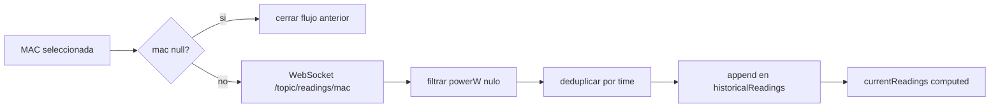
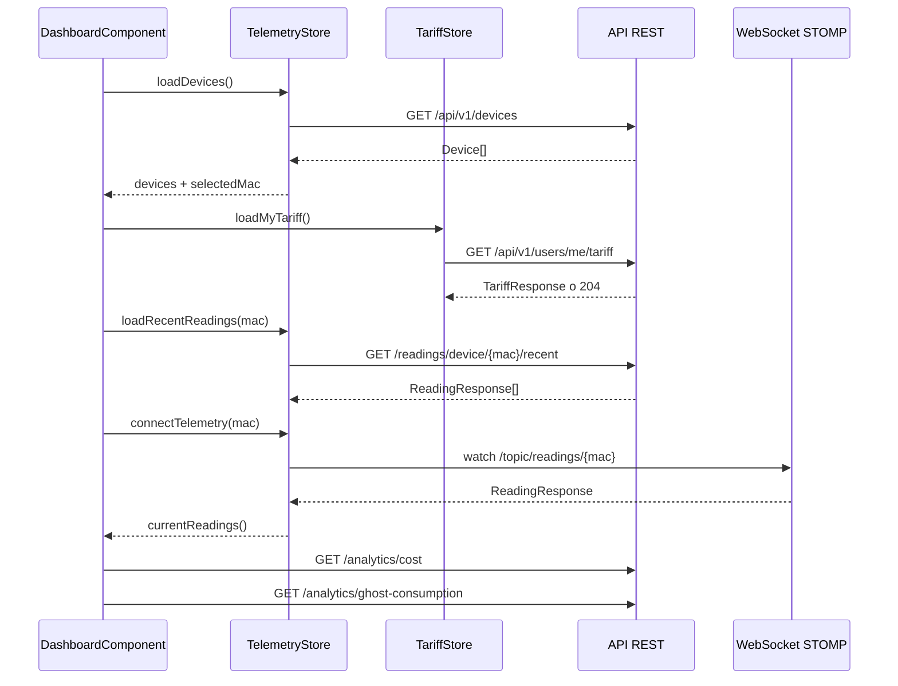

# Anexo B. Frontend Angular, RxJS y NgRx Signals

Este anexo documenta el frontend real de Wattimizer ubicado en `frontend/src/app`. La aplicación está construida con Angular 21, componentes standalone, rutas lazy, PrimeNG, RxJS y NgRx Signal Store.

## B.1. Estructura general

| Elemento | Archivo | Función |
|---|---|---|
| Bootstrap | `main.ts` | Arranca `App` con `appConfig`. |
| Configuración global | `app.config.ts` | Router, HttpClient con interceptor, animaciones y preset PrimeNG. |
| Rutas | `app.routes.ts` | Login, registro, callback OAuth y rutas protegidas dentro de layout. |
| Guard | `guards/auth.guard.ts` | Bloquea rutas si no hay JWT válido. |
| Interceptor | `interceptors/http.interceptor.ts` | Añade JWT a `/api/v1` y redirige en 401. |

La aplicación usa un layout autenticado (`MainLayoutComponent`) que envuelve las pantallas principales. Las rutas hijas están protegidas con `canActivate` y `canActivateChild`, por lo que una URL directa a `/dashboard`, `/devices`, `/tariffs` o `/alerts` vuelve a comprobar sesión.

## B.2. Rutas de la aplicación

| Ruta | Componente | Acceso |
|---|---|---|
| `/login` | `LoginComponent` | Público |
| `/register` | `RegisterComponent` | Público |
| `/auth/oauth/callback` | `OAuthCallbackComponent` | Público |
| `/dashboard` | `DashboardComponent` | JWT |
| `/devices` | `DevicesComponent` | JWT |
| `/tariffs` | `TariffComponent` | JWT |
| `/alerts` | `AlertsComponent` | JWT |
| `**` | Redirección a `/dashboard` | Según guard |

## B.3. Interceptor HTTP y sesión

`httpInterceptor` añade siempre `X-Requested-With: XMLHttpRequest`. Si la URL contiene `/api/v1` y no corresponde a login, registro u OAuth exchange, lee el token actual de `SessionStorageService` y añade:

```http
Authorization: Bearer <jwt>
```

La lectura del token se hace en el momento de procesar la petición. Esta decisión evita usar una copia antigua del token si el usuario acaba de iniciar sesión o cerrar sesión.

`SessionStorageService` guarda el JWT en `sessionStorage` bajo la clave `auth_token`. Además:

- `isLoggedIn()` decodifica el token y comprueba `exp`.
- `getAuthorities()` lee la cadena CSV de roles.
- `hasRole("ROLE_ADMIN")` se usa para mostrar funciones de administración.
- `getUsername()` permite pintar el usuario en el layout.

## B.4. `TelemetryStore`

**Archivo:** `store/telemetry.store.ts`
**Tecnología:** `signalStore`, `withState`, `withComputed`, `rxMethod`, `patchState`

### Estado

```typescript
{
  devices: Device[];
  selectedMac: string | null;
  historicalReadings: {
    [mac: string]: {
      timestamps: string[];
      powerW: number[];
    };
  };
  isLoadingDevices: boolean;
}
```

La clave de `historicalReadings` es la MAC. Esto es importante por el cambio reciente a panel multi-dispositivo: si el usuario alterna entre medidores, el histórico de uno no pisa el de otro.

### Computed

| Computed | Uso |
|---|---|
| `currentReadings` | Devuelve la serie temporal de `selectedMac`, o arrays vacíos si no hay selección. |

### Métodos síncronos

| Método | Descripción |
|---|---|
| `setSelectedMac(mac)` | Actualiza MAC seleccionada y carga lecturas recientes si no es `null`. |
| `loadRecentReadings(mac)` | Hace `GET /api/v1/readings/device/{mac}/recent?seconds=120` y conserva las últimas 20 lecturas. |
| `reset()` | Limpia todo el estado al cerrar sesión para evitar fugas entre usuarios. |

### `rxMethod` y RxJS

| Método | Pipeline | Endpoint o fuente |
|---|---|---|
| `loadDevices()` | `tap` activa loading, `switchMap` a HTTP, `tap` parchea estado | `GET /api/v1/devices` |
| `claimDevice(payload)` | `switchMap` a HTTP, `tap` añade dispositivo | `POST /api/v1/devices/claim` |
| `createSimulatedDevice(payload)` | `switchMap` a HTTP, `tap` añade simulador | `POST /api/v1/devices/simulated` |
| `addDevice(newDevice)` | `switchMap` a HTTP, `tap` añade dispositivo | `POST /api/v1/devices` |
| `updateDevice(device)` | `switchMap` a HTTP, `tap` reemplaza en lista | `PUT /api/v1/devices/{id}` |
| `deleteDevice(id)` | `switchMap` a HTTP, `tap` elimina y recoloca selección | `DELETE /api/v1/devices/{id}` |
| `connectTelemetry(mac)` | `distinctUntilChanged`, `switchMap`, `filter`, `distinctUntilChanged`, `tap` | WebSocket `/topic/readings/{mac}` |

La parte más relevante es `connectTelemetry`. Cuando recibe una MAC nueva, `switchMap` cambia de stream WebSocket. Si recibe `null`, devuelve `of(null)` y se corta la suscripción anterior. Después filtra lecturas sin `powerW`, deduplica por `time` y mantiene solo una ventana móvil de 20 puntos.



## B.5. `TariffStore`

**Archivo:** `store/tariff.store.ts`

### Estado

```typescript
{
  catalog: TariffResponse[];
  myTariff: TariffResponse | null;
  isLoadingCatalog: boolean;
  isLoadingMyTariff: boolean;
  errorMessage: string | null;
}
```

### Computed

| Computed | Uso |
|---|---|
| `hasMyTariff` | Activa widgets económicos del dashboard. |
| `isCatalogEmpty` | Permite mostrar estado vacío en pantalla de tarifas. |

### Métodos reactivos

| Método | Servicio llamado | Resultado |
|---|---|---|
| `loadCatalog()` | `TariffService.getCatalog()` | Carga plantillas globales. |
| `loadMyTariff()` | `TariffService.getMyTariff()` | Carga tarifa privada o `null` si backend devuelve 204. |
| `saveMyTariff(payload)` | `TariffService.saveMyTariff()` | Guarda contrato privado. |
| `unlinkMyTariff()` | `TariffService.unlinkMyTariff()` | Deja `myTariff` a `null`. |
| `refreshAfterCatalogMutation()` | `TariffService.getCatalog()` | Recarga catálogo, aunque actualmente no se invoca desde componentes. |

El patrón se repite: `tap` para activar carga, `switchMap` al servicio, `tap` para `patchState` y `catchError(() => EMPTY)` para cortar el stream sin romper el store.

## B.6. `WebsocketService`

**Archivo:** `services/websocket.service.ts`

El servicio crea una instancia de `RxStomp` y calcula la URL según protocolo:

```typescript
const protocol = window.location.protocol === "https:" ? "wss:" : "ws:";
const wsUrl = `${protocol}//${window.location.host}/ws-iot`;
```

Configuración principal:

- `heartbeatOutgoing: 20000`
- `reconnectDelay: 5000`
- `watchReadings(macAddress)` escucha `/topic/readings/{macAddress}`
- Cada mensaje STOMP se transforma con `JSON.parse` a `ReadingResponse`

La conexión se activa en el constructor. El store decide qué topic observar según la MAC elegida.

## B.7. Componentes principales

### B.7.1. `DashboardComponent`

**Archivo:** `components/dashboard/dashboard.component.ts`
**Plantilla:** `components/dashboard/dashboard.html`

Responsabilidad: mostrar la situación energética de la empresa en tiempo real.

Dependencias:

- `TelemetryStore`
- `TariffStore`
- `HttpClient`
- `Router`
- PrimeNG Chart, Select, Message, Toast

Flujo del constructor:

1. `store.loadDevices()` carga los medidores.
2. `tariffStore.loadMyTariff()` comprueba si el usuario tiene contrato.
3. Un `effect` borra mensajes de error de analítica tras 8 segundos.
4. Otro `effect` reacciona a `selectedMac`:
   - carga lecturas recientes,
   - conecta WebSocket,
   - consulta analítica si hay tarifa.
5. Un tercer `effect` reacciona a `hasMyTariff`:
   - si no hay tarifa, reinicia métricas a `null`,
   - si aparece tarifa y hay MAC, recarga costes.

Computed importantes:

| Computed | Origen | Uso visual |
|---|---|---|
| `powerW` | `store.currentReadings().powerW` | Datos de la gráfica. |
| `formattedTime` | timestamps convertidos a `es-ES` | Eje X. |
| `chartData` | `formattedTime` + `powerW` | Configuración de Chart.js. |
| `companyName` | username del primer dispositivo | Cabecera personalizada. |

Los endpoints de analítica se llaman directamente desde el componente:

```http
GET /api/v1/analytics/cost?macAddress=<mac>&start=<iso>&end=<iso>
GET /api/v1/analytics/ghost-consumption?macAddress=<mac>&start=<iso>&end=<iso>
```

La decisión de no consultar analítica si no hay tarifa evita mostrar importes falsos. En ese caso la interfaz enseña placeholders y un aviso para configurar tarifa.

### B.7.2. `DevicesComponent`

**Archivo:** `components/devices/devices.component.ts`

Responsabilidad: gestionar dispositivos físicos y simulados.

Estado local:

- `isLoadingSubmit`
- `isLoadingDemoPack`
- `errorMessage`
- `successMessage`
- `selectedDevice`
- `detailsDialogVisible`
- `editDialogVisible`
- `isSavingEdit`

Formulario de alta:

| Campo | Reglas |
|---|---|
| `deviceKind` | `physical` o `simulated`, obligatorio. |
| `name` | Obligatorio, mínimo 3 caracteres. |
| `macAddress` | Obligatoria y patrón `^[0-9A-Fa-f]{12}$` solo si es físico. |
| `simulationProfile` | Obligatorio solo si es simulado. |

La suscripción a `deviceKind.valueChanges` cambia validadores dinámicamente. Si el usuario elige simulado, la MAC se deshabilita porque el backend genera una MAC sintética. Si elige físico, el perfil se deshabilita porque la telemetría vendrá del hardware.

Endpoints usados:

| Acción | Método y endpoint |
|---|---|
| Alta física | `POST /api/v1/devices/claim` |
| Alta simulada | `POST /api/v1/devices/simulated` |
| Pack demo | `POST /api/v1/devices/simulated/demo-pack` |
| Borrado | `DELETE /api/v1/devices/{id}` |
| Toggle estado | `PUT /api/v1/devices/{id}` |
| Edición | `PUT /api/v1/devices/{id}` |

Aunque `TelemetryStore` tiene `rxMethod` para CRUD, este componente usa `HttpClient` directo y llama a `store.loadDevices()` tras cada mutación. Esta duplicidad existe en el código actual y conviene reflejarla porque es una decisión de implementación real.

### B.7.3. `TariffComponent`

**Archivo:** `components/tariff/tariff.component.ts`

Responsabilidad: gestionar plantillas de tarifa y tarifa privada del usuario.

Dependencias:

- `TariffStore`
- `TariffService`
- `SessionStorageService`

Computed:

| Computed | Finalidad |
|---|---|
| `isAdmin` | Muestra acciones de catálogo solo si el JWT contiene `ROLE_ADMIN`. |
| `isEditingMyTariffMode` | Distingue edición de contrato privado frente a plantilla de catálogo. |

El formulario reactivo contiene:

- `name`
- `market`
- `accessTariffCode`
- `geographicZone`
- `energyCompany`
- `periods`
- `contractedPowers`

Los arrays `periods` y `contractedPowers` se reconstruyen según el peaje:

| Peaje | Periodos de energía | Potencias |
|---|---|---|
| `2.0TD` | P1, P2, P3 | P1, P2 |
| `3.0TD` | P1-P6 | P1-P6 |
| `6.1TD` | P1-P6 | P1-P6 |
| `6.2TD` | P1-P6 | P1-P6 |

`ascendingPowerValidator` impone que las potencias contratadas no decrezcan entre periodos. Esto tiene sentido porque en tarifas de acceso con varios periodos la contratación suele requerir orden ascendente.

Flujos:

- Admin crea o edita catálogo con `TariffService.createCatalogTariff` / `updateCatalogTariff`.
- Usuario asigna plantilla con `store.saveMyTariff({ templateTariffId, contract: null })`.
- Usuario edita su tarifa privada con `TariffService.saveMyTariff({ templateTariffId: null, contract })`.
- Usuario desvincula con `store.unlinkMyTariff()`.

### B.7.4. `AlertsComponent`

**Archivo:** `components/alerts/alerts.component.ts`

Responsabilidad: mostrar y descartar alertas.

No usa store global. Mantiene estado local de lista, carga y mensajes. Consume:

```http
GET /api/v1/alerts
DELETE /api/v1/alerts/{id}
```

Esto es suficiente porque las alertas no afectan a múltiples pantallas salvo el posible WebSocket de alertas del backend, que aún no está consumido por el frontend actual.

### B.7.5. Login, registro y OAuth callback

| Componente | Función |
|---|---|
| `LoginComponent` | Formulario email/contraseña y redirección OAuth2 a `/oauth2/authorization/{provider}`. |
| `RegisterComponent` | Registro local con validador de coincidencia de contraseña. |
| `OAuthCallbackComponent` | Lee `ticket` de la URL y llama a `AuthService.exchangeOAuthTicket(ticket)`. |

Tras login correcto, `SessionStorageService.saveToken()` guarda el JWT y la navegación va a `/dashboard`.

### B.7.6. `MainLayoutComponent`

El layout pinta navegación y username. Su `logout()` hace algo más que borrar el token:

1. `telemetryStore.connectTelemetry(null)` corta el stream WebSocket.
2. `telemetryStore.reset()` elimina dispositivos e históricos cacheados.
3. `tariffStore.reset()` elimina catálogo privado y errores.
4. `sessionStorageService.logout()` borra el token.
5. Redirige a `/login`.

Este orden evita que un segundo usuario vea datos cargados por el usuario anterior en una sesión compartida de navegador.

## B.8. Servicios HTTP

### `AuthService`

| Método | Endpoint | Retorno |
|---|---|---|
| `authentication(user)` | `POST /api/v1/auth/login` | `Observable<LoginUserJwt>` |
| `register(user)` | `POST /api/v1/auth/register` | `Observable<void>` |
| `exchangeOAuthTicket(ticket)` | `POST /api/v1/auth/oauth/exchange` | `Observable<LoginUserJwt>` |

### `TariffService`

| Método | Endpoint |
|---|---|
| `getCatalog()` | `GET /api/v1/tariffs` |
| `getById(id)` | `GET /api/v1/tariffs/{id}` |
| `createCatalogTariff(payload)` | `POST /api/v1/tariffs` |
| `updateCatalogTariff(id, payload)` | `POST /api/v1/tariffs/{id}` |
| `deleteCatalogTariff(id)` | `DELETE /api/v1/tariffs/{id}` |
| `getMyTariff()` | `GET /api/v1/users/me/tariff` |
| `saveMyTariff(payload)` | `POST /api/v1/users/me/tariff` |
| `unlinkMyTariff()` | `DELETE /api/v1/users/me/tariff` |

`getMyTariff()` usa `observe: "response"` para distinguir `204 No Content` de una tarifa real. Después transforma `204` o body `null` a `null`.

### `DeviceService`

Existe un `httpResource<Device[]>` para `/api/v1/devices`, pero no se usa en los componentes actuales. La carga real se hace desde `TelemetryStore` o directamente desde `DevicesComponent`.

## B.9. Interfaces principales

| Archivo | Interfaces o tipos |
|---|---|
| `device.interface.ts` | `Device`, `ClaimDeviceRequest`, `CreateSimulatedDeviceRequest` |
| `reading-response.interface.ts` | `ReadingResponse` |
| `telemetry-state.interface.ts` | `TelemetryState` |
| `tariff-request.interface.ts` | `TariffRequest`, `TariffResponse`, `UserTariffRequest`, `AccessTariffCode`, `PeriodCode`, `GeographicZone` |
| `alert.interface.ts` | `Alert` |
| `login-user.interface.ts` | `LoginUser` |
| `login-user-jwt.interface.ts` | `LoginUserJwt` |
| `register-request.interface.ts` | `RegisterRequest` |
| `jwt-payload.interface.ts` | `JwtPayload` |
| `simulation-profile.interface.ts` | `SimulationProfile`, `DeviceKind`, opciones de perfiles |

Estas interfaces reflejan los DTOs Java. Por ejemplo, `TariffRequest` mantiene `periods` y `contractedPowers`, igual que `TariffDto` en backend.

## B.10. Flujo de datos del dashboard



El resultado es una pantalla que combina datos históricos recientes con datos nuevos en vivo, sin recargar toda la página y sin hacer polling constante.

## B.11. Pruebas frontend existentes

| Test | Qué valida |
|---|---|
| `app.spec.ts` | Creación de la aplicación raíz. |
| `dashboard.component.spec.ts` | Integración con `TariffStore`, placeholders y banner si no hay tarifa. |
| `devices.component.spec.ts` | Validación de alta física/simulada y endpoints enviados. |
| `tariff.component.spec.ts` | Número de periodos por peaje y visibilidad admin según rol. |
| `tariff.service.spec.ts` | Endpoints HTTP y transformación de 204 a `null`. |
| `session-storage.service.spec.ts` | Roles, username y lectura de JWT. |

No hay tests específicos para `TelemetryStore`, `TariffStore`, `WebsocketService`, guard o interceptor. Es una línea futura razonable porque esas piezas concentran bastante lógica reactiva.
