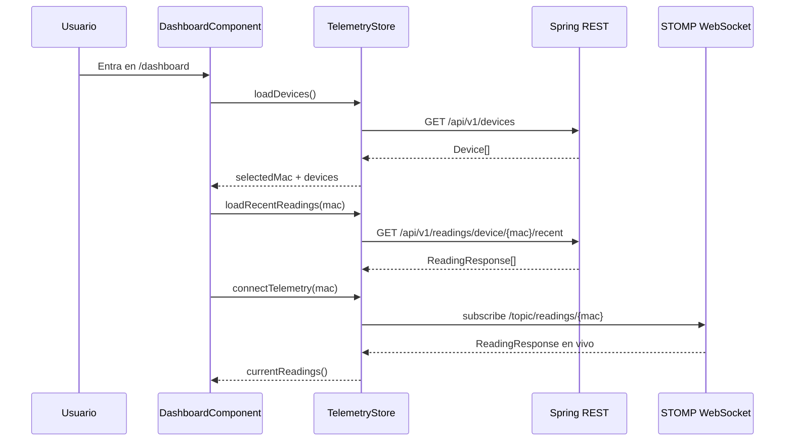

# Anexo B - Frontend Angular, RxJS y NgRx Signals

## 1. Funcion del frontend

El frontend de Wattimizer esta en `frontend/` y esta construido con Angular 21 usando componentes standalone. Su responsabilidad es presentar la aplicacion al usuario, proteger rutas privadas, consumir la API REST, escuchar telemetria en tiempo real por WebSocket y mantener estado compartido sin depender de un store global clasico.

La aplicacion arranca en `src/main.ts` con `bootstrapApplication(App, appConfig)`. El componente raiz `App` solo renderiza el `router-outlet`, por lo que el peso real de la navegacion queda en `app.routes.ts`.

## 2. Rutas y componentes principales

**Archivo:** `frontend/src/app/app.routes.ts`

| Ruta | Componente | Acceso | Funcion |
|---|---|---|---|
| `/login` | `LoginComponent` | Publico | Login con correo/contrasena y acceso OAuth2. |
| `/register` | `RegisterComponent` | Publico | Registro de usuario. |
| `/auth/oauth/callback` | `OAuthCallbackComponent` | Publico | Intercambia el ticket OAuth por JWT propio. |
| `/dashboard` | `DashboardComponent` | `authGuard` | Panel de consumo, grafica y costes. |
| `/devices` | `DevicesComponent` | `authGuard` | Gestion de dispositivos fisicos y simulados. |
| `/tariffs` | `TariffComponent` | `authGuard` | Catalogo de tarifas y tarifa privada. |
| `/alerts` | `AlertsComponent` | `authGuard` | Historial de alertas. |
| `**` | Redireccion | - | Envia a `/dashboard`. |

La ruta privada se monta dentro de `MainLayoutComponent`, protegido con `canActivate` y `canActivateChild`. Esta doble validacion evita que el usuario entre a una ruta hija escribiendo la URL directamente con un token caducado.

## 3. Autenticacion en cliente

### 3.1. `SessionStorageService`

**Archivo:** `frontend/src/app/services/session-storage.service.ts`

Guarda el JWT en `sessionStorage` con la clave `auth_token`. La decision de usar `sessionStorage` hace que el token desaparezca al cerrar la pestana o navegador, reduciendo persistencia innecesaria en un proyecto de control energetico.

Metodos principales:

- `saveToken(token)`: elimina token anterior y guarda el nuevo.
- `getToken()`: devuelve el token actual o `null`.
- `logout()`: borra solo la clave de autenticacion.
- `isLoggedIn()`: decodifica `exp` con `jwt-decode` y comprueba caducidad.
- `getAuthorities()`: separa roles recibidos como CSV en el claim `authorities`.
- `hasRole(role)`: permite adaptar UI para `ROLE_ADMIN` y `ROLE_USER`.
- `getUsername()`: lee el nombre de usuario del JWT.

### 3.2. Interceptor HTTP

**Archivo:** `frontend/src/app/interceptors/http.interceptor.ts`

El interceptor anade siempre `X-Requested-With: XMLHttpRequest`. Ademas, si la URL contiene `/api/v1` y no es una ruta publica de autenticacion, anade:

```http
Authorization: Bearer <token>
```

Cuando la API responde `401`, limpia la sesion y redirige a `/login`. Esto centraliza el comportamiento y evita repetir la misma comprobacion en todos los componentes.

## 4. Estado reactivo con NgRx Signals

El proyecto no usa NgRx clasico con `StoreModule`, actions, reducers y effects. Usa `@ngrx/signals`, que encaja mejor con Angular moderno porque trabaja directamente con signals.

Equivalencias practicas:

| NgRx clasico | En este proyecto |
|---|---|
| State | `withState` |
| Selectors | `withComputed` + `computed` |
| Reducers | Metodos con `patchState` |
| Effects | `rxMethod` con operadores RxJS |
| Store inyectable | `signalStore({ providedIn: "root" })` |

### 4.1. `TelemetryStore`

**Archivo:** `frontend/src/app/store/telemetry.store.ts`

Estado:

```typescript
interface TelemetryState {
  devices: Device[];
  selectedMac: string | null;
  historicalReadings: {
    [mac: string]: { timestamps: string[]; powerW: number[] };
  };
  isLoadingDevices: boolean;
}
```

Selector principal:

- `currentReadings`: devuelve el historial del dispositivo seleccionado, o arrays vacios si no hay seleccion.

Metodos y flujos:

| Metodo | Tipo | Flujo |
|---|---|---|
| `loadDevices()` | `rxMethod<void>` | `GET /api/v1/devices`; actualiza lista y selecciona la primera MAC si no habia seleccion. |
| `setSelectedMac(mac)` | Sincrono | Cambia `selectedMac` y carga historial reciente. |
| `loadRecentReadings(mac)` | HTTP con `subscribe` | `GET /api/v1/readings/device/{mac}/recent?seconds=120`; guarda maximo 20 puntos. |
| `connectTelemetry(mac)` | `rxMethod<string \| null>` | Se suscribe al WebSocket, filtra lecturas sin potencia y deduplica por timestamp. |
| `claimDevice(payload)` | `rxMethod` | `POST /api/v1/devices/claim`; anade el dispositivo reclamado al estado. |
| `createSimulatedDevice(payload)` | `rxMethod` | `POST /api/v1/devices/simulated`; anade simulador. |
| `addDevice(payload)` | `rxMethod` | `POST /api/v1/devices`; mantiene endpoint directo heredado. |
| `updateDevice(device)` | `rxMethod` | `PUT /api/v1/devices/{id}`; sustituye el item en el array. |
| `deleteDevice(id)` | `rxMethod` | `DELETE /api/v1/devices/{id}`; elimina item y recalcula seleccion. |
| `reset()` | Sincrono | Vuelve al estado inicial al cerrar sesion. |

La ventana de 20 lecturas se mantiene en frontend para que Chart.js no repinte una serie demasiado grande en tiempo real.

### 4.2. `TariffStore`

**Archivo:** `frontend/src/app/store/tariff.store.ts`

Estado:

```typescript
interface TariffState {
  catalog: TariffResponse[];
  myTariff: TariffResponse | null;
  isLoadingCatalog: boolean;
  isLoadingMyTariff: boolean;
  errorMessage: string | null;
}
```

Selectores:

- `hasMyTariff`: indica si hay contrato activo.
- `isCatalogEmpty`: indica si el catalogo esta vacio.

Metodos:

| Metodo | Servicio | Uso |
|---|---|---|
| `loadCatalog()` | `TariffService.getCatalog()` | Cargar plantillas disponibles. |
| `loadMyTariff()` | `TariffService.getMyTariff()` | Obtener tarifa privada o `null`. |
| `saveMyTariff(payload)` | `TariffService.saveMyTariff()` | Clonar/asignar/actualizar tarifa. |
| `unlinkMyTariff()` | `TariffService.unlinkMyTariff()` | Desvincular contrato privado. |
| `refreshAfterCatalogMutation()` | `TariffService.getCatalog()` | Recargar tras cambios admin. |
| `setCatalogTariff`, `addToCatalog`, `removeFromCatalog`, `patchMyTariff` | No HTTP | Sincronizar cambios confirmados por el servidor. |
| `reset()` | No HTTP | Limpiar datos al cerrar sesion. |

El store usa `catchError(() => EMPTY)` en flujos donde el interceptor ya gestiona errores criticos como `401`. Asi se corta la cadena reactiva sin romper el componente.

## 5. Componentes principales

### 5.1. `DashboardComponent`

**Archivo:** `frontend/src/app/components/dashboard/dashboard.component.ts`

Responsabilidades:

- Cargar dispositivos y tarifa activa al montar el componente.
- Mostrar grafica de potencia con Chart.js.
- Permitir cambiar de medidor mediante `p-select`.
- Cargar coste diario y consumo fantasma por REST.
- Mostrar banner si el usuario no tiene tarifa configurada.

Flujo reactivo:

```text
constructor()
  -> TelemetryStore.loadDevices()
  -> TariffStore.loadMyTariff()
  -> effect(selectedMac)
       -> loadRecentReadings(mac)
       -> connectTelemetry(mac)
       -> loadAnalyticsMetrics(mac) si hay tarifa
  -> effect(hasMyTariff)
       -> limpia metricas si no hay tarifa
       -> recarga metricas si aparece tarifa y hay MAC seleccionada
```

Las metricas economicas se piden directamente desde el componente:

- `GET /api/v1/analytics/cost`
- `GET /api/v1/analytics/ghost-consumption`

Esta decision mantiene las analiticas como estado local de la pantalla, porque no se reutilizan en otras vistas.

### 5.2. `DevicesComponent`

**Archivo:** `frontend/src/app/components/devices/devices.component.ts`

Gestiona dos tipos de alta:

- **Fisico:** pide nombre y MAC. La MAC se valida con regex de 12 caracteres hexadecimales.
- **Simulado:** pide nombre y `simulationProfile`. Desactiva el campo MAC porque el backend genera una `SIM...` unica.

Endpoints usados:

| Accion | Endpoint |
|---|---|
| Vincular fisico | `POST /api/v1/devices/claim` |
| Crear simulado | `POST /api/v1/devices/simulated` |
| Crear pack demo | `POST /api/v1/devices/simulated/demo-pack` |
| Editar dispositivo | `PUT /api/v1/devices/{id}` |
| Apagar/encender | `PUT /api/v1/devices/{id}` cambiando `isOn` |
| Borrar | `DELETE /api/v1/devices/{id}` |

Usa signals locales para `isLoadingSubmit`, `isLoadingDemoPack`, mensajes y visibilidad de dialogos. Tras cada mutacion recarga `TelemetryStore.loadDevices()` para reflejar el estado real del backend.

### 5.3. `TariffComponent`

**Archivo:** `frontend/src/app/components/tariff/tariff.component.ts`

La vista cambia segun rol:

- `ROLE_ADMIN`: ve el catalogo maestro con crear, editar, borrar y asignarse una plantilla.
- `ROLE_USER`: ve plantillas disponibles y puede asignarse una.

Formulario:

- Usa `ReactiveFormsModule` con `FormArray` para periodos y potencias.
- `ENERGY_PERIODS` define si el peaje usa P1-P3 o P1-P6.
- `POWER_PERIODS` define potencias P1-P2 para `2.0TD` y P1-P6 para el resto.
- `ascendingPowerValidator` impone P1 <= P2 <= ... <= P6.

La decision de bloquear campos estructurales al editar la tarifa privada evita que el usuario cambie el tipo de peaje o zona desde una pantalla pensada para ajustar precios y potencias. Asi se reduce el riesgo de dejar un contrato incoherente con sus periodos.

### 5.4. `AlertsComponent`

**Archivo:** `frontend/src/app/components/alerts/alerts.component.ts`

Mantiene estado local:

- `alertsList`
- `isLoading`
- `errorMessage`
- `successMessage`

Endpoints:

- `GET /api/v1/alerts`
- `DELETE /api/v1/alerts/{id}`

Despues de descartar una alerta, vuelve a cargar la lista. Es una solucion sencilla y fiable porque el volumen de alertas del MVP no justifica una sincronizacion parcial mas compleja.

### 5.5. `MainLayoutComponent`

**Archivo:** `frontend/src/app/components/main-layout/main-layout.component.ts`

Al cerrar sesion:

1. Llama a `telemetryStore.connectTelemetry(null)` para cortar el flujo actual.
2. Resetea `TelemetryStore` y `TariffStore`.
3. Borra el token.
4. Navega a `/login` con `replaceUrl`.

Este orden evita que otro usuario vea datos cacheados del anterior al iniciar sesion en el mismo navegador.

## 6. Servicios Angular

### 6.1. `AuthService`

| Metodo | Endpoint | Resultado |
|---|---|---|
| `authentication(user)` | `POST /api/v1/auth/login` | `LoginUserJwt`. |
| `register(user)` | `POST /api/v1/auth/register` | Alta de usuario. |
| `exchangeOAuthTicket(ticket)` | `POST /api/v1/auth/oauth/exchange` | JWT final tras OAuth. |

### 6.2. `TariffService`

| Metodo | Endpoint |
|---|---|
| `getCatalog()` | `GET /api/v1/tariffs` |
| `getById(id)` | `GET /api/v1/tariffs/{id}` |
| `createCatalogTariff(payload)` | `POST /api/v1/tariffs` |
| `updateCatalogTariff(id, payload)` | `POST /api/v1/tariffs/{id}` |
| `deleteCatalogTariff(id)` | `DELETE /api/v1/tariffs/{id}` |
| `getMyTariff()` | `GET /api/v1/users/me/tariff` |
| `saveMyTariff(payload)` | `POST /api/v1/users/me/tariff` |
| `unlinkMyTariff()` | `DELETE /api/v1/users/me/tariff` |

`getMyTariff()` trabaja con `observe: "response"` para convertir `204 No Content` en `null`, que es mas comodo para `TariffStore.hasMyTariff`.

### 6.3. `WebsocketService`

**Archivo:** `frontend/src/app/services/websocket.service.ts`

Configura `RxStomp` contra:

```typescript
const protocol = window.location.protocol === "https:" ? "wss:" : "ws:";
const wsUrl = `${protocol}//${window.location.host}/ws-iot`;
```

La suscripcion de lecturas se hace en:

```typescript
watchReadings(macAddress: string): Observable<ReadingResponse> {
  return this.rxStomp
    .watch(`/topic/readings/${macAddress}`)
    .pipe(map((message) => JSON.parse(message.body) as ReadingResponse));
}
```

El frontend no hace polling para la grafica en vivo. Solo carga un historial inicial por REST y luego escucha STOMP.

## 7. Modelos TypeScript y relacion con DTOs Java

### Dispositivos

**Archivo:** `interfaces/device.interface.ts`

```typescript
export interface Device {
  id: number;
  username: string;
  name: string;
  macAddress: string;
  isOn: boolean;
  simulated: boolean;
  simulationProfile: SimulationProfile | null;
}
```

Coincide con `DeviceDto` del backend.

### Tarifas

**Archivo:** `interfaces/tariff-request.interface.ts`

```typescript
export interface TariffRequest {
  id: number | null;
  name: string;
  market: string;
  accessTariffCode: AccessTariffCode;
  geographicZone: GeographicZone;
  energyCompany: string;
  periods: PeriodRequest[];
  contractedPowers: TariffContractedPowerRequest[];
}
```

`TariffResponse` es un alias del mismo shape porque la API devuelve la misma estructura que recibe.

### Lecturas y analiticas

| Interfaz | Uso |
|---|---|
| `ReadingResponse` | Historial REST y mensajes STOMP. |
| `EnergyCostResponse` | Respuesta de `GET /analytics/cost`. |
| `GhostCostResponse` | Respuesta de `GET /analytics/ghost-consumption`. |
| `Alert` | Respuesta de `GET /alerts`. |

## 8. Flujo completo de datos en el dashboard



La combinacion de historial inicial y WebSocket permite que la grafica no arranque vacia y, a la vez, se mantenga actualizada sin recargar la pagina.
