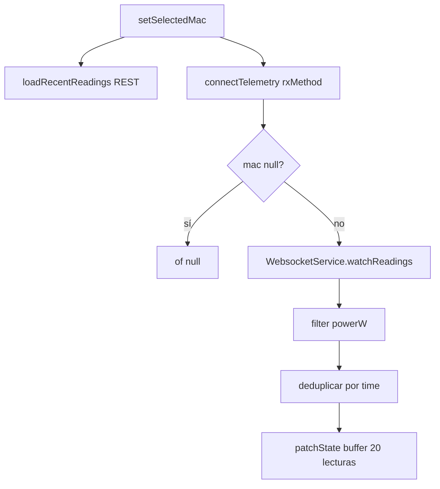
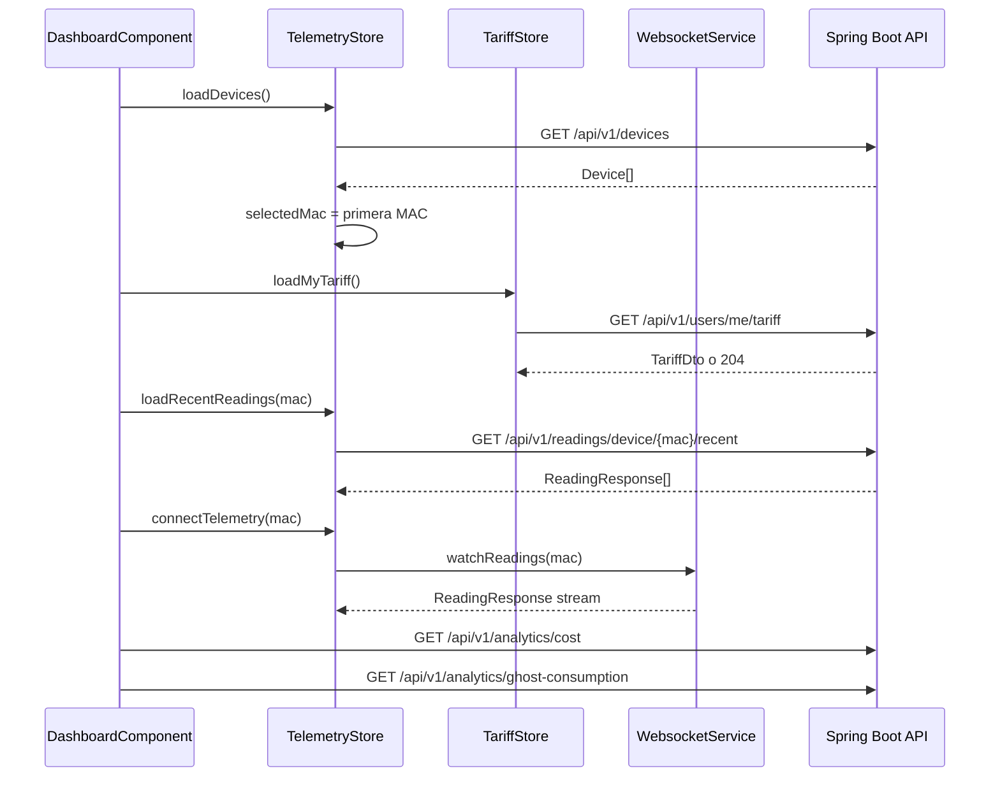

# Anexo B. Frontend Angular, RxJS y NgRx Signals

## 1. Visión general

El frontend está en `frontend/src/app` y usa Angular standalone. No hay `AppModule`: la aplicación arranca con `bootstrapApplication` y se configura desde `app.config.ts`.

Tecnologías principales observadas en `frontend/package.json`:

| Tecnología | Versión |
| --- | --- |
| Angular | `^21.1.0` |
| PrimeNG | `^21.1.7` |
| Tailwind CSS | `^4.1.12` |
| `@ngrx/signals` | `^21.1.0` |
| RxJS | `~7.8.0` |
| Chart.js | `^4.5.1` |
| `@stomp/rx-stomp` | `^2.4.0` |
| `jwt-decode` | `^4.0.0` |

La decisión técnica más importante del frontend es usar **signals** y **NgRx Signal Store** en vez de NgRx clásico. Por eso no existen reducers, actions ni effects tradicionales.

## 2. Estructura de rutas

Archivo: `frontend/src/app/app.routes.ts`

| Ruta | Componente | Protección |
| --- | --- | --- |
| `/login` | `LoginComponent` | Pública |
| `/register` | `RegisterComponent` | Pública |
| `/auth/oauth/callback` | `OAuthCallbackComponent` | Pública |
| `/dashboard` | `DashboardComponent` dentro de `MainLayoutComponent` | `authGuard` |
| `/devices` | `DevicesComponent` dentro de `MainLayoutComponent` | `authGuard` |
| `/tariffs` | `TariffComponent` dentro de `MainLayoutComponent` | `authGuard` |
| `/alerts` | `AlertsComponent` dentro de `MainLayoutComponent` | `authGuard` |
| `**` | Redirección a `/dashboard` | Depende del layout |

El layout privado usa tanto `canActivate` como `canActivateChild`. Esto evita que un usuario con token caducado entre directamente por URL a una ruta hija.

## 3. Configuración global

Archivo: `frontend/src/app/app.config.ts`

Providers principales:

- `provideRouter(routes)`.
- `provideHttpClient(withInterceptors([httpInterceptor]))`.
- `provideAnimationsAsync()`.
- `providePrimeNG(...)` con preset visual propio.

Archivo: `frontend/proxy.conf.json`

En desarrollo, Angular redirige estas rutas al backend local:

```text
/api
/oauth2
/ws-iot
```

Así el frontend puede llamar a `/api/v1/...` sin codificar `http://localhost:8080`.

## 4. Autenticación en Angular

### 4.1. `SessionStorageService`

Archivo: `frontend/src/app/services/session-storage.service.ts`

Responsabilidades:

- Guardar JWT en `sessionStorage` con clave `auth_token`.
- Decodificar `exp`, `username` y `authorities`.
- Comprobar expiración del token.
- Evaluar roles como `ROLE_ADMIN`.
- Limpiar sesión en logout.

La elección de `sessionStorage` hace que la sesión no sobreviva al cierre de pestaña. Para un proyecto académico y una app con datos energéticos, es una opción prudente porque reduce persistencia local del token.

### 4.2. `authGuard`

Archivo: `frontend/src/app/guards/auth.guard.ts`

```ts
const isLogged = sessionStorageService.isLoggedIn();
return isLogged ? true : router.createUrlTree(["/login"]);
```

El guard no valida contra servidor en cada navegación; confía en la expiración del JWT local. Si el backend devuelve 401 más tarde, el interceptor fuerza logout.

### 4.3. `httpInterceptor`

Archivo: `frontend/src/app/interceptors/http.interceptor.ts`

Comportamiento:

- Añade siempre `X-Requested-With: XMLHttpRequest`.
- Añade `Authorization: Bearer <token>` a rutas que contienen `/api/v1`.
- Excluye rutas públicas:
  - `/api/v1/auth/login`
  - `/api/v1/auth/register`
  - `/api/v1/auth/oauth/exchange`
- Si recibe `401`, limpia sesión y navega a `/login`.

## 5. Servicios Angular

| Servicio | Archivo | Responsabilidad |
| --- | --- | --- |
| `AuthService` | `services/auth.service.ts` | Login, registro y canje de ticket OAuth2. |
| `TariffService` | `services/tariff.service.ts` | Catálogo admin y tarifa privada del usuario. |
| `WebsocketService` | `services/websocket.service.ts` | Conexión STOMP y stream de lecturas por MAC. |
| `SessionStorageService` | `services/session-storage.service.ts` | Gestión local del JWT. |
| `DeviceService` | `services/device.service.ts` | `httpResource<Device[]>`, definido pero sin uso principal en la UI. |

### 5.1. `TariffService`

Usa dos bases:

```ts
private readonly catalogUrl = "/api/v1/tariffs";
private readonly myTariffUrl = "/api/v1/users/me/tariff";
```

Puntos importantes:

- `getMyTariff()` observa la respuesta completa para distinguir `204 No Content` de una tarifa real.
- `updateCatalogTariff()` usa `POST /api/v1/tariffs/{id}` porque el backend actual no expone `PUT`.
- Los errores 401/403 se delegan al interceptor global.

### 5.2. `WebsocketService`

Archivo: `frontend/src/app/services/websocket.service.ts`

La URL se calcula según protocolo:

```ts
const protocol = window.location.protocol === "https:" ? "wss:" : "ws:";
const wsUrl = `${protocol}//${window.location.host}/ws-iot`;
```

Configuración STOMP:

- `heartbeatOutgoing`: 20 segundos.
- `reconnectDelay`: 5 segundos.
- `watchReadings(macAddress)`: se suscribe a `/topic/readings/{macAddress}` y parsea el JSON a `ReadingResponse`.

## 6. Stores con NgRx Signals

### 6.1. `TelemetryStore`

Archivo: `frontend/src/app/store/telemetry.store.ts`

Estado:

```ts
interface TelemetryState {
  devices: Device[];
  selectedMac: string | null;
  historicalReadings: Record<string, { timestamps: string[]; powerW: number[] }>;
  isLoadingDevices: boolean;
}
```

Computed:

- `currentReadings`: devuelve el histórico del dispositivo seleccionado o arrays vacíos.

Métodos síncronos:

- `setSelectedMac(mac)`: cambia MAC seleccionada y carga lecturas recientes.
- `loadRecentReadings(mac)`: hace `GET /api/v1/readings/device/{mac}/recent?seconds=120`.
- `reset()`: vuelve al estado inicial al cerrar sesión.

Métodos `rxMethod`:

| Método | Endpoint/flujo | Efecto |
| --- | --- | --- |
| `loadDevices` | `GET /api/v1/devices` | Carga dispositivos y selecciona la primera MAC si no hay selección previa. |
| `claimDevice` | `POST /api/v1/devices/claim` | Añade dispositivo reclamado al estado. |
| `createSimulatedDevice` | `POST /api/v1/devices/simulated` | Añade simulador al estado. |
| `addDevice` | `POST /api/v1/devices` | Alta directa heredada. |
| `updateDevice` | `PUT /api/v1/devices/{id}` | Actualiza lista local. |
| `deleteDevice` | `DELETE /api/v1/devices/{id}` | Elimina dispositivo y ajusta selección. |
| `connectTelemetry` | STOMP `/topic/readings/{mac}` | Inserta lecturas en buffer de 20 puntos. |

Operadores RxJS relevantes:

- `switchMap`: cambia de petición o stream cuando cambia la entrada.
- `distinctUntilChanged`: evita reconectar al mismo dispositivo.
- `filter`: descarta lecturas sin `powerW`.
- `tap`: actualiza estado con `patchState`.
- `of(null)`: corta el stream cuando no hay MAC.

Flujo de telemetría en el store:



### 6.2. `TariffStore`

Archivo: `frontend/src/app/store/tariff.store.ts`

Estado:

```ts
interface TariffState {
  catalog: TariffResponse[];
  myTariff: TariffResponse | null;
  isLoadingCatalog: boolean;
  isLoadingMyTariff: boolean;
  errorMessage: string | null;
}
```

Computed:

- `hasMyTariff`: usado por dashboard para habilitar analíticas.
- `isCatalogEmpty`: ayuda a la pantalla de tarifas.

Métodos `rxMethod`:

| Método | Endpoint | Finalidad |
| --- | --- | --- |
| `loadCatalog` | `GET /api/v1/tariffs` | Carga catálogo global. |
| `loadMyTariff` | `GET /api/v1/users/me/tariff` | Carga contrato del usuario o `null` si hay 204. |
| `saveMyTariff` | `POST /api/v1/users/me/tariff` | Guarda tarifa privada. |
| `unlinkMyTariff` | `DELETE /api/v1/users/me/tariff` | Desvincula tarifa. |
| `refreshAfterCatalogMutation` | `GET /api/v1/tariffs` | Recarga catálogo tras cambio admin. |

También incluye helpers síncronos (`addToCatalog`, `setCatalogTariff`, `removeFromCatalog`, `patchMyTariff`) para actualizar la UI después de mutaciones realizadas desde componentes.

## 7. Componentes principales

### 7.1. `DashboardComponent`

Archivo: `frontend/src/app/components/dashboard/dashboard.component.ts`

Responsabilidades:

- Cargar dispositivos (`TelemetryStore.loadDevices()`).
- Cargar tarifa propia (`TariffStore.loadMyTariff()`).
- Mostrar gráfica de potencia con Chart.js.
- Conectar telemetría en tiempo real al cambiar MAC.
- Consultar coste diario y consumo fantasma si el usuario tiene tarifa.

Signals destacadas:

- `totalCostEur`, `ghostCostEur`: métricas económicas.
- `isLoadingAnalytics`, `analyticsError`: estado de carga.
- `chartData`: computed que transforma timestamps y W en dataset.

Endpoints usados:

```text
GET /api/v1/analytics/cost?macAddress=...&start=...&end=...
GET /api/v1/analytics/ghost-consumption?macAddress=...&start=...&end=...
```

La fecha inicial se calcula como las 00:00 del día actual en el navegador. El backend recibe `Instant` ISO y calcula con la zona del contrato cuando toca consumo fantasma.

### 7.2. `DevicesComponent`

Archivo: `frontend/src/app/components/devices/devices.component.ts`

Pantalla para gestión de dispositivos. Usa formulario reactivo tipado con estos campos:

- `deviceKind`: `physical` o `simulated`.
- `name`: mínimo 3 caracteres.
- `macAddress`: obligatorio solo para físico y validado con regex de 12 hexadecimales.
- `simulationProfile`: obligatorio solo para simulador.

Endpoints usados directamente:

```text
POST /api/v1/devices/claim
POST /api/v1/devices/simulated
POST /api/v1/devices/simulated/demo-pack
PUT /api/v1/devices/{id}
DELETE /api/v1/devices/{id}
```

Aunque `TelemetryStore` contiene métodos CRUD, este componente realiza varias llamadas HTTP directas y después invoca `store.loadDevices()` para refrescar. Es una mezcla real del código actual, no un patrón teórico.

### 7.3. `TariffComponent`

Archivo: `frontend/src/app/components/tariff/tariff.component.ts`

Gestiona catálogo y tarifa privada. Tiene formularios dinámicos porque los periodos cambian según el peaje:

```ts
const ENERGY_PERIODS = {
  "2.0TD": ["P1", "P2", "P3"],
  "3.0TD": ["P1", "P2", "P3", "P4", "P5", "P6"],
  "6.1TD": ["P1", "P2", "P3", "P4", "P5", "P6"],
  "6.2TD": ["P1", "P2", "P3", "P4", "P5", "P6"],
};
```

La potencia contratada incluye un validador propio:

- `ascendingPowerValidator`: impone que P1 <= P2 <= ... <= P6.

Esto representa una regla de negocio del contrato eléctrico, no solo una validación visual.

### 7.4. `AlertsComponent`

Archivo: `frontend/src/app/components/alerts/alerts.component.ts`

Gestiona:

- `GET /api/v1/alerts`
- `DELETE /api/v1/alerts/{id}`

Usa signals para lista, carga y mensajes temporales. No está conectado por WebSocket en el componente, aunque el backend sí puede emitir alertas por STOMP.

### 7.5. `MainLayoutComponent`

Archivo: `frontend/src/app/components/main-layout/main-layout.component.ts`

En logout ejecuta tres acciones con intención clara:

1. `telemetryStore.connectTelemetry(null)` para cerrar el stream activo.
2. `telemetryStore.reset()` y `tariffStore.reset()` para evitar datos cruzados entre usuarios.
3. `sessionStorageService.logout()` y navegación a `/login`.

## 8. Interfaces TypeScript principales

| Interfaz | Archivo | Relación con backend |
| --- | --- | --- |
| `Device` | `interfaces/device.interface.ts` | Equivale a `DeviceDto`. |
| `ClaimDeviceRequest` | `interfaces/device.interface.ts` | Cuerpo usado en `/devices/claim`. |
| `CreateSimulatedDeviceRequest` | `interfaces/device.interface.ts` | Equivale a DTO Java. |
| `ReadingResponse` | `interfaces/reading-response.interface.ts` | Equivale a `ReadingResponse` Java. |
| `TariffRequest`, `TariffResponse` | `interfaces/tariff-request.interface.ts` | Equivalen a `TariffDto` y derivados. |
| `UserTariffRequest` | `interfaces/tariff-request.interface.ts` | Equivale a `UserTariffRequest` Java. |
| `Alert` | `interfaces/alert.interface.ts` | Equivale a `AlertDto`. |
| `EnergyCostResponse` | `interfaces/energy-cost-response.interface.ts` | Respuesta de `/analytics/cost`. |
| `GhostCostResponse` | `interfaces/ghost-cost-response.interface.ts` | Respuesta de `/analytics/ghost-consumption`. |

## 9. Flujo completo de pantalla dashboard



La pantalla no espera a tener muchos datos históricos. Primero pinta lo reciente y después va completando la gráfica con el stream STOMP. Esta decisión mejora la sensación de tiempo real.

## 10. Observaciones técnicas

- No hay `BehaviorSubject`, `Subject` ni `ReplaySubject` en el código productivo analizado.
- El estado global se concentra en `TelemetryStore` y `TariffStore`, pero dispositivos y alertas aún mezclan HTTP directo en componentes.
- `DeviceService` con `httpResource` existe, pero no es el eje actual de la pantalla de dispositivos.
- El buffer de gráfica se limita a 20 puntos para mantener una visualización clara.
- La deduplicación por `time` evita pintar dos veces una lectura si llegan eventos parecidos desde distintos canales.
- La UI está mayoritariamente en español y muestra mensajes comprensibles para usuario final.
