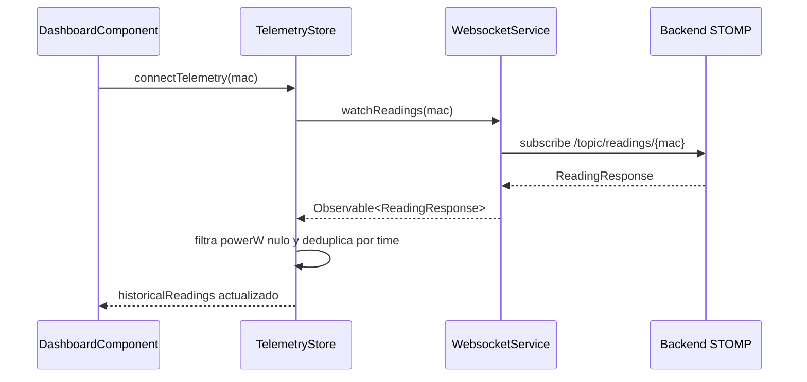
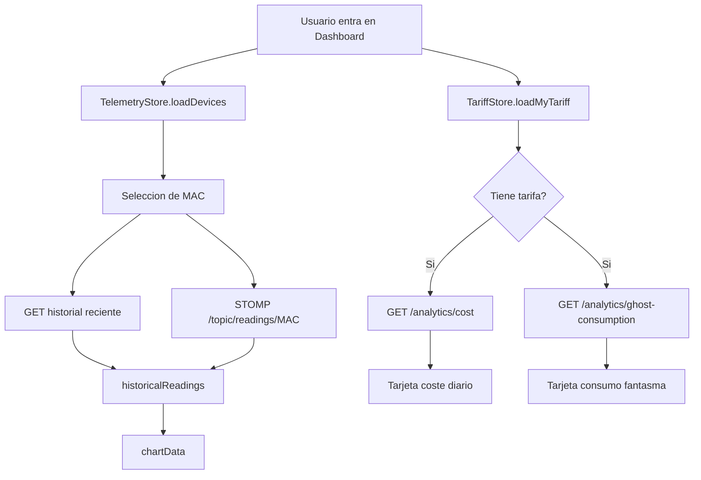

# Anexo B. Frontend Angular, RxJS y NgRx Signals

## 1. Vision general del frontend

El frontend esta en `frontend/src/app` y usa Angular 21 con componentes
standalone. La aplicacion no se organiza en modulos clasicos de Angular, sino en
rutas perezosas (`loadComponent`) que cargan cada pantalla cuando se necesita.

Stack principal:

| Tecnologia | Uso real |
| --- | --- |
| Angular 21.x | Componentes standalone, rutas, formularios y HTTP. |
| NgRx Signals | Stores reactivos `TelemetryStore` y `TariffStore`. |
| RxJS 7.8 | Operadores `switchMap`, `tap`, `filter`, `distinctUntilChanged`, `catchError`. |
| PrimeNG 21 | Inputs, tablas, dialogs, mensajes, selectores y graficas. |
| Chart.js 4 | Grafica de potencia del dashboard mediante `primeng/chart`. |
| STOMP | Suscripcion a lecturas en tiempo real por WebSocket. |
| Tailwind CSS 4 | Layout y estilos utilitarios. |

El arranque se hace en `main.ts`, que carga el componente raiz `App`. Este
componente solo contiene el `RouterOutlet`, por lo que toda la navegacion depende
de `app.routes.ts`.

## 2. Rutas y proteccion de navegacion

Archivo: `frontend/src/app/app.routes.ts`

| Ruta | Componente | Acceso |
| --- | --- | --- |
| `/login` | `LoginComponent` | Publico. |
| `/register` | `RegisterComponent` | Publico. |
| `/auth/oauth/callback` | `OAuthCallbackComponent` | Publico. |
| `/` | `MainLayoutComponent` | Protegido por `authGuard`. |
| `/dashboard` | `DashboardComponent` | Hijo protegido. |
| `/devices` | `DevicesComponent` | Hijo protegido. |
| `/tariffs` | `TariffComponent` | Hijo protegido. |
| `/alerts` | `AlertsComponent` | Hijo protegido. |

`authGuard` consulta `SessionStorageService.isLoggedIn()`. Si no hay JWT valido,
devuelve un `UrlTree` a `/login`. La comprobacion es de autenticacion, no de rol:
el rol `ROLE_ADMIN` se usa dentro de `TariffComponent` para activar o esconder
funciones de administracion.

## 3. Servicios Angular

### 3.1. `AuthService`

Archivo: `services/auth.service.ts`

| Metodo | Endpoint | DTO entrada | DTO salida |
| --- | --- | --- | --- |
| `authentication` | `POST /api/v1/auth/login` | `LoginUser` | `LoginUserJwt` |
| `register` | `POST /api/v1/auth/register` | `RegisterRequest` | `void` |
| `exchangeOAuthTicket` | `POST /api/v1/auth/oauth/exchange` | `{ ticket }` | `LoginUserJwt` |

El servicio no captura errores por dentro. Los componentes deciden que mensaje
mostrar al usuario, lo que permite adaptar el feedback segun pantalla.

### 3.2. `SessionStorageService`

Archivo: `services/session-storage.service.ts`

Gestiona el token con la clave `auth_token`. Decodifica el JWT con `jwt-decode`
para comprobar expiracion, roles y nombre de usuario.

| Metodo | Funcion |
| --- | --- |
| `saveToken` | Sustituye el token anterior por el nuevo. |
| `getToken` | Recupera el JWT o `null`. |
| `logout` | Elimina la sesion local. |
| `isLoggedIn` | Comprueba existencia y expiracion (`exp`). |
| `getAuthorities` | Lee roles del claim `authorities`. |
| `hasRole` | Comprueba si el usuario tiene un rol concreto. |
| `getUsername` | Devuelve el claim `username`. |

### 3.3. Interceptor HTTP

Archivo: `interceptors/http.interceptor.ts`

El interceptor tiene dos decisiones importantes:

1. Anade `X-Requested-With: XMLHttpRequest` a todas las peticiones.
2. Si la URL contiene `/api/v1` y no es una ruta publica de autenticacion, anade
   `Authorization: Bearer <token>`.

En caso de `401`, borra el token y redirige a `/login`. Esto evita que el usuario
permanezca en una pantalla privada con una sesion caducada.

```typescript
// La cabecera Bearer se anade aqui para que los componentes no repitan
// logica de autenticacion en cada llamada HTTP.
Authorization: `Bearer ${token}`
```

### 3.4. `TariffService`

Archivo: `services/tariff.service.ts`

| Metodo | HTTP | Uso |
| --- | --- | --- |
| `getCatalog` | `GET /api/v1/tariffs` | Catalogo maestro. |
| `getById` | `GET /api/v1/tariffs/{id}` | Preparado, no usado en componentes actuales. |
| `createCatalogTariff` | `POST /api/v1/tariffs` | Alta admin. |
| `updateCatalogTariff` | `POST /api/v1/tariffs/{id}` | Edicion admin, adaptada al backend. |
| `deleteCatalogTariff` | `DELETE /api/v1/tariffs/{id}` | Borrado admin. |
| `getMyTariff` | `GET /api/v1/users/me/tariff` | Tarifa privada; convierte `204` en `null`. |
| `saveMyTariff` | `POST /api/v1/users/me/tariff` | Asignar o editar tarifa privada. |
| `unlinkMyTariff` | `DELETE /api/v1/users/me/tariff` | Desvincular tarifa privada. |

La decision de mapear `204` a `null` en `getMyTariff` simplifica el frontend: los
componentes solo preguntan si `myTariff` existe.

### 3.5. `WebsocketService`

Archivo: `services/websocket.service.ts`

El servicio crea un cliente `RxStomp` y lo activa al instanciarse. Construye la
URL segun el protocolo actual:

- `ws://host/ws-iot` en HTTP.
- `wss://host/ws-iot` en HTTPS.

Metodo principal:

```typescript
watchReadings(macAddress: string): Observable<ReadingResponse>
```

Se suscribe a `/topic/readings/{macAddress}` y parsea cada mensaje JSON como
`ReadingResponse`.

### 3.6. `DeviceService`

Archivo: `services/device.service.ts`

Define un `httpResource<Device[]>` hacia `/api/v1/devices`, pero no esta usado por
los componentes actuales. La carga real de dispositivos esta en `TelemetryStore`.

## 4. Stores con NgRx Signals

### 4.1. `TelemetryStore`

Archivo: `store/telemetry.store.ts`

Estado inicial:

```typescript
{
  devices: [],
  selectedMac: null,
  historicalReadings: {},
  isLoadingDevices: false
}
```

Computed principal:

| Selector | Que devuelve |
| --- | --- |
| `currentReadings` | Historial de la MAC seleccionada o arrays vacios. |

#### Flujo de carga de dispositivos

`loadDevices` es un `rxMethod<void>` que:

1. Activa `isLoadingDevices`.
2. Llama a `GET /api/v1/devices`.
3. Guarda la lista.
4. Selecciona la primera MAC si no habia seleccion previa.
5. Desactiva el estado de carga.

Operadores usados: `tap` y `switchMap`.

#### Flujo de historial reciente

`loadRecentReadings(mac)` llama a:

```text
GET /api/v1/readings/device/{mac}/recent?seconds=120
```

Despues limita el resultado a 20 puntos. Esta limitacion no es casual: mantiene la
grafica legible y evita que cada actualizacion repinte un historico demasiado
grande.

#### Flujo de tiempo real

`connectTelemetry` escucha la MAC seleccionada:



Operadores clave:

| Operador | Motivo |
| --- | --- |
| `distinctUntilChanged()` | Evita reconectar si la MAC no cambia. |
| `switchMap()` | Cancela la suscripcion anterior al cambiar de dispositivo. |
| `filter()` | Descarta lecturas sin `powerW`, que no sirven para la grafica. |
| `distinctUntilChanged((prev, curr) => prev.time === curr.time)` | Evita duplicados si llegan eventos con el mismo timestamp. |
| `tap()` | Actualiza el estado con un buffer de 20 puntos. |

El store tambien define metodos CRUD (`claimDevice`, `createSimulatedDevice`,
`addDevice`, `updateDevice`, `deleteDevice`), aunque el componente de dispositivos
usa actualmente `HttpClient` directo y refresca con `store.loadDevices()`.

### 4.2. `TariffStore`

Archivo: `store/tariff.store.ts`

Estado inicial:

```typescript
{
  catalog: [],
  myTariff: null,
  isLoadingCatalog: false,
  isLoadingMyTariff: false,
  errorMessage: null
}
```

Computed:

| Selector | Significado |
| --- | --- |
| `hasMyTariff` | Indica si el usuario tiene tarifa activa. |
| `isCatalogEmpty` | Permite adaptar la UI si no hay plantillas. |

Metodos reactivos:

| Metodo | Servicio usado | Operadores |
| --- | --- | --- |
| `loadCatalog` | `TariffService.getCatalog` | `tap`, `switchMap`, `catchError`. |
| `loadMyTariff` | `TariffService.getMyTariff` | `tap`, `switchMap`, `catchError`. |
| `saveMyTariff` | `TariffService.saveMyTariff` | `tap`, `switchMap`, `catchError`. |
| `unlinkMyTariff` | `TariffService.unlinkMyTariff` | `tap`, `switchMap`, `catchError`. |
| `refreshAfterCatalogMutation` | `TariffService.getCatalog` | Preparado, no usado actualmente. |

`catchError(() => EMPTY)` evita que un error rompa el stream del `rxMethod`. En
vez de propagar la excepcion, el store guarda un `errorMessage` en espanol para
que el componente lo pinte.

## 5. Componentes principales

### 5.1. `LoginComponent`

Ruta: `/login`  
Archivo: `components/login/login.component.ts`

Usa formulario reactivo con `username` y `password`. En login correcto guarda el
JWT y navega a `/dashboard`. Tambien redirige a `/oauth2/authorization/google` o
`/oauth2/authorization/github` para login social.

Signals:

- `isLoading`
- `loginError`

Un `effect` limpia el error a los 7 segundos para que la pantalla no quede
permanentemente en estado de fallo.

### 5.2. `RegisterComponent`

Ruta: `/register`  
Archivo: `components/register/register.component.ts`

Formulario reactivo con email, password y confirmacion. Incluye validador de grupo
para comprobar que ambas contrasenas coinciden antes de llamar al backend.

### 5.3. `OAuthCallbackComponent`

Ruta: `/auth/oauth/callback`  
Archivo: `components/oauth-callback/oauth-callback.component.ts`

Lee `?ticket=` de la URL, llama a `AuthService.exchangeOAuthTicket` y guarda el
JWT. Si no hay ticket o falla el intercambio, muestra error y permite volver a
login.

### 5.4. `MainLayoutComponent`

Archivo: `components/main-layout/main-layout.component.ts`

Actua como carcasa de la zona privada. En logout corta la telemetria activa con
`telemetryStore.connectTelemetry(null)`, resetea stores y elimina el token.

Esta limpieza evita que un segundo usuario vea datos cacheados del anterior tras
cerrar sesion.

### 5.5. `DashboardComponent`

Ruta: `/dashboard`  
Archivo: `components/dashboard/dashboard.component.ts`

Responsabilidades:

- Cargar dispositivos (`TelemetryStore.loadDevices`).
- Cargar tarifa del usuario (`TariffStore.loadMyTariff`).
- Conectar a STOMP para la MAC seleccionada.
- Consultar coste total y consumo fantasma.
- Construir `chartData` para PrimeNG Chart.

Signals locales:

- `totalCostEur`
- `ghostCostEur`
- `isLoadingAnalytics`
- `analyticsError`

Computed relevantes:

| Computed | Uso |
| --- | --- |
| `powerW` | Ultimo valor de potencia. |
| `timestamps` | Etiquetas de la grafica. |
| `formattedTime` | Hora de la ultima lectura. |
| `chartData` | Dataset completo para Chart.js. |

El componente usa `effect` para reaccionar a cambios en `selectedMac` y
`hasMyTariff`. Esta decision reduce llamadas manuales desde la plantilla: cuando
cambia el dispositivo o la tarifa, se recalculan las metricas necesarias.

### 5.6. `DevicesComponent`

Ruta: `/devices`  
Archivo: `components/devices/devices.component.ts`

Gestiona alta fisica, simuladores, demo pack, borrado, detalle y edicion. Usa
formularios reactivos con validadores dinamicos segun el tipo de dispositivo:

- Fisico: requiere `macAddress`.
- Simulado: requiere `simulationProfile`.

Endpoints usados directamente con `HttpClient`:

| Accion | Endpoint |
| --- | --- |
| Reclamar fisico | `POST /api/v1/devices/claim` |
| Crear simulado | `POST /api/v1/devices/simulated` |
| Crear demo pack | `POST /api/v1/devices/simulated/demo-pack` |
| Borrar | `DELETE /api/v1/devices/{id}` |
| Editar/toggle | `PUT /api/v1/devices/{id}` |

Tras cada mutacion recarga el listado mediante `store.loadDevices()`.

### 5.7. `TariffComponent`

Ruta: `/tariffs`  
Archivo: `components/tariff/tariff.component.ts`

Es el componente mas complejo del frontend. Gestiona dos contextos:

- Catalogo maestro para administradores.
- Tarifa privada del usuario autenticado.

El formulario usa `FormArray` para periodos de energia y potencias contratadas.
El validador `ascendingPowerValidator` comprueba que las potencias contratadas no
rompan el orden esperado por periodos.

Computed:

- `isAdmin`: lee `ROLE_ADMIN` desde `SessionStorageService`.
- `isEditingMyTariffMode`: distingue si se edita la tarifa privada o una plantilla.

### 5.8. `AlertsComponent`

Ruta: `/alerts`  
Archivo: `components/alerts/alerts.component.ts`

Lista alertas con `GET /api/v1/alerts` y permite descartarlas con
`DELETE /api/v1/alerts/{id}`. Usa signals locales para lista, carga y mensajes.

## 6. Flujo completo de datos en el dashboard



## 7. Observaciones tecnicas

- `DeviceService` esta preparado con `httpResource`, pero no se usa.
- `TelemetryStore` define CRUD reactivo, pero `DevicesComponent` usa `HttpClient`
  directo. Esto reparte la logica en dos sitios.
- `setSelectedMac` carga historial y el `effect` del dashboard tambien puede
  cargarlo al cambiar MAC, lo que puede provocar peticion duplicada.
- `WebsocketService` no envia JWT en el handshake; depende de que el backend
  permita `/ws-iot`.
- La suscripcion STOMP se corta en logout, pero si el usuario navega fuera del
  dashboard sin cerrar sesion, el store root puede seguir recibiendo lecturas.
- `ReadingsHistory` declara `timestamps: number[]`, mientras que el store usa
  strings ISO. No rompe la UI actual, pero conviene unificar tipos.
