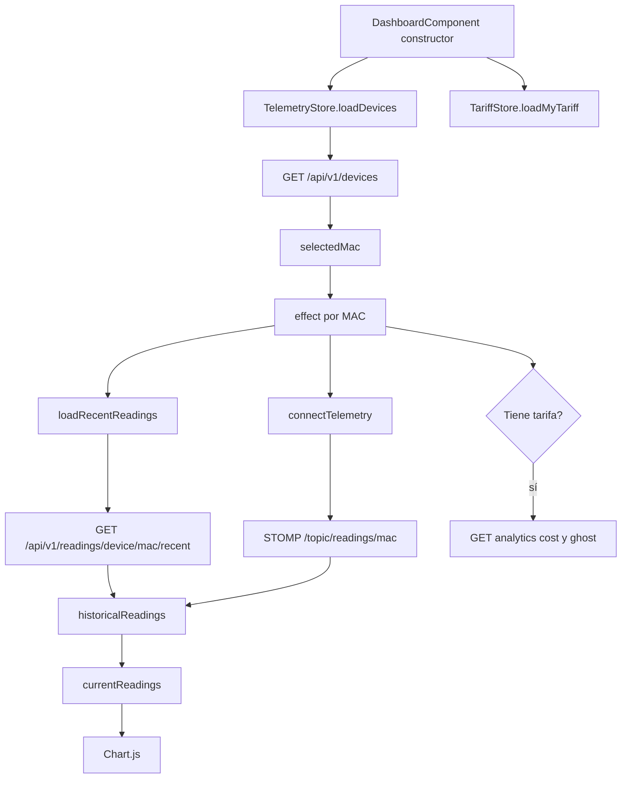
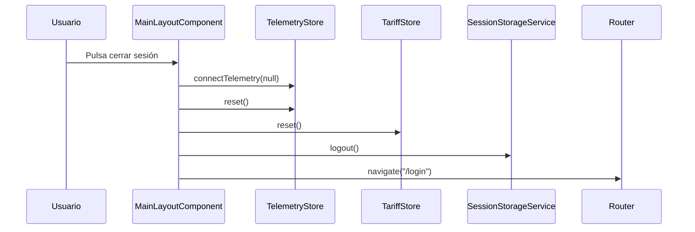

# Anexo B. Frontend Angular, RxJS y NgRx Signals

## 1. Visión general

El frontend está en `frontend/` y usa Angular 21 con componentes standalone. No hay `NgModule` clásico. La aplicación se arranca desde `src/main.ts`, carga la configuración de `src/app/app.config.ts` y organiza la navegación en `src/app/app.routes.ts`.

Tecnologías principales:

- Angular 21 y TypeScript 5.9.
- PrimeNG 21 para tablas, formularios, mensajes, selectores y gráficas.
- Tailwind CSS 4 para estilos utilitarios.
- Chart.js integrado mediante PrimeNG Chart.
- RxJS 7.8 para flujos HTTP y WebSocket.
- `@ngrx/signals` para stores ligeros con signals.
- `@stomp/rx-stomp` para consumir telemetría en tiempo real.

## 2. Rutas y protección de navegación

**Archivo:** `frontend/src/app/app.routes.ts`

| Ruta | Componente | Tipo |
| --- | --- | --- |
| `/login` | `LoginComponent` | Pública |
| `/register` | `RegisterComponent` | Pública |
| `/auth/oauth/callback` | `OAuthCallbackComponent` | Pública |
| `/dashboard` | `DashboardComponent` dentro de `MainLayoutComponent` | Protegida |
| `/devices` | `DevicesComponent` dentro de `MainLayoutComponent` | Protegida |
| `/tariffs` | `TariffComponent` dentro de `MainLayoutComponent` | Protegida |
| `/alerts` | `AlertsComponent` dentro de `MainLayoutComponent` | Protegida |

El layout principal se protege con `canActivate` y `canActivateChild`. Esta doble protección tiene sentido porque valida tanto la entrada inicial al chasis autenticado como cada navegación interna entre secciones.

**Archivo:** `frontend/src/app/guards/auth.guard.ts`

```ts
export const authGuard: CanActivateFn = () => {
  const router = inject(Router);
  const sessionStorageService = inject(SessionStorageService);

  const isLogged = sessionStorageService.isLoggedIn();
  return isLogged ? true : router.createUrlTree(["/login"]);
};
```

## 3. Gestión de sesión e interceptor HTTP

### 3.1. `SessionStorageService`

**Archivo:** `frontend/src/app/services/session-storage.service.ts`

Este servicio guarda el JWT en `sessionStorage` con la clave `auth_token`. Se usa `sessionStorage` y no `localStorage`, por lo que la sesión queda limitada a la pestaña o sesión del navegador.

Métodos principales:

| Método | Uso |
| --- | --- |
| `saveToken(token)` | Guarda el JWT tras login u OAuth2. |
| `getToken()` | Recupera el token actual. |
| `logout()` | Borra solo `auth_token`. |
| `isLoggedIn()` | Decodifica el JWT y comprueba `exp`. |
| `getAuthorities()` | Lee roles del claim `authorities`. |
| `hasRole(role)` | Permite distinguir `ROLE_USER` y `ROLE_ADMIN`. |
| `getUsername()` | Obtiene el usuario del claim `username`. |

### 3.2. `httpInterceptor`

**Archivo:** `frontend/src/app/interceptors/http.interceptor.ts`

El interceptor añade:

- `X-Requested-With: XMLHttpRequest` a todas las peticiones.
- `Authorization: Bearer <token>` a rutas `/api/v1`, excepto login, registro y OAuth exchange.
- Redirección a `/login` si el backend responde `401`.

La intención es que los componentes no tengan que repetir la lógica de autenticación. Cualquier servicio o componente que llame a `/api/v1/*` hereda automáticamente el JWT si procede.

## 4. Componentes principales

| Componente | Archivo | Responsabilidad |
| --- | --- | --- |
| `App` | `src/app/app.ts` | Shell mínimo con `RouterOutlet`. |
| `LoginComponent` | `components/login/login.component.ts` | Login clásico y enlaces OAuth2. |
| `RegisterComponent` | `components/register/register.component.ts` | Alta de usuario con validación de contraseña. |
| `OAuthCallbackComponent` | `components/oauth-callback/oauth-callback.component.ts` | Intercambia ticket OAuth2 por JWT. |
| `MainLayoutComponent` | `components/main-layout/main-layout.component.ts` | Layout autenticado, menú y logout. |
| `DashboardComponent` | `components/dashboard/dashboard.component.ts` | Gráfica de potencia, analítica y selección de dispositivo. |
| `DevicesComponent` | `components/devices/devices.component.ts` | Alta, vinculación, simuladores, edición y borrado de dispositivos. |
| `TariffComponent` | `components/tariff/tariff.component.ts` | Catálogo de tarifas y contrato privado del usuario. |
| `AlertsComponent` | `components/alerts/alerts.component.ts` | Listado y eliminación de alertas. |

## 5. Stores con NgRx Signals

El proyecto no usa NgRx Store clásico ni Effects. Usa `signalStore` de `@ngrx/signals`, que encaja mejor con Angular moderno porque combina estado global, computed signals y métodos reactivos sin montar toda la infraestructura de Redux.

### 5.1. `TelemetryStore`

**Archivo:** `frontend/src/app/store/telemetry.store.ts`

Estado:

```ts
const initialState: TelemetryState = {
  devices: [],
  selectedMac: null,
  historicalReadings: {},
  isLoadingDevices: false,
};
```

Campos:

| Campo | Tipo funcional | Uso |
| --- | --- | --- |
| `devices` | Lista | Dispositivos del usuario. |
| `selectedMac` | Estado de selección | MAC activa en el dashboard. |
| `historicalReadings` | Diccionario por MAC | Buffer de timestamps y potencias. |
| `isLoadingDevices` | Booleano | Carga del listado. |

Computed:

- `currentReadings`: devuelve las lecturas de la MAC seleccionada o arrays vacíos si no hay selección.

Métodos principales:

| Método | Tipo | Lógica |
| --- | --- | --- |
| `loadDevices` | `rxMethod<void>` | `GET /api/v1/devices`; carga dispositivos y selecciona la primera MAC si no hay otra. |
| `setSelectedMac` | Síncrono | Cambia la MAC activa y carga histórico reciente. |
| `loadRecentReadings` | Método interno expuesto | `GET /api/v1/readings/device/{mac}/recent?seconds=120`; mantiene los últimos 20 puntos. |
| `claimDevice` | `rxMethod` | Reclama un dispositivo físico. |
| `createSimulatedDevice` | `rxMethod` | Crea simulador. |
| `updateDevice` | `rxMethod` | Actualiza dispositivo. |
| `deleteDevice` | `rxMethod` | Borra dispositivo y recalcula selección. |
| `connectTelemetry` | `rxMethod<string \| null>` | Abre escucha WebSocket por MAC. |
| `reset` | Síncrono | Limpia datos al cerrar sesión. |

El uso de `switchMap` en `connectTelemetry` es clave: cuando cambia la MAC seleccionada, se abandona la suscripción anterior y se escucha el nuevo topic.

```ts
connectTelemetry: rxMethod<string | null>(
  pipe(
    distinctUntilChanged(),
    switchMap((mac) => {
      if (!mac) return of(null);
      return wsService.watchReadings(mac).pipe(
        filter((r) => (r.powerW as number | null | undefined) != null),
        distinctUntilChanged((prev, curr) => prev.time === curr.time),
        tap({ next: (reading) => { /* actualiza buffer de 20 puntos */ } }),
      );
    }),
  ),
)
```

### 5.2. `TariffStore`

**Archivo:** `frontend/src/app/store/tariff.store.ts`

Estado:

| Campo | Uso |
| --- | --- |
| `catalog` | Tarifas plantilla disponibles. |
| `myTariff` | Tarifa privada del usuario autenticado. |
| `isLoadingCatalog` | Estado de carga del catálogo. |
| `isLoadingMyTariff` | Estado de carga de la tarifa privada. |
| `errorMessage` | Mensaje técnico o de negocio para la UI. |

Computed:

- `hasMyTariff`: `true` si el usuario ya tiene tarifa configurada.
- `isCatalogEmpty`: `true` si no hay plantillas.

Métodos:

| Método | Endpoint |
| --- | --- |
| `loadCatalog` | `GET /api/v1/tariffs` |
| `loadMyTariff` | `GET /api/v1/users/me/tariff` |
| `saveMyTariff` | `POST /api/v1/users/me/tariff` |
| `unlinkMyTariff` | `DELETE /api/v1/users/me/tariff` |
| `refreshAfterCatalogMutation` | Recarga catálogo tras cambios admin |

El store usa `catchError(() => EMPTY)` para cortar el flujo tras registrar el error en estado. Así se evita que un fallo HTTP rompa toda la cadena reactiva.

## 6. Servicios Angular

| Servicio | Archivo | Función |
| --- | --- | --- |
| `AuthService` | `services/auth.service.ts` | Login, registro e intercambio OAuth. |
| `TariffService` | `services/tariff.service.ts` | Catálogo y tarifa privada. |
| `SessionStorageService` | `services/session-storage.service.ts` | JWT, roles y sesión. |
| `WebsocketService` | `services/websocket.service.ts` | Conexión STOMP a `/ws-iot`. |
| `DeviceService` | `services/device.service.ts` | Define `httpResource<Device[]>`; actualmente no es el servicio principal usado por componentes. |

### 6.1. `WebsocketService`

El servicio construye la URL WebSocket según el protocolo actual:

```ts
const protocol = window.location.protocol === "https:" ? "wss:" : "ws:";
const wsUrl = `${protocol}//${window.location.host}/ws-iot`;
```

Esto evita hardcodear dominio y permite que el mismo código funcione en local (`ws://localhost:4200/ws-iot` con proxy) y en producción (`wss://wattimizer.com/ws-iot`).

`watchReadings(macAddress)` se suscribe al topic:

```text
/topic/readings/{macAddress}
```

y parsea cada mensaje JSON como `ReadingResponse`.

## 7. Flujo del dashboard

**Archivo:** `frontend/src/app/components/dashboard/dashboard.component.ts`



El dashboard combina dos fuentes:

1. **REST:** carga inicial de lecturas recientes.
2. **WebSocket:** nuevas lecturas en tiempo real.

La gráfica se construye con computed signals:

- `powerW`: valores del eje Y.
- `formattedTime`: etiquetas de tiempo en formato español.
- `chartData`: estructura esperada por Chart.js.

Además, el componente calcula métricas del día con dos peticiones HTTP:

- `GET /api/v1/analytics/cost`
- `GET /api/v1/analytics/ghost-consumption`

Solo se lanzan si existe tarifa privada (`hasMyTariff()`), porque sin tarifa no se puede convertir kWh en euros.

## 8. Formularios y validación

### 8.1. Login

**Archivo:** `components/login/login.component.ts`

- `username`: requerido y formato email.
- `password`: requerido y longitud mínima.
- Si el formulario es inválido, se marca todo como touched.
- Si el login responde con JWT, se guarda en `SessionStorageService`.

### 8.2. Registro

**Archivo:** `components/register/register.component.ts`

- `username`: requerido y email.
- `password`: requerido.
- `confirmPassword`: requerido.
- Validador de grupo para comprobar que las contraseñas coinciden.

### 8.3. Dispositivos

**Archivo:** `components/devices/devices.component.ts`

Formulario de alta:

| Campo | Validación |
| --- | --- |
| `deviceKind` | Requerido; valores `physical` o `simulated`. |
| `name` | Requerido, mínimo 3 caracteres. |
| `macAddress` | Requerido para físico; patrón `^[0-9A-Fa-f]{12}$`. |
| `simulationProfile` | Requerido para simulador. |

La validación cambia dinámicamente según el tipo de dispositivo. Si el usuario elige físico, se exige MAC. Si elige simulado, se exige perfil y la MAC no se introduce manualmente.

### 8.4. Tarifas

**Archivo:** `components/tariff/tariff.component.ts`

El formulario de tarifas es el más complejo del frontend. Usa `FormArray` para periodos de energía y potencias contratadas.

Reglas relevantes:

- `accessTariffCode`: `2.0TD`, `3.0TD`, `6.1TD`, `6.2TD`.
- Al cambiar el peaje, se reconstruyen los arrays de periodos.
- `priceKwh` debe ser mayor que `0.0001`.
- `contractedPowerKw` debe ser mayor que `0.001`.
- `ascendingPowerValidator` impone que las potencias no bajen de P1 a P6.

La lógica del formulario copia en frontend parte de la estructura regulatoria para ofrecer una experiencia guiada antes de enviar datos al backend.

## 9. Observaciones arquitectónicas

- La aplicación usa un patrón híbrido: stores para estado global, pero algunos componentes hacen HTTP directo cuando la operación es muy local.
- `DevicesComponent` usa `HttpClient` directamente para crear/vincular/borrar y después llama a `store.loadDevices()` para refrescar.
- `DashboardComponent` usa store para telemetría, pero HTTP directo para analítica económica.
- `TariffComponent` combina `TariffStore` con `TariffService`, porque hay operaciones de formulario y administración que actualizan estado de forma específica.
- Al cerrar sesión, `MainLayoutComponent` limpia stores para que un usuario no vea datos cacheados del anterior.

## 10. Flujo de cierre de sesión



Este flujo es importante en una aplicación multitenant. Aunque el JWT ya no exista, también se limpian los datos reactivos en memoria para evitar que queden visibles al cambiar de usuario.

