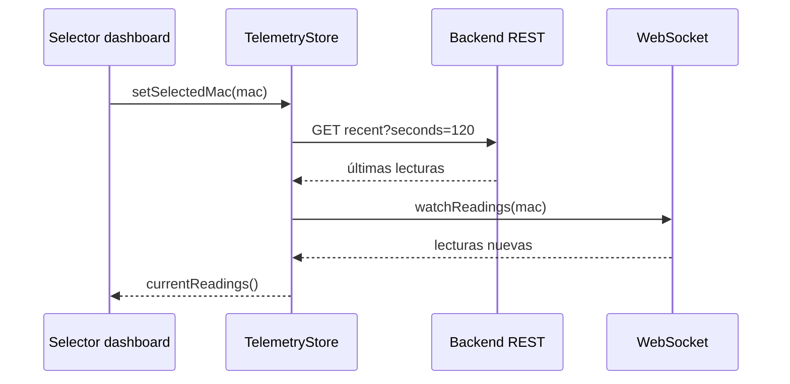

# Anexo B - Frontend Angular, RxJS y NgRx Signals

## 1. Visión general

El frontend de Wattimizer está construido con **Angular 21** usando componentes standalone. La aplicación funciona como SPA y se comunica con el backend por dos vías:

- **REST JSON** para autenticación, dispositivos, tarifas, alertas y analíticas.
- **STOMP sobre WebSocket** para recibir telemetría de potencia en tiempo real.

La interfaz usa PrimeNG para formularios, tablas, botones, diálogos y gráficas, mientras que Tailwind CSS aporta utilidades de maquetación.

## 2. Enrutado principal

| Ruta | Componente | Protección | Función |
| --- | --- | --- | --- |
| `/login` | `LoginComponent` | Pública | Login con email/contraseña y acceso OAuth2. |
| `/register` | `RegisterComponent` | Pública | Registro de usuario. |
| `/auth/oauth/callback` | `OAuthCallbackComponent` | Pública | Canje de ticket OAuth2 por JWT. |
| `/dashboard` | `DashboardComponent` dentro de `MainLayoutComponent` | `authGuard` | Panel de telemetría y costes. |
| `/devices` | `DevicesComponent` | `authGuard` | Gestión de medidores físicos y simulados. |
| `/tariffs` | `TariffComponent` | `authGuard` | Catálogo y tarifa privada. |
| `/alerts` | `AlertsComponent` | `authGuard` | Consulta y borrado de alertas. |

El layout principal agrupa las rutas privadas. Al cerrar sesión, `MainLayoutComponent` borra el token, desconecta la telemetría y resetea los stores para que un usuario no vea datos cacheados de otro.

## 3. Servicios Angular

### 3.1. `AuthService`

Gestiona operaciones de autenticación:

| Método | Endpoint | Uso |
| --- | --- | --- |
| `authentication()` | `POST /api/v1/auth/login` | Login tradicional. |
| `register()` | `POST /api/v1/auth/register` | Alta de usuario. |
| `exchangeOAuthTicket()` | `POST /api/v1/auth/oauth/exchange` | Canje de ticket social por JWT. |

### 3.2. `SessionStorageService`

Centraliza el JWT en `sessionStorage` con la clave `auth_token`. También decodifica el token para obtener:

- `username`
- `authorities`
- expiración (`exp`)
- comprobación de rol con `hasRole`

Separar esta lógica evita repetir decodificación JWT en cada componente.

### 3.3. `TariffService`

Expone métodos HTTP para:

- leer catálogo (`GET /api/v1/tariffs`);
- obtener tarifa por id;
- crear, actualizar y borrar tarifas maestras como administrador;
- leer, guardar y desvincular la tarifa privada de `/api/v1/users/me/tariff`.

### 3.4. `WebsocketService`

Abre una conexión STOMP contra `/ws-iot` y se suscribe a:

```text
/topic/readings/{macAddress}
```

Devuelve un `Observable<ReadingResponse>`, lo que permite que el store decida cuándo conectarse, desconectarse o cambiar de MAC.

### 3.5. `DeviceService`

Existe un `httpResource` para `GET /api/v1/devices`, pero no es el mecanismo principal usado por la UI. En la aplicación real, la carga de dispositivos se gestiona desde `TelemetryStore.loadDevices()` y, en algunos casos, desde peticiones directas de `DevicesComponent`.

## 4. Interfaces principales

### 4.1. Dispositivo

```ts
export interface Device {
  id: number;
  username: string;
  name: string;
  macAddress: string;
  isOn: boolean;
  simulated: boolean;
  simulationProfile: SimulationProfile | null;
}
```

`simulated` y `simulationProfile` permiten distinguir entre hardware real y medidores generados por software. Esta distinción se usa en la tabla de dispositivos y en el formulario de edición.

### 4.2. Solicitudes de alta

```ts
export interface ClaimDeviceRequest {
  name: string;
  macAddress: string;
}

export interface CreateSimulatedDeviceRequest {
  name: string;
  simulationProfile: SimulationProfile;
}
```

El frontend separa alta física y alta simulada porque los datos necesarios no son los mismos: un Shelly real necesita MAC, mientras que un simulador necesita perfil de consumo.

### 4.3. Lectura de telemetría

```ts
export interface ReadingResponse {
  time: string | number;
  macAddress: string;
  powerW: number;
  energyTotalKwh: number;
  isOn: boolean;
}
```

`time` acepta `string | number` porque las lecturas pueden llegar desde HTTP serializadas como fecha ISO o desde flujos que ya vienen normalizados de otra forma. El store convierte el valor a `String(reading.time)` antes de pintarlo en la gráfica.

### 4.4. Estado de telemetría

```ts
export interface TelemetryState {
  devices: Device[];
  selectedMac: string | null;
  historicalReadings: {
    [macAddress: string]: {
      timestamps: string[];
      powerW: number[];
    };
  };
  isLoadingDevices: boolean;
}
```

La clave de este diseño es `historicalReadings` indexado por MAC. Si solo existiera una lista global de lecturas, al cambiar de medidor se mezclarían puntos de dispositivos distintos.

## 5. Estado global con `@ngrx/signals`

Wattimizer no usa NgRx clásico con `Store`, `Actions`, `Reducers` y `Effects`. Usa **NgRx Signals**, una variante más ligera basada en signals de Angular.

### 5.1. `TelemetryStore`

Responsabilidades:

- cargar dispositivos del usuario;
- recordar la MAC seleccionada;
- cargar histórico reciente por HTTP;
- abrir el WebSocket del medidor activo;
- mantener las últimas 20 lecturas por MAC;
- limpiar estado al cerrar sesión.

#### Estado inicial

```ts
const initialState: TelemetryState = {
  devices: [],
  selectedMac: null,
  historicalReadings: {},
  isLoadingDevices: false,
};
```

#### Selector calculado

```ts
currentReadings: computed(() => {
  const mac = state.selectedMac();
  return mac
    ? (state.historicalReadings()[mac] ?? { timestamps: [], powerW: [] })
    : { timestamps: [], powerW: [] };
});
```

Este computed permite que el dashboard lea siempre "las lecturas del medidor activo" sin conocer la estructura interna del diccionario.

#### Carga de dispositivos

`loadDevices` usa `rxMethod` y `switchMap` para llamar a `GET /api/v1/devices`. Si la lista contiene dispositivos y no había selección previa, elige la primera MAC como activa.

#### Cambio de medidor activo

```ts
setSelectedMac(mac: string | null): void {
  patchState(store, { selectedMac: mac });
  if (mac) {
    loadRecentReadings(mac);
  }
}
```

Primero se cambia el estado y después se carga el historial reciente. Este orden hace que el dashboard pueda reaccionar inmediatamente al cambio, aunque el histórico tarde unos milisegundos en llegar.

#### Histórico reciente

`loadRecentReadings(mac)` llama a:

```http
GET /api/v1/readings/device/{mac}/recent?seconds=120
```

Después se queda con un máximo de 20 lecturas. Es una decisión pensada para que la gráfica sea estable y no se llene de demasiados puntos.

#### WebSocket por MAC

`connectTelemetry` recibe una MAC o `null`. Si no hay MAC, devuelve `of(null)`. Si hay MAC, se suscribe al WebSocket y aplica:

- `distinctUntilChanged()` para no reconectar si la MAC no cambia;
- `filter()` para descartar lecturas sin `powerW`;
- `distinctUntilChanged((prev, curr) => prev.time === curr.time)` para evitar duplicados por timestamp;
- `tap()` para insertar la lectura y limitar el buffer a 20 puntos.

### 5.2. `TariffStore`

Responsabilidades:

- cargar catálogo de tarifas;
- cargar tarifa privada del usuario;
- guardar o desvincular contrato;
- refrescar catálogo tras mutaciones de administrador;
- exponer computed como `hasMyTariff` e `isCatalogEmpty`.

El dashboard consulta `hasMyTariff()` antes de pedir analíticas. Si no hay tarifa, muestra aviso y evita peticiones que terminarían en coste cero.

## 6. Componentes principales

### 6.1. `MainLayoutComponent`

Actúa como shell de la zona privada:

- menú lateral con Dashboard, Dispositivos, Tarifas y Alertas;
- muestra el usuario autenticado;
- ejecuta logout centralizado.

La limpieza en logout es importante porque `TelemetryStore` conserva históricos por MAC. Sin reset, otro usuario en el mismo navegador podría ver datos anteriores.

### 6.2. `DashboardComponent`

El dashboard muestra:

- selector de medidor activo;
- gráfica de potencia en vatios;
- coste diario;
- coste fantasma nocturno;
- nombre de compañía/tarifa si existe contrato;
- aviso cuando no hay tarifa asignada.

Flujo al cambiar de medidor:



El componente también calcula las fechas de analítica del día: inicio a medianoche local del navegador y fin en el momento actual convertido a ISO. El backend interpreta el periodo tarifario con la zona configurada en la tarifa.

### 6.3. `DevicesComponent`

Gestiona inventario y operaciones sobre medidores.

#### Alta física

Campos:

- nombre;
- MAC de 12 caracteres hexadecimales.

Endpoint:

```http
POST /api/v1/devices/claim
```

#### Alta simulada

Campos:

- nombre;
- perfil de simulación.

Endpoint:

```http
POST /api/v1/devices/simulated
```

El componente cambia validadores según el tipo elegido. Si el usuario selecciona "simulado", ya no tiene sentido exigir una MAC real, porque el backend generará una `SIM#########`.

#### Pack de demostración

Endpoint:

```http
POST /api/v1/devices/simulated/demo-pack
```

Crea hasta nueve dispositivos, uno por perfil no repetido. En la UI se muestra un mensaje distinto si ya existían todos los perfiles.

#### Edición y borrado

La edición permite cambiar:

- nombre;
- estado `isOn`;
- perfil, solo si el dispositivo es simulado.

El borrado llama a `DELETE /api/v1/devices/{id}`. Si el backend devuelve error, el componente intenta mostrar `err.error?.message`, que es útil en conflictos de integridad.

### 6.4. `TariffComponent`

Combina dos casos de uso:

- administrador: mantenimiento del catálogo maestro;
- usuario: selección y edición de su tarifa privada.

El formulario reactivo crea arrays de periodos y potencias según el peaje. Para `2.0TD` se trabajan menos periodos que para `3.0TD`, `6.1TD` o `6.2TD`.

### 6.5. `AlertsComponent`

Carga alertas del usuario con:

```http
GET /api/v1/alerts
```

Y descarta una alerta con:

```http
DELETE /api/v1/alerts/{id}
```

El componente mantiene signals locales para lista, loading y mensajes de error/éxito.

### 6.6. Login, registro y OAuth callback

- `LoginComponent`: guarda JWT en `sessionStorage` y navega a `/dashboard`.
- `RegisterComponent`: valida que `password` y `confirmPassword` coincidan.
- `OAuthCallbackComponent`: lee `ticket` en query string, llama a `exchangeOAuthTicket()` y guarda el JWT.

## 7. Interceptor HTTP

El interceptor añade:

```http
X-Requested-With: XMLHttpRequest
Authorization: Bearer <jwt>
```

La cabecera JWT se omite en rutas públicas de autenticación. Ante un `401`, el interceptor cierra sesión y redirige a `/login`. Esta decisión evita que el usuario siga usando la SPA con un token caducado.

## 8. Flujo reactivo completo del dashboard

```mermaid
flowchart TD
    A[Usuario entra en Dashboard] --> B[TelemetryStore.loadDevices]
    B --> C{Hay dispositivos}
    C -->|Sí| D[Selecciona primera MAC o conserva selectedMac]
    C -->|No| E[Muestra estado sin medidores]
    D --> F[loadRecentReadings]
    F --> G[historicalReadings mac]
    D --> H[connectTelemetry mac]
    H --> I[Buffer circular de 20 lecturas]
    I --> J[Chart PrimeNG]
    D --> K{Tiene tarifa}
    K -->|Sí| L[GET analytics cost y ghost-consumption]
    K -->|No| M[Aviso de configurar tarifa]
```



## 9. Decisiones destacadas

- **Signals para estado local y global:** reducen código repetitivo frente a NgRx clásico.
- **Histórico por MAC:** evita mezclar series de diferentes medidores.
- **Precarga HTTP antes del WebSocket:** permite que la gráfica no aparezca vacía al cambiar de dispositivo.
- **Buffer de 20 lecturas:** mantiene la gráfica legible y ligera.
- **Alta simulada separada de alta física:** refleja que los datos requeridos son distintos.
- **Reset en logout:** protege datos de usuarios anteriores en navegadores compartidos.

## 10. Puntos mejorables

- Unificar operaciones CRUD de dispositivos: ahora existen métodos en `TelemetryStore`, pero `DevicesComponent` también realiza HTTP directo y refresca después.
- Proteger STOMP con JWT para que la seguridad de WebSocket esté alineada con REST.
- Sustituir algunas suscripciones manuales por patrones más declarativos cuando la complejidad crezca.
- Revisar la interfaz `ReadingsHistory`, que queda fuera del flujo activo actual.
