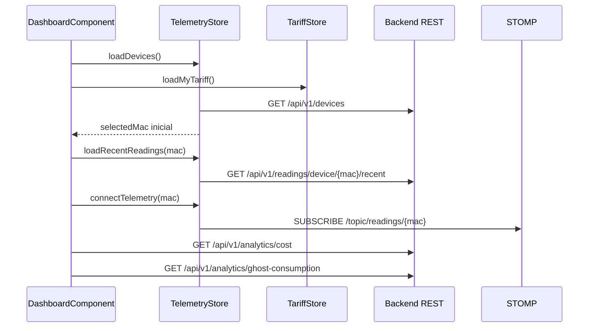

# Anexo B. Frontend Angular, RxJS y NgRx Signals

El frontend de Wattimizer está desarrollado con Angular 21 y componentes standalone. La aplicación no utiliza NgModules tradicionales para las vistas principales; cada pantalla se carga desde el router y declara sus imports. El estado compartido se gestiona con NgRx Signals y los flujos asíncronos se apoyan en RxJS.

## B.1. Estructura general

| Elemento | Archivo | Función |
|---|---|---|
| Bootstrap | `frontend/src/main.ts` | Arranca `App` con `appConfig`. |
| Configuración | `frontend/src/app/app.config.ts` | Router, HTTP interceptor, animaciones y PrimeNG. |
| Rutas | `frontend/src/app/app.routes.ts` | Login, registro, callback OAuth2 y layout privado. |
| Stores | `frontend/src/app/store/telemetry.store.ts`, `tariff.store.ts` | Estado global de telemetría y tarifas. |
| Servicios | `frontend/src/app/services/*.ts` | Auth, tarifas, WebSocket y sesión. |
| Interceptor | `frontend/src/app/interceptors/http.interceptor.ts` | Inserta JWT en `/api/v1` y gestiona 401. |

La aplicación se sirve como SPA. En desarrollo, `proxy.conf.json` reenvía `/api`, `/oauth2` y `/ws-iot` al backend local. En producción, Nginx realiza esa función.

## B.2. Componentes principales

### B.2.1. `MainLayoutComponent`

Representa el marco privado de la aplicación: navegación lateral, cabecera y `<router-outlet>`. Su método de logout no se limita a borrar el JWT:

1. Llama a `telemetryStore.connectTelemetry(null)` para cerrar la suscripción activa.
2. Ejecuta `telemetryStore.reset()` y `tariffStore.reset()` para no dejar datos cacheados.
3. Borra el token con `SessionStorageService.logout()`.
4. Redirige a `/login` con `replaceUrl`.

Esta limpieza es importante porque la aplicación trabaja con datos de empresa. Si no se resetean los stores, un segundo usuario podría ver lecturas o tarifas del usuario anterior en la misma pestaña.

### B.2.2. `DashboardComponent`

Es la pantalla principal de monitorización. Usa:

- `TelemetryStore` para dispositivos, MAC seleccionada e histórico de potencia.
- `TariffStore` para saber si hay tarifa privada asignada.
- `HttpClient` directo para `/api/v1/analytics/cost` y `/api/v1/analytics/ghost-consumption`.
- PrimeNG Chart, que internamente usa Chart.js.

Flujo de carga:



El componente solo consulta las métricas económicas si `TariffStore.hasMyTariff()` es verdadero. Esta decisión evita mostrar importes sin base tarifaria.

### B.2.3. `DevicesComponent`

Gestiona el alta, edición y borrado de dispositivos.

| Caso | Endpoint usado | Decisión |
|---|---|---|
| Físico | `POST /api/v1/devices/claim` | Vincula una MAC real al usuario autenticado. |
| Simulado | `POST /api/v1/devices/simulated` | Crea un dispositivo `SIM...` con perfil de consumo. |
| Pack demo | `POST /api/v1/devices/simulated/demo-pack` | Crea varios simuladores para pruebas de interfaz. |
| Borrado | `DELETE /api/v1/devices/{id}` | El backend borra también lecturas y alertas. |
| Encendido/apagado | `PUT /api/v1/devices/{id}` | Cambia `isOn`. |
| Edición | `PUT /api/v1/devices/{id}` | Modifica nombre y, si es simulado, perfil. |

El formulario cambia sus validaciones según `deviceKind`. Si el usuario elige "Físico", exige MAC de 12 caracteres hexadecimales. Si elige "Simulado", deshabilita la MAC y exige `simulationProfile`.

### B.2.4. `TariffComponent`

Esta pantalla tiene dos modos:

- **Administrador:** gestiona el catálogo maestro con `TariffService`.
- **Usuario:** asigna una plantilla a su cuenta o edita precios/potencias de su contrato privado.

La parte más sensible es el formulario de periodos:

- `ENERGY_PERIODS` define periodos de energía por peaje: `2.0TD` usa P1-P3 y `3.0TD`/`6.xTD` usan P1-P6.
- `POWER_PERIODS` define potencias contratadas: `2.0TD` usa P1-P2 y el resto P1-P6.
- `ascendingPowerValidator` impone que las potencias contratadas no bajen de un periodo al siguiente.

Cuando el usuario edita su tarifa privada, el componente bloquea campos estructurales como peaje, zona o compañía. La razón es que la edición de usuario está pensada para ajustar precios y potencias, no para convertir una tarifa en otra distinta.

### B.2.5. `AlertsComponent`

Gestiona el listado de alertas con estado local mediante signals:

- `GET /api/v1/alerts`
- `DELETE /api/v1/alerts/{id}`

Aunque el backend emite alertas por `/topic/alerts/{username}`, el frontend actual no está suscrito a ese canal. Por ahora, las alertas se ven al cargar la pantalla.

### B.2.6. Login, registro y OAuth callback

| Componente | Responsabilidad |
|---|---|
| `LoginComponent` | Envía `LoginUser`, guarda JWT y navega a `/dashboard`. |
| `RegisterComponent` | Valida contraseña y confirmación antes de llamar a registro. |
| `OAuthCallbackComponent` | Lee `?ticket=...`, llama a `/api/v1/auth/oauth/exchange` y guarda JWT. |

El ticket OAuth2 es de un solo uso y evita exponer el JWT directamente en la redirección del proveedor.

## B.3. Servicios

### B.3.1. `AuthService`

| Método | Endpoint |
|---|---|
| `authentication(user)` | `POST /api/v1/auth/login` |
| `register(user)` | `POST /api/v1/auth/register` |
| `exchangeOAuthTicket(ticket)` | `POST /api/v1/auth/oauth/exchange` |

### B.3.2. `TariffService`

Separa dos URLs:

- `catalogUrl = "/api/v1/tariffs"`
- `myTariffUrl = "/api/v1/users/me/tariff"`

`getMyTariff()` usa `{ observe: "response" }` para distinguir `204 No Content`. Si el backend responde 204 o cuerpo nulo, el servicio devuelve `null`.

### B.3.3. `SessionStorageService`

Guarda el JWT en `sessionStorage` con clave `auth_token`. Usa `jwt-decode` para:

- Comprobar expiración (`exp`).
- Obtener `username`.
- Leer `authorities`.
- Validar roles con `hasRole`.

Se ha elegido `sessionStorage` en lugar de `localStorage` para que el token viva solo en la pestaña actual.

### B.3.4. `WebsocketService`

Configura `RxStomp` con una URL relativa al host:

```typescript
const protocol = window.location.protocol === "https:" ? "wss:" : "ws:";
const wsUrl = `${protocol}//${window.location.host}/ws-iot`;
```

El método principal es:

```typescript
watchReadings(macAddress: string): Observable<ReadingResponse> {
    const destination = `/topic/readings/${macAddress}`;
    return this.rxStomp
        .watch(destination)
        .pipe(map((message) => JSON.parse(message.body) as ReadingResponse));
}
```

No se añade JWT al WebSocket desde Angular. El backend permite `/ws-iot/**` como ruta pública.

## B.4. `TelemetryStore`

### Estado

```typescript
{
  devices: Device[];
  selectedMac: string | null;
  historicalReadings: {
    [mac: string]: {
      timestamps: string[];
      powerW: number[];
    };
  };
  isLoadingDevices: boolean;
}
```

### Computed

`currentReadings` devuelve el histórico de la MAC seleccionada o arrays vacíos. Esto evita que el dashboard tenga que comprobar nulos en cada render.

### Métodos síncronos

| Método | Función |
|---|---|
| `setSelectedMac(mac)` | Cambia la MAC y carga histórico reciente. |
| `loadRecentReadings(mac)` | Consulta `/recent?seconds=120` y conserva los últimos 20 puntos. |
| `reset()` | Vuelve al estado inicial al cerrar sesión. |

### `rxMethod` y RxJS

| Método | Operadores | Resultado |
|---|---|---|
| `loadDevices` | `tap`, `switchMap`, `tap` | Carga dispositivos y selecciona la primera MAC si no hay una previa. |
| `claimDevice` | `switchMap`, `tap` | Vincula un dispositivo físico y lo añade al estado. |
| `createSimulatedDevice` | `switchMap`, `tap` | Crea simulador y lo añade al estado. |
| `addDevice` | `switchMap`, `tap` | Alta directa legacy. |
| `updateDevice` | `switchMap`, `tap` | Sustituye el dispositivo actualizado en la lista. |
| `deleteDevice` | `switchMap`, `tap` | Elimina de la lista y recalcula `selectedMac`. |
| `connectTelemetry` | `distinctUntilChanged`, `switchMap`, `filter`, `distinctUntilChanged`, `tap` | Cambia de topic STOMP según la MAC y actualiza la gráfica. |

La parte clave es `connectTelemetry`:

- `distinctUntilChanged()` evita reconectar si la MAC no cambia.
- `switchMap()` cancela la suscripción anterior cuando el usuario cambia de dispositivo.
- `filter()` descarta lecturas sin `powerW`.
- `distinctUntilChanged((prev, curr) => prev.time === curr.time)` evita duplicados por timestamp.
- `tap()` añade la lectura a una ventana deslizante de 20 puntos.

Esta composición es adecuada porque el usuario puede cambiar de medidor en caliente y la gráfica no debe seguir recibiendo eventos del topic anterior.

## B.5. `TariffStore`

### Estado

```typescript
{
  catalog: TariffResponse[];
  myTariff: TariffResponse | null;
  isLoadingCatalog: boolean;
  isLoadingMyTariff: boolean;
  errorMessage: string | null;
}
```

### Computed

| Signal | Expresión |
|---|---|
| `hasMyTariff` | `myTariff() !== null` |
| `isCatalogEmpty` | `catalog().length === 0` |

### Flujos

Todos los `rxMethod` principales usan el mismo patrón:

1. `tap()` activa flags de carga y limpia errores.
2. `switchMap()` llama al servicio.
3. `tap()` actualiza estado en `next` o mensaje en `error`.
4. `catchError(() => EMPTY)` corta el flujo sin romper el store.

| Método | Servicio |
|---|---|
| `loadCatalog` | `tariffService.getCatalog()` |
| `loadMyTariff` | `tariffService.getMyTariff()` |
| `saveMyTariff` | `tariffService.saveMyTariff(payload)` |
| `unlinkMyTariff` | `tariffService.unlinkMyTariff()` |
| `refreshAfterCatalogMutation` | `tariffService.getCatalog()` |

Los helpers `setCatalogTariff`, `addToCatalog`, `removeFromCatalog` y `patchMyTariff` permiten que `TariffComponent` actualice el estado inmediatamente después de una mutación confirmada por el backend.

## B.6. Interceptor HTTP y guard

`httpInterceptor` añade siempre:

```http
X-Requested-With: XMLHttpRequest
```

Y añade:

```http
Authorization: Bearer <jwt>
```

solo en URLs que contienen `/api/v1`, excepto login, registro y OAuth exchange. Si una respuesta llega con estado 401, limpia la sesión y navega a `/login`.

`authGuard` usa `SessionStorageService.isLoggedIn()`. Si el token no existe o está caducado, devuelve un `UrlTree` hacia `/login`.

## B.7. Flujo completo de una lectura hasta la interfaz

```mermaid
flowchart TD
    MQTT[MQTT o simulador backend] --> BE[Spring Boot persiste Reading]
    BE --> STOMP[STOMP /topic/readings/{mac}]
    STOMP --> WS[WebsocketService.watchReadings]
    WS --> STORE[TelemetryStore.connectTelemetry]
    STORE --> STATE[historicalReadings mac]
    STATE --> DASH[DashboardComponent.chartData]
    DASH --> CHART[PrimeNG Chart]
```

La lectura que llega al frontend tiene esta forma:

```typescript
export interface ReadingResponse {
  time: string;
  macAddress: string;
  powerW: number;
  energyTotalKwh: number;
  isOn: boolean;
}
```

El dashboard transforma `time` a formato `es-ES` y usa `powerW` como serie de datos. La intención de mostrar potencia y no coste en la gráfica es que la curva reacciona de forma inmediata a los cambios de consumo; el coste se muestra como métrica agregada aparte.

## B.8. Observaciones técnicas

- `DevicesComponent` realiza mutaciones con `HttpClient` directo aunque `TelemetryStore` tiene métodos equivalentes. Funciona correctamente, pero sería más limpio unificarlo en el store.
- `DeviceService` define un `httpResource<Device[]>`, pero no aparece como dependencia real de los componentes actuales.
- El frontend sí consume `/topic/readings/{mac}`, pero no `/topic/alerts/{username}`.
- Las métricas del dashboard dependen de tener tarifa asignada; sin tarifa se muestran placeholders.
- La desconexión por logout se resuelve llamando a `connectTelemetry(null)`, aprovechando que `switchMap` cambia el flujo a `of(null)`.
