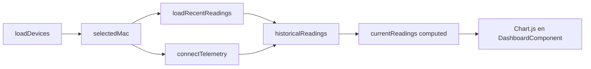

# Anexo B. Componentes y servicios de Angular

Este anexo documenta el frontend ubicado en `frontend/src/app`. La aplicación usa Angular 21 con componentes standalone, rutas lazy, PrimeNG para UI, Tailwind para estilos y NgRx Signals para estado compartido.

## B.1. Estructura general

| Elemento | Archivo | Función |
| --- | --- | --- |
| Bootstrap | `frontend/src/main.ts` | Arranca la aplicación con `bootstrapApplication(App, appConfig)`. |
| Configuración | `frontend/src/app/app.config.ts` | Router, HTTP client, interceptor, animaciones y tema PrimeNG. |
| Rutas | `frontend/src/app/app.routes.ts` | Define login, registro, callback OAuth2 y rutas privadas. |
| Raíz | `frontend/src/app/app.ts` | Contiene el `RouterOutlet`. |
| Proxy dev | `frontend/proxy.conf.json` | Redirige `/api`, `/oauth2` y `/ws-iot` al backend local. |

La arquitectura elegida evita módulos Angular clásicos y trabaja con componentes standalone. Esto reduce código de infraestructura y hace que cada pantalla importe solo lo que necesita.

## B.2. Rutas y guard de autenticación

| Ruta | Componente | Protección |
| --- | --- | --- |
| `/login` | `LoginComponent` | Pública |
| `/register` | `RegisterComponent` | Pública |
| `/auth/oauth/callback` | `OAuthCallbackComponent` | Pública |
| `/dashboard` | `DashboardComponent` dentro de `MainLayoutComponent` | `authGuard` |
| `/devices` | `DevicesComponent` dentro de `MainLayoutComponent` | `authGuard` |
| `/tariffs` | `TariffComponent` dentro de `MainLayoutComponent` | `authGuard` |
| `/alerts` | `AlertsComponent` dentro de `MainLayoutComponent` | `authGuard` |

`auth.guard.ts` comprueba `SessionStorageService.isLoggedIn()`. Si el JWT no existe o está caducado, devuelve un `UrlTree` hacia `/login`. La validación de rol admin no se hace en el router; se usa en la UI de tarifas con `SessionStorageService.hasRole("ROLE_ADMIN")`.

## B.3. Servicios

### B.3.1. `AuthService`

**Archivo:** `services/auth.service.ts`

| Método | Endpoint | Request | Response |
| --- | --- | --- | --- |
| `authentication` | `POST /api/v1/auth/login` | `LoginUser` | `LoginUserJwt` |
| `register` | `POST /api/v1/auth/register` | `RegisterRequest` | `void` |
| `exchangeOAuthTicket` | `POST /api/v1/auth/oauth/exchange` | `{ ticket: string }` | `LoginUserJwt` |

Este servicio encapsula la autenticación básica y el canje OAuth2. La decisión importante es que Angular no recibe directamente el token del proveedor externo; recibe un JWT propio del backend.

### B.3.2. `SessionStorageService`

**Archivo:** `services/session-storage.service.ts`

- Guarda el token en `sessionStorage` con clave `auth_token`.
- Decodifica el JWT con `jwt-decode`.
- Comprueba `exp` para considerar caducada la sesión.
- Extrae `username` y `authorities`.
- Ofrece `hasRole()` para adaptar la interfaz a usuarios admin.

Se usa `sessionStorage` y no `localStorage`, de modo que el token se pierde al cerrar la pestaña. Es una decisión prudente para un proyecto académico con datos de consumo energético.

### B.3.3. Interceptor HTTP

**Archivo:** `interceptors/http.interceptor.ts`

El interceptor añade:

- `X-Requested-With: XMLHttpRequest`
- `Authorization: Bearer <token>` en rutas `/api/v1`, excepto login, registro y canje OAuth2.

Si recibe `401`, limpia la sesión y navega a `/login`. El operador RxJS usado es `catchError`, devolviendo `throwError` para no ocultar el fallo a quien hizo la petición.

### B.3.4. `WebsocketService`

**Archivo:** `services/websocket.service.ts`

- Usa `RxStomp` de `@stomp/rx-stomp`.
- Se conecta a `/ws-iot` calculando `ws://` o `wss://` según el protocolo actual.
- `watchReadings(macAddress)` se suscribe a `/topic/readings/{macAddress}`.
- Convierte cada mensaje STOMP a `ReadingResponse` con `JSON.parse`.

```typescript
watchReadings(macAddress: string): Observable<ReadingResponse> {
  return this.rxStomp
    .watch(`/topic/readings/${macAddress}`)
    .pipe(map((message) => JSON.parse(message.body) as ReadingResponse));
}
```

El servicio se activa al inyectarse porque es `providedIn: "root"`. El cierre funcional de la suscripción depende de `TelemetryStore.connectTelemetry(null)` al hacer logout.

### B.3.5. `TariffService`

**Archivo:** `services/tariff.service.ts`

| Área | Endpoints |
| --- | --- |
| Catálogo | `GET /api/v1/tariffs`, `POST /api/v1/tariffs`, `GET /api/v1/tariffs/{id}`, `POST /api/v1/tariffs/{id}`, `DELETE /api/v1/tariffs/{id}` |
| Tarifa privada | `GET /api/v1/users/me/tariff`, `POST /api/v1/users/me/tariff`, `DELETE /api/v1/users/me/tariff` |

`getMyTariff()` usa `observe: "response"` para distinguir una respuesta `204 No Content` de un error. Cuando el backend devuelve 204, Angular lo transforma en `null`.

### B.3.6. `DeviceService`

**Archivo:** `services/device.service.ts`

Expone `devicesResource` con `httpResource<Device[]>`. Es una API moderna de Angular, pero en el código actual no es la vía principal de carga. Los componentes usan `TelemetryStore` o `HttpClient` directo.

## B.4. Stores con NgRx Signals

La aplicación no usa NgRx clásico con `Store`, `Actions` y `Effects`. Usa `@ngrx/signals` y `rxMethod`.

### B.4.1. `TelemetryStore`

**Archivo:** `store/telemetry.store.ts`

Estado principal:

| Campo | Descripción |
| --- | --- |
| `devices` | Lista de dispositivos del usuario. |
| `selectedMac` | MAC seleccionada en el dashboard. |
| `historicalReadings` | Mapa por MAC con arrays de `timestamps` y `powerW`. |
| `isLoadingDevices` | Flag de carga. |

`currentReadings` es un `computed` que devuelve las lecturas de la MAC seleccionada. La razón de guardar lecturas por MAC es que el dashboard puede cambiar de dispositivo sin perder inmediatamente el buffer del anterior.

Métodos reactivos:

| Método | Operadores | Intención |
| --- | --- | --- |
| `loadDevices` | `tap`, `switchMap` | Carga dispositivos y selecciona la primera MAC si no hay selección. |
| `claimDevice` | `switchMap`, `tap` | Reclama un dispositivo físico. |
| `createSimulatedDevice` | `switchMap`, `tap` | Crea un simulador. |
| `addDevice` | `switchMap`, `tap` | Alta directa de dispositivo. |
| `updateDevice` | `switchMap`, `tap` | Actualiza nombre, estado o perfil. |
| `deleteDevice` | `switchMap`, `tap` | Borra un dispositivo y limpia selección si procede. |
| `connectTelemetry` | `distinctUntilChanged`, `switchMap`, `filter`, `distinctUntilChanged`, `tap` | Cambia la suscripción STOMP cuando cambia la MAC. |

Flujo del dashboard:



`connectTelemetry` usa `switchMap` porque solo debe quedar activa la suscripción del dispositivo seleccionado. Si se cambia de MAC, la suscripción anterior se cancela.

### B.4.2. `TariffStore`

**Archivo:** `store/tariff.store.ts`

Estado:

| Campo | Descripción |
| --- | --- |
| `catalog` | Tarifas maestras disponibles. |
| `myTariff` | Tarifa privada del usuario autenticado. |
| `isLoadingCatalog` | Carga del catálogo. |
| `isLoadingMyTariff` | Carga o guardado de tarifa privada. |
| `errorMessage` | Mensaje de error para la UI. |

Computed:

| Computed | Significado |
| --- | --- |
| `hasMyTariff` | `true` si el usuario ya tiene tarifa configurada. |
| `isCatalogEmpty` | `true` si no hay tarifas maestras. |

Los `rxMethod` usan el patrón `tap` para activar carga, `switchMap` para la petición HTTP y `catchError(() => EMPTY)` para cortar el flujo si falla. Esto evita que un error rompa el store.

## B.5. Componentes principales

### B.5.1. `MainLayoutComponent`

**Archivo:** `components/main-layout/main-layout.component.ts`

Contiene el chasis de navegación privada. Al cerrar sesión:

1. Llama a `telemetryStore.connectTelemetry(null)` para cortar la suscripción STOMP.
2. Limpia `TelemetryStore` y `TariffStore`.
3. Borra el token.
4. Navega a `/login`.

El orden importa: primero se desconecta la telemetría para que no queden mensajes asociados a un usuario que ya no está autenticado en la UI.

### B.5.2. `LoginComponent`

**Archivo:** `components/login/login.component.ts`

Usa formulario reactivo con:

- `username`: requerido y formato email.
- `password`: requerido y longitud mínima.

Al iniciar sesión correctamente, guarda el JWT y navega a `/dashboard`. También permite login social redirigiendo a `/oauth2/authorization/google` o `/oauth2/authorization/github`.

### B.5.3. `RegisterComponent`

**Archivo:** `components/register/register.component.ts`

Usa formulario reactivo con `username`, `password` y `confirmPassword`. Incluye un validador de grupo para comprobar que las contraseñas coinciden antes de enviar al backend.

### B.5.4. `OAuthCallbackComponent`

**Archivo:** `components/oauth-callback/oauth-callback.component.ts`

Lee `ticket` desde query params, llama a `AuthService.exchangeOAuthTicket`, guarda el JWT y redirige a `/dashboard`. Si falta el ticket o falla el canje, vuelve a `/login`.

### B.5.5. `DashboardComponent`

**Archivo:** `components/dashboard/dashboard.component.ts`

Responsabilidades:

- Mostrar gráfica de potencia con PrimeNG Chart / Chart.js.
- Elegir dispositivo activo.
- Pedir lecturas recientes.
- Conectar WebSocket del dispositivo seleccionado.
- Pedir coste y consumo fantasma del día si el usuario tiene tarifa.

Usa `computed` para derivar:

| Computed | Origen |
| --- | --- |
| `powerW` | `TelemetryStore.currentReadings.powerW` |
| `formattedTime` | Timestamps convertidos a hora española |
| `chartData` | Datos listos para Chart.js |
| `companyName` | Nombre del dispositivo seleccionado |

Tiene tres `effect()` importantes:

1. Autoocultar error de analítica.
2. Reaccionar al cambio de `selectedMac`: cargar lecturas, conectar STOMP y recargar analítica.
3. Reaccionar al cambio de `hasMyTariff`: si no hay tarifa, limpia métricas; si hay tarifa, recalcula.

### B.5.6. `DevicesComponent`

**Archivo:** `components/devices/devices.component.ts`

Permite gestionar dispositivos físicos y simulados. Aunque existe `TelemetryStore` con métodos CRUD, este componente realiza varias operaciones con `HttpClient` directo y luego refresca la lista con `loadDevices()`.

Formularios:

| Formulario | Campos | Uso |
| --- | --- | --- |
| `deviceForm` | `deviceKind`, `name`, `macAddress`, `simulationProfile` | Alta física o simulada. |
| `editDeviceForm` | `name`, `simulationProfile` | Edición de nombre/perfil. |

La validación cambia según `deviceKind`: si es físico, la MAC es obligatoria; si es simulado, el perfil es obligatorio.

### B.5.7. `TariffComponent`

**Archivo:** `components/tariff/tariff.component.ts`

Gestiona dos casos:

- Usuario normal: configurar su tarifa privada.
- Admin: crear, editar o borrar plantillas del catálogo.

El formulario usa `FormArray` para periodos de energía y potencias contratadas. Incluye `ascendingPowerValidator` para validar que las potencias contratadas mantienen el orden esperado en tarifas TD.

La propiedad `isAdmin` es un `computed` basado en `SessionStorageService.hasRole("ROLE_ADMIN")`. No sustituye a la seguridad del backend; solo controla qué se muestra.

### B.5.8. `AlertsComponent`

**Archivo:** `components/alerts/alerts.component.ts`

Lista alertas con `GET /api/v1/alerts` y permite descartarlas con `DELETE /api/v1/alerts/{id}`. Usa signals locales para lista, carga y mensajes. No hay store global porque las alertas solo se consultan en esta pantalla.

## B.6. Interfaces principales

| Interface | Archivo | Campos relevantes |
| --- | --- | --- |
| `Device` | `interfaces/device.interface.ts` | `id`, `username`, `name`, `macAddress`, `isOn`, `simulated`, `simulationProfile` |
| `ReadingResponse` | `interfaces/reading-response.interface.ts` | `time`, `macAddress`, `powerW`, `energyTotalKwh`, `isOn` |
| `TelemetryState` | `interfaces/telemetry-state.interface.ts` | `devices`, `selectedMac`, `historicalReadings`, `isLoadingDevices` |
| `TariffRequest` / `TariffResponse` | `interfaces/tariff-request.interface.ts` | Contrato completo con periodos y potencias. |
| `UserTariffRequest` | `interfaces/tariff-request.interface.ts` | `templateTariffId`, `contract` |
| `LoginUser` | `interfaces/login-user.interface.ts` | `username`, `password` |
| `LoginUserJwt` | `interfaces/login-user-jwt.interface.ts` | `statusCode`, `jwt` |
| `RegisterRequest` | `interfaces/register-request.interface.ts` | `username`, `password`, `confirmPassword`, `tariffId?` |
| `EnergyCostResponse` | `interfaces/energy-cost-response.interface.ts` | `macAddress`, `totalCostEur`, `start`, `end` |
| `GhostCostResponse` | `interfaces/ghost-cost-response.interface.ts` | `macAddress`, `ghostCostEur`, `start`, `end` |
| `Alert` | `interfaces/alert.interface.ts` | `id`, `macAddress`, `username`, `type`, `message`, `createdAt` |

## B.7. Endpoints consumidos por Angular

| Endpoint | Consumidor |
| --- | --- |
| `POST /api/v1/auth/login` | `AuthService` |
| `POST /api/v1/auth/register` | `AuthService` |
| `POST /api/v1/auth/oauth/exchange` | `AuthService` |
| `GET /api/v1/devices` | `TelemetryStore`, `DeviceService` |
| `POST /api/v1/devices/claim` | `DevicesComponent`, `TelemetryStore` |
| `POST /api/v1/devices/simulated` | `DevicesComponent`, `TelemetryStore` |
| `POST /api/v1/devices/simulated/demo-pack` | `DevicesComponent` |
| `PUT /api/v1/devices/{id}` | `DevicesComponent`, `TelemetryStore` |
| `DELETE /api/v1/devices/{id}` | `DevicesComponent`, `TelemetryStore` |
| `GET /api/v1/readings/device/{mac}/recent` | `TelemetryStore` |
| `GET /api/v1/analytics/cost` | `DashboardComponent` |
| `GET /api/v1/analytics/ghost-consumption` | `DashboardComponent` |
| `GET /api/v1/tariffs` | `TariffService`, `TariffStore` |
| `POST /api/v1/users/me/tariff` | `TariffService`, `TariffStore` |
| `GET /api/v1/alerts` | `AlertsComponent` |
| `DELETE /api/v1/alerts/{id}` | `AlertsComponent` |
| STOMP `/topic/readings/{mac}` | `WebsocketService`, `TelemetryStore` |

## B.8. Observaciones técnicas

- No se usan `BehaviorSubject`, `Subject`, `combineLatest`, `debounceTime` ni `shareReplay` en el código actual.
- `DashboardComponent` hace peticiones de analítica con `HttpClient` directo. Si cambia la MAC muy rápido, esas peticiones no se cancelan con `switchMap`.
- `DeviceService` con `httpResource` existe, pero no está integrado en las pantallas principales.
- El guard protege autenticación, no roles; el backend sigue siendo la barrera real para operaciones admin.
- El buffer de la gráfica mantiene 20 puntos por MAC, suficiente para una vista en directo sin cargar demasiado el DOM ni Chart.js.
