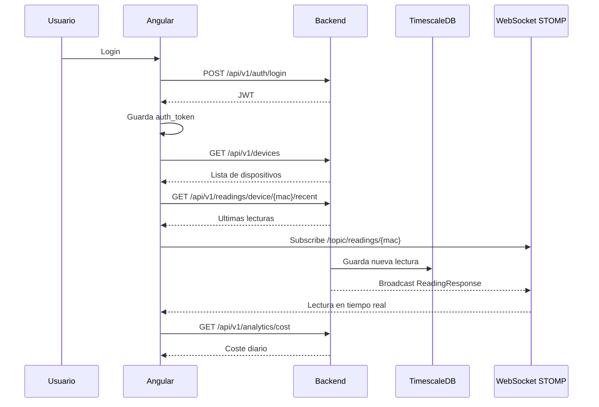

# Anexo B. Frontend Angular, RxJS y NgRx Signals

## 1. Vision general

El frontend de Wattimizer esta desarrollado con Angular 21 y componentes standalone. La aplicacion no usa modulos Angular tradicionales para cada pantalla; las rutas cargan los componentes de forma perezosa mediante `loadComponent`.

La experiencia de usuario esta montada alrededor de cuatro zonas privadas:

- Dashboard de telemetria y costes.
- Gestion de dispositivos.
- Gestion de tarifas.
- Historial de alertas.

La sesion se guarda en `sessionStorage` como JWT. El estado compartido no se gestiona con un store Redux clasico, sino con `@ngrx/signals`, que encaja bien con Angular moderno porque permite exponer datos como senales y derivar valores con `computed`.

## 2. Rutas principales

Archivo: `frontend/src/app/app.routes.ts`

| Ruta | Componente | Seguridad |
|---|---|---|
| `/login` | `LoginComponent` | Publica |
| `/register` | `RegisterComponent` | Publica |
| `/auth/oauth/callback` | `OAuthCallbackComponent` | Publica |
| `/dashboard` | `DashboardComponent` dentro de `MainLayoutComponent` | `authGuard` |
| `/devices` | `DevicesComponent` dentro de `MainLayoutComponent` | `authGuard` |
| `/tariffs` | `TariffComponent` dentro de `MainLayoutComponent` | `authGuard` |
| `/alerts` | `AlertsComponent` dentro de `MainLayoutComponent` | `authGuard` |

El `authGuard` se aplica tanto a `canActivate` como a `canActivateChild`. La intencion es validar la entrada inicial al layout y tambien las navegaciones internas, sobre todo si el token ha caducado mientras el usuario tenia la aplicacion abierta.

## 3. Servicios Angular

### 3.1. `AuthService`

Archivo: `frontend/src/app/services/auth.service.ts`

| Metodo | HTTP | URL | Uso |
|---|---|---|---|
| `authentication(user)` | `POST` | `/api/v1/auth/login` | Login con email y password. |
| `register(user)` | `POST` | `/api/v1/auth/register` | Alta de usuario. |
| `exchangeOAuthTicket(ticket)` | `POST` | `/api/v1/auth/oauth/exchange` | Convierte el ticket temporal OAuth en JWT. |

Este servicio no guarda estado. Devuelve `Observable` y deja que los componentes decidan como reaccionar.

### 3.2. `SessionStorageService`

Archivo: `frontend/src/app/services/session-storage.service.ts`

Responsabilidades:

- Guardar el token bajo la clave `auth_token`.
- Borrar sesion con `logout()`.
- Comprobar si el token existe y no esta expirado.
- Extraer roles desde el claim `authorities`.
- Obtener el username desde el JWT.

La decision de usar `sessionStorage` implica que la sesion se pierde al cerrar la pestana o navegador. Para un proyecto academico de control energetico es una decision prudente, porque evita dejar una sesion persistente en equipos compartidos.

### 3.3. `TariffService`

Archivo: `frontend/src/app/services/tariff.service.ts`

| Metodo | HTTP | URL |
|---|---|---|
| `getCatalog` | `GET` | `/api/v1/tariffs` |
| `getById` | `GET` | `/api/v1/tariffs/{id}` |
| `createCatalogTariff` | `POST` | `/api/v1/tariffs` |
| `updateCatalogTariff` | `POST` | `/api/v1/tariffs/{id}` |
| `deleteCatalogTariff` | `DELETE` | `/api/v1/tariffs/{id}` |
| `getMyTariff` | `GET` | `/api/v1/users/me/tariff` |
| `saveMyTariff` | `POST` | `/api/v1/users/me/tariff` |
| `unlinkMyTariff` | `DELETE` | `/api/v1/users/me/tariff` |

`getMyTariff()` usa `observe: "response"` porque el backend devuelve `204 No Content` cuando el usuario no tiene tarifa. El servicio convierte ese caso a `null`, lo que simplifica el dashboard y evita tratar un 204 como error.

### 3.4. `WebsocketService`

Archivo: `frontend/src/app/services/websocket.service.ts`

Este servicio crea un cliente `RxStomp` al arrancar:

```ts
const protocol = window.location.protocol === "https:" ? "wss:" : "ws:";
const wsUrl = `${protocol}//${window.location.host}/ws-iot`;
```

Parametros relevantes:

- `heartbeatOutgoing: 20000`
- `reconnectDelay: 5000`
- destino de lectura: `/topic/readings/{macAddress}`

El metodo principal es:

```ts
watchReadings(macAddress: string): Observable<ReadingResponse>
```

Devuelve un `Observable` que parsea cada mensaje STOMP como `ReadingResponse`.

### 3.5. Interceptor HTTP

Archivo: `frontend/src/app/interceptors/http.interceptor.ts`

Acciones:

1. Anade `X-Requested-With: XMLHttpRequest`.
2. Si la URL contiene `/api/v1` y no es auth publica, anade `Authorization: Bearer <token>`.
3. Si el backend devuelve 401, borra la sesion y navega a `/login`.

Esta pieza es clave porque centraliza la seguridad del cliente y evita repetir cabeceras en cada servicio.

## 4. Stores con NgRx Signals

### 4.1. `TelemetryStore`

Archivo: `frontend/src/app/store/telemetry.store.ts`

Estado inicial:

```ts
const initialState: TelemetryState = {
    devices: [],
    selectedMac: null,
    historicalReadings: {},
    isLoadingDevices: false,
};
```

El store guarda el historico por MAC:

```ts
historicalReadings: {
    [macAddress]: {
        timestamps: string[],
        powerW: number[]
    }
}
```

Computed principal:

| Computed | Funcion |
|---|---|
| `currentReadings` | Devuelve el historico de la MAC seleccionada o arrays vacios. |

Metodos:

| Metodo | Tipo | Logica |
|---|---|---|
| `setSelectedMac(mac)` | Sincrono | Actualiza `selectedMac` y carga lecturas recientes. |
| `loadRecentReadings(mac)` | Suscripcion HTTP directa | `GET /api/v1/readings/device/{mac}/recent?seconds=120`; conserva 20 puntos. |
| `loadDevices` | `rxMethod<void>` | Carga dispositivos, selecciona la primera MAC si no hay seleccion previa. |
| `claimDevice` | `rxMethod<ClaimDeviceRequest>` | Llama a `/api/v1/devices/claim` y anade el dispositivo al estado. |
| `createSimulatedDevice` | `rxMethod<CreateSimulatedDeviceRequest>` | Crea simulador y lo anade a la lista. |
| `addDevice` | `rxMethod` | Alta directa en `/api/v1/devices`; existe en store aunque el componente usa `claim`. |
| `updateDevice` | `rxMethod<Device>` | Actualiza dispositivo y sustituye la entrada local. |
| `deleteDevice` | `rxMethod<number>` | Borra dispositivo y ajusta `selectedMac`. |
| `connectTelemetry(mac)` | `rxMethod<string \| null>` | Abre/cierra flujo WebSocket segun MAC. |
| `reset` | Sincrono | Vuelve al estado inicial al cerrar sesion. |

Pipeline WebSocket:

```ts
connectTelemetry: rxMethod<string | null>(
    pipe(
        distinctUntilChanged(),
        switchMap((mac) => {
            if (!mac) return of(null);
            return wsService.watchReadings(mac).pipe(
                filter((r) => (r.powerW as number | null | undefined) != null),
                distinctUntilChanged((prev, curr) => prev.time === curr.time),
                tap({ next: (reading) => { /* patchState */ } }),
            );
        }),
    ),
)
```

Decisiones importantes:

- `switchMap` cancela la suscripcion anterior cuando cambia la MAC.
- `filter` evita pintar lecturas sin potencia.
- `distinctUntilChanged` por timestamp reduce duplicados si el backend emite lecturas muy cercanas.
- La ventana se limita a 20 puntos para que la grafica siga siendo legible.

### 4.2. `TariffStore`

Archivo: `frontend/src/app/store/tariff.store.ts`

Estado:

```ts
interface TariffState {
    catalog: TariffResponse[];
    myTariff: TariffResponse | null;
    isLoadingCatalog: boolean;
    isLoadingMyTariff: boolean;
    errorMessage: string | null;
}
```

Computed:

| Computed | Funcion |
|---|---|
| `hasMyTariff` | Indica si el usuario tiene tarifa privada. |
| `isCatalogEmpty` | Permite adaptar la UI cuando no hay plantillas. |

Metodos `rxMethod`:

- `loadCatalog`
- `loadMyTariff`
- `saveMyTariff`
- `unlinkMyTariff`
- `refreshAfterCatalogMutation`

Todos siguen un patron parecido: activar loading, ejecutar servicio, actualizar con `patchState` y convertir errores controlados en `EMPTY` para cortar el flujo sin romper la aplicacion.

Metodos sincronos:

- `setCatalogTariff`
- `addToCatalog`
- `removeFromCatalog`
- `patchMyTariff`
- `clearError`
- `reset`

## 5. Componentes

### 5.1. `LoginComponent`

Archivo: `frontend/src/app/components/login/login.component.ts`

Usa formulario reactivo con:

- `username`: obligatorio y email.
- `password`: obligatorio y minimo 4 caracteres.

Senales:

- `isLoading`
- `loginError`

Flujo:

1. Si el formulario es invalido, marca todos los campos.
2. Llama a `AuthService.authentication`.
3. Guarda el JWT en `SessionStorageService`.
4. Navega a `/dashboard`.
5. Si hay error, muestra mensaje y lo oculta tras 7 segundos.

Tambien permite redireccion a `/oauth2/authorization/google` o `/oauth2/authorization/github`.

### 5.2. `RegisterComponent`

Archivo: `frontend/src/app/components/register/register.component.ts`

Formulario:

- `username`: email obligatorio.
- `password`: minimo 6 caracteres.
- `confirmPassword`: minimo 6 caracteres.
- validador de grupo `passwordMatchValidator`.

La decision de validar la coincidencia en el grupo, y no en un unico campo, es correcta porque la regla depende de dos controles.

### 5.3. `OAuthCallbackComponent`

Ruta: `/auth/oauth/callback`

Lee el parametro `ticket` de la URL. Si existe, llama a `AuthService.exchangeOAuthTicket`, guarda el JWT y redirige al dashboard. Si falta el ticket, muestra error. Esta pantalla actua como puente entre Spring Security OAuth2 y la sesion JWT propia de la SPA.

### 5.4. `MainLayoutComponent`

Archivo: `frontend/src/app/components/main-layout/main-layout.component.ts`

Es el chasis privado de la aplicacion. Contiene navegacion y `router-outlet`.

Logout:

```ts
this.telemetryStore.connectTelemetry(null);
this.telemetryStore.reset();
this.tariffStore.reset();
this.sessionStorageService.logout();
this.router.navigateByUrl("/login", { replaceUrl: true });
```

La secuencia es intencionada: primero se corta la telemetria, despues se limpia estado compartido y al final se borra el token.

### 5.5. `DashboardComponent`

Archivo: `frontend/src/app/components/dashboard/dashboard.component.ts`

Responsabilidades:

- Cargar dispositivos.
- Cargar tarifa privada.
- Mostrar grafica de potencia con Chart.js/PrimeNG.
- Consultar coste diario y consumo fantasma.
- Mostrar CTA si el usuario no tiene tarifa.

Senales locales:

- `totalCostEur`
- `ghostCostEur`
- `isLoadingAnalytics`
- `analyticsError`

Computed:

- `powerW`
- `formattedTime`
- `chartData`
- `companyName`

Effects:

1. Si aparece `analyticsError`, lo limpia pasados 8 segundos.
2. Cuando cambia `selectedMac`, carga lecturas recientes, conecta WebSocket y recalcula analiticas si hay tarifa.
3. Cuando cambia `hasMyTariff`, resetea metricas o vuelve a cargar coste.

Endpoints directos:

- `GET /api/v1/analytics/cost`
- `GET /api/v1/analytics/ghost-consumption`

El dashboard consulta analiticas con `HttpClient` directo, no mediante store. Es una decision simple y suficiente porque esos datos solo se usan en esta pantalla.

### 5.6. `DevicesComponent`

Archivo: `frontend/src/app/components/devices/devices.component.ts`

Gestiona:

- Alta fisica por claim.
- Alta de simulador individual.
- Pack demo de simuladores.
- Edicion de nombre y perfil.
- Encendido/apagado.
- Borrado.

Formulario principal:

| Campo | Regla |
|---|---|
| `deviceKind` | `physical` o `simulated` |
| `name` | Obligatorio, minimo 3 |
| `macAddress` | Obligatorio para fisico, regex de 12 caracteres hexadecimales |
| `simulationProfile` | Obligatorio para simulado |

Endpoints usados desde el componente:

| Accion | Metodo | URL |
|---|---|---|
| Claim fisico | `POST` | `/api/v1/devices/claim` |
| Crear simulado | `POST` | `/api/v1/devices/simulated` |
| Crear pack demo | `POST` | `/api/v1/devices/simulated/demo-pack` |
| Borrar | `DELETE` | `/api/v1/devices/{id}` |
| Encender/apagar | `PUT` | `/api/v1/devices/{id}` |
| Editar | `PUT` | `/api/v1/devices/{id}` |

Tras cada mutacion exitosa se llama a `store.loadDevices()`. Esto mantiene la tabla y el dashboard sincronizados con el backend.

### 5.7. `TariffComponent`

Archivo: `frontend/src/app/components/tariff/tariff.component.ts`

Gestiona dos casos:

- Catalogo maestro, visible para administradores.
- Tarifa privada del usuario.

El rol se calcula desde el token:

```ts
readonly isAdmin = computed(() => this.sessionService.hasRole("ROLE_ADMIN"));
```

El formulario usa `FormArray` para periodos de energia y potencias contratadas. La cantidad de periodos depende del peaje:

| Peaje | Periodos energia | Periodos potencia |
|---|---|---|
| `2.0TD` | P1, P2, P3 | P1, P2 |
| `3.0TD` | P1-P6 | P1-P6 |
| `6.1TD` | P1-P6 | P1-P6 |
| `6.2TD` | P1-P6 | P1-P6 |

Validador relevante:

```ts
ascendingPowerValidator
```

Impone que las potencias contratadas sean crecientes o iguales: P1 <= P2 <= ... <= P6. Esta regla refleja una restriccion habitual de contratos TD y evita guardar configuraciones incoherentes.

### 5.8. `AlertsComponent`

Archivo: `frontend/src/app/components/alerts/alerts.component.ts`

Usa estado local con senales:

- `alertsList`
- `isLoading`
- `errorMessage`
- `successMessage`

Endpoints:

- `GET /api/v1/alerts`
- `DELETE /api/v1/alerts/{id}`

No usa store global porque el historico de alertas no se comparte con otras pantallas. Es una decision correcta para no complicar el estado cuando no hay reutilizacion.

## 6. Flujo de datos completo



## 7. Pruebas del frontend

| Archivo | Que valida |
|---|---|
| `session-storage.service.spec.ts` | Roles, username y token ausente. |
| `tariff.service.spec.ts` | URLs, metodos HTTP y `204 -> null`. |
| `dashboard.component.spec.ts` | Estado sin tarifa, placeholders y banner. |
| `devices.component.spec.ts` | Validacion fisico/simulado y llamadas a endpoints. |
| `tariff.component.spec.ts` | Periodos por peaje y rol admin. |
| `app.spec.ts` | Creacion basica del componente raiz. |

Quedan sin prueba especifica `WebsocketService`, `TelemetryStore`, `TariffStore`, `http.interceptor`, `auth.guard`, `LoginComponent`, `RegisterComponent` y `AlertsComponent`. La parte mas prioritaria para ampliar seria `TelemetryStore`, porque concentra el flujo de datos en tiempo real.
