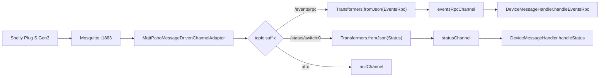
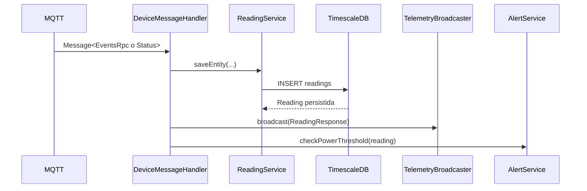
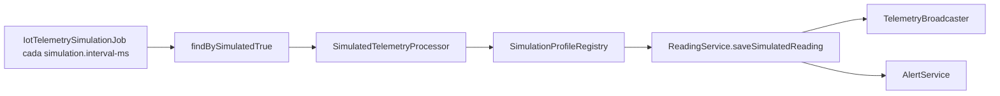

# Anexo C. Telemetría asíncrona con Spring Integration MQTT

## 1. Objetivo de la ingesta

La ingesta MQTT conecta el mundo físico con la aplicación web. El enchufe Shelly
publica medidas de potencia y energía en Mosquitto; el backend las consume con
Spring Integration MQTT, las transforma a entidades `Reading`, las guarda en
TimescaleDB y las reenvía por STOMP al frontend.

El flujo no depende de que el usuario tenga el dashboard abierto. La lectura se
procesa en backend de forma asíncrona y, si hay clientes suscritos, se publica
también en tiempo real.

## 2. Infraestructura MQTT

| Elemento | Configuración real |
| --- | --- |
| Broker | Eclipse Mosquitto 2.1.2 Alpine |
| Puerto expuesto | 1883 |
| Autenticación | Activada con `password_file` |
| URL en Docker | `tcp://mosquitto:1883` mediante `MQTT_URL` |
| URL local por defecto | `mqtt.url` en `application.properties` |
| Cliente Spring | `backend-spring-iot` |
| QoS | 1 |
| Sesión MQTT | `cleanSession=true` |
| Reconexión | `automaticReconnect=true` |

El `docker-compose.yml` marca el puerto 1883 como deuda de seguridad porque va
en texto plano. Para una instalación real más madura habría que usar TLS/8883 o
una VPN si el hardware lo permite.

## 3. Configuración Spring Integration

La clase principal es `MqttConfig`.

Canales declarados:

```java
@Bean
public MessageChannel eventsRpcChannel() {
    return new DirectChannel();
}

@Bean
MessageChannel statusChannel() {
    return new DirectChannel();
}
```

Adaptador MQTT:

```java
new MqttPahoMessageDrivenChannelAdapter(
    "backend-spring-iot",
    mqttClientFactory(),
    "shellyplugsg3-9070694d3590/#"
);
```

La suscripción está fijada a un único Shelly:

```text
shellyplugsg3-9070694d3590/#
```

Esto significa que añadir otro dispositivo físico no es solo cuestión de base de
datos: habría que parametrizar o ampliar la configuración del tópico.

## 4. Enrutado de tópicos

El `IntegrationFlow` lee el tópico desde la cabecera
`MqttHeaders.RECEIVED_TOPIC` y decide qué rama usar.

| Tópico recibido | Rama | Transformación | Canal final |
| --- | --- | --- | --- |
| Termina en `/events/rpc` | `EVENTS` | JSON a `EventsRpc` | `eventsRpcChannel` |
| Termina en `/status/switch:0` | `STATUS` | JSON a `Status` | `statusChannel` |
| Cualquier otro bajo `#` | `IGNORE` | Ninguna | `nullChannel` |

Diagrama del flujo:



## 5. DTOs de entrada MQTT

### 5.1. `EventsRpc`

Formato esperado:

```json
{
  "src": "shellyplugsg3-9070694d3590",
  "params": {
    "ts": 1790000000.0,
    "switch:0": {
      "apower": 125.4,
      "aenergy": {
        "total": 4312.0
      }
    }
  }
}
```

Campos usados:

| Campo JSON | DTO Java | Uso |
| --- | --- | --- |
| `src` | `EventsRpc.source` | Permite extraer la MAC después del último guion. |
| `params.ts` | `Params.timestamp` | Se convierte a `Instant`. |
| `params["switch:0"].apower` | `Switch.activePower` | Potencia activa en W. |
| `params["switch:0"].aenergy.total` | `ActiveEnergy.total` | Energía acumulada en Wh. |

`EventsRpcMapper` convierte Wh a kWh antes de persistir:

```java
BigDecimal.valueOf(energyWh).divide(BigDecimal.valueOf(1000))
```

### 5.2. `Status`

Formato esperado:

```json
{
  "output": true,
  "apower": 125.4,
  "aenergy": {
    "total": 4312.0
  }
}
```

Campos usados:

| Campo JSON | Uso |
| --- | --- |
| `output` | Estado del relé; se guarda como `is_on`. |
| `apower` | Potencia activa en W. |
| `aenergy.total` | Energía acumulada en Wh, convertida a kWh. |

En esta ruta el timestamp no viene del payload. `ReadingService.saveEntity` usa
`Instant.now()` al persistir.

## 6. Handler de mensajes

La clase `DeviceMessageHandler` recibe mensajes ya transformados:

```java
@ServiceActivator(inputChannel = "eventsRpcChannel")
public void handleEventsRpc(Message<EventsRpc> mqttMessage)

@ServiceActivator(inputChannel = "statusChannel")
public void handleStatus(Message<Status> mqttMessage)
```

Ambos métodos siguen la misma estructura general:

1. Obtener payload y, en `status`, también la MAC desde el tópico.
2. Guardar una entidad `Reading`.
3. Transformarla a `ReadingResponse`.
4. Publicarla por WebSocket/STOMP.
5. Comprobar si debe generarse una alerta de maxímetro.



## 7. Diferencias entre `events/rpc` y `status/switch:0`

| Aspecto | `events/rpc` | `status/switch:0` |
| --- | --- | --- |
| DTO | `EventsRpc` | `Status` |
| Timestamp | `params.ts` del dispositivo | `Instant.now()` del backend |
| MAC | Se intenta resolver desde `src` | Se extrae del tópico MQTT |
| `is_on` | Se ignora en el mapper | Se toma de `output` |
| Dispositivo requerido | Debe existir para conservar bien la MAC | Debe existir o `findByMacAddress` lanza excepción |
| Energía | Wh a kWh | Wh a kWh |

### Matiz importante sobre registro automático

No conviene describir `events/rpc` como auto-registro fiable de dispositivos. El
código actual hace esto:

1. `EventsRpcMapper.mapSourceToDevice` extrae la MAC desde `src`.
2. Busca esa MAC en `DeviceRepository`.
3. Si existe, devuelve el `Device` y la lectura conserva la relación correcta.
4. Si no existe, devuelve `null`.
5. `ReadingService.saveEntity(EventsRpc)` calcula la MAC a partir de
   `reading.getDevice()`. Si el dispositivo era `null`, usa una cadena vacía.

Por tanto, el flujo fiable para hardware real es registrar o reclamar la MAC
antes de depender de la telemetría. La ruta `status/switch:0` es aún más estricta:
extrae la MAC del tópico y llama a `deviceService.findByMacAddress`; si no hay
dispositivo, no puede guardar la lectura.

## 8. Persistencia en `readings`

La entidad `Reading` guarda:

| Campo | Significado |
| --- | --- |
| `time` | Instante de la lectura; forma parte de la clave compuesta. |
| `device_id` | Dispositivo asociado; forma parte de la clave compuesta. |
| `power_w` | Potencia activa en vatios. |
| `energy_total_kwh` | Energía acumulada en kWh. |
| `is_on` | Estado lógico del equipo si el origen lo proporciona. |

La tabla se convierte en hypertable mediante:

```sql
SELECT create_hypertable('readings', 'time');
```

Esto permite que TimescaleDB particione los datos por tiempo, aunque las
consultas analíticas actuales se calculan en Java y no usan funciones como
`time_bucket`.

## 9. Emisión STOMP al frontend

Después de guardar una lectura, `TelemetryBroadcaster` envía el DTO al canal:

```text
/topic/readings/{macAddress}
```

Angular se suscribe desde `WebsocketService.watchReadings(macAddress)` y
`TelemetryStore.connectTelemetry(mac)`. La store filtra lecturas sin `powerW`,
deduplica timestamps exactos y añade el punto al historial de la MAC activa.

## 10. Alertas de maxímetro

Cada lectura MQTT pasa por:

```java
alertService.checkPowerThreshold(reading);
```

La alerta solo se genera si se cumplen todas estas condiciones:

1. La lectura tiene potencia, hora y dispositivo.
2. El dispositivo tiene usuario asignado.
3. El usuario tiene tarifa asociada.
4. `CalendarResolverService` resuelve el periodo P1-P6 del instante.
5. Existe potencia contratada para ese periodo.
6. `power_w / 1000` supera `contracted_power_kw`.

Si falta calendario tarifario o contrato, la lectura se guarda, pero no se crea
alerta.

## 11. Simulación IoT

Los simuladores no publican MQTT. Funcionan como un flujo paralelo interno:



Características reales:

- La simulación se controla con `simulation.enabled`.
- El intervalo por defecto es `simulation.interval-ms=5000`.
- Solo procesa dispositivos con `is_simulated=true`.
- Si un dispositivo está apagado (`isOn=false`), la potencia simulada es 0 W.
- El odómetro `energy_total_kwh` se incrementa con potencia por duración del
  intervalo.
- Cada dispositivo se procesa en una transacción independiente
  (`Propagation.REQUIRES_NEW`) para que un fallo no bloquee el resto del tick.

Perfiles disponibles:

| Perfil | Uso de demo |
| --- | --- |
| `SINE_WAVE` | Señal variable de prueba. |
| `OVEN` | Carga alta y por ciclos. |
| `WASHING_MACHINE` | Consumo por fases. |
| `TELEVISION` | Consumo doméstico estable. |
| `FAN` | Carga ligera. |
| `DESKTOP_PC` | Equipo de oficina. |
| `FRIDGE` | Ciclos de nevera. |
| `STANDBY` | Consumo fantasma. |
| `CONSTANT_HIGH_LOAD` | Carga alta para probar alertas. |

## 12. Riesgos y límites actuales

- La suscripción MQTT está hardcodeada a un único Shelly.
- MQTT usa 1883 en texto plano según la configuración Docker actual.
- `events/rpc` y `status/switch:0` no son equivalentes: difieren en timestamp,
  estado `is_on` y forma de localizar el dispositivo.
- Los tópicos no reconocidos bajo el wildcard se descartan en `nullChannel`.
- Las credenciales y secretos deben entrar por variables de entorno en
  producción; no deben escribirse en la documentación pública ni en commits.
- Las alertas dependen de que existan tarifa, calendario y potencias contratadas.
