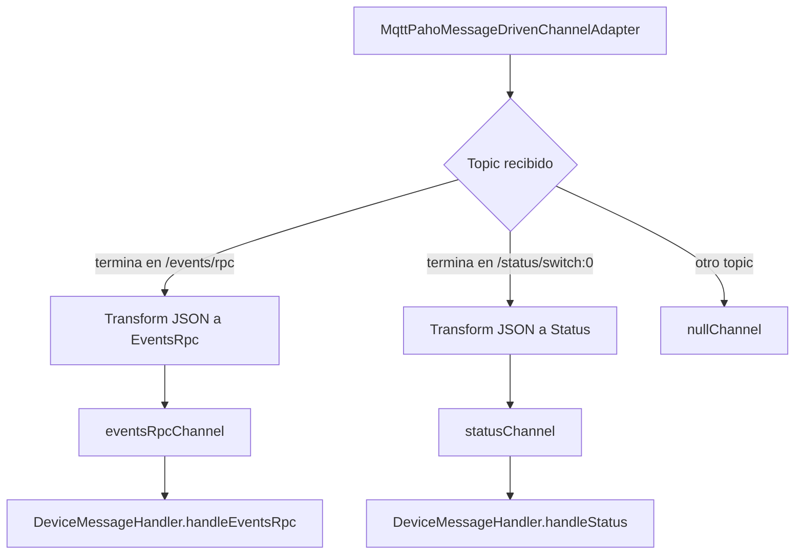
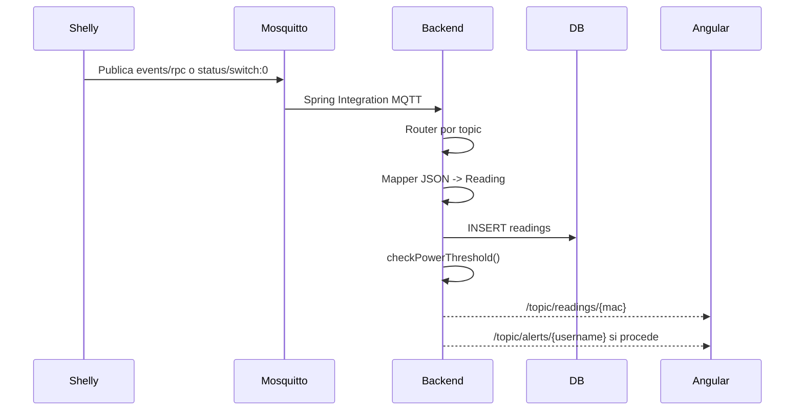
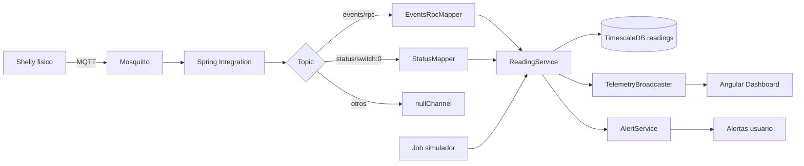

# Anexo C. Ingesta asincrona de telemetria con Spring Integration MQTT

## 1. Objetivo del modulo

El modulo de telemetria recibe mensajes MQTT publicados por un enchufe Shelly, los transforma a lecturas internas y los persiste en la tabla `readings`. Despues de guardar cada lectura, el backend la emite al frontend por WebSocket STOMP y comprueba si debe generar una alerta de sobrepotencia.

La configuracion principal esta en:

```text
backend/src/main/java/com/joselumartos/jwtauthbackenddemo/config/MqttConfig.java
```

El handler de mensajes esta en:

```text
backend/src/main/java/com/joselumartos/jwtauthbackenddemo/services/DeviceMessageHandler.java
```

---

## 2. Configuracion MQTT

### 2.1. Conexion con broker

El backend usa `DefaultMqttPahoClientFactory` y `MqttConnectOptions`.

| Propiedad | Valor / origen | Uso |
| --- | --- | --- |
| `mqtt.url` | `${MQTT_URL:tcp://localhost:1883}` | URL del broker |
| `mqtt.username` | `${MQTT_USER:gateway-service}` | Usuario MQTT |
| `mqtt.password` | `${MQTT_PASSWORD:s3cr3t}` | Contrasena MQTT |
| `automaticReconnect` | `true` | Reconexion automatica |
| `cleanSession` | `true` | Sesion limpia |

En Docker Compose, el backend apunta al servicio interno:

```yaml
MQTT_URL: tcp://mosquitto:1883
```

### 2.2. Adaptador de entrada

El adaptador se declara asi:

```java
new MqttPahoMessageDrivenChannelAdapter(
    "backend-spring-iot",
    mqttClientFactory(),
    "shellyplugsg3-9070694d3590/#"
);
```

Parametros:

| Campo | Valor |
| --- | --- |
| Client ID | `backend-spring-iot` |
| Topic suscrito | `shellyplugsg3-9070694d3590/#` |
| QoS | `1` |

El topic esta hardcodeado para un Shelly concreto. Esto sirve para el prototipo y la demo, pero no escala a varios dispositivos fisicos sin cambiar la configuracion.

---

## 3. Flujo de Spring Integration

El flujo de integracion enruta los mensajes segun el sufijo del topic recibido:



Codigo relevante:

```java
.route(Message.class,
    message -> {
        String topic = message.getHeaders().get(MqttHeaders.RECEIVED_TOPIC, String.class);
        if (topic != null && topic.endsWith("/events/rpc")) return "EVENTS";
        if (topic != null && topic.endsWith("/status/switch:0")) return "STATUS";
        return "IGNORE";
    },
    router -> router
        .subFlowMapping("EVENTS", eventsBranch -> eventsBranch
            .transform(Transformers.fromJson(EventsRpc.class))
            .channel("eventsRpcChannel")
        )
        .subFlowMapping("STATUS", statusBranch -> statusBranch
            .transform(Transformers.fromJson(Status.class))
            .channel("statusChannel")
        )
        .defaultOutputChannel("nullChannel")
)
```

La decision de separar canales evita tener un unico DTO artificial para mensajes que realmente tienen estructura distinta.

---

## 4. DTOs de telemetria

Los DTOs estan en:

```text
backend/src/main/java/com/joselumartos/jwtauthbackenddemo/dtos
```

### 4.1. `EventsRpc`

Representa mensajes publicados por Shelly en:

```text
shellyplugsg3-9070694d3590/events/rpc
```

Estructura simplificada:

```java
public record EventsRpc(
    String src,
    Params params
) {}
```

```java
public record Params(
    Long ts,
    @JsonProperty("switch:0") Switch switchData
) {}
```

```java
public record Switch(
    ActiveEnergy aenergy,
    BigDecimal apower
) {}
```

```java
public record ActiveEnergy(
    BigDecimal total
) {}
```

Campos importantes:

| Campo Shelly | Uso en Wattimizer |
| --- | --- |
| `src` | Permite extraer la MAC |
| `params.ts` | Timestamp original en segundos epoch |
| `params.switch:0.apower` | Potencia activa en W |
| `params.switch:0.aenergy.total` | Energia acumulada en Wh |

### 4.2. `Status`

Representa mensajes en:

```text
shellyplugsg3-9070694d3590/status/switch:0
```

Estructura:

```java
public record Status(
    Boolean output,
    BigDecimal apower,
    ActiveEnergy aenergy
) {}
```

Campos:

| Campo Shelly | Uso en Wattimizer |
| --- | --- |
| `output` | Estado del rele, se guarda como `isOn` |
| `apower` | Potencia activa en W |
| `aenergy.total` | Energia acumulada en Wh |

---

## 5. Mapeo a entidad `Reading`

Entidad destino:

```text
backend/src/main/java/com/joselumartos/jwtauthbackenddemo/entities/Reading.java
```

Campos persistidos:

| Campo | Tipo | Significado |
| --- | --- | --- |
| `time` | `Instant` | Momento de la lectura |
| `device` | `Device` | Dispositivo asociado |
| `powerW` | `BigDecimal(10,2)` | Potencia activa en W |
| `energyTotalKwh` | `BigDecimal(14,4)` | Energia acumulada en kWh |
| `isOn` | `Boolean` | Estado del rele cuando el mensaje lo aporta |

### 5.1. Ruta `events/rpc`

Mapper:

```text
backend/src/main/java/com/joselumartos/jwtauthbackenddemo/mappers/EventsRpcMapper.java
```

Flujo:

1. Se transforma el JSON en `EventsRpc`.
2. `EventsRpcMapper` intenta resolver el dispositivo a partir de `src`, tomando la parte final del identificador Shelly y buscandola en `DeviceRepository`.
3. `params.ts` se convierte a `Instant`.
4. `apower` se guarda como `powerW`.
5. `aenergy.total` se divide entre 1000 para pasar de Wh a kWh.
6. `isOn` se ignora porque este mensaje no se usa como fuente del estado del rele.
7. `ReadingService.saveEntity()` persiste la lectura asociada al dispositivo resuelto.

En el codigo actual, si la MAC del `src` no existe en `devices`, el mapper devuelve `null` y `ReadingService` cae en una ruta de alta con MAC vacia. Por tanto, para que `events/rpc` conserve correctamente la MAC real, el dispositivo debe existir previamente en la base de datos, por ejemplo mediante semilla de desarrollo o mediante el flujo de reclamacion/registro desde la API.

### 5.2. Ruta `status/switch:0`

Mapper:

```text
backend/src/main/java/com/joselumartos/jwtauthbackenddemo/mappers/StatusMapper.java
```

Flujo:

1. La MAC se extrae del topic MQTT recibido.
2. Se busca el dispositivo por MAC.
3. Si el dispositivo no existe, el flujo falla con `EntityNotFoundException`.
4. El timestamp se asigna con `Instant.now()`.
5. `output` se guarda como `isOn`.
6. `apower` se guarda como `powerW`.
7. `aenergy.total` se convierte de Wh a kWh.

Igual que en el caso anterior, para que los mensajes de estado funcionen de forma estable, el dispositivo debe estar sembrado, reclamado o registrado previamente.

---

## 6. Persistencia y efectos posteriores

Los handlers estan anotados con `@Transactional`. Tras persistir una lectura:

1. Se guarda la entidad en `readings`.
2. Se convierte a `ReadingResponse`.
3. `TelemetryBroadcaster` publica la lectura por STOMP:

```text
/topic/readings/{macAddress}
```

4. `AlertService.checkPowerThreshold(reading)` evalua si se supera la potencia contratada.
5. Si hay alerta, se guarda en `alerts` y se emite en:

```text
/topic/alerts/{username}
```

Diagrama:



---

## 7. Registro y reclamacion de dispositivos

El flujo funcional fiable para asociar un enchufe a un usuario es el endpoint:

```text
POST /api/v1/devices/claim
```

Reglas de reclamacion:

- Si la MAC no existe, se crea el dispositivo y se asigna al usuario autenticado.
- Si el dispositivo existe y no tiene usuario, se asigna al usuario autenticado.
- Si pertenece al mismo usuario, se permite actualizar nombre.
- Si pertenece a otro usuario real, se rechaza.

La ingesta MQTT, tal como esta implementada, trabaja mejor cuando la fila `devices` ya existe. Por eso, para alta real de hardware, la ruta recomendable es registrar o reclamar la MAC desde la API antes de depender de los topics MQTT. El script de desarrollo `04-seed-device-shelly.sql` sigue esa idea sembrando el Shelly conocido.

---

## 8. Simulacion de telemetria

Ademas de MQTT real, el proyecto incluye telemetria simulada. No entra por Mosquitto, pero acaba en la misma tabla `readings`.

Componentes:

| Clase | Funcion |
| --- | --- |
| `IotTelemetrySimulationJob` | Job programado cada `simulation.interval-ms` |
| `SimulatedTelemetryProcessor` | Procesa cada dispositivo simulado en transaccion propia |
| `SimulationProfileRegistry` | Selecciona calculador de potencia por perfil |
| `ReadingService.saveSimulatedReading` | Persiste lectura simulada |

Configuracion:

```properties
simulation.enabled=${SIMULATION_ENABLED:true}
simulation.interval-ms=${SIMULATION_INTERVAL_MS:5000}
```

La simulacion usa perfiles como horno, lavadora, television, ventilador, PC, frigorifico o standby. La razon de meterlos en el mismo flujo de lecturas es que el dashboard, las alertas y la analitica pueden trabajar igual con datos reales y simulados.

---

## 9. Limitaciones tecnicas actuales

| Limitacion | Impacto | Mejora futura |
| --- | --- | --- |
| Topic Shelly hardcodeado | Solo se escucha un dispositivo fisico concreto | Subscripcion dinamica o topic wildcard por tenant |
| MQTT sin TLS en `1883` | Trafico en claro entre hardware y broker | TLS `8883` o VPN |
| Sin flujo MQTT saliente | No se envian comandos reales al enchufe desde backend | Implementar `MqttPahoMessageHandler` para publish |
| Resolucion de MAC no provisionada | `events/rpc` no conserva bien la MAC si no existe el dispositivo, y `status/switch:0` falla si no hay fila previa | Extraer la MAC del payload/topic antes de crear el dispositivo o exigir registro previo de forma explicita |
| Sin `errorChannel` especifico | Errores de integracion no tienen cola de recuperacion | Definir canal de errores y logging operativo |
| HiveMQ en dependencias pero no usado | Dependencia sin uso en `src/main` | Retirar o integrar si se migra cliente MQTT |

---

## 10. Resumen del flujo real



La ingesta esta bien separada: MQTT se encarga de entrada asincrona, JPA de persistencia, STOMP de tiempo real hacia el navegador y servicios de negocio de calculo/alertas. Esa separacion hace que el sistema sea mas facil de explicar y de mantener.
