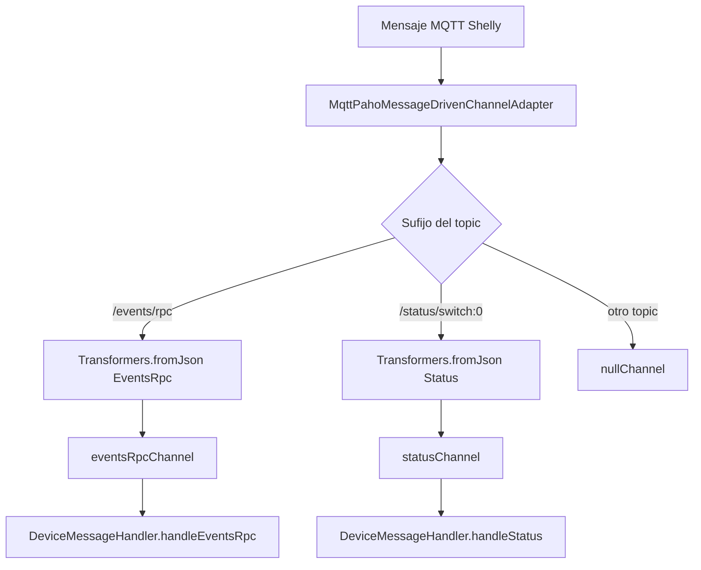
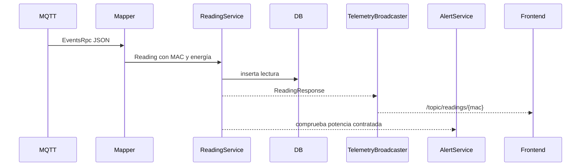
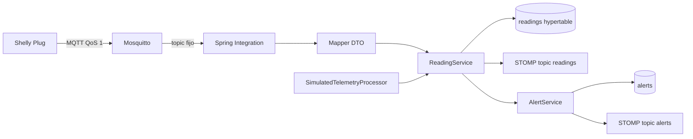

# Anexo C - Ingesta de telemetría MQTT con Spring Integration

## 1. Objetivo del módulo

El módulo de telemetría conecta Wattimizer con enchufes inteligentes Shelly. Su función es recibir mensajes MQTT, transformarlos en lecturas internas, guardarlos en base de datos, emitirlos al frontend por WebSocket y comprobar si debe generarse una alerta de potencia.

También existe una vía de simulación que genera lecturas sin MQTT. Esta vía usa el mismo modelo de persistencia y difusión, por lo que sirve para pruebas y demostraciones.

## 2. Infraestructura MQTT

| Elemento | Configuración actual |
| --- | --- |
| Broker | Eclipse Mosquitto en Docker. |
| Puerto | `1883`. |
| Autenticación | `allow_anonymous false` y archivo de contraseñas. |
| URL backend | Propiedad `mqtt.url`, externalizada como `MQTT_URL`. |
| Usuario/password | `mqtt.username` y `mqtt.password`. |
| Client ID | `backend-spring-iot`. |
| QoS | `1`. |
| Reconexión | Automática. |
| Sesión MQTT | `cleanSession=true`. |

La configuración evita dejar el broker abierto de forma anónima. Queda pendiente, como mejora de producción, incorporar TLS si el broker se expone fuera de una red privada.

## 3. Topics escuchados

Actualmente el adaptador MQTT está suscrito a:

```text
shellyplugsg3-9070694d3590/#
```

Esto significa que el backend escucha un Shelly concreto. El formato general esperado es:

```text
shellyplugsg3-{mac12hex}/events/rpc
shellyplugsg3-{mac12hex}/status/switch:0
```

La suscripción fija es suficiente para una demo controlada, pero no para alta dinámica de muchos enchufes físicos. Una mejora futura sería construir la lista de topics desde la tabla `devices` o suscribirse a un patrón más general si el broker lo permite.

## 4. Flujo Spring Integration

La clase `MqttConfig` define un `MqttPahoMessageDrivenChannelAdapter` y un `IntegrationFlow`.



El router decide la ruta según `MqttHeaders.RECEIVED_TOPIC`:

- si termina en `/events/rpc`, se transforma a `EventsRpc`;
- si termina en `/status/switch:0`, se transforma a `Status`;
- cualquier otro mensaje se descarta en `nullChannel`.

Los canales usados son `DirectChannel`. Por tanto, el flujo de Spring Integration es síncrono respecto al hilo del adaptador MQTT. Aunque el origen del dato es asíncrono por naturaleza, el código no usa `@Async` ni executor propio en esta parte.

## 5. Payload `events/rpc`

`events/rpc` contiene información anidada bajo `params`, incluyendo potencia y energía acumulada:

```json
{
  "src": "shellyplugsg3-9070694d3590",
  "params": {
    "ts": 1720000000,
    "switch:0": {
      "apower": 123.45,
      "aenergy": {
        "total": 4567.8
      }
    }
  }
}
```

El mapper `EventsRpcMapper` realiza estas decisiones:

- extrae la MAC desde `src`;
- convierte el timestamp epoch a `Instant`;
- usa `apower` como potencia en W;
- convierte `aenergy.total` de Wh a kWh;
- no rellena `isOn` en este flujo.

## 6. Payload `status/switch:0`

`status/switch:0` representa el estado actual del relé:

```json
{
  "output": true,
  "apower": 123.45,
  "aenergy": {
    "total": 4567.8
  }
}
```

En este caso, la MAC se obtiene del topic, no del cuerpo JSON. `StatusMapper` usa `Instant.now()` como momento de lectura porque el payload no se trata como una lectura histórica con timestamp propio.

## 7. Procesamiento en `DeviceMessageHandler`

`DeviceMessageHandler` tiene dos service activators:

| Canal | Método | Trabajo realizado |
| --- | --- | --- |
| `eventsRpcChannel` | `handleEventsRpc` | Guarda lectura, emite WebSocket y comprueba alertas. |
| `statusChannel` | `handleStatus` | Localiza dispositivo por MAC, guarda lectura, emite WebSocket y comprueba alertas. |

### 7.1. Flujo `events/rpc`



El flujo operativo previsto es que la MAC del Shelly ya exista en `devices`. `EventsRpcMapper` busca el dispositivo a partir de `src`; si lo encuentra, la lectura queda asociada correctamente. Si no lo encuentra, el mapper devuelve `device=null` y `ReadingService.saveEntity(EventsRpc)` acaba usando una cadena vacía como MAC para crear un placeholder con nombre `Nuevo Enchufe `. Por tanto, el código actual no conserva bien una MAC nueva recibida por `events/rpc`; el alta real de una MAC desconocida debe hacerse con `POST /api/v1/devices/claim` o corregirse en una mejora futura.

### 7.2. Flujo `status/switch:0`

En `status/switch:0` el dispositivo debe existir antes. El handler llama a `deviceService.findByMacAddress(mac)`, y si no existe se lanza `EntityNotFoundException`. Por eso el auto-registro no debe documentarse como genérico para todos los topics: solo se produce en `events/rpc`.

## 8. Difusión al frontend

Después de guardar una lectura, el backend publica por STOMP:

```text
/topic/readings/{macAddress}
```

Si se genera una alerta, se publica en:

```text
/topic/alerts/{username}
```

El frontend se suscribe a las lecturas del medidor activo. No existe en el código actual un adapter MQTT outbound para mandar comandos al enchufe; las clases relacionadas con comandos están comentadas.

## 9. Simulación de telemetría

La simulación está pensada para enseñar Wattimizer sin depender de un Shelly físico. Se activa con:

```properties
simulation.enabled=${SIMULATION_ENABLED:true}
simulation.interval-ms=${SIMULATION_INTERVAL_MS:5000}
```

`IotTelemetrySimulationJob` ejecuta un ciclo programado y procesa solo dispositivos con `is_simulated=true`. Cada dispositivo se procesa en `SimulatedTelemetryProcessor`.

### 9.1. Perfiles disponibles

| Perfil | Comportamiento esperado |
| --- | --- |
| `SINE_WAVE` | Variación suave para comprobar gráficas. |
| `OVEN` | Potencia alta durante fases de calentamiento. |
| `WASHING_MACHINE` | Ciclo con tramos de reposo y picos. |
| `TELEVISION` | Consumo estable moderado. |
| `FAN` | Consumo constante bajo-medio. |
| `DESKTOP_PC` | Fluctuación propia de carga variable. |
| `FRIDGE` | Encendido y apagado del compresor. |
| `STANDBY` | Consumo fantasma pequeño y continuo. |
| `CONSTANT_HIGH_LOAD` | Carga alta constante para provocar alertas. |

### 9.2. Decisiones técnicas del procesador

- Cada dispositivo se procesa en una transacción `REQUIRES_NEW`.
- La potencia se calcula con `SimulationProfileRegistry`.
- La energía acumulada se integra a partir de la última lectura.
- La hora se desplaza con `device.getId() % 1000` milisegundos para reducir colisiones de clave primaria `(time, device_id)`.
- Tras guardar se reutiliza el mismo camino que una lectura real: WebSocket y comprobación de alertas.

Esta separación por transacción permite que un fallo en un simulador no cancele las lecturas del resto del pack.

## 10. Pack de demostración

El endpoint:

```http
POST /api/v1/devices/simulated/demo-pack
```

crea un dispositivo por cada perfil que el usuario todavía no tenga. Los nombres usados son:

| Perfil | Nombre |
| --- | --- |
| `SINE_WAVE` | Simulador onda de prueba |
| `OVEN` | Simulador horno |
| `WASHING_MACHINE` | Simulador lavadora |
| `TELEVISION` | Simulador televisor |
| `FAN` | Simulador ventilador |
| `DESKTOP_PC` | Simulador PC |
| `FRIDGE` | Simulador nevera |
| `STANDBY` | Simulador consumo fantasma |
| `CONSTANT_HIGH_LOAD` | Simulador carga alta |

En los scripts de seed existe también `05-seed-device-simulation.sql`, que inserta nueve simuladores para `admin@wattimizer.dev`.

## 11. Limitaciones actuales

- La suscripción MQTT está fijada a una MAC concreta.
- El caso de MAC desconocida por `events/rpc` no conserva la MAC en el alta placeholder.
- WebSocket `/ws-iot` está permitido sin JWT en la configuración de seguridad.
- `events/rpc` no informa de `isOn` en las lecturas.
- `status/switch:0` no auto-registra dispositivos.
- No hay compresión ni retención automática de lecturas antiguas.
- Las dependencias MQTT v5/HiveMQ aparecen en `pom.xml`, pero el flujo activo usa Spring Integration MQTT con Paho v3.

## 12. Resumen del flujo completo



La arquitectura mantiene dos fuentes de lectura: MQTT real y simulación. Ambas terminan en el mismo repositorio de lecturas, lo que simplifica dashboard, alertas y analítica.
