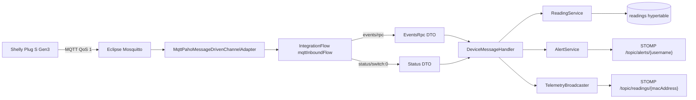

# Anexo C. Ingesta asíncrona de telemetría con Spring Integration MQTT

Este anexo explica la entrada de telemetría desde MQTT hasta la base de datos y el frontend. El código principal está en:

- `backend/src/main/java/com/joselumartos/jwtauthbackenddemo/config/MqttConfig.java`
- `backend/src/main/java/com/joselumartos/jwtauthbackenddemo/services/DeviceMessageHandler.java`
- `backend/src/main/java/com/joselumartos/jwtauthbackenddemo/services/TelemetryBroadcaster.java`
- `backend/src/main/java/com/joselumartos/jwtauthbackenddemo/config/StompWebSocketConfig.java`

## C.1. Intención de la arquitectura

La telemetría llega de forma asíncrona: el usuario no la solicita con un botón, sino que el dispositivo publica mensajes MQTT cuando hay datos. Por eso el backend no usa un controlador REST para recibir lecturas. Usa Spring Integration MQTT para escuchar un broker Mosquitto, transformar el JSON recibido y guardar la lectura.

El flujo completo es:



La decisión importante es que la misma lectura, una vez procesada, sirve para dos salidas: persistencia histórica y actualización en tiempo real.

## C.2. Configuración MQTT

`application.properties` define los valores con variables de entorno:

```properties
mqtt.url=${MQTT_URL:tcp://localhost:1883}
mqtt.username=${MQTT_USER:gateway-service}
mqtt.password=${MQTT_PASSWORD:s3cr3t}
```

En Docker Compose, el backend usa:

```yaml
MQTT_URL: tcp://mosquitto:1883
MQTT_USER: ${PROD_MQTT_USER}
MQTT_PASSWORD: ${PROD_MQTT_PASSWORD}
```

Esto evita usar `localhost` dentro del contenedor, porque el backend debe resolver el broker por nombre de servicio (`mosquitto`).

## C.3. `MqttConfig`

`MqttConfig.java` activa Spring Integration con `@EnableIntegration` y define:

| Bean | Función |
| --- | --- |
| `mqttClientFactory` | Crea clientes Paho con URL, usuario, contraseña, reconexión automática y `cleanSession=true`. |
| `mqttInbound` | Adaptador que se suscribe al broker. |
| `mqttInputChannel` | Canal de entrada de mensajes crudos. |
| `eventsRpcChannel` | Canal para mensajes `events/rpc`. |
| `statusChannel` | Canal para mensajes `status/switch:0`. |
| `mqttInboundFlow` | Flujo que enruta y transforma mensajes según el topic. |

La suscripción actual está fijada a:

```text
shellyplugsg3-9070694d3590/#
```

Esto significa que el backend escucha todos los subtopics de una MAC concreta. Es útil para una primera integración con un Shelly real, pero limita la escalabilidad: añadir hardware de otra MAC requiere cambiar configuración o código.

## C.4. Topics soportados

| Topic recibido | Canal | DTO destino | Uso |
| --- | --- | --- | --- |
| `shellyplugsg3-{mac}/events/rpc` | `eventsRpcChannel` | `EventsRpc` | Evento RPC emitido por Shelly. |
| `shellyplugsg3-{mac}/status/switch:0` | `statusChannel` | `Status` | Estado periódico del interruptor. |
| Cualquier otro | `nullChannel` | Ninguno | Se descarta. |

El flujo inspecciona `MqttHeaders.RECEIVED_TOPIC`. Según el sufijo, aplica `Transformers.fromJson(...)` hacia el DTO correspondiente.

## C.5. DTOs MQTT

### C.5.1. `EventsRpc`

| DTO | Campo | JSON original | Significado |
| --- | --- | --- | --- |
| `EventsRpc` | `source` | `src` | Identificador tipo `shellyplugsg3-{mac}`. |
| `EventsRpc` | `params` | `params` | Contenedor de timestamp y switch. |
| `Params` | `timestamp` | `ts` | Tiempo epoch en segundos. |
| `Params` | `switchData` | `switch:0` | Datos del enchufe. |
| `Switch` | `activePower` | `apower` | Potencia instantánea en W. |
| `Switch` | `activeEnergy` | `aenergy` | Energía acumulada. |
| `ActiveEnergy` | `total` | `total` | Energía acumulada en Wh. |

La energía se convierte a kWh antes de guardarse, porque la entidad `Reading` trabaja con `energyTotalKwh`.

### C.5.2. `Status`

| Campo | Significado |
| --- | --- |
| `output` | Estado encendido/apagado. |
| `apower` | Potencia activa en W. |
| `aenergy.total` | Energía acumulada en Wh. |

En la rama `status`, el tiempo se toma con `Instant.now()`, porque el DTO no trae el mismo timestamp que `events/rpc`.

## C.6. `DeviceMessageHandler`

`DeviceMessageHandler.java` contiene dos métodos con `@ServiceActivator`:

| Método | Canal | Lógica |
| --- | --- | --- |
| `handleEventsRpc` | `eventsRpcChannel` | Mapea `EventsRpc`, guarda lectura, emite por WebSocket y revisa alertas. |
| `handleStatus` | `statusChannel` | Extrae MAC del topic, mapea `Status`, guarda lectura, emite por WebSocket y revisa alertas. |

Ambos métodos son `@Transactional`. Si falla el guardado o una validación de entidad, la transacción puede hacer rollback.

### C.6.1. Rama `events/rpc`

El mapper de eventos:

1. Extrae la MAC desde `source`.
2. Busca el dispositivo por MAC.
3. Si no existe, crea un dispositivo con nombre `Nuevo Enchufe {mac}`.
4. Convierte `ts` a `Instant`.
5. Guarda `powerW` y `energyTotalKwh`.

Un detalle importante: un dispositivo creado automáticamente por MQTT puede quedar sin usuario asignado. Por eso después existe `/api/v1/devices/claim`, que permite vincularlo a una cuenta.

### C.6.2. Rama `status/switch:0`

La MAC se extrae desde el topic:

```text
shellyplugsg3-9070694d3590/status/switch:0
```

El handler separa el prefijo por `/` y después por `-` para quedarse con `9070694d3590`. En esta rama el dispositivo debe existir; si no se encuentra, se lanza `EntityNotFoundException`.

## C.7. Persistencia de lecturas

La entidad `Reading` contiene:

| Campo | Tipo | Origen |
| --- | --- | --- |
| `time` | `Instant` | `ts` MQTT o `Instant.now()`. |
| `device` | `Device` | MAC del topic/payload. |
| `powerW` | `BigDecimal` | `apower`. |
| `energyTotalKwh` | `BigDecimal` | `aenergy.total / 1000`. |
| `isOn` | `Boolean` | `output` en rama `status`; en eventos puede no venir. |

Se guarda mediante `ReadingService.saveEntity()` y `ReadingRepository.save()`. La tabla destino es `readings`, convertida en hypertable por `01-hypertable.sql`.

## C.8. Emisión en tiempo real

`TelemetryBroadcaster.java` usa `SimpMessagingTemplate` para publicar:

```text
/topic/readings/{macAddress}
```

El frontend se suscribe con `WebsocketService.watchReadings(macAddress)`. Cada lectura nueva llega al `TelemetryStore`, que actualiza el buffer de la gráfica.

Las alertas se publican en:

```text
/topic/alerts/{username}
```

El backend tiene configurado STOMP en `StompWebSocketConfig.java`:

| Configuración | Valor |
| --- | --- |
| Endpoint WebSocket | `/ws-iot` |
| Broker simple | `/topic` |
| Prefijo cliente-servidor | `/app` |

En el código actual no hay `@MessageMapping` activo, así que el WebSocket se usa como canal de salida del backend hacia Angular.

## C.9. Telemetría simulada

Además del flujo MQTT, el proyecto incluye simuladores:

| Clase | Función |
| --- | --- |
| `IotTelemetrySimulationJob` | Job `@Scheduled` que se ejecuta cada `simulation.interval-ms`. |
| `SimulatedTelemetryProcessor` | Calcula potencia según perfil y guarda lectura. |
| `SimulationProperties` | Lee `simulation.enabled` e intervalo. |

Perfiles disponibles en `SimulationProfile`:

- `SINE_WAVE`
- `OVEN`
- `WASHING_MACHINE`
- `TELEVISION`
- `FAN`
- `DESKTOP_PC`
- `FRIDGE`
- `STANDBY`
- `CONSTANT_HIGH_LOAD`

La simulación usa el mismo final de tubería que MQTT: guarda en `readings`, publica por STOMP y revisa alertas. Esto hace que el frontend no tenga que distinguir si una lectura viene de hardware real o de demo.

## C.10. Alertas de potencia

Después de guardar una lectura, `AlertService.checkPowerThreshold(reading)`:

1. Comprueba que el dispositivo tenga usuario.
2. Comprueba que el usuario tenga tarifa.
3. Resuelve el periodo horario con `CalendarResolverService`.
4. Busca la potencia contratada de ese periodo.
5. Compara `power_w / 1000` con `contracted_power_kw`.
6. Si se supera el umbral, crea una alerta y la publica por STOMP.

La intención es acercar el concepto de maxímetro al usuario: no solo se muestra que hay consumo alto, sino que se compara con lo contratado.

## C.11. Errores y límites actuales

| Caso | Comportamiento |
| --- | --- |
| Topic no soportado | Se envía a `nullChannel` y se descarta. |
| JSON inválido | Fallo en `Transformers.fromJson`; no hay handler de error personalizado. |
| MAC desconocida en `events/rpc` | Se crea dispositivo huérfano. |
| MAC desconocida en `status/switch:0` | Se lanza error al no encontrar dispositivo. |
| WebSocket | `/ws-iot/**` está permitido sin JWT en `SecurityConfig`. |
| MQTT outbound | No hay adaptador de salida ni comandos activos hacia dispositivos. |
| Topic hardcodeado | Solo se escucha una MAC concreta. |

## C.12. Decisiones técnicas destacables

- Se usa MQTT para entrada porque los dispositivos IoT publican datos de forma natural en un broker.
- Se usa REST para consulta histórica porque el frontend necesita peticiones puntuales y cacheables.
- Se usa STOMP para tiempo real porque Angular puede suscribirse por dispositivo sin hacer polling.
- Se usa un job de simulación para que la demo sea útil incluso sin enchufe físico.
- Se convierte Wh a kWh al persistir para que los cálculos de coste trabajen en la unidad habitual de facturación.
