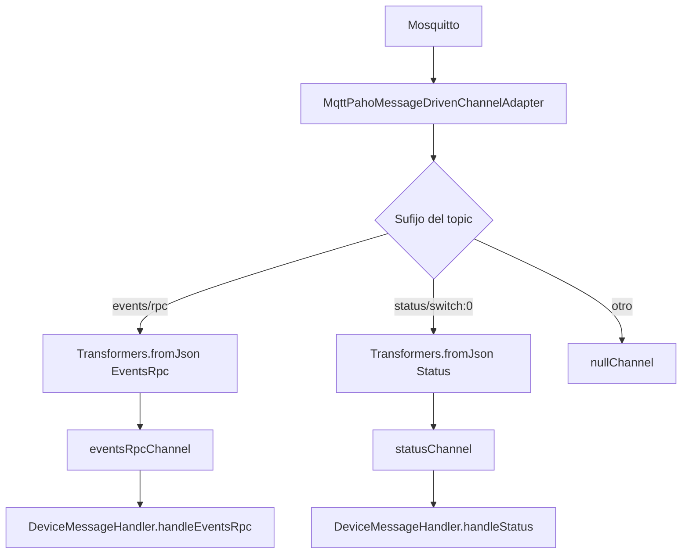
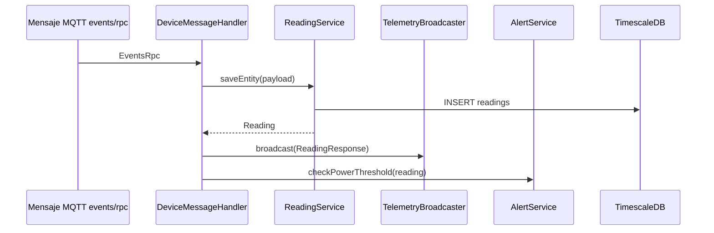
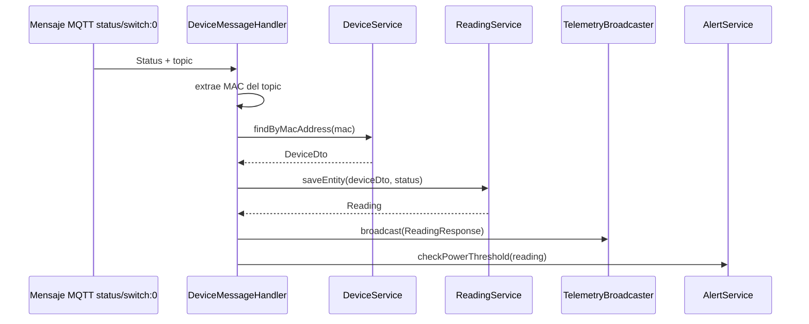
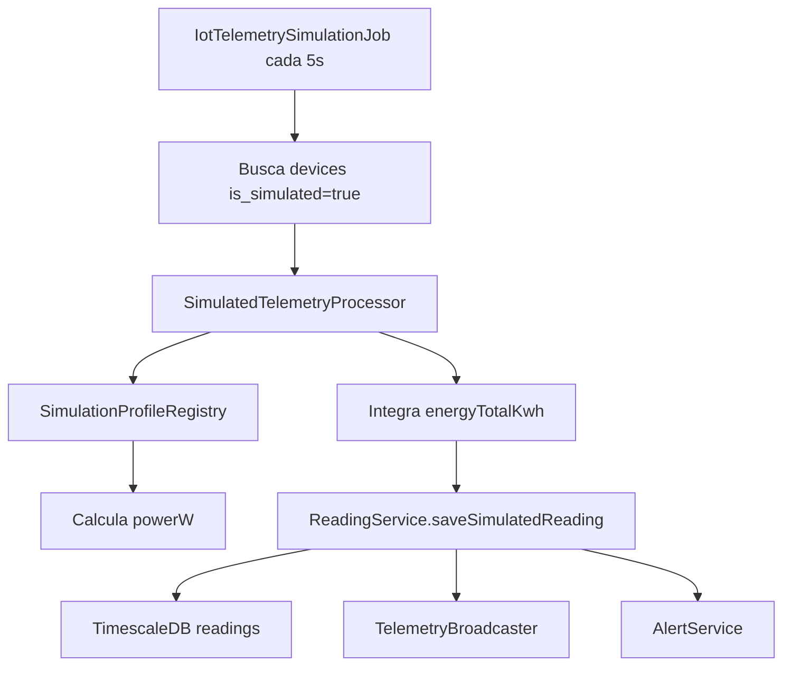

# Anexo C. Ingesta asincrona de telemetria MQTT

## 1. Objetivo de la ingesta

La ingesta de telemetria convierte mensajes de consumo electrico en lecturas persistidas y visibles en tiempo real en el dashboard. El sistema admite dos origenes:

1. **Dispositivo Shelly real**, que publica mensajes MQTT en Mosquitto.
2. **Dispositivos simulados**, generados por un job interno de Spring.

Ambos caminos terminan creando filas en `readings`, emitiendo por WebSocket y comprobando alertas de potencia.

## 2. Configuracion MQTT

**Archivo principal:** `backend/src/main/java/com/joselumartos/jwtauthbackenddemo/config/MqttConfig.java`

La clase usa Spring Integration MQTT con Paho:

| Bean | Tipo | Funcion |
| --- | --- | --- |
| `mqttClientFactory` | `DefaultMqttPahoClientFactory` | Configura URL, usuario, password y reconexion |
| `eventsRpcChannel` | `DirectChannel` | Canal para mensajes `events/rpc` |
| `statusChannel` | `DirectChannel` | Canal para mensajes `status/switch:0` |
| `mqttInbound` | `MqttPahoMessageDrivenChannelAdapter` | Adaptador que se suscribe al broker |
| `mqttInboundFlow` | `IntegrationFlow` | Enruta y transforma mensajes JSON |

### 2.1. Propiedades

**Archivo:** `backend/src/main/resources/application.properties`

| Propiedad | Variable Docker | Valor local por defecto |
| --- | --- | --- |
| `mqtt.url` | `MQTT_URL` | `tcp://localhost:1883` |
| `mqtt.username` | `MQTT_USER` | `gateway-service` |
| `mqtt.password` | `MQTT_PASSWORD` | `s3cr3t` |

En `docker-compose.yml`, el backend se conecta al broker por red interna:

```yaml
MQTT_URL: tcp://mosquitto:1883
MQTT_USER: ${PROD_MQTT_USER}
MQTT_PASSWORD: ${PROD_MQTT_PASSWORD}
```

### 2.2. Suscripcion y QoS

El adaptador MQTT usa:

```text
clientId: backend-spring-iot
topic: shellyplugsg3-9070694d3590/#
QoS: 1
```

La suscripcion esta centrada en un Shelly concreto. Es valida para el prototipo y para la demo con un dispositivo fisico, pero limita el escalado a varios Shelly si no se cambia la configuracion.

## 3. Flujo Spring Integration

El flujo discrimina por el topico recibido:



La entrega usa `DirectChannel`, por lo que el procesamiento es directo en el flujo de Spring Integration. No hay `@Async` en el proyecto para desacoplar la transaccion del hilo del adaptador.

## 4. DTOs de payload MQTT

Los DTOs estan en `backend/src/main/java/com/joselumartos/jwtauthbackenddemo/dtos`.

| DTO | Uso | Campos relevantes |
| --- | --- | --- |
| `EventsRpc` | Mensajes completos `events/rpc` | `src`, `params.timestamp`, `params.switch:0` |
| `Params` | Nodo interno del evento | Timestamp y datos del switch |
| `Switch` | Estado de switch dentro de `events/rpc` | Potencia activa y energia |
| `Status` | Mensaje de estado `status/switch:0` | `output`, `apower`, `aenergy.total` |
| `ActiveEnergy` | Energia acumulada | `total` |

Los mappers MapStruct son:

- `EventsRpcMapper`
- `StatusMapper`
- `ReadingResponseMapper`

El mapper de eventos extrae la MAC desde `src`, que llega con formato parecido a `shellyplugsg3-{mac}`. Tambien transforma la energia acumulada de Wh a kWh cuando corresponde.

## 5. `DeviceMessageHandler`

**Archivo:** `backend/src/main/java/com/joselumartos/jwtauthbackenddemo/services/DeviceMessageHandler.java`

El handler tiene dos metodos con `@ServiceActivator` y `@Transactional`.

### 5.1. Canal `eventsRpcChannel`



En esta ruta, `ReadingService.saveEntity(EventsRpc)` puede crear el dispositivo si todavia no existe. Lo registra con nombre generico y MAC extraida del payload.

### 5.2. Canal `statusChannel`



En esta ruta el dispositivo debe existir, porque el estado por si solo no trae todo el contexto que se usa en el evento RPC.

## 6. Persistencia de lecturas

**Archivo:** `backend/src/main/java/com/joselumartos/jwtauthbackenddemo/services/ReadingService.java`

`ReadingService` convierte payloads en entidades `Reading` y las guarda en `ReadingRepository`.

Campos principales de una lectura:

| Campo | Significado |
| --- | --- |
| `time` | Instante de la lectura |
| `device` | Dispositivo propietario |
| `powerW` | Potencia activa en vatios |
| `energyTotalKwh` | Energia acumulada en kWh |
| `isOn` | Estado del enchufe |

La clave de negocio es la combinacion `(time, device_id)`, lo que permite tener muchas lecturas por dispositivo sin usar un id artificial.

## 7. Emision en tiempo real

**Archivo:** `backend/src/main/java/com/joselumartos/jwtauthbackenddemo/services/TelemetryBroadcaster.java`

Tras persistir una lectura, el backend la transforma a `ReadingResponse` y la envia a:

```text
/topic/readings/{macAddress}
```

El frontend se suscribe a ese destino desde `WebsocketService.watchReadings(macAddress)`. Asi el dashboard no necesita refrescar cada pocos segundos.

La configuracion STOMP esta en:

- `backend/src/main/java/com/joselumartos/jwtauthbackenddemo/config/StompWebSocketConfig.java`
- Endpoint: `/ws-iot`
- Broker simple: `/topic`
- Prefijo de aplicacion: `/app`

## 8. Alertas de potencia

**Archivo:** `backend/src/main/java/com/joselumartos/jwtauthbackenddemo/services/AlertService.java`

Despues del broadcast de lectura se ejecuta:

```text
alertService.checkPowerThreshold(reading)
```

El servicio:

1. Comprueba que la lectura tenga dispositivo, usuario, potencia y fecha.
2. Recupera la tarifa del usuario.
3. Resuelve el periodo P1-P6 aplicable con `CalendarResolverService`.
4. Busca la potencia contratada de ese periodo.
5. Compara `powerW / 1000` con `contractedPowerKw`.
6. Si se supera, guarda una alerta `OVERPOWER`.
7. Emite la alerta por `/topic/alerts/{username}`.

El frontend actual no se suscribe todavia a ese topic de alertas; consulta las alertas con REST en `/api/v1/alerts`.

## 9. Simulacion de telemetria

La simulacion no publica mensajes MQTT. Es un camino interno que genera lecturas directamente.

| Pieza | Archivo | Funcion |
| --- | --- | --- |
| `SchedulingConfig` | `config/SchedulingConfig.java` | Activa `@EnableScheduling` |
| `SimulationProperties` | `config/SimulationProperties.java` | Lee `simulation.enabled` e `interval-ms` |
| `IotTelemetrySimulationJob` | `services/IotTelemetrySimulationJob.java` | Ejecuta el tick programado |
| `SimulatedTelemetryProcessor` | `services/SimulatedTelemetryProcessor.java` | Calcula y persiste lectura por dispositivo |
| `SimulationProfileRegistry` | `simulation/SimulationProfileRegistry.java` | Relaciona perfil con calculadora |

### 9.1. Propiedades

```properties
simulation.enabled=${SIMULATION_ENABLED:true}
simulation.interval-ms=${SIMULATION_INTERVAL_MS:5000}
```

En produccion, `docker-compose.yml` permite activar el modo demo con:

```yaml
SIMULATION_ENABLED: ${SIMULATION_ENABLED:-true}
```

### 9.2. Perfiles disponibles

| Perfil | Intencion |
| --- | --- |
| `SINE_WAVE` | Consumo variable suave |
| `OVEN` | Picos de potencia altos por ciclos de calentamiento |
| `WASHING_MACHINE` | Ciclos con fases distintas |
| `TELEVISION` | Consumo medio estable |
| `FAN` | Consumo bajo/moderado |
| `DESKTOP_PC` | Consumo variable de oficina |
| `FRIDGE` | Ciclos de compresor |
| `STANDBY` | Consumo fantasma bajo |
| `CONSTANT_HIGH_LOAD` | Carga alta constante para probar alertas |

### 9.3. Flujo de simulacion



`SimulatedTelemetryProcessor` usa una transaccion nueva por dispositivo. Esto evita que un fallo en un simulador bloquee el procesamiento de todos los demas.

## 10. Broker Mosquitto y despliegue

El broker esta definido en `docker-compose.yml`:

```yaml
mosquitto:
  image: eclipse-mosquitto:2.1.2-alpine
  ports:
    - "1883:1883"
```

La configuracion se monta desde:

```text
mosquitto/config/mosquitto.conf
mosquitto/config/password_file
```

El compose deja anotada una deuda tecnica: el puerto 1883 va en texto plano. Para un entorno real con mas exigencia de seguridad seria recomendable TLS en 8883 o una VPN si el hardware lo soporta.

## 11. Limitaciones detectadas

- La suscripcion MQTT esta fijada a `shellyplugsg3-9070694d3590/#`.
- La ingesta no usa una cola intermedia propia; el handler procesa dentro del flujo de Spring Integration.
- La simulacion no pasa por Mosquitto, asi que no valida el broker, solo el pipeline de persistencia y visualizacion.
- El frontend no consume todavia las alertas por WebSocket aunque el backend las emite.

Estas limitaciones no impiden la demo ni el MVP, pero son buenos puntos para defender como mejoras futuras.
