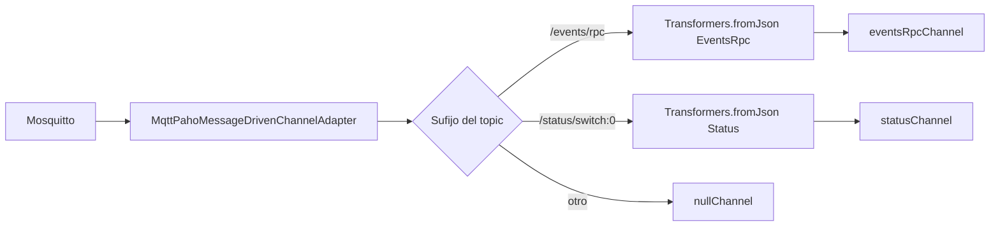
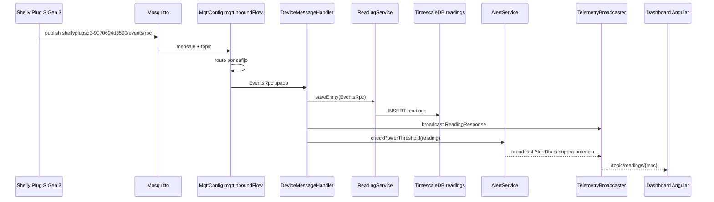

# Anexo C. Ingesta asincrona de telemetria con Spring Integration MQTT

Este anexo explica como Wattimizer recibe datos electricos desde enchufes inteligentes Shelly Plug S Gen 3 y los convierte en lecturas persistidas, alertas y mensajes en tiempo real para el frontend.

## 1. Objetivo del flujo MQTT

La telemetria no llega al backend mediante formularios ni peticiones REST. Llega como mensajes MQTT publicados por el dispositivo IoT en Mosquitto. Esta decision separa dos mundos:

- **HTTP/REST:** acciones del usuario, como login, gestion de dispositivos o consulta de costes.
- **MQTT:** datos automaticos de sensores, que pueden llegar aunque ningun usuario tenga abierto el dashboard.

El backend actua como consumidor MQTT, transforma el JSON del Shelly, guarda la lectura en `readings`, comprueba alertas y emite la lectura por STOMP para que Angular actualice la grafica.

## 2. Componentes implicados

| Componente | Archivo | Responsabilidad |
| --- | --- | --- |
| Configuracion MQTT | `config/MqttConfig.java` | Conexion con broker, suscripcion a topics y enrutado por canal. |
| Handler de mensajes | `services/DeviceMessageHandler.java` | Procesa mensajes ya convertidos a DTO. |
| Servicio de lecturas | `services/ReadingService.java` | Convierte DTO MQTT en entidad `Reading` y persiste. |
| Servicio de dispositivos | `services/DeviceService.java` | Busca o reclama dispositivos por MAC. |
| Alertas | `services/AlertService.java` | Comprueba exceso de potencia contratada. |
| Broadcast | `services/TelemetryBroadcaster.java` | Publica lecturas y alertas por STOMP. |
| Simulador | `services/IotTelemetrySimulationJob.java` | Genera lecturas sinteticas cada 5 segundos. |
| Broker | `docker-compose.yml` servicio `mosquitto` | Recibe mensajes MQTT del Shelly. |

## 3. Configuracion del broker y del backend

En `docker-compose.yml`, Mosquitto se publica en el puerto `1883`:

```yaml
mosquitto:
  image: eclipse-mosquitto:2.1.2-alpine
  ports:
    - "1883:1883"
```

El backend recibe las variables:

```yaml
MQTT_URL: tcp://mosquitto:1883
MQTT_USER: ${PROD_MQTT_USER}
MQTT_PASSWORD: ${PROD_MQTT_PASSWORD}
```

En local, `application.properties` usa fallback:

```properties
mqtt.url=${MQTT_URL:tcp://localhost:1883}
mqtt.username=${MQTT_USER:gateway-service}
mqtt.password=${MQTT_PASSWORD:s3cr3t}
```

La exposicion del puerto `1883` es una deuda de seguridad documentada: MQTT viaja en texto plano. La mejora natural seria usar TLS en `8883` o una VPN si el hardware lo permite.

## 4. Configuracion de Spring Integration

**Clase:** `config/MqttConfig.java`
**Anotacion:** `@EnableIntegration`

### 4.1. Conexion MQTT

`mqttClientFactory()` crea un `DefaultMqttPahoClientFactory` con:

| Opcion | Valor |
| --- | --- |
| Broker | `mqtt.url` |
| Usuario | `mqtt.username` |
| Password | `mqtt.password` |
| Reconexion | `setAutomaticReconnect(true)` |
| Sesion limpia | `setCleanSession(true)` |

La reconexion automatica es importante porque el backend debe recuperarse si Mosquitto reinicia o si la red interna de Docker tarda en estar disponible.

### 4.2. Canales internos

| Bean | Tipo | Uso |
| --- | --- | --- |
| `eventsRpcChannel()` | `DirectChannel` | Mensajes terminados en `/events/rpc`. |
| `statusChannel()` | `DirectChannel` | Mensajes terminados en `/status/switch:0`. |

`DirectChannel` ejecuta el handler en el mismo hilo de procesamiento del mensaje. En este proyecto encaja porque el trabajo por mensaje es acotado: persistir lectura, comprobar alerta y emitir STOMP.

### 4.3. Adaptador MQTT

```java
new MqttPahoMessageDrivenChannelAdapter(
    "backend-spring-iot",
    mqttClientFactory(),
    "shellyplugsg3-9070694d3590/#"
);
```

| Propiedad | Valor |
| --- | --- |
| Client ID | `backend-spring-iot` |
| Topic suscrito | `shellyplugsg3-9070694d3590/#` |
| QoS | `1` |

El topic esta centrado en el Shelly fisico usado en el proyecto. El wildcard `#` permite recibir subtopics del dispositivo.

## 5. Enrutado por topic

`mqttInboundFlow()` inspecciona la cabecera `MqttHeaders.RECEIVED_TOPIC` y decide la ruta.

| Sufijo del topic | Ruta logica | Transformacion JSON | Canal |
| --- | --- | --- | --- |
| `/events/rpc` | `EVENTS` | `EventsRpc.class` | `eventsRpcChannel` |
| `/status/switch:0` | `STATUS` | `Status.class` | `statusChannel` |
| Cualquier otro | `IGNORE` | Ninguna | `nullChannel` |



Esta separacion evita que `DeviceMessageHandler` tenga que parsear JSON manualmente. Cuando el handler recibe el mensaje, ya tiene un DTO tipado.

## 6. DTOs MQTT

### 6.1. `EventsRpc`

**Archivo:** `dtos/EventsRpc.java`

```java
public record EventsRpc(
    @JsonProperty("src") String source,
    Params params
) {}
```

`Params` contiene:

```java
public record Params(
    @JsonProperty("ts") Double timestamp,
    @JsonProperty("switch:0") Switch switchData
) {}
```

`Switch` contiene potencia y energia activa:

```java
public record Switch(
    @JsonProperty("aenergy") ActiveEnergy activeEnergy,
    @JsonProperty("apower") Double activePower
) {}
```

### 6.2. `Status`

**Archivo:** `dtos/Status.java`

```java
public record Status(
    Boolean output,
    @JsonProperty("apower") Double activePower,
    @JsonProperty("aenergy") ActiveEnergy activeEnergy
) {}
```

`Status` se usa cuando el dispositivo informa del estado del interruptor `switch:0`.

### 6.3. Conversion de unidades

| Campo MQTT | Unidad original | Columna final | Unidad final |
| --- | --- | --- | --- |
| `apower` | W | `readings.power_w` | W |
| `aenergy.total` | Wh | `readings.energy_total_kwh` | kWh |
| `ts` | timestamp Shelly | `readings.time` | `Instant` UTC |
| `output` | boolean | `readings.is_on` | boolean |

La conversion Wh a kWh es necesaria porque los calculos economicos trabajan con euros por kWh.

## 7. Procesamiento en `DeviceMessageHandler`

### 7.1. Eventos RPC

**Metodo:** `handleEventsRpc(Message<EventsRpc> mqttMessage)`
**Canal:** `eventsRpcChannel`
**Transaccion:** `@Transactional`

Flujo:

1. Extrae `EventsRpc` del mensaje.
2. Llama a `ReadingService.saveEntity(payload)`.
3. `ReadingService` convierte el DTO con `EventsRpcMapper`.
4. Se busca el dispositivo por MAC extraida de `source`.
5. Si procede, se persiste `Reading`.
6. Se emite `ReadingResponse` por STOMP.
7. Se llama a `AlertService.checkPowerThreshold(reading)`.

### 7.2. Estado del switch

**Metodo:** `handleStatus(Message<Status> mqttMessage)`
**Canal:** `statusChannel`
**Transaccion:** `@Transactional`

Flujo:

1. Lee el topic desde `MqttHeaders.RECEIVED_TOPIC`.
2. Extrae la MAC con `topic.split("/")[0].split("-")[1]`.
3. Busca el dispositivo con `DeviceService.findByMacAddress(macAddress)`.
4. Convierte `Status` a `Reading` usando `StatusMapper`.
5. Guarda lectura, emite STOMP y comprueba alertas.

La diferencia principal es que `EventsRpc` puede aportar timestamp propio del payload, mientras que `Status` se guarda con el instante de recepcion.

## 8. Persistencia de lecturas

La entidad `Reading` se guarda en la tabla `readings`:

| Campo | Descripcion |
| --- | --- |
| `time` | Parte temporal de la PK compuesta. |
| `device` | Dispositivo origen, tambien parte de la PK compuesta. |
| `powerW` | Potencia instantanea. |
| `energyTotalKwh` | Energia acumulada del medidor. |
| `isOn` | Estado del enchufe. |

La clave compuesta `(time, device_id)` evita duplicar lecturas del mismo dispositivo en el mismo instante.

## 9. Deteccion de alertas

Despues de guardar cada lectura, el handler llama a:

```java
alertService.checkPowerThreshold(reading);
```

Logica:

1. Si la lectura no tiene dispositivo, potencia o instante, se ignora.
2. Se obtiene la tarifa del usuario asociado al dispositivo.
3. `CalendarResolverService` resuelve el periodo aplicable P1-P6 segun hora local.
4. Se busca la potencia contratada para ese periodo.
5. Si `powerW / 1000` supera `contractedPowerKw`, se crea alerta `OVERPOWER`.
6. La alerta se emite por `/topic/alerts/{username}`.

Esta comprobacion se hace punto a punto, al entrar cada lectura. No depende de una tarea batch posterior.

## 10. Emision en tiempo real

**Clase:** `services/TelemetryBroadcaster.java`

| Tipo de mensaje | Destino STOMP | Consumidor frontend |
| --- | --- | --- |
| Lectura | `/topic/readings/{macAddress}` | `WebsocketService.watchReadings(mac)` |
| Alerta | `/topic/alerts/{username}` | Preparado en backend; el listado actual de alertas se consulta tambien por REST. |

La lectura emitida es `ReadingResponse`, el mismo DTO usado por el controlador REST de lecturas. Esto evita mantener dos modelos distintos para una misma informacion.

## 11. Flujo completo



## 12. Simulador de telemetria

**Clase:** `services/IotTelemetrySimulationJob.java`

El simulador genera telemetria cada 5 segundos para dispositivos con `is_simulated=true`. Sirve para ensenar la aplicacion aunque el Shelly fisico no este conectado.

| Aspecto | Implementacion |
| --- | --- |
| Periodicidad | `@Scheduled(fixedRate = 5000)` |
| Seleccion de dispositivos | `DeviceRepository.findBySimulatedTrue()` |
| Guardado | `ReadingService.saveSimulatedReading` |
| Salida | Mismo broadcast STOMP y misma comprobacion de alertas |

La decision buena aqui es que el simulador no crea un camino paralelo hacia el frontend. Genera lecturas y deja que el resto del sistema actue igual que con un dispositivo real.

## 13. Riesgos y mejoras futuras

| Punto | Estado actual | Mejora |
| --- | --- | --- |
| Topic fijo | Suscripcion centrada en `shellyplugsg3-9070694d3590/#`. | Generalizar a `shellyplugsg3-+/#` o gestionar topics por dispositivo registrado. |
| MQTT sin TLS | Puerto `1883` expuesto para hardware. | Usar TLS en `8883` o VPN. |
| Extraccion de MAC por `split` | Funciona con el formato actual del Shelly. | Encapsular en un parser validado para topics. |
| Procesamiento sin cola persistente interna | `DirectChannel` procesa en memoria. | Para mucho volumen, valorar canales con executor o broker intermedio. |
| Alertas repetidas | Cada lectura por encima del umbral puede generar alerta. | Anadir ventana de enfriamiento o agrupacion. |
