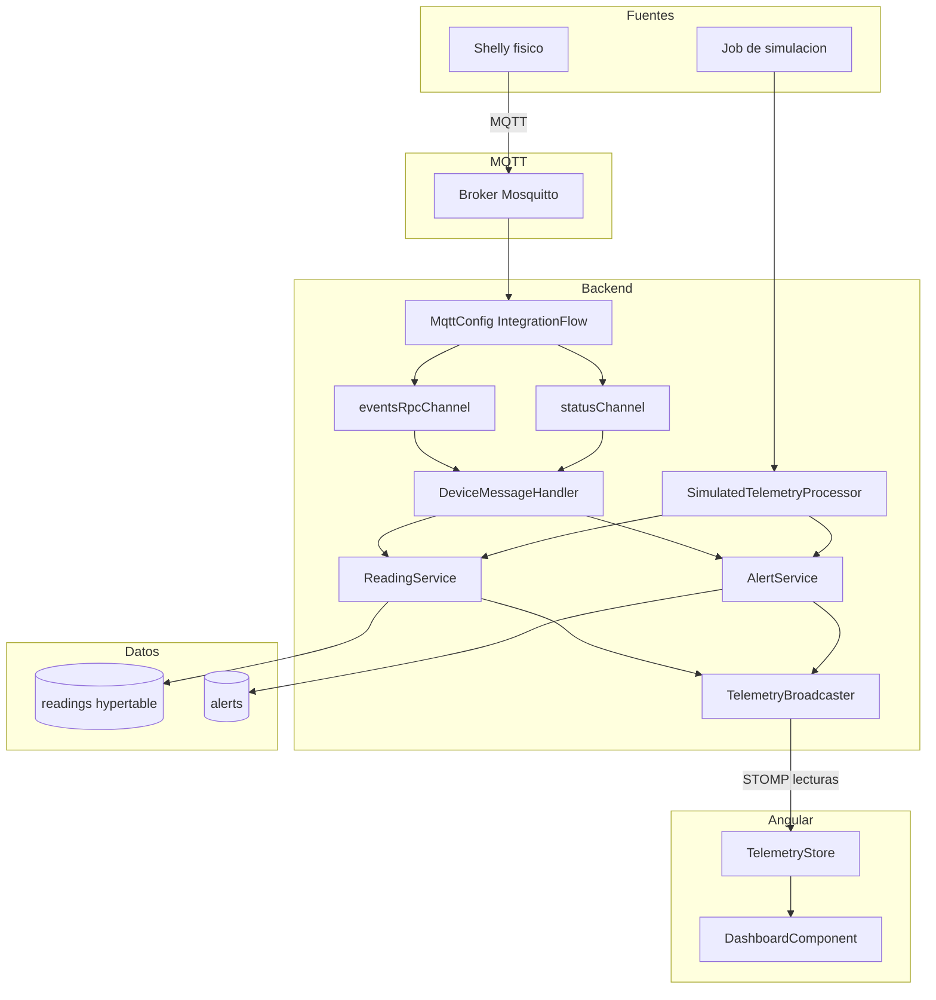

# Anexo C - Ingesta de telemetria MQTT y simulacion IoT

## 1. Objetivo de la ingesta

La ingesta de telemetria convierte mensajes de dispositivos electricos en lecturas persistentes y visibles en tiempo real. En Wattimizer hay dos fuentes:

1. **Dispositivo fisico Shelly**, que publica mensajes MQTT en Mosquitto.
2. **Simuladores internos**, que generan lecturas desde un job programado de Spring.

Ambas fuentes acaban en la misma entidad `Reading`, se guardan en TimescaleDB y disparan el mismo flujo posterior: WebSocket al dashboard y comprobacion de alertas de maximetro.

## 2. Broker MQTT y configuracion

El broker se define en `docker-compose.yml` con la imagen `eclipse-mosquitto:2.1.2-alpine`. Expone el puerto `1883` para permitir que un Shelly fisico publique desde fuera de Docker.

La configuracion Spring esta en `backend/src/main/resources/application.properties`:

```properties
mqtt.url=${MQTT_URL:tcp://localhost:1883}
mqtt.username=${MQTT_USER:gateway-service}
mqtt.password=${MQTT_PASSWORD:...}
```

En Docker, esas propiedades se sobreescriben desde `docker-compose.yml`:

```yaml
MQTT_URL: tcp://mosquitto:1883
MQTT_USER: ${PROD_MQTT_USER}
MQTT_PASSWORD: ${PROD_MQTT_PASSWORD}
```

No se documenta el valor real de secretos de produccion porque pertenecen al entorno, no al codigo.

## 3. Spring Integration MQTT

**Archivo:** `backend/src/main/java/com/joselumartos/jwtauthbackenddemo/config/MqttConfig.java`

La clase esta anotada con `@EnableIntegration` y declara:

- `MqttPahoClientFactory`: crea la conexion MQTT.
- `MqttPahoMessageDrivenChannelAdapter`: se suscribe al topic Shelly.
- `eventsRpcChannel`: canal para mensajes `events/rpc`.
- `statusChannel`: canal para mensajes `status/switch:0`.
- `IntegrationFlow`: rutea cada mensaje segun el topic recibido.

Configuracion de conexion:

```java
options.setServerURIs(new String[] { mqttUrl });
options.setUserName(mqttUsername);
options.setPassword(mqttPassword.toCharArray());
options.setAutomaticReconnect(true);
options.setCleanSession(true);
```

La suscripcion actual esta fijada a:

```java
"shellyplugsg3-9070694d3590/#"
```

Esto significa que el backend escucha la jerarquia MQTT de un Shelly concreto. Para soportar varios Shelly fisicos de forma directa, habria que hacer configurable esa lista de topics o suscribirse a un patron mas general controlado por seguridad de broker.

## 4. Ruteo de mensajes

El `IntegrationFlow` revisa la cabecera `MqttHeaders.RECEIVED_TOPIC`:

```java
if (topic != null && topic.endsWith("/events/rpc")) return "EVENTS";
if (topic != null && topic.endsWith("/status/switch:0")) return "STATUS";
return "IGNORE";
```

Despues, transforma el JSON al DTO correspondiente:

| Topic final | DTO | Canal |
|---|---|---|
| `/events/rpc` | `EventsRpc` | `eventsRpcChannel` |
| `/status/switch:0` | `Status` | `statusChannel` |
| Cualquier otro | No se procesa | `nullChannel` |

La decision de descartar topics no reconocidos en `nullChannel` evita que el backend falle por mensajes MQTT que no forman parte del MVP.

## 5. DTOs MQTT

### 5.1. `EventsRpc`

```java
@JsonIgnoreProperties(ignoreUnknown = true)
public record EventsRpc(
        @JsonProperty("src") String source,
        Params params
) {}
```

`source` contiene el identificador Shelly, por ejemplo `shellyplugsg3-9070694d3590`.

### 5.2. `Params` y `Switch`

`Params` contiene el timestamp del evento y el bloque `switch:0`. `Switch` recoge potencia activa y energia acumulada.

El mapper `EventsRpcMapper` convierte:

- timestamp del Shelly a `Instant`;
- potencia a `powerW`;
- energia acumulada Wh a kWh;
- `source` a MAC del dispositivo.

### 5.3. `Status`

```java
@JsonIgnoreProperties(ignoreUnknown = true)
public record Status(
        Boolean output,
        @JsonProperty("apower") Double activePower,
        @JsonProperty("aenergy") ActiveEnergy activeEnergy
) {}
```

El mapper `StatusMapper` usa `output` como estado del rele, `apower` como potencia instantanea y `aenergy.total` como energia acumulada.

## 6. Procesamiento con `DeviceMessageHandler`

**Archivo:** `services/DeviceMessageHandler.java`

### 6.1. Eventos RPC

Metodo:

```java
@ServiceActivator(inputChannel = "eventsRpcChannel")
public void handleEventsRpc(Message<EventsRpc> mqttMessage)
```

Flujo:

1. Recibe el DTO `EventsRpc`.
2. Llama a `ReadingService.saveEntity(payload)`.
3. `ReadingService` extrae la MAC del payload ya mapeado.
4. Si no encuentra el dispositivo por MAC, crea un dispositivo sin usuario con nombre `Nuevo Enchufe {mac}`.
5. Persiste la lectura.
6. Emite la lectura por WebSocket.
7. Llama a `AlertService.checkPowerThreshold(reading)`.

La auto-creacion del dispositivo en esta rama no vincula el dispositivo a un usuario final. El usuario debe reclamarlo despues con `POST /api/v1/devices/claim`.

### 6.2. Estado periodico `status/switch:0`

Metodo:

```java
@ServiceActivator(inputChannel = "statusChannel")
public void handleStatus(Message<Status> mqttMessage)
```

Flujo:

1. Lee el topic recibido.
2. Extrae la MAC con `topic.split("/")[0].split("-")[1]`.
3. Busca el dispositivo con `DeviceService.findByMacAddress`.
4. Mapea `Status` a `Reading`.
5. Usa `Instant.now()` como tiempo de lectura.
6. Persiste, emite WebSocket y revisa alertas.

A diferencia de `events/rpc`, esta rama espera que el dispositivo exista. Si no existe, `DeviceService.findByMacAddress` lanza `EntityNotFoundException`.

## 7. Persistencia de lecturas

La entidad real es `Reading`:

```java
@Entity
@Table(name = "readings")
@IdClass(ReadingId.class)
public class Reading {
    @Id
    private Instant time;

    @Id
    @ManyToOne(fetch = FetchType.LAZY)
    @JoinColumn(name = "device_id", nullable = false)
    private Device device;

    private BigDecimal powerW;
    private BigDecimal energyTotalKwh;
    private Boolean isOn;
}
```

La clave compuesta `time + device_id` encaja con telemetria porque una lectura pertenece a un dispositivo y a un instante concreto. En simulacion se anade un pequeno desfase por dispositivo para reducir colisiones de clave primaria cuando varios simuladores emiten en el mismo tick.

## 8. Emision en tiempo real por WebSocket

Tras guardar una lectura, el backend usa `TelemetryBroadcaster` para enviarla a:

```text
/topic/readings/{macAddress}
```

Angular se suscribe desde `WebsocketService.watchReadings(macAddress)` y el `TelemetryStore` la anade al historial del dispositivo seleccionado. Asi el navegador recibe datos nuevos sin hacer polling.

El backend tambien publica alertas por:

```text
/topic/alerts/{username}
```

En el frontend actual no hay metodo equivalente a `watchAlerts`; `AlertsComponent` consulta y borra alertas por REST. Por tanto, el canal STOMP de alertas queda disponible desde backend, pero la vista implementada no lo consume todavia.

## 9. Alertas de maximetro

`AlertService.checkPowerThreshold(reading)` se ejecuta despues de cada lectura real o simulada.

Proceso:

1. Verifica que la lectura tiene dispositivo, potencia y tiempo.
2. Comprueba que el dispositivo tiene usuario y tarifa.
3. Resuelve el periodo aplicable con `CalendarResolverService`.
4. Busca la potencia contratada de ese periodo en `TariffContractedPowerRepository`.
5. Convierte `powerW` a kW.
6. Si supera la potencia contratada, crea una alerta `OVERPOWER`.
7. Emite la alerta por WebSocket.

Esta regla conecta telemetria instantanea con informacion contractual. No basta con saber que un equipo consume mucho: hay que compararlo con el limite contratado para ese periodo.

## 10. Simulacion IoT

Los cambios recientes anaden un camino de telemetria sin hardware fisico.

### 10.1. Activacion

**Archivo:** `application.properties`

```properties
simulation.enabled=${SIMULATION_ENABLED:true}
simulation.interval-ms=${SIMULATION_INTERVAL_MS:5000}
```

En produccion, `docker-compose.yml` deja `SIMULATION_ENABLED` a `true` por defecto, salvo que se defina lo contrario en secrets.

### 10.2. `IotTelemetrySimulationJob`

**Archivo:** `services/IotTelemetrySimulationJob.java`

Cada 5 segundos ejecuta:

```java
@Scheduled(fixedRateString = "${simulation.interval-ms:5000}")
public void publishSimulatedTelemetry()
```

Si la simulacion esta desactivada, sale sin hacer nada. Si esta activa:

1. Toma `Instant.now()` como inicio del tick.
2. Recupera `deviceRepository.findBySimulatedTrue()`.
3. Procesa cada dispositivo con `SimulatedTelemetryProcessor`.
4. Captura errores por dispositivo para que un simulador roto no pare el resto.

### 10.3. `SimulatedTelemetryProcessor`

**Archivo:** `services/SimulatedTelemetryProcessor.java`

Cada dispositivo se procesa en una transaccion propia (`Propagation.REQUIRES_NEW`). Esta decision es practica: si falla un perfil, no se revierte el tick completo.

Flujo:

1. Lee `device.getSimulationProfile()`.
2. Si `isOn=false`, potencia 0 W.
3. Si esta encendido, pide la potencia a `SimulationProfileRegistry`.
4. Recupera el ultimo `energyTotalKwh`.
5. Calcula el siguiente odometro:

```text
kWh nuevo = kWh anterior + (W / 1000) * (intervalo_segundos / 3600)
```

6. Guarda lectura con `ReadingService.saveSimulatedReading`.
7. Emite WebSocket y revisa alertas.

### 10.4. Perfiles disponibles

**Archivo:** `entities/SimulationProfile.java`

| Perfil | Uso en demo |
|---|---|
| `SINE_WAVE` | Curva controlada de prueba. |
| `OVEN` | Consumo alto por ciclos. |
| `WASHING_MACHINE` | Picos y fases de lavado. |
| `TELEVISION` | Consumo moderado. |
| `FAN` | Consumo estable bajo/medio. |
| `DESKTOP_PC` | Variacion de ordenador de sobremesa. |
| `FRIDGE` | Ciclos de compresor. |
| `STANDBY` | Consumo fantasma. |
| `CONSTANT_HIGH_LOAD` | Carga alta para provocar alertas si la potencia contratada es baja. |

El endpoint `POST /api/v1/devices/simulated/demo-pack` crea un dispositivo por perfil, pero es idempotente: si el usuario ya tiene un perfil, no lo duplica.

## 11. Diagrama de flujo



## 12. Riesgos y mejoras tecnicas

- El topic MQTT esta fijado a un Shelly concreto. Para varios dispositivos fisicos convendria parametrizarlo.
- MQTT se expone por `1883`, que no cifra trafico. La mejora natural es MQTT sobre TLS (`8883`) o VPN.
- La rama `status/switch:0` no auto-registra dispositivos. Esto es correcto si se exige alta previa, pero debe tenerse en cuenta al configurar un Shelly nuevo.
- Los mensajes desconocidos se descartan. Es adecuado para el MVP, aunque en produccion podria registrarse metrica de descarte para diagnostico.
