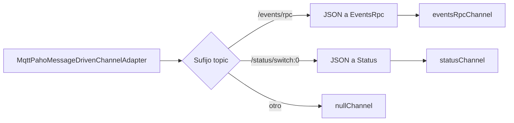
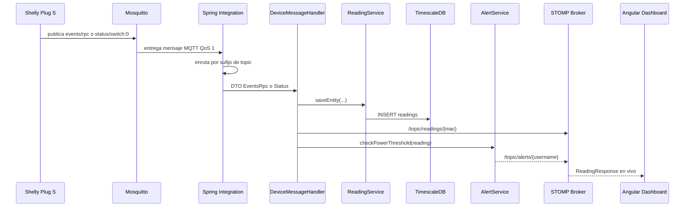

# Anexo C. Ingesta asíncrona de telemetría MQTT

Este anexo explica cómo Wattimizer recibe telemetría IoT de forma asíncrona. El flujo real está implementado con Eclipse Mosquitto, Spring Integration MQTT, servicios transaccionales de Spring y broadcast STOMP hacia Angular.

## C.1. Objetivo del pipeline

La aplicación necesita recibir lecturas de dispositivos sin que el usuario tenga que refrescar el dashboard. Para eso se separan dos caminos:

1. **Entrada asíncrona MQTT**: el dispositivo Shelly publica mensajes en Mosquitto.
2. **Salida en tiempo real WebSocket**: el backend guarda la lectura y la emite al frontend por STOMP.

Esta separación permite que el hardware no hable directamente con Angular. El backend queda como punto de control, validación, persistencia y cálculo de alertas.

## C.2. Servicios implicados

| Capa | Archivo | Responsabilidad |
|---|---|---|
| Broker | `docker-compose.yml`, `mosquitto/config/mosquitto.conf` | Recibir mensajes MQTT del Shelly. |
| Configuración MQTT | `config/MqttConfig.java` | Crear cliente, adaptador inbound, canales y rutas. |
| Handler | `services/DeviceMessageHandler.java` | Procesar mensajes ya deserializados. |
| Persistencia | `services/ReadingService.java` | Guardar lecturas y mapear payloads. |
| Alertas | `services/AlertService.java` | Detectar exceso de potencia contratada. |
| Broadcast | `services/TelemetryBroadcaster.java` | Emitir lecturas y alertas por STOMP. |
| WebSocket | `config/StompWebSocketConfig.java` | Exponer endpoint `/ws-iot` y broker `/topic`. |
| Simulación | `services/IotTelemetrySimulationJob.java`, `services/SimulatedTelemetryProcessor.java` | Generar lecturas internas sin MQTT. |

## C.3. Configuración de Mosquitto y Docker

En `docker-compose.yml`, el servicio `mosquitto` usa la imagen `eclipse-mosquitto:2.1.2-alpine` y expone el puerto `1883`:

```yaml
mosquitto:
  image: eclipse-mosquitto:2.1.2-alpine
  ports:
    - "1883:1883"
```

El comentario del compose marca una deuda de seguridad: MQTT viaja en texto plano por 1883. Para una producción más estricta habría que migrar a TLS/8883 o aislar el tráfico con VPN, sobre todo si el Shelly está fuera de la red del servidor.

El backend se conecta al broker con:

```yaml
MQTT_URL: tcp://mosquitto:1883
MQTT_USER: ${PROD_MQTT_USER}
MQTT_PASSWORD: ${PROD_MQTT_PASSWORD}
```

En local, `application.properties` usa valores por defecto:

```properties
mqtt.url=${MQTT_URL:tcp://localhost:1883}
mqtt.username=${MQTT_USER:gateway-service}
mqtt.password=${MQTT_PASSWORD:s3cr3t}
```

## C.4. Adaptador MQTT en Spring Integration

`MqttConfig` está anotada con `@EnableIntegration`. Define tres bloques:

### C.4.1. Factoría del cliente

`mqttClientFactory()` crea `DefaultMqttPahoClientFactory` con `MqttConnectOptions`:

- `serverURIs`: URL del broker.
- `userName`: usuario MQTT.
- `password`: contraseña MQTT.
- `automaticReconnect=true`: reconexión automática.
- `cleanSession=true`: sesión limpia.

Esta configuración prioriza simplicidad y recuperación automática. No mantiene sesión persistente MQTT entre reinicios, porque las lecturas se tratan como datos de streaming en tiempo real.

### C.4.2. Adaptador inbound

```java
new MqttPahoMessageDrivenChannelAdapter(
    "backend-spring-iot",
    mqttClientFactory(),
    "shellyplugsg3-9070694d3590/#"
);
```

| Propiedad | Valor |
|---|---|
| Client id | `backend-spring-iot` |
| Topic | `shellyplugsg3-9070694d3590/#` |
| QoS | `1` |

El topic está fijado para un Shelly Plug S Gen3 concreto. El comodín `#` permite recibir subtopics como `events/rpc` y `status/switch:0`.

### C.4.3. Enrutamiento por sufijo de topic

`mqttInboundFlow()` inspecciona la cabecera `MqttHeaders.RECEIVED_TOPIC`:

| Condición | Rama | Transformación | Canal |
|---|---|---|---|
| Topic termina en `/events/rpc` | `EVENTS` | JSON a `EventsRpc` | `eventsRpcChannel` |
| Topic termina en `/status/switch:0` | `STATUS` | JSON a `Status` | `statusChannel` |
| Otro topic | `IGNORE` | Ninguna | `nullChannel` |



## C.5. Payloads MQTT

### C.5.1. `EventsRpc`

`EventsRpc` representa mensajes RPC de Shelly. Incluye:

- `src`: contiene el identificador del dispositivo.
- `params.timestamp`: instante informado por Shelly.
- `params.switch:0`: bloque de estado del relé.

Dentro de `switch:0` se usan:

| Campo | Significado |
|---|---|
| `apower` | Potencia activa instantánea en W. |
| `aenergy.total` | Energía acumulada en Wh. |

En esta rama no se persiste el estado del relé. `EventsRpcMapper` ignora `isOn`, así que `events/rpc` se utiliza para potencia, energía y tiempo, pero no para encendido/apagado.

### C.5.2. `Status`

`Status` representa el estado de `/status/switch:0`. Se usa cuando el topic ya identifica el dispositivo y el backend extrae la MAC desde el topic:

```java
String macAddress = topic.split("/")[0].split("-")[1];
```

Campos usados:

| Campo | Significado |
|---|---|
| `output` | Estado del relé, mapeado a `Reading.isOn`. |
| `apower` | Potencia activa instantánea en W. |
| `aenergy.total` | Energía acumulada en Wh. |

## C.6. Handler transaccional

`DeviceMessageHandler` tiene dos métodos con `@ServiceActivator` y `@Transactional`.

### C.6.1. `handleEventsRpc`

```java
@ServiceActivator(inputChannel = "eventsRpcChannel")
public void handleEventsRpc(Message<EventsRpc> mqttMessage) {
    EventsRpc payload = mqttMessage.getPayload();
    Reading reading = readingService.saveEntity(payload);
    broadcaster.broadcast(readingResponseMapper.toDto(reading));
    alertService.checkPowerThreshold(reading);
}
```

Flujo:

1. Recibe el DTO `EventsRpc`.
2. `ReadingService.saveEntity(payload)` convierte y guarda lectura.
3. `TelemetryBroadcaster.broadcast(...)` envía la lectura al topic STOMP.
4. `AlertService.checkPowerThreshold(reading)` evalúa si debe crear alerta.

### C.6.2. `handleStatus`

```java
@ServiceActivator(inputChannel = "statusChannel")
public void handleStatus(Message<Status> mqttMessage) {
    String topic = mqttMessage.getHeaders().get(MqttHeaders.RECEIVED_TOPIC, String.class);
    String macAddress = (topic != null) ? topic.split("/")[0].split("-")[1] : null;
    DeviceDto deviceDto = deviceService.findByMacAddress(macAddress);
    Reading reading = readingService.saveEntity(deviceDto, mqttMessage.getPayload());
    broadcaster.broadcast(readingResponseMapper.toDto(reading));
    alertService.checkPowerThreshold(reading);
}
```

En esta rama, la MAC no se toma del cuerpo sino del topic. Después el flujo converge con `events/rpc`: guardar, emitir y comprobar alertas.

## C.7. Persistencia de lecturas

`ReadingService` transforma los mensajes a entidad `Reading`. La entidad se guarda en la tabla `readings`, cuya clave compuesta es:

- `time`
- `device_id`

Campos persistidos:

| Campo | Origen |
|---|---|
| `time` | Timestamp del mensaje o `Instant.now()` en status/simulación. |
| `device` | Dispositivo encontrado o creado por MAC. |
| `powerW` | `apower`. |
| `energyTotalKwh` | `aenergy.total`, convertido de Wh a kWh si procede. |
| `isOn` | Estado del relé solo cuando la lectura viene de `Status`; en `EventsRpc` se ignora. |

La decisión de guardar `energyTotalKwh` como odómetro acumulado es clave para analítica. Permite calcular coste por diferencia entre lecturas, que es más estable que integrar potencia instantánea con intervalos variables.

## C.8. Broadcast STOMP

`StompWebSocketConfig` registra:

- Endpoint: `/ws-iot`
- Broker simple: `/topic`

`TelemetryBroadcaster` publica:

| Destino | Payload |
|---|---|
| `/topic/readings/{macAddress}` | `ReadingResponse` |
| `/topic/alerts/{username}` | `AlertDto` |

Angular consume actualmente `/topic/readings/{macAddress}` mediante `WebsocketService.watchReadings(macAddress)`. El topic de alertas está preparado en backend, aunque la pantalla de alertas actual se alimenta por REST.

## C.9. Detección de alertas de potencia

Tras guardar cada lectura, `AlertService.checkPowerThreshold(reading)`:

1. Obtiene el usuario y tarifa del dispositivo.
2. Resuelve el periodo regulatorio actual.
3. Busca la potencia contratada para ese periodo.
4. Convierte la lectura de W a kW.
5. Si la potencia medida supera la contratada, crea alerta `OVERPOWER`.
6. Emite la alerta por `/topic/alerts/{username}`.

Esta lógica se ejecuta tanto para telemetría MQTT real como para telemetría simulada.

## C.10. Simulación IoT

La simulación no pasa por MQTT, pero está diseñada para entrar en el mismo pipeline de negocio después de generar la lectura.

| Clase | Responsabilidad |
|---|---|
| `IotTelemetrySimulationJob` | Job `@Scheduled` cada `simulation.interval-ms`, por defecto 5000 ms. |
| `SimulationProperties` | Lee `simulation.enabled` e intervalo. |
| `SimulatedTelemetryProcessor` | Procesa un dispositivo simulado concreto. |
| `SimulationProfileRegistry` | Elige calculadora según `SimulationProfile`. |
| `PowerProfileCalculator` y clases concretas | Generan potencia sintética. |

Perfiles disponibles:

- `SINE_WAVE`
- `OVEN`
- `WASHING_MACHINE`
- `TELEVISION`
- `FAN`
- `DESKTOP_PC`
- `FRIDGE`
- `STANDBY`
- `CONSTANT_HIGH_LOAD`

El cálculo de energía acumulada mantiene monotonicidad cuando hay potencia positiva. Si un dispositivo falla durante el job, los tests comprueban que los demás se siguen procesando.

## C.11. Flujo completo de datos



## C.12. Pruebas relacionadas

| Test | Qué aporta |
|---|---|
| `IotTelemetrySimulationJobTest` | Comprueba que la simulación no se ejecuta si está desactivada y que continúa si falla un dispositivo. |
| `SimulationProfileRegistryTest` | Valida que todos los perfiles devuelven potencia no negativa y determinista para un instante. |
| `DeviceServiceTest` | Valida creación de dispositivos simulados, pack demo y limpieza de lecturas/alertas al borrar. |
| `ConsumptionServiceTest` | Usa lecturas simuladas para comprobar cálculo de consumo fantasma. |

## C.13. Limitaciones actuales

- El topic MQTT está acoplado a un dispositivo Shelly concreto.
- MQTT está expuesto por 1883 sin TLS en la configuración actual.
- El frontend no consume todavía `/topic/alerts/{username}`.
- No hay test de integración que arranque Mosquitto y valide el flujo MQTT extremo a extremo.

Estas limitaciones no bloquean el MVP, pero son mejoras claras si la aplicación pasa de demo técnica a uso productivo con varios dispositivos reales.
