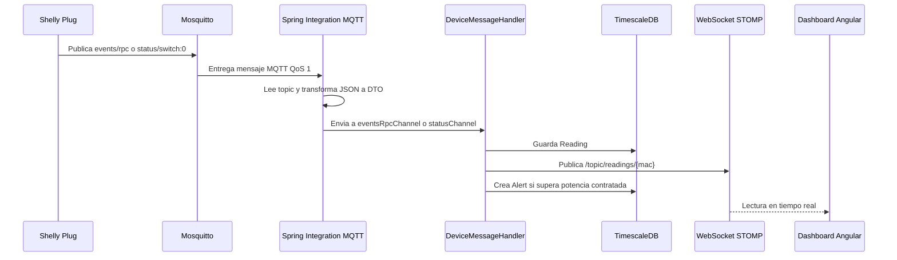

# Anexo C. Ingesta de telemetria MQTT con Spring Integration

## 1. Objetivo de la ingesta

La ingesta MQTT convierte mensajes publicados por enchufes Shelly en lecturas persistentes dentro de Wattimizer. El flujo conecta el mundo fisico del dispositivo con la parte web: el Shelly publica potencia y energia, el backend lo guarda en TimescaleDB y Angular lo recibe en directo por WebSocket.

La pieza central esta en `backend/src/main/java/com/joselumartos/jwtauthbackenddemo/config/MqttConfig.java`.

## 2. Configuracion MQTT

| Elemento | Valor en codigo |
|---|---|
| Cliente MQTT | `MqttPahoMessageDrivenChannelAdapter` |
| Client ID | `backend-spring-iot` |
| Broker | `${mqtt.url}` (`tcp://mosquitto:1883` en Docker) |
| Usuario/contrasena | `${mqtt.username}` y `${mqtt.password}` |
| QoS | `1` |
| Reconexion | `automaticReconnect=true` |
| Sesion | `cleanSession=true` |
| Topic suscrito | `shellyplugsg3-9070694d3590/#` |

El topic esta fijado a un Shelly concreto. Esto simplifica el MVP porque se conoce de antemano el dispositivo fisico de pruebas, pero limita la escalabilidad: para varios dispositivos reales habria que parametrizar la suscripcion o usar un patron mas general y validar despues la MAC.

## 3. Enrutamiento por topic

`mqttInboundFlow` lee la cabecera `MqttHeaders.RECEIVED_TOPIC` y decide la rama:

```java
message -> {
    String topic = message.getHeaders().get(MqttHeaders.RECEIVED_TOPIC, String.class);
    if (topic != null && topic.endsWith("/events/rpc")) return "EVENTS";
    if (topic != null && topic.endsWith("/status/switch:0")) return "STATUS";
    return "IGNORE";
}
```

| Sufijo | DTO destino | Canal | Funcion |
|---|---|---|---|
| `/events/rpc` | `EventsRpc` | `eventsRpcChannel` | Lecturas de evento Shelly con timestamp propio. |
| `/status/switch:0` | `Status` | `statusChannel` | Estado del interruptor y potencia actual. |
| Otros | - | `nullChannel` | Mensajes descartados. |

Los mensajes se transforman desde JSON con `Transformers.fromJson(...)`. Asi, cuando llegan al handler, el codigo ya trabaja con records Java en lugar de cadenas JSON.

## 4. DTOs MQTT

### 4.1. Evento RPC

`EventsRpc` representa el payload de eventos del Shelly. Los campos importantes son:

```java
public record EventsRpc(
        @JsonProperty("src") String source,
        Params params
) {}

public record Params(
        @JsonProperty("ts") Double timestamp,
        @JsonProperty("switch:0") Switch switchData
) {}

public record Switch(
        @JsonProperty("aenergy") ActiveEnergy activeEnergy,
        @JsonProperty("apower") Double activePower
) {}

public record ActiveEnergy(Double total) {}
```

En este formato:

- `src` contiene algo parecido a `shellyplugsg3-9070694d3590`.
- `ts` es el timestamp en segundos epoch.
- `apower` es la potencia instantanea en W.
- `aenergy.total` llega en Wh y se convierte a kWh.

### 4.2. Estado del switch

`Status` representa `status/switch:0`:

- `output`: indica si el enchufe esta encendido.
- `apower`: potencia activa.
- `aenergy.total`: energia acumulada en Wh.

Para este topic, la MAC no viene del DTO principal, sino que se extrae del topic:

```java
String topic = mqttMessage.getHeaders().get(MqttHeaders.RECEIVED_TOPIC, String.class);
String macAddress = (topic != null) ? topic.split("/")[0].split("-")[1] : null;
```

## 5. Mapeo a entidad `Reading`

La entidad final es `Reading`, guardada en la tabla `readings`.

| Origen MQTT | Campo `Reading` |
|---|---|
| `params.ts` | `time` |
| MAC del `src` o del topic | `device` |
| `apower` | `powerW` |
| `aenergy.total / 1000` | `energyTotalKwh` |
| `output` en `Status` | `isOn` |

`EventsRpcMapper` y `StatusMapper` hacen la conversion Wh -> kWh para guardar el acumulado en una unidad mas adecuada para calculos de coste.

Hay una diferencia importante:

- En `status/switch:0`, `DeviceMessageHandler` busca el dispositivo por MAC antes de guardar.
- En `events/rpc`, `EventsRpcMapper` intenta localizar el dispositivo desde `src`. Si no lo encuentra, `ReadingService.saveEntity(EventsRpc)` acaba creando un dispositivo con MAC vacia porque el mapper devuelve `device=null`. Por eso la documentacion no debe afirmar que `events/rpc` auto-registra correctamente cualquier MAC desconocida.

## 6. Handler de mensajes

El servicio `DeviceMessageHandler` procesa ambos canales.

```java
@Transactional
@ServiceActivator(inputChannel = "eventsRpcChannel")
public void handleEventsRpc(Message<EventsRpc> mqttMessage) {
    EventsRpc payload = mqttMessage.getPayload();
    Reading reading = readingService.saveEntity(payload);
    broadcaster.broadcast(readingResponseMapper.toDto(reading));
    alertService.checkPowerThreshold(reading);
}
```

```java
@Transactional
@ServiceActivator(inputChannel = "statusChannel")
public void handleStatus(Message<Status> mqttMessage) {
    String topic = mqttMessage.getHeaders().get(MqttHeaders.RECEIVED_TOPIC, String.class);
    String macAddress = (topic != null) ? topic.split("/")[0].split("-")[1] : null;
    DeviceDto deviceDto = deviceService.findByMacAddress(macAddress);

    Status payload = mqttMessage.getPayload();
    Reading reading = readingService.saveEntity(deviceDto, payload);
    broadcaster.broadcast(readingResponseMapper.toDto(reading));
    alertService.checkPowerThreshold(reading);
}
```

El handler hace tres cosas en orden:

1. Persiste la lectura.
2. Publica la lectura por WebSocket.
3. Comprueba si hay sobrepotencia y, si procede, crea una alerta.

## 7. Asincronia real del flujo

Desde el punto de vista de arquitectura, MQTT desacopla el dispositivo fisico del backend: el Shelly publica en Mosquitto y Spring Boot consume cuando el mensaje llega. Sin embargo, dentro de la aplicacion el procesamiento no usa una cola propia ni un pool separado:

- `eventsRpcChannel` es `DirectChannel`.
- `statusChannel` es `DirectChannel`.
- No hay `ExecutorChannel`, `@Async` ni cola persistente.

Por tanto, el flujo es asincrono respecto al frontend y al dispositivo, pero el handler se ejecuta de forma directa dentro del flujo del adaptador MQTT. Si un handler fuese lento, podria afectar al consumo de mensajes.

## 8. Publicacion en tiempo real

Tras guardar una lectura, `TelemetryBroadcaster` la envia al broker STOMP interno:

| Tipo | Destino |
|---|---|
| Lectura | `/topic/readings/{macAddress}` |
| Alerta | `/topic/alerts/{username}` |

La configuracion WebSocket esta en `StompWebSocketConfig`:

```java
registry.addEndpoint("/ws-iot").setAllowedOriginPatterns(origins);
registry.enableSimpleBroker("/topic");
registry.setApplicationDestinationPrefixes("/app");
```

Angular se suscribe con `RxStomp` desde `WebsocketService.watchReadings(macAddress)`.

## 9. Simulacion de telemetria

Ademas del Shelly real, Wattimizer incluye telemetria simulada para demostraciones.

| Clase | Funcion |
|---|---|
| `IotTelemetrySimulationJob` | Job programado con `@Scheduled(fixedRateString = "${simulation.interval-ms:5000}")`. |
| `SimulatedTelemetryProcessor` | Calcula potencia, acumula kWh, persiste lectura y lanza broadcast/alertas. |
| `SimulationProfileRegistry` | Selecciona el calculador segun `SimulationProfile`. |

La simulacion se activa con `simulation.enabled` o `SIMULATION_ENABLED`. En Docker Compose esta en `true` por defecto para permitir una demo sin hardware.

`SimulatedTelemetryProcessor` usa `@Transactional(propagation = Propagation.REQUIRES_NEW)`. Esto significa que cada dispositivo simulado se procesa en su propia transaccion. Si falla uno, el resto del tick puede seguir generando lecturas.

## 10. Flujo completo



## 11. Riesgos y mejoras detectadas

- El topic MQTT esta atado a una MAC concreta: funciona para el dispositivo de pruebas, pero no para alta dinamica de muchos Shelly.
- Mosquitto expone `1883`, que no cifra el trafico. El propio `docker-compose.yml` lo marca como deuda de seguridad.
- Los canales son directos; si aumenta el volumen, convendria introducir `ExecutorChannel`, cola o procesamiento por lotes.
- El alta automatica desde `events/rpc` no conserva correctamente la MAC cuando el dispositivo no existe, por lo que conviene registrar/reclamar dispositivos antes de confiar en ese topic.
- Las alertas dependen de que el usuario tenga tarifa y potencia contratada por periodo. Sin esos datos, el sistema guarda lectura pero no puede evaluar sobrepotencia.
