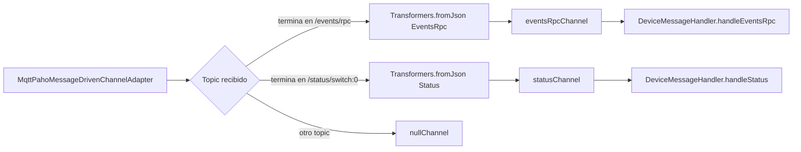
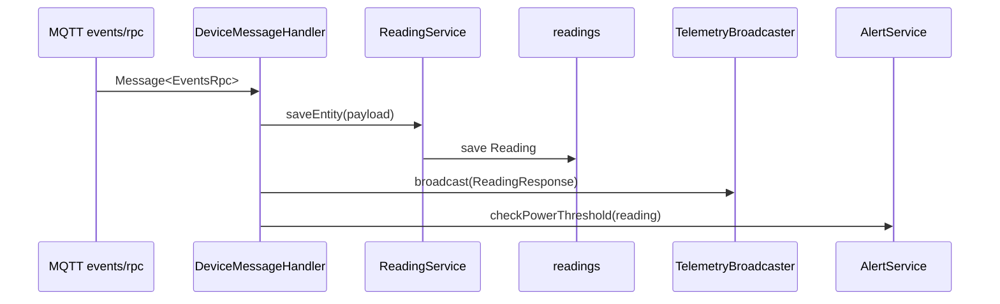
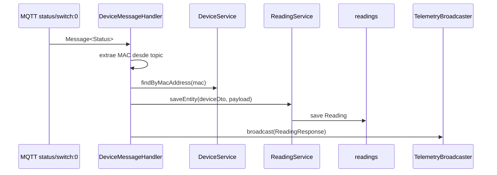
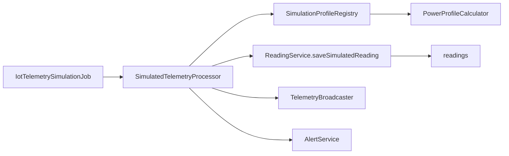

# Anexo C. Ingesta asincrona de telemetria con MQTT

## 1. Objetivo de la ingesta

La ingesta MQTT permite que el backend reciba lecturas de enchufes inteligentes
Shelly sin depender de peticiones HTTP del frontend. El dispositivo publica datos
en un broker MQTT, Spring Integration los transforma a DTOs Java y el backend los
guarda en la tabla `readings`. Despues emite la lectura por WebSocket para que el
dashboard Angular se actualice en tiempo real.

Archivos principales:

| Archivo | Responsabilidad |
| --- | --- |
| `config/MqttConfig.java` | Conexion al broker, suscripcion y enrutado por topic. |
| `services/DeviceMessageHandler.java` | Procesa los mensajes ya convertidos a DTO. |
| `services/ReadingService.java` | Guarda lecturas en base de datos. |
| `mappers/EventsRpcMapper.java` | Mapea mensajes `events/rpc` a `Reading`. |
| `mappers/StatusMapper.java` | Mapea mensajes `status/switch:0` a `Reading`. |
| `services/TelemetryBroadcaster.java` | Publica lecturas y alertas por STOMP. |
| `services/AlertService.java` | Comprueba maximetro y genera alertas. |

## 2. Configuracion del broker MQTT

La clase `MqttConfig` lee las credenciales desde `application.properties`, que a
su vez permite sobreescribirlas por variables de entorno:

| Propiedad | Variable | Valor por defecto local |
| --- | --- | --- |
| `mqtt.url` | `MQTT_URL` | `tcp://localhost:1883` |
| `mqtt.username` | `MQTT_USER` | `gateway-service` |
| `mqtt.password` | `MQTT_PASSWORD` | `s3cr3t` |

El `MqttPahoClientFactory` configura:

- URI del broker.
- Usuario y contrasena.
- Reconexion automatica.
- Sesion limpia.

La sesion limpia (`cleanSession=true`) encaja con el objetivo de tiempo real del
proyecto: se priorizan lecturas recientes para dashboard y analitica, no una cola
larga de mensajes antiguos pendientes.

## 3. Adaptador inbound y topics

`mqttInbound()` crea un `MqttPahoMessageDrivenChannelAdapter` con:

| Parametro | Valor |
| --- | --- |
| Client ID | `backend-spring-iot` |
| Topic suscrito | `shellyplugsg3-9070694d3590/#` |
| QoS | `1` |

El topic esta fijado actualmente a un Shelly concreto. Esto sirve para el MVP y
para una demo controlada, pero una mejora futura seria suscribirse de forma
dinamica a los dispositivos registrados.

Topics procesados:

- `shellyplugsg3-9070694d3590/events/rpc`
- `shellyplugsg3-9070694d3590/status/switch:0`

## 4. Flujo de Spring Integration

El `IntegrationFlow` recibe mensajes del adaptador, mira la cabecera
`MqttHeaders.RECEIVED_TOPIC` y decide que rama usar:



Los canales son `DirectChannel`. Eso significa que no hay una cola intermedia
configurada por el proyecto: el mensaje se entrega de forma directa al handler.
La parte asincrona viene del propio patron MQTT y del adaptador inbound, no de una
cola interna adicional.

## 5. DTOs MQTT

### 5.1. `EventsRpc`

Representa eventos publicados por Shelly en `events/rpc`.

Estructura logica:

```json
{
  "src": "shellyplugsg3-9070694d3590",
  "params": {
    "ts": 1720387200.0,
    "switch:0": {
      "apower": 1250.5,
      "aenergy": {
        "total": 45678.0
      }
    }
  }
}
```

Mapeo principal:

| JSON Shelly | DTO Java | Entidad `Reading` |
| --- | --- | --- |
| `src` | `EventsRpc.source` | `device.macAddress` sin prefijo Shelly. |
| `params.ts` | `Params.timestamp` | `time`. |
| `params["switch:0"].apower` | `Switch.activePower` | `powerW`. |
| `params["switch:0"].aenergy.total` | `ActiveEnergy.total` | `energyTotalKwh` tras pasar Wh a kWh. |

`EventsRpcMapper` ignora `isOn` al convertir a entidad porque este mensaje no
trae directamente el estado del interruptor.

### 5.2. `Status`

Representa estado del interruptor en `status/switch:0`.

```json
{
  "output": true,
  "apower": 1250.5,
  "aenergy": {
    "total": 45678.0
  }
}
```

Mapeo principal:

| JSON Shelly | Entidad `Reading` |
| --- | --- |
| `output` | `isOn` |
| `apower` | `powerW` |
| `aenergy.total` | `energyTotalKwh` en kWh |

En este flujo el tiempo no viene del payload. `ReadingService.saveEntity(DeviceDto,
Status)` asigna `Instant.now()` del servidor.

## 6. Procesamiento en `DeviceMessageHandler`

Archivo: `services/DeviceMessageHandler.java`

### 6.1. Rama `eventsRpcChannel`



`ReadingService.saveEntity(EventsRpc)` busca el dispositivo por MAC. Si no existe,
lo crea como enchufe nuevo sin usuario asignado. Esta decision permite que el
sistema detecte hardware antes de que un usuario lo reclame.

### 6.2. Rama `statusChannel`



Aqui no hay autocreacion de dispositivo: si la MAC no existe, `DeviceService` lanza
error. Es una diferencia importante entre los dos tipos de mensaje.

## 7. Persistencia en `readings`

La entidad `Reading` representa cada muestra:

| Campo | Origen | Descripcion |
| --- | --- | --- |
| `time` | Shelly `ts`, `Instant.now()` o simulador | Parte temporal de la PK. |
| `device` | MAC resuelta a `Device` | Parte de la PK compuesta. |
| `powerW` | `apower` | Potencia activa. |
| `energyTotalKwh` | `aenergy.total / 1000` | Odometro acumulado. |
| `isOn` | `output` o simulador | Estado de interruptor. |

`ReadingId` define la clave compuesta formada por `device` y `time`. Esta clave
encaja con TimescaleDB porque el tiempo es la dimension principal de la hypertable.

## 8. Emision a Angular por WebSocket

`TelemetryBroadcaster.broadcast(ReadingResponse)` publica en:

```text
/topic/readings/{macAddress}
```

Angular se suscribe con `WebsocketService.watchReadings(macAddress)`. Esta
separacion tiene sentido porque REST se usa para cargar historial inicial y STOMP
para las lecturas nuevas.

Tambien se publican alertas en:

```text
/topic/alerts/{username}
```

El endpoint WebSocket se configura en `StompWebSocketConfig`:

| Elemento | Valor |
| --- | --- |
| Handshake | `/ws-iot` |
| Broker simple | `/topic` |
| Prefijo de aplicacion | `/app` |
| Origenes | Los mismos de CORS REST. |

## 9. Alertas de maximetro

`AlertService.checkPowerThreshold(Reading)` aplica el siguiente flujo:

1. Comprueba que la lectura tenga dispositivo y usuario.
2. Comprueba que el usuario tenga tarifa.
3. Resuelve el periodo P1-P6 con `CalendarResolverService`.
4. Busca la potencia contratada para ese periodo.
5. Convierte la potencia medida de W a kW.
6. Si supera la contratada, crea alerta `OVERPOWER`.
7. Publica la alerta por WebSocket.

```text
powerKw = powerW / 1000
si powerKw > contractedPowerKw -> crear alerta
```

El sistema no deduplica alertas. Por tanto, varias lecturas seguidas por encima
del limite generan varias filas en `alerts`.

## 10. Simulacion paralela a MQTT

Ademas del hardware real, existe un flujo de simulacion:



Los perfiles estan en `backend/src/main/java/.../simulation`, por ejemplo:

- `OvenPowerCalculator`
- `WashingMachinePowerCalculator`
- `FridgePowerCalculator`
- `StandbyPowerCalculator`
- `ConstantHighLoadPowerCalculator`

Este camino reutiliza persistencia, WebSocket y alertas. La decision es buena para
el proyecto porque permite demostrar el dashboard aunque no haya un Shelly real
publicando mensajes.

## 11. Limitaciones documentables

- El topic MQTT esta hardcodeado a un unico dispositivo Shelly.
- `events/rpc` puede crear un dispositivo nuevo; `status/switch:0` exige que ya exista.
- El mensaje `Status` usa hora del servidor, no hora del dispositivo.
- `EventsRpcMapper` pierde subsegundos al convertir `ts` a `Instant`.
- El campo `isOn` puede quedar `null` cuando la lectura viene de `events/rpc`.
- `DirectChannel` no anade una cola de reintentos propia dentro de Spring.
- WebSocket no valida JWT en el handshake actual.
