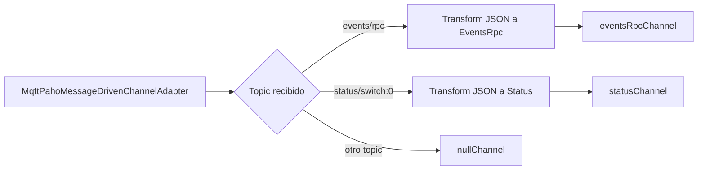
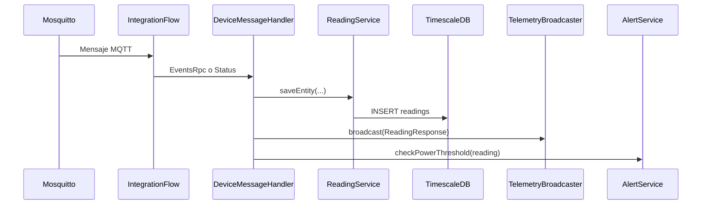

# Anexo C. Ingesta de telemetría asíncrona con Spring Integration MQTT

## 1. Objetivo del flujo de telemetría

Wattimizer necesita recibir medidas eléctricas sin que el usuario tenga que refrescar la página. Para eso el backend escucha un broker MQTT, transforma los mensajes del enchufe inteligente, guarda la lectura en TimescaleDB y la reenvía al frontend mediante WebSocket STOMP.

El flujo real combina:

- Mosquitto como broker MQTT.
- Spring Integration MQTT para suscribirse y enrutar mensajes.
- MapStruct para convertir DTOs externos en entidades `Reading`.
- Spring Data JPA para persistir lecturas.
- `SimpMessagingTemplate` para publicar por WebSocket STOMP.
- `AlertService` para revisar si la potencia supera el contrato.

## 2. Configuración MQTT

**Archivo:** `backend/src/main/java/com/joselumartos/jwtauthbackenddemo/config/MqttConfig.java`

Propiedades:

```properties
mqtt.url=${MQTT_URL:tcp://localhost:1883}
mqtt.username=${MQTT_USER:gateway-service}
mqtt.password=${MQTT_PASSWORD:s3cr3t}
```

En producción, Docker Compose inyecta:

```yaml
MQTT_URL: tcp://mosquitto:1883
MQTT_USER: ${PROD_MQTT_USER}
MQTT_PASSWORD: ${PROD_MQTT_PASSWORD}
```

### 2.1. Factoría de cliente MQTT

`mqttClientFactory()` crea un `DefaultMqttPahoClientFactory` con:

- URL del broker.
- Usuario y contraseña.
- Reconexión automática.
- Sesión limpia.

La reconexión automática es importante porque el backend no debe dejar de escuchar telemetría si Mosquitto se reinicia durante el despliegue.

### 2.2. Adaptador de entrada

```java
new MqttPahoMessageDrivenChannelAdapter(
    "backend-spring-iot",
    mqttClientFactory(),
    "shellyplugsg3-9070694d3590/#"
);
```

El backend se suscribe al árbol de topics del dispositivo Shelly físico. El `#` final permite recibir subtopics como:

- `shellyplugsg3-9070694d3590/events/rpc`
- `shellyplugsg3-9070694d3590/status/switch:0`

El QoS se configura a `1`, por lo que se prioriza que el mensaje llegue al menos una vez. Por esa misma razón el frontend deduplica algunas lecturas por timestamp cuando las pinta.

## 3. Enrutamiento con `IntegrationFlow`

El bean `mqttInboundFlow` toma cada mensaje y decide a qué canal mandarlo según el sufijo del topic.



Ramas:

| Sufijo de topic | DTO | Canal |
| --- | --- | --- |
| `/events/rpc` | `EventsRpc` | `eventsRpcChannel` |
| `/status/switch:0` | `Status` | `statusChannel` |
| Cualquier otro | Se descarta | `nullChannel` |

Esta separación evita mezclar formatos de mensaje. Aunque ambos terminan creando una lectura, cada topic trae los datos con una estructura diferente.

## 4. DTOs MQTT

Los DTOs están en `backend/src/main/java/com/joselumartos/jwtauthbackenddemo/dtos/`.

### 4.1. `EventsRpc`

Representa eventos RPC del Shelly. Contiene:

- `source`: incluye el identificador del dispositivo, por ejemplo `shellyplugsg3-9070694d3590`.
- `params`: agrupa timestamp y datos de `switch:0`.
- Energía acumulada en Wh, que luego se convierte a kWh.

El mapper `EventsRpcMapper` extrae la MAC desde `source`:

```java
String mac = source.substring(source.lastIndexOf("-") + 1);
```

y convierte energía:

```java
BigDecimal.valueOf(energyWh).divide(BigDecimal.valueOf(1000))
```

### 4.2. `Status`

Representa el estado instantáneo del switch. El topic permite saber de qué MAC viene el mensaje:

```java
String macAddress = topic.split("/")[0].split("-")[1];
```

El mapper `StatusMapper` transforma:

| Campo MQTT | Campo `Reading` |
| --- | --- |
| `activePower` | `powerW` |
| `activeEnergy.total` | `energyTotalKwh` |
| `output` | `isOn` |

En este caso el tiempo no viene como `Instant` de la misma manera que en `EventsRpc`, así que `ReadingService.saveEntity(deviceDto, status)` asigna `Instant.now()`.

## 5. Procesamiento con `DeviceMessageHandler`

**Archivo:** `backend/src/main/java/com/joselumartos/jwtauthbackenddemo/services/DeviceMessageHandler.java`



Métodos:

| Método | Canal | Acción |
| --- | --- | --- |
| `handleEventsRpc` | `eventsRpcChannel` | Convierte `EventsRpc`, guarda lectura, emite por STOMP y revisa alerta. |
| `handleStatus` | `statusChannel` | Extrae MAC del topic, localiza dispositivo, guarda lectura, emite por STOMP y revisa alerta. |

Ambos métodos son transaccionales. La decisión tiene sentido porque guardar lectura, construir DTO y revisar alerta forman parte del mismo procesamiento lógico de un mensaje.

## 6. Persistencia en `ReadingService`

**Archivo:** `backend/src/main/java/com/joselumartos/jwtauthbackenddemo/services/ReadingService.java`

`ReadingService` guarda lecturas desde tres fuentes:

| Fuente | Método | Particularidad |
| --- | --- | --- |
| MQTT `EventsRpc` | `saveEntity(EventsRpc dto)` | Puede crear un dispositivo nuevo si la MAC no existe. |
| MQTT `Status` | `saveEntity(DeviceDto deviceDto, Status dto)` | Usa `Instant.now()` y el dispositivo ya localizado. |
| Simulación | `saveSimulatedReading(...)` | No pasa por DTO externo porque los datos los calcula el backend. |

En `EventsRpc`, si no se encuentra el dispositivo, se crea uno con nombre `Nuevo Enchufe {mac}`. Esto permite que el sistema no pierda lecturas si el enchufe empieza a publicar antes de estar completamente vinculado.

## 7. Emisión hacia Angular con STOMP

**Backend:** `TelemetryBroadcaster`
**Frontend:** `WebsocketService`

El backend publica lecturas en:

```text
/topic/readings/{macAddress}
```

y alertas en:

```text
/topic/alerts/{username}
```

Configuración STOMP:

**Archivo:** `backend/src/main/java/com/joselumartos/jwtauthbackenddemo/config/StompWebSocketConfig.java`

| Elemento | Valor |
| --- | --- |
| Endpoint WebSocket | `/ws-iot` |
| Broker simple | `/topic` |
| Prefijo de aplicación | `/app` |
| Orígenes permitidos | `app.cors.allowed-origins` |

En Angular, `WebsocketService.watchReadings(macAddress)` escucha:

```ts
const destination = `/topic/readings/${macAddress}`;
```

La URL WebSocket se calcula según el protocolo actual:

```ts
const protocol = window.location.protocol === "https:" ? "wss:" : "ws:";
const wsUrl = `${protocol}//${window.location.host}/ws-iot`;
```

Así el mismo código sirve para desarrollo y producción.

## 8. Ruta paralela de simulación

Además de MQTT real, Wattimizer incluye simuladores IoT. Esto es útil para la demo pública y para probar la aplicación sin hardware Shelly.

### 8.1. Job programado

**Archivo:** `backend/src/main/java/com/joselumartos/jwtauthbackenddemo/services/IotTelemetrySimulationJob.java`

```java
@Scheduled(fixedRateString = "${simulation.interval-ms:5000}")
public void publishSimulatedTelemetry() {
    if (!simulationProperties.enabled()) {
        return;
    }
    // Busca dispositivos simulados y procesa cada uno.
}
```

Propiedades:

```properties
simulation.enabled=${SIMULATION_ENABLED:true}
simulation.interval-ms=${SIMULATION_INTERVAL_MS:5000}
```

### 8.2. Procesador de dispositivo simulado

**Archivo:** `backend/src/main/java/com/joselumartos/jwtauthbackenddemo/services/SimulatedTelemetryProcessor.java`

Cada dispositivo simulado se procesa en una transacción independiente con `Propagation.REQUIRES_NEW`. La razón es práctica: si un simulador falla, no debe cancelar el tick completo del resto de dispositivos.

Flujo:

1. Lee el perfil de simulación del dispositivo.
2. Calcula potencia instantánea con `SimulationProfileRegistry`.
3. Recupera el último `energyTotalKwh`.
4. Calcula el siguiente acumulado.
5. Guarda una lectura en `readings`.
6. Emite por STOMP igual que MQTT real.
7. Comprueba alertas de potencia.

El cálculo de energía acumulada usa:

```text
kWh nuevo = kWh anterior + (W * segundos / 1000 / 3600)
```

## 9. Alertas dentro del pipeline

**Archivo:** `backend/src/main/java/com/joselumartos/jwtauthbackenddemo/services/AlertService.java`

Tras cada lectura real o simulada se llama a:

```java
alertService.checkPowerThreshold(reading);
```

La comprobación hace:

1. Verifica que hay lectura, dispositivo, potencia y fecha.
2. Comprueba que el usuario tiene tarifa.
3. Resuelve el periodo aplicable con `CalendarResolverService`.
4. Obtiene la potencia contratada del periodo.
5. Convierte W a kW.
6. Si la potencia actual supera el límite, crea una alerta `OVERPOWER`.
7. Emite la alerta por `/topic/alerts/{username}`.

Este diseño tiene una ventaja: las alertas se generan cerca del punto donde entra el dato. No dependen de que el usuario abra la pantalla de alertas o el dashboard.

## 10. Flujo completo extremo a extremo

```mermaid
flowchart TD
    A[Shelly Plug S Gen 3] -->|MQTT| B[Mosquitto]
    B --> C[MqttPahoMessageDrivenChannelAdapter]
    C --> D{Topic}
    D -->|events/rpc| E[EventsRpcMapper]
    D -->|status/switch:0| F[StatusMapper]
    E --> G[ReadingService]
    F --> G
    G --> H[(readings hypertable)]
    G --> I[TelemetryBroadcaster]
    G --> J[AlertService]
    J --> K[(alerts)]
    I --> L[/topic/readings/{mac}]
    J --> M[/topic/alerts/{username}]
    L --> N[Angular Dashboard]
    M --> O[Angular Alerts]
```

## 11. Consideraciones técnicas

- El topic MQTT está actualmente ligado a un Shelly concreto (`shellyplugsg3-9070694d3590/#`). Para soportar muchos dispositivos físicos habría que generalizar la suscripción.
- MQTT se expone en producción por el puerto 1883. El propio `docker-compose.yml` marca esto como deuda de seguridad porque es texto plano.
- La tabla `readings` debe convertirse en hypertable antes de recibir grandes volúmenes de datos.
- La simulación reutiliza la misma salida STOMP y la misma lógica de alertas, por lo que el frontend no distingue si una lectura viene de hardware real o de un simulador.
