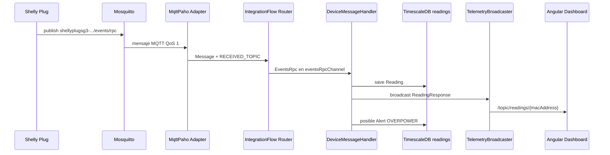

# Anexo C. Ingesta asíncrona de telemetría MQTT

## 1. Objetivo de la ingesta

La ingesta MQTT permite que Wattimizer reciba datos de enchufes inteligentes Shelly y los convierta en lecturas persistentes. El sistema no trabaja con mensajes MQTT directamente en el frontend. El backend actúa como puente:

1. Recibe MQTT desde Mosquitto.
2. Transforma JSON a DTOs Java.
3. Guarda una lectura en `readings`.
4. Emite la lectura por STOMP WebSocket al navegador.
5. Evalúa si debe crear una alerta de potencia.

## 2. Configuración principal

Archivo: `backend/src/main/java/com/joselumartos/jwtauthbackenddemo/config/MqttConfig.java`

Propiedades usadas:

```properties
mqtt.url=${...}
mqtt.username=${...}
mqtt.password=${...}
```

La configuración crea un `DefaultMqttPahoClientFactory` con:

- `automaticReconnect = true`
- `cleanSession = true`
- usuario y contraseña desde properties

Adaptador inbound:

```java
new MqttPahoMessageDrivenChannelAdapter(
    "backend-spring-iot",
    mqttClientFactory(),
    "shellyplugsg3-9070694d3590/#"
);
```

El topic está hardcoded a un Shelly concreto. Esto es suficiente para la demo actual, pero no es todavía una configuración multi-dispositivo basada en base de datos o properties.

## 3. Canales Spring Integration

El flujo se define con `IntegrationFlow.from(mqttInbound)` y enruta según `MqttHeaders.RECEIVED_TOPIC`.

| Topic recibido | Rama | Transformación | Canal final |
| --- | --- | --- | --- |
| Termina en `/events/rpc` | `EVENTS` | `Transformers.fromJson(EventsRpc.class)` | `eventsRpcChannel` |
| Termina en `/status/switch:0` | `STATUS` | `Transformers.fromJson(Status.class)` | `statusChannel` |
| Cualquier otro | `IGNORE` | Ninguna | `nullChannel` |

Los canales son `DirectChannel`. Esto significa que el mensaje se procesa en la cadena de Spring Integration sin una cola intermedia declarada en el código.

## 4. DTOs MQTT

### 4.1. Eventos RPC Shelly

Archivos:

- `dtos/EventsRpc.java`
- `dtos/Params.java`
- `dtos/Switch.java`
- `dtos/ActiveEnergy.java`

Estructura simplificada:

```java
public record EventsRpc(
    @JsonProperty("src") String source,
    Params params
) {}

public record Params(
    @JsonProperty("ts") Double timestamp,
    @JsonProperty("switch:0") Switch switch0
) {}

public record Switch(
    @JsonProperty("aenergy") ActiveEnergy activeEnergy,
    @JsonProperty("apower") Double activePower
) {}

public record ActiveEnergy(Double total) {}
```

Todos ignoran propiedades desconocidas con `@JsonIgnoreProperties(ignoreUnknown = true)`, porque los payloads Shelly pueden traer más campos de los que la aplicación necesita.

### 4.2. Estado de interruptor

Archivo: `dtos/Status.java`

```java
public record Status(
    Boolean output,
    @JsonProperty("apower") Double activePower,
    @JsonProperty("aenergy") ActiveEnergy activeEnergy
) {}
```

`output` se mapea a `isOn`; `apower` representa potencia activa; `aenergy.total` representa energía acumulada.

## 5. Mappers MapStruct

| Mapper | Archivo | Conversión |
| --- | --- | --- |
| `EventsRpcMapper` | `mappers/EventsRpcMapper.java` | Convierte timestamp Shelly a `Instant`, extrae MAC desde `src` y transforma Wh a kWh. |
| `StatusMapper` | `mappers/StatusMapper.java` | Convierte `output` a `isOn` y energía acumulada a kWh. |
| `ReadingResponseMapper` | `mappers/ReadingResponseMapper.java` | Convierte entidad `Reading` a DTO REST/STOMP. |

La decisión de usar mappers evita llenar el handler MQTT de conversiones de formato. El handler se queda con la lógica de flujo: guardar, emitir y comprobar alertas.

## 6. Handler de mensajes

Archivo: `backend/src/main/java/com/joselumartos/jwtauthbackenddemo/services/DeviceMessageHandler.java`

### 6.1. Rama `eventsRpcChannel`

```java
@Transactional
@ServiceActivator(inputChannel = "eventsRpcChannel")
public void handleEventsRpc(Message<EventsRpc> mqttMessage) {
    EventsRpc payload = mqttMessage.getPayload();
    Reading reading = readingService.saveEntity(payload);
    broadcaster.broadcast(readingResponseMapper.toDto(reading));
    alertService.checkPowerThreshold(reading);
}
```

Flujo:

1. Recibe `EventsRpc`.
2. `ReadingService.saveEntity(EventsRpc)` crea la entidad `Reading`.
3. Si la MAC no existe, crea un `Device` sin usuario con nombre `"Nuevo Enchufe <mac>"`.
4. Guarda la lectura.
5. Publica la lectura a Angular por STOMP.
6. Evalúa alerta de potencia.

El auto-registro en esta rama no asigna propietario. El usuario debe reclamar el dispositivo después si quiere verlo en su cuenta.

### 6.2. Rama `statusChannel`

```java
@Transactional
@ServiceActivator(inputChannel = "statusChannel")
public void handleStatus(Message<Status> mqttMessage) {
    String topic = mqttMessage.getHeaders().get(MqttHeaders.RECEIVED_TOPIC, String.class);
    String macAddress = (topic != null) ? topic.split("/")[0].split("-")[1] : null;
    DeviceDto deviceDto = deviceService.findByMacAddress(macAddress);

    Status payload = mqttMessage.getPayload();
    Reading reading = readingService.saveEntity(deviceDto, payload);
    broadcaster.broadcast(readingResponseMapper.toDto(reading));
    alertService.checkPowerThreshold(reading);
}
```

En esta rama la MAC se obtiene desde el topic. Por ejemplo:

```text
shellyplugsg3-9070694d3590/status/switch:0
```

La extracción real es:

```java
topic.split("/")[0].split("-")[1]
```

Esto asume la convención `shellyplugsg3-<mac>`. Si en el futuro se añaden otros modelos Shelly, convendría encapsular esta lógica en una utilidad con tests.

## 7. Persistencia de lecturas

Archivo: `backend/src/main/java/com/joselumartos/jwtauthbackenddemo/services/ReadingService.java`

### 7.1. Eventos RPC

```java
Reading reading = eventsRpcMapper.toEntity(dto);
Device managedDevice = deviceRepository.findByMacAddress(macAddress)
    .orElseGet(() -> {
        Device newDevice = new Device();
        newDevice.setMacAddress(macAddress);
        newDevice.setName("Nuevo Enchufe " + macAddress);
        newDevice.setIsOn(true);
        return deviceRepository.save(newDevice);
    });
reading.setDevice(managedDevice);
return readingRepository.save(reading);
```

La intención es no perder telemetría aunque el dispositivo aún no haya sido dado de alta manualmente. La consecuencia es que puede existir un dispositivo sin `user_id`, pendiente de reclamación.

### 7.2. Estado de interruptor

```java
Reading reading = statusMapper.toEntity(dto);
reading.setTime(Instant.now());
reading.setDevice(deviceDtoMapper.toEntity(deviceDto));
return readingRepository.save(reading);
```

Aquí se usa `Instant.now()` porque el DTO `Status` no trae el mismo timestamp de evento que `EventsRpc`. Es una decisión práctica: registra el momento de recepción en backend.

## 8. Broadcast STOMP

Archivo: `backend/src/main/java/com/joselumartos/jwtauthbackenddemo/services/TelemetryBroadcaster.java`

Destino de lecturas:

```text
/topic/readings/{macAddress}
```

Destino de alertas:

```text
/topic/alerts/{username}
```

Configuración WebSocket:

Archivo: `backend/src/main/java/com/joselumartos/jwtauthbackenddemo/config/StompWebSocketConfig.java`

- Endpoint: `/ws-iot`
- Broker simple: `/topic`
- Prefijo de aplicación: `/app`

Angular se conecta con `@stomp/rx-stomp` y escucha solo el topic de la MAC seleccionada en el dashboard.

## 9. Flujo completo MQTT a pantalla



## 10. Simulación de telemetría

Además de MQTT físico, el backend incluye simulación interna:

- `IotTelemetrySimulationJob`
- `SimulatedTelemetryProcessor`
- `SimulationProfile`
- `SimulationProfileRegistry`

Configuración:

```properties
simulation.enabled=...
simulation.interval-ms=...
```

El job programado recorre dispositivos con `is_simulated=true`, calcula potencia según perfil, acumula energía y guarda lecturas con `ReadingService.saveSimulatedReading`. Después sigue el mismo final que MQTT:

```text
persistir lectura -> broadcast STOMP -> checkPowerThreshold
```

Esto se añadió para que la demo no dependa de tener un enchufe físico activo durante la defensa.

## 11. Limitaciones actuales

- Solo hay MQTT inbound; no hay comandos outbound activos hacia el enchufe.
- El topic físico está hardcoded a `shellyplugsg3-9070694d3590/#`.
- La extracción de MAC desde topic depende del formato exacto del nombre Shelly.
- `events/rpc` puede crear dispositivos sin usuario, lo que exige reclamación posterior.
- `status/switch:0` necesita que la MAC exista previamente; si no existe, `DeviceService.findByMacAddress` lanzará error.

## 12. Posibles mejoras

- Configurar patrones de topic desde base de datos o properties.
- Añadir una tabla de gateways/dispositivos para registrar topics autorizados.
- Separar parsing de MAC en una clase testeable.
- Incorporar cola persistente si se necesita tolerancia a picos de mensajes.
- Añadir métricas de ingesta: mensajes recibidos, descartados y errores de parseo.
