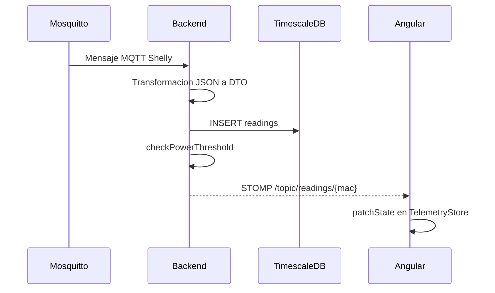

# Anexo C. Ingesta de telemetria MQTT y simulacion IoT

## 1. Objetivo del subsistema

El subsistema de telemetria convierte lecturas electricas en datos utiles para el usuario. Tiene dos entradas:

1. Mensajes MQTT reales publicados por un Shelly Plug S G3.
2. Lecturas simuladas generadas por el backend para demostracion.

Ambas entradas convergen en la misma salida:

- se guarda una fila en `readings`;
- se emite un `ReadingResponse` por STOMP;
- se comprueba si la potencia supera la contratada;
- si hay exceso, se guarda una alerta `OVERPOWER`.

```mermaid
flowchart TB
    A[Shelly Plug S G3] -->|MQTT| B[Mosquitto]
    B --> C[Spring Integration MQTT]
    C --> D[DeviceMessageHandler]
    E[IotTelemetrySimulationJob] --> F[SimulatedTelemetryProcessor]
    D --> G[ReadingService]
    F --> G
    G --> H[(readings hypertable)]
    G --> I[TelemetryBroadcaster]
    I --> J[/topic/readings/{mac}]
    G --> K[AlertService]
    K --> L[(alerts)]
    K --> M[/topic/alerts/{username}]
```

## 2. Configuracion MQTT

Archivo: `backend/src/main/java/com/joselumartos/jwtauthbackenddemo/config/MqttConfig.java`

Propiedades:

```properties
mqtt.url=${MQTT_URL:tcp://localhost:1883}
mqtt.username=${MQTT_USER:gateway-service}
mqtt.password=${MQTT_PASSWORD:s3cr3t}
```

En Docker Compose se sobreescriben con:

```yaml
MQTT_URL: tcp://mosquitto:1883
MQTT_USER: ${PROD_MQTT_USER}
MQTT_PASSWORD: ${PROD_MQTT_PASSWORD}
```

El cliente MQTT se crea con `DefaultMqttPahoClientFactory` y `MqttConnectOptions`:

| Opcion | Valor |
|---|---|
| `serverURIs` | `mqtt.url` |
| `userName` | `mqtt.username` |
| `password` | `mqtt.password` |
| `automaticReconnect` | `true` |
| `cleanSession` | `true` |

La suscripcion actual es:

```java
"shellyplugsg3-9070694d3590/#"
```

Esto significa que el backend escucha un prefijo fijo de Shelly. Es funcional para el dispositivo real configurado, pero como mejora futura convendria externalizarlo a propiedades o base de datos.

## 3. Flujo Spring Integration

`MqttConfig` declara dos canales internos:

```java
eventsRpcChannel: DirectChannel
statusChannel: DirectChannel
```

El adaptador de entrada es `MqttPahoMessageDrivenChannelAdapter` con:

- client id: `backend-spring-iot`;
- QoS: `1`;
- topic: `shellyplugsg3-9070694d3590/#`.

La ruta se decide por el final del topic:

| Topic recibido | Rama | DTO |
|---|---|---|
| termina en `/events/rpc` | `EVENTS` | `EventsRpc` |
| termina en `/status/switch:0` | `STATUS` | `Status` |
| cualquier otro | `IGNORE` | `nullChannel` |

Fragmento esencial:

```java
.route(Message.class,
    message -> {
        String topic = message.getHeaders().get(MqttHeaders.RECEIVED_TOPIC, String.class);
        if (topic != null && topic.endsWith("/events/rpc")) return "EVENTS";
        if (topic != null && topic.endsWith("/status/switch:0")) return "STATUS";
        return "IGNORE";
    },
    router -> router
        .subFlowMapping("EVENTS", eventsBranch -> eventsBranch
            .transform(Transformers.fromJson(EventsRpc.class))
            .channel("eventsRpcChannel"))
        .subFlowMapping("STATUS", statusBranch -> statusBranch
            .transform(Transformers.fromJson(Status.class))
            .channel("statusChannel"))
        .defaultOutputChannel("nullChannel"))
```

Esta separacion evita que el handler tenga que inspeccionar JSON bruto. El flujo ya entrega objetos Java tipados.

## 4. Payloads MQTT

### 4.1. Evento RPC

DTO principal:

```java
public record EventsRpc(
        @JsonProperty("src") String source,
        Params params
) {}
```

DTOs anidados:

```java
public record Params(
        @JsonProperty("ts") Double timestamp,
        @JsonProperty("switch:0") Switch switchData
) {}
```

```java
public record Switch(
        @JsonProperty("aenergy") ActiveEnergy activeEnergy,
        @JsonProperty("apower") Double activePower
) {}
```

El campo `src` permite extraer la MAC desde un identificador tipo `shellyplugsg3-{mac}`. El timestamp llega como epoch y el odometro de energia se normaliza antes de persistir.

### 4.2. Estado del switch

DTO:

```java
public record Status(
        Boolean output,
        @JsonProperty("apower") Double activePower,
        @JsonProperty("aenergy") ActiveEnergy activeEnergy
) {}
```

En este caso la MAC no va en el cuerpo JSON, sino en el topic. `DeviceMessageHandler` la obtiene asi:

```java
String macAddress = (topic != null) ? topic.split("/")[0].split("-")[1] : null;
```

## 5. `DeviceMessageHandler`

Archivo: `backend/src/main/java/com/joselumartos/jwtauthbackenddemo/services/DeviceMessageHandler.java`

### 5.1. `handleEventsRpc`

Entrada:

```java
@ServiceActivator(inputChannel = "eventsRpcChannel")
public void handleEventsRpc(Message<EventsRpc> mqttMessage)
```

Pasos:

1. Extrae el payload `EventsRpc`.
2. Llama a `readingService.saveEntity(payload)`.
3. Convierte la entidad a `ReadingResponse`.
4. Emite por WebSocket con `TelemetryBroadcaster`.
5. Ejecuta `alertService.checkPowerThreshold(reading)`.

### 5.2. `handleStatus`

Entrada:

```java
@ServiceActivator(inputChannel = "statusChannel")
public void handleStatus(Message<Status> mqttMessage)
```

Pasos:

1. Lee el topic desde `MqttHeaders.RECEIVED_TOPIC`.
2. Extrae la MAC.
3. Busca el dispositivo con `deviceService.findByMacAddress`.
4. Guarda lectura con `readingService.saveEntity(deviceDto, payload)`.
5. Emite lectura por STOMP.
6. Comprueba alerta de potencia.

Ambos metodos tienen `@Transactional`. La transaccion cubre guardado de lectura y comprobacion de alerta, de forma que el proceso de una lectura se trata como una unidad de trabajo.

## 6. Persistencia y broadcast

La entidad final es `Reading`:

```java
@Entity
@Table(name = "readings")
@IdClass(ReadingId.class)
public class Reading {
    @Id
    private Instant time;

    @Id
    @ManyToOne(fetch = FetchType.LAZY)
    @JoinColumn(name = "device_id", nullable = false)
    private Device device;

    private BigDecimal powerW;
    private BigDecimal energyTotalKwh;
    private Boolean isOn;
}
```

El broadcast se realiza con `TelemetryBroadcaster` mediante `SimpMessagingTemplate`.

Destinos:

| Dato | Topic |
|---|---|
| Lecturas | `/topic/readings/{macAddress}` |
| Alertas | `/topic/alerts/{username}` |

La configuracion WebSocket esta en `StompWebSocketConfig`:

```java
registry.addEndpoint("/ws-iot").setAllowedOriginPatterns(origins);
registry.enableSimpleBroker("/topic");
registry.setApplicationDestinationPrefixes("/app");
```

El endpoint `/ws-iot` esta permitido en `SecurityConfig`. Actualmente no se documenta una validacion JWT de suscripciones STOMP, por lo que la autorizacion en tiempo real queda pendiente como mejora.

## 7. Alertas de maximetro

Cada lectura llega a `AlertService.checkPowerThreshold(reading)`.

La logica esperada es:

1. Obtener el usuario y tarifa del dispositivo.
2. Resolver el periodo tarifario aplicable en el instante de la lectura.
3. Buscar la potencia contratada para ese periodo.
4. Convertir `powerW` a kW.
5. Si la potencia instantanea supera la contratada, crear alerta `OVERPOWER`.

Esta comprobacion se ejecuta tanto para MQTT real como para simulacion. La ventaja es que las reglas de negocio no dependen del origen de la lectura.

## 8. Simulacion IoT asincrona

La simulacion no usa `@Async`; usa planificacion con `@Scheduled`.

Configuracion:

```properties
simulation.enabled=${SIMULATION_ENABLED:true}
simulation.interval-ms=${SIMULATION_INTERVAL_MS:5000}
```

La clase `IotTelemetrySimulationJob` se ejecuta cada `simulation.interval-ms`:

```java
@Scheduled(fixedRateString = "${simulation.interval-ms:5000}")
public void publishSimulatedTelemetry()
```

Pasos:

1. Si `simulation.enabled` es `false`, no hace nada.
2. Obtiene todos los dispositivos con `simulated=true`.
3. Para cada dispositivo llama a `SimulatedTelemetryProcessor.processDevice`.
4. Si un dispositivo falla, registra un `warn` y continua con los demas.

Esta ultima decision es importante: un simulador mal configurado no debe tumbar toda la demo.

## 9. `SimulatedTelemetryProcessor`

Archivo: `backend/src/main/java/com/joselumartos/jwtauthbackenddemo/services/SimulatedTelemetryProcessor.java`

La transaccion por dispositivo se declara asi:

```java
@Transactional(propagation = Propagation.REQUIRES_NEW)
```

Con esto, cada dispositivo simulado tiene su propia transaccion. Si falla uno, no revierte las lecturas de otros dispositivos procesados en el mismo tick.

Flujo:

1. Lee el perfil de simulacion del dispositivo.
2. Comprueba si el dispositivo esta encendido.
3. Aplica un pequeno desfase de tiempo: `tickStart.plusMillis(device.getId() % 1000L)`.
4. Calcula potencia con `SimulationProfileRegistry`.
5. Recupera el ultimo `energyTotalKwh`.
6. Integra energia: potencia por duracion.
7. Guarda lectura simulada.
8. Emite WebSocket y comprueba alertas.

El desfase temporal evita colisiones de clave primaria `(time, device_id)` cuando varios ticks caen muy cerca.

## 10. Perfiles de consumo

El enum `SimulationProfile` define perfiles que representan equipos distintos:

| Perfil | Intencion funcional |
|---|---|
| `SINE_WAVE` | Carga generica variable. |
| `OVEN` | Picos altos y ciclos de calentamiento. |
| `WASHING_MACHINE` | Ciclos con fases diferenciadas. |
| `TELEVISION` | Consumo estable moderado. |
| `FAN` | Carga baja-media. |
| `DESKTOP_PC` | Consumo de equipo informatico. |
| `FRIDGE` | Ciclos intermitentes. |
| `STANDBY` | Consumo fantasma bajo. |
| `CONSTANT_HIGH_LOAD` | Carga alta constante, util para probar alertas. |

`SimulationProfileRegistry` mantiene el mapa perfil -> calculadora. Si el perfil es nulo, usa `SINE_WAVE` como fallback.

## 11. Relacion con Angular

El frontend no se conecta a MQTT. Angular solo consume:

- REST para historico reciente;
- STOMP para lecturas en tiempo real.



`TelemetryStore.connectTelemetry(mac)` usa `switchMap`. Por eso, cuando el usuario cambia de dispositivo, se abandona la suscripcion anterior y se escucha solo la MAC seleccionada.

## 12. Limitaciones detectadas

| Punto | Estado actual | Mejora propuesta |
|---|---|---|
| Topic Shelly | Prefijo fijo `shellyplugsg3-9070694d3590/#`. | Configurar por propiedades o registrar topics por dispositivo. |
| Error JSON MQTT | No hay `errorChannel` especifico. | Registrar canal de errores y metricas de mensajes descartados. |
| Seguridad STOMP | `/ws-iot` permitido a nivel HTTP. | Validar token en handshake o en suscripcion. |
| Tests MQTT | No hay pruebas dedicadas de `MqttConfig` ni `DeviceMessageHandler`. | Anadir tests de transformacion, routing y persistencia. |
| Retencion telemetria | No hay politica de compresion/retencion. | Definir politicas TimescaleDB para lecturas antiguas. |

## 13. Pruebas existentes relacionadas

| Test | Validacion |
|---|---|
| `IotTelemetrySimulationJobTest` | No incrementa energia con 0 W, energia monotona con potencia positiva, resiliencia ante fallo por dispositivo y flag de desactivacion. |
| `SimulationProfileRegistryTest` | Todos los perfiles devuelven potencia no negativa y determinista. |
| `DeviceServiceTest` | Creacion de simuladores, pack demo y borrado con lecturas/alertas. |
| `ConsumptionServiceTest` | Costes derivados de lecturas y zonas horarias. |

El flujo MQTT real no esta cubierto por test automatico, asi que su validacion depende de pruebas manuales o de integracion con Mosquitto y Shelly.
