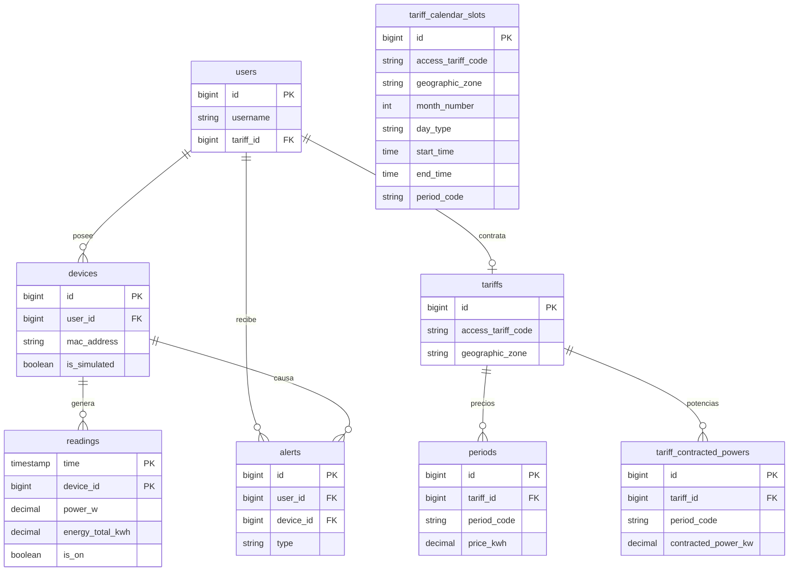

# Anexo D - TimescaleDB y consultas analíticas

## 1. Alcance del anexo

Este anexo documenta la estructura de datos relacionada con series temporales, tarifas y analíticas energéticas. El backend usa PostgreSQL con la extensión TimescaleDB para convertir la tabla `readings` en hypertable.

Archivos analizados:

- `backend/src/main/resources/db/dev-seed/00-extensions.sql`
- `backend/src/main/resources/db/dev-seed/01-hypertable.sql`
- `backend/src/main/resources/db/tariffs-td-schema.sql`
- `backend/src/main/resources/db/seed-tariff-calendar-slots.sql`
- `repositories/ReadingRepository.java`
- `repositories/TariffCalendarSlotRepository.java`
- `services/ConsumptionService.java`
- `services/CalendarResolverService.java`

## 2. Extensiones de base de datos

El script `00-extensions.sql` habilita TimescaleDB y `pgcrypto`. TimescaleDB se usa para gestionar lecturas como serie temporal. `pgcrypto` queda disponible para utilidades criptográficas de PostgreSQL, aunque el cifrado principal de autenticación se gestiona desde Spring Security.

La conversión a hypertable está en `01-hypertable.sql`:

```sql
SELECT create_hypertable('readings', 'time');
```

El propio script indica que debe ejecutarse después de que Hibernate cree la tabla y antes de recibir datos MQTT. Si la tabla ya contiene filas, habría que usar:

```sql
SELECT create_hypertable('readings', 'time', migrate_data => true);
```

## 3. Tabla `readings`

La tabla `readings` procede de la entidad `Reading`.

| Columna | Tipo lógico | Restricción | Descripción |
| --- | --- | --- | --- |
| `time` | timestamp/instant | PK compuesta | Momento de la lectura |
| `device_id` | bigint | PK compuesta, FK a `devices.id` | Dispositivo asociado |
| `power_w` | decimal | Nullable | Potencia activa instantánea |
| `energy_total_kwh` | decimal | Nullable | Energía acumulada del contador |
| `is_on` | boolean | Nullable | Estado del relé o simulador |

Clave primaria:

```text
(time, device_id)
```

Diseño:

- `time` es la dimensión temporal de la hypertable.
- `device_id` separa lecturas de distintos dispositivos.
- `energy_total_kwh` se almacena como odómetro, no como consumo puntual.
- El consumo de un intervalo se calcula por diferencia entre lecturas consecutivas.

## 4. Tablas de dispositivos, usuarios y alertas

### 4.1. `devices`

| Columna | Uso |
| --- | --- |
| `id` | Identificador interno |
| `user_id` | Usuario propietario, nullable para dispositivos aún no reclamados |
| `name` | Nombre visible en la UI |
| `mac_address` | Identificador único del dispositivo |
| `is_on` | Estado lógico |
| `is_simulated` | Distingue hardware real de simuladores |
| `simulation_profile` | Perfil de consumo simulado |

La MAC es única porque se usa como identificador natural en endpoints y tópicos.

### 4.2. `users`

Guarda el usuario autenticado y la relación con su tarifa privada o clonada. El campo más importante para las analíticas es la tarifa asociada, porque sin tarifa no se puede convertir kWh a euros.

### 4.3. `alerts`

Registra avisos generados por el backend. En el flujo actual se usa para alertas de sobrepotencia (`OVERPOWER`) cuando una lectura supera la potencia contratada.

## 5. Modelo de tarifas TD

El modelo tarifario se apoya en cuatro tablas:

| Tabla | Función |
| --- | --- |
| `tariffs` | Contrato o plantilla de tarifa |
| `periods` | Precio del kWh por periodo P1-P6 |
| `tariff_contracted_powers` | Potencia contratada por periodo |
| `tariff_calendar_slots` | Calendario que asigna periodo según mes, día y hora |

### 5.1. `tariffs`

Campos relevantes:

| Campo | Descripción |
| --- | --- |
| `name` | Nombre visible |
| `market` | Mercado o tipo comercial |
| `access_tariff_code` | Peaje: `2.0TD`, `3.0TD`, `6.1TD`, `6.2TD` |
| `geographic_zone` | Zona: Península, Canarias, Baleares, Ceuta o Melilla |
| `energy_company` | Comercializadora |

Restricciones SQL:

```sql
CHECK (access_tariff_code IN ('2.0TD', '3.0TD', '6.1TD', '6.2TD'))
CHECK (geographic_zone IN ('PENINSULA', 'CANARIAS', 'ISLAS_BALEARES', 'CEUTA', 'MELILLA'))
```

### 5.2. `periods`

Cada fila define el precio del kWh para un periodo.

```sql
CREATE UNIQUE INDEX IF NOT EXISTS ux_periods_tariff_period_code
  ON periods (tariff_id, period_code);
```

Esto impide tener dos precios P1 para la misma tarifa.

### 5.3. `tariff_contracted_powers`

Define la potencia contratada en kW por periodo.

Restricciones:

```sql
CHECK (period_code IN ('P1', 'P2', 'P3', 'P4', 'P5', 'P6'))
CHECK (contracted_power_kw > 0)
```

Índice:

```sql
CREATE INDEX IF NOT EXISTS ix_tariff_contracted_powers_tariff_id
  ON tariff_contracted_powers (tariff_id);
```

### 5.4. `tariff_calendar_slots`

Es una dimensión de calendario. Permite responder a esta pregunta: "para esta tarifa, zona, mes, tipo de día y hora, ¿qué periodo P1-P6 se aplica?".

Índices:

```sql
CREATE UNIQUE INDEX IF NOT EXISTS ux_tariff_calendar_slots_lookup
  ON tariff_calendar_slots (
    access_tariff_code, geographic_zone, month_number, day_type, start_time, end_time
  );

CREATE INDEX IF NOT EXISTS ix_tariff_calendar_slots_period_code
  ON tariff_calendar_slots (
    access_tariff_code, geographic_zone, month_number, day_type, period_code
  );
```

Restricciones:

```sql
CHECK (month_number BETWEEN 1 AND 12)
CHECK (season_code IN ('HIGH', 'MID_HIGH', 'MID', 'LOW'))
CHECK (day_type IN ('A', 'B', 'B1', 'C', 'D'))
CHECK (period_code IN ('P1', 'P2', 'P3', 'P4', 'P5', 'P6'))
```

## 6. Diagrama relacional



## 7. Consultas de lecturas

**Archivo:** `repositories/ReadingRepository.java`

Consulta de intervalo:

```java
@Query("""
    SELECT r FROM Reading r
    WHERE r.device.macAddress = :macAddress
      AND r.time >= :start
      AND r.time <= :end
    ORDER BY r.time ASC
""")
List<Reading> findReadingsInInterval(String macAddress, Instant start, Instant end);
```

Esta consulta es la base de las analíticas. Se ordena por tiempo ascendente porque el cálculo usa parejas consecutivas.

Borrado por clave:

```java
@Modifying
@Query("""
    DELETE FROM Reading r
    WHERE r.time = :time
      AND r.device.macAddress = :macAddress
""")
int deleteByTimeAndDeviceMacAddress(Instant time, String macAddress);
```

Borrado por dispositivo:

```java
@Modifying
@Query("DELETE FROM Reading r WHERE r.device.macAddress = :macAddress")
int deleteAllByDeviceMacAddress(String macAddress);
```

Además hay métodos derivados como:

- `findFirstByDeviceMacAddressOrderByTimeDesc`
- `findByTimeAndDeviceMacAddress`

## 8. Resolución de periodo tarifario

**Archivo:** `repositories/TariffCalendarSlotRepository.java`

Consulta principal:

```sql
SELECT cs.periodCode FROM TariffCalendarSlot cs
WHERE cs.accessTariffCode = :accessTariffCode
  AND cs.geographicZone   = :zone
  AND cs.monthNumber      = :month
  AND cs.dayType          = :dayType
  AND (
        (cs.startTime <> cs.endTime AND cs.startTime <= :localTime AND cs.endTime > :localTime)
        OR
        (cs.startTime = cs.endTime AND cs.dayType = 'D')
        OR
        (cs.endTime = :endOfDay AND :localTime >= cs.startTime)
      )
```

El servicio `CalendarResolverService` prepara los parámetros:

1. Convierte el `Instant` a hora local según la zona de la tarifa.
2. Obtiene mes y hora.
3. Decide el tipo de día.
4. Busca el periodo P1-P6 aplicable.

La zona horaria se diferencia especialmente para Canarias:

- Canarias: `Atlantic/Canary`
- Resto: `Europe/Madrid`

Esto evita errores de una hora cuando se calculan tramos por fecha local.

## 9. Analítica de coste energético

**Archivo:** `services/ConsumptionService.java`

Método:

```java
public BigDecimal calculateCostInPeriod(String macAddress, Instant start, Instant end)
```

Proceso:

1. Cargar lecturas ordenadas con `findReadingsInInterval`.
2. Si hay menos de 2 lecturas, devolver `0`.
3. Buscar el dispositivo y su tarifa.
4. Recorrer las lecturas desde la segunda.
5. Calcular delta positivo de energía acumulada.
6. Resolver el periodo tarifario de la lectura actual.
7. Multiplicar `deltaKwh * priceKwh`.
8. Sumar todos los tramos y redondear a 2 decimales.

Fragmento conceptual:

```java
BigDecimal delta = current.energyTotalKwh - previous.energyTotalKwh;
BigDecimal cost = delta * period.priceKwh;
```

El código descarta deltas negativos o nulos. Esto es importante porque un dispositivo real puede reiniciar su contador acumulado; si se aceptara un delta negativo, el coste total quedaría falseado.

## 10. Analítica de consumo fantasma

Método:

```java
public BigDecimal calculateGhostCost(String macAddress, Instant start, Instant end)
```

La lógica es igual al coste general, pero solo acepta tramos dentro de la ventana:

```java
int hour = instant.atZone(zoneId).getHour();
return hour >= 0 && hour < 6;
```

La ventana fantasma se define como 00:00-05:59 hora local del contrato. No se equipara directamente al periodo valle regulatorio, porque el objetivo funcional es detectar consumo nocturno de equipos que deberían estar apagados.

## 11. Coste instantáneo

`ConsumptionService` también tiene:

```java
public BigDecimal calculateInstantaneousCost(
    String macAddress,
    double powerW,
    int durationSeconds
)
```

Fórmula:

```text
kWh = (powerW / 1000) * (durationSeconds / 3600)
coste = kWh * priceKwh
```

Este método calcula coste estimado para una ventana corta, aunque no está expuesto por `ConsumptionController` en la API REST actual.

## 12. API REST que consume estas analíticas

**Archivo:** `controllers/ConsumptionController.java`

```http
GET /api/v1/analytics/cost?macAddress=<mac>&start=<instant>&end=<instant>
GET /api/v1/analytics/ghost-consumption?macAddress=<mac>&start=<instant>&end=<instant>
```

Antes de calcular, el controlador comprueba que el dispositivo pertenece al usuario autenticado:

```java
DeviceDto device = deviceService.findByMacAddress(macAddress);
if (!device.username().equals(principal.getName())) {
    return ResponseEntity.status(HttpStatus.FORBIDDEN).build();
}
```

Esta comprobación es fundamental porque las consultas aceptan MAC como parámetro. Sin ella, un usuario podría intentar calcular costes de otro dispositivo.

## 13. Observaciones sobre TimescaleDB

El repositorio usa TimescaleDB como base temporal, pero las analíticas todavía se calculan en Java. No se han implementado consultas nativas con:

- `time_bucket`
- continuous aggregates
- políticas de retención
- compresión de chunks

Esto no invalida el diseño. Para el tamaño de MVP, cargar las lecturas de un rango corto y procesarlas en Java es más sencillo de razonar. A futuro, si aumentan los datos, TimescaleDB permitiría mover parte del cálculo a SQL.

## 14. Consultas analíticas que podrían añadirse

Aunque no están implementadas en el backend actual, TimescaleDB encaja con consultas como:

```sql
SELECT
  time_bucket('15 minutes', time) AS bucket,
  device_id,
  avg(power_w) AS avg_power_w,
  max(power_w) AS max_power_w
FROM readings
WHERE time >= now() - interval '24 hours'
GROUP BY bucket, device_id
ORDER BY bucket;
```

Esta consulta sería útil para mostrar una gráfica agregada sin enviar miles de puntos al frontend.

Otra consulta posible para detectar actividad nocturna:

```sql
SELECT
  device_id,
  date_trunc('day', time) AS day,
  max(energy_total_kwh) - min(energy_total_kwh) AS ghost_kwh
FROM readings
WHERE extract(hour from time AT TIME ZONE 'Europe/Madrid') BETWEEN 0 AND 5
GROUP BY device_id, day
ORDER BY day DESC;
```

Estas consultas se documentan como evolución técnica, no como comportamiento ya expuesto por la API.

## 15. Decisiones técnicas destacables

- **Hypertable en `readings`:** prepara el sistema para volumen temporal aunque el MVP use consultas JPQL.
- **Odómetro energético:** guardar acumulado permite calcular consumo real por diferencia, más fiable que integrar potencia instantánea si hay variaciones de muestreo.
- **Calendario tarifario separado:** evita hardcodear periodos en Java y permite adaptar zonas o peajes.
- **Deltas positivos:** protegen frente a reinicios de contador.
- **Cálculo por tramo:** cada delta usa el precio del periodo aplicable en ese instante.
- **Autorización antes de analítica:** el cálculo económico también es dato privado del usuario.
